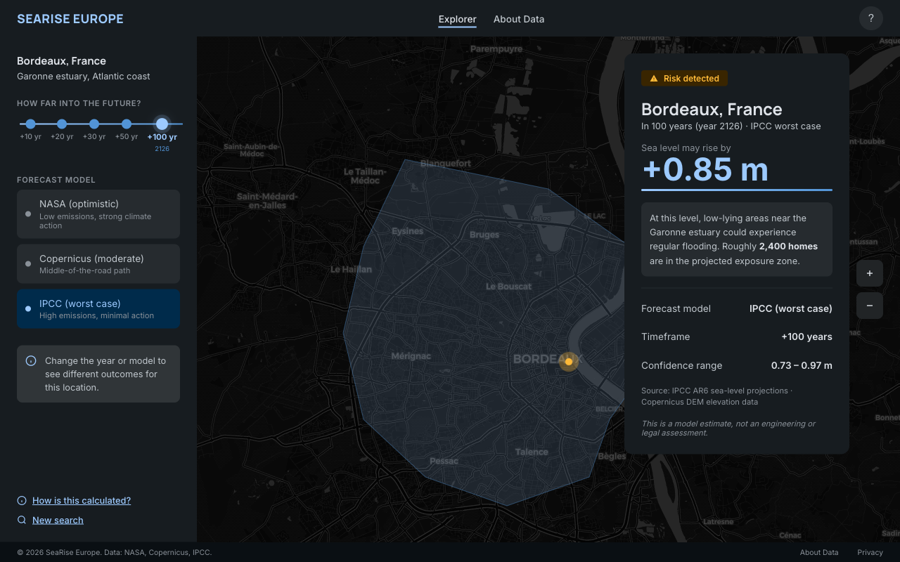
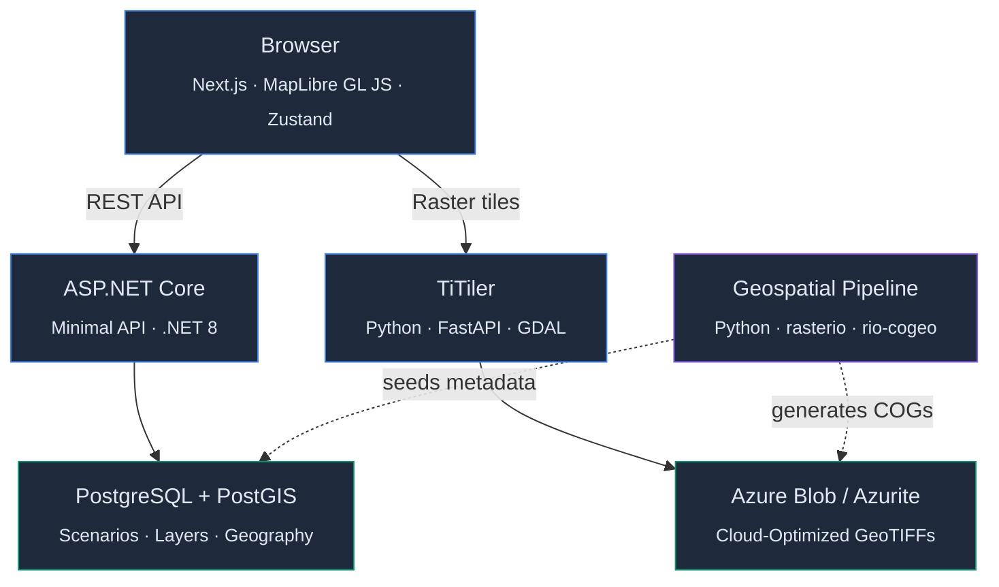

# SeaRise Europe

**Make coastal sea-level exposure understandable for anyone, anywhere in Europe — without overpromising what the science can say.**

SeaRise Europe is a web application that lets users search for a European location and view scenario-based coastal sea-level exposure on an interactive map across selectable future time horizons (+10 to +100 years). It bridges the gap between authoritative but fragmented climate datasets and a clear, scientifically cautious user experience.

> This is a portfolio-grade project demonstrating end-to-end product engineering — from product vision and architecture documentation through geospatial data pipelines to a fully tested, accessible frontend.

<p align="center">
  
</p>
<p align="center"><em>Bordeaux, France — IPCC worst-case scenario, +100 years</em></p>

---

## Tech Stack

| Layer | Technology |
|-------|------------|
| Frontend | Next.js 14+, TypeScript, TailwindCSS, MapLibre GL JS, Zustand, TanStack Query |
| Backend | ASP.NET Core .NET 8, Minimal API, Npgsql |
| Tile Server | TiTiler (Python / FastAPI) |
| Database | PostgreSQL 16 + PostGIS 3.4 |
| Pipeline | Python 3.9+, GDAL, rasterio, rio-cogeo |
| Infrastructure | Docker Compose (local), Azure Container Apps (planned) |
| CI | GitHub Actions — lint, type-check, test, Docker build |

---

## Architecture Overview



---

## Quick Start

### Prerequisites

- Docker and Docker Compose
- An Azure Maps API key (for geocoding and basemap tiles)

### Run locally

```bash
# 1. Copy the environment template and fill in your API keys
cp .env.local.example .env.local

# 2. Start all services
docker compose up --build
```

| Service | URL |
|---------|-----|
| Frontend | http://localhost:3000 |
| API | http://localhost:8080 |
| TiTiler | http://localhost:8000 |

To reset the database: `docker compose down -v && docker compose up --build`

---

## Project Status

```text
██████████████████░░  81%  ·  47 of 58 stories  ·  7 of 8 epics complete
```

| Wave | Epic | Status |
|:----:|------|:------:|
| 1 | Decision Closure | Done |
| 2 | Local Dev Environment | Done |
| 3 | Geospatial Pipeline | Done |
| 4 | Backend API Core | Done |
| 5 | Frontend Search | Done |
| 6 | Assessment UX | Done |
| 7 | Transparency & Accessibility | Done |
| 8 | Azure Release | Planned |

Full delivery details: [docs/delivery/ROADMAP.md](docs/delivery/ROADMAP.md)

---

## Repository Structure

```text
SeaRise Europe/
├── src/
│   ├── frontend/          Next.js App Router (TypeScript)
│   ├── api/               ASP.NET Core Minimal API (C#)
│   └── pipeline/          Geospatial data pipeline (Python)
├── infra/db/              PostgreSQL schema + PostGIS + seed data
├── docs/
│   ├── product/           PRD, vision, personas, content guidelines, mocks
│   ├── architecture/      19 architecture docs, ADRs, diagrams
│   └── delivery/          Roadmap and 8 epic files
├── data/geometry/         Coastal analysis zone specification
├── docker-compose.yml     5-service local dev stack
└── .env.local.example     Environment variable documentation
```

---

## Documentation

| Topic | Document |
|-------|----------|
| Product vision | [docs/product/VISION.md](docs/product/VISION.md) |
| Product requirements | [docs/product/PRD.md](docs/product/PRD.md) |
| Architecture index | [docs/architecture/README.md](docs/architecture/README.md) |
| Architecture decisions | [docs/architecture/11-architecture-decisions.md](docs/architecture/11-architecture-decisions.md) |
| Delivery roadmap | [docs/delivery/ROADMAP.md](docs/delivery/ROADMAP.md) |

---

## What This Project Is Not

- A live public service or operational tool
- An engineering, insurance, mortgage, or legal risk assessment
- A parcel-level guarantee or real-time flood forecast
- A global coverage product (Europe only for MVP)

---

## Contributing

Contributions are welcome — especially corrections, clarifications, and architecture feedback. See [CONTRIBUTING.md](CONTRIBUTING.md) before opening a pull request.

## Security

Please do not report vulnerabilities in public issues. See [SECURITY.md](SECURITY.md).

## License

[MIT](LICENSE) — Copyright (c) 2026 Artem Sem
