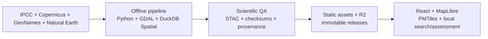

# SeaRise Europe

[](https://github.com/artemsemdev/SeaRise-Europe/actions/workflows/ci.yml)
[](https://github.com/artemsemdev/SeaRise-Europe/actions/workflows/codeql.yml)

**Make coastal sea-level exposure understandable without overstating what the
science can say.**

SeaRise Europe is a public, portfolio-grade explorer for comparing modeled
coastal exposure across three IPCC scenarios and the 2030, 2050, and 2100
horizons. It combines a cautious user experience with a reproducible geospatial
data-product architecture.

> **Design preview:** Open the self-contained
> [SeaRise Flight interactive mock](docs/product/Mock/SeaRise-Flight.html), then
> review its [implementation scope map](docs/product/Mock/MOCK_REQUIREMENTS_MAP.md).
> The mock uses synthetic illustrative data and does not override the PRD,
> methodology, or accepted architecture.

> **Repository status:** The Phase 2 integration branch contains the static-only
> React/Vite application and retained offline release pipeline. The superseded
> distributed runtime has been removed under ADR-025. Clean-clone validation uses
> the committed synthetic fixture; this is not a public scientific release.

## Run the static application

The clean-clone path needs Node 20.20.1 and no Docker, database, API, tile
server, cloud key, or private candidate:

```bash
npm ci
npm run web:check
npm run web:serve
```

Open `http://127.0.0.1:4173/` or the direct architecture route at
`http://127.0.0.1:4173/about/architecture/`. Browser smoke tests run with
`npm run web:e2e` after Playwright Chromium is installed. The build copies only
the committed synthetic release fixture; ignored Phase 1 candidate bytes are
never discovered, bundled, or uploaded.

## Accepted architecture

SeaRise Europe uses a static-first model: authoritative source data is
downloaded once, processed before release, and published as immutable
browser-ready artifacts. A normal user request requires no application API,
database, tile server, or geocoding service.


```mermaid
flowchart LR
    Sources[IPCC + Copernicus + GeoNames + Natural Earth]
    Build[Offline pipeline<br/>Python + GDAL + DuckDB Spatial]
    QA[Scientific QA<br/>STAC + checksums + provenance]
    Edge[Static assets + R2<br/>immutable releases]
    Browser[React + MapLibre<br/>PMTiles + local search/assessment]

    Sources --> Build --> QA --> Edge --> Browser
```

The target stack is:

| Concern | Decision |
|---|---|
| Web application | React 19, TypeScript, Vite 8; static output |
| Map | MapLibre GL JS with OpenFreeMap visual basemap |
| Exposure display | Nine raster PMTiles archives |
| Exact assessment | Browser lookup in lossless analysis COGs |
| Settlement search | Pinned GeoNames snapshot, prebuilt index, Web Worker |
| Spatial build work | DuckDB Spatial, GeoParquet, Python/GDAL/Rasterio |
| Data catalog | Static STAC catalog and release manifest |
| Hosting | Cloudflare Workers Static Assets + R2 custom domain |
| Infrastructure | OpenTofu |
| Supply-chain evidence | SHA-256, SLSA provenance, keyless Cosign signature |

The architectural goal is deliberately not “more cloud.” It demonstrates how
to move deterministic geospatial computation out of the request path and ship
a faster, cheaper, inspectable product using open formats.

Read the complete [accepted architecture decision](docs/architecture/adr/ADR-021-static-first-offline-geospatial-architecture.md).

## Product scope

- Three scenarios: SSP1-2.6, SSP2-4.5, and SSP5-8.5.
- Three horizons: 2030, 2050, and 2100.
- Exactly four projection outcomes: `ProjectionAvailable`, `DataUnavailable`,
  `OutOfScope`, and `UnsupportedGeography`; delivery failures are separate.
- Local search over European places, including every active coastal settlement
  that qualifies in the pinned GeoNames snapshot.
- A versioned coastal analysis boundary. The current checked-in 25 km geometry
  is an approximation pending comparison with the canonical Copernicus source.
- No property-level forecast, probability, engineering conclusion, or safety
  guarantee.

## Why static-first

| Legacy runtime | Accepted runtime |
|---|---|
| Next.js server | Static React assets |
| ASP.NET Core API | Browser domain engine |
| PostgreSQL/PostGIS | DuckDB Spatial during offline builds only |
| TiTiler | PMTiles and COG byte-range reads |
| Runtime geocoder | Local indexed GeoNames data |
| Multiple always-on services | CDN/object delivery only |
| Backend cold starts | No backend request |

Expected idle hosting cost is EUR 0/month while storage and traffic remain in
the provider's free allowances, excluding domain registration. The architecture
is portable to any static host and object store that supports CORS and HTTP
range requests.

## Repository status

| Area | Status |
|---|---|
| Static-first ADR and technical documentation | Accepted/current |
| Static React/Vite browser application | Implemented and validated from the committed fixture |
| Exact AR6 projection lookup | Implemented for all nine scenario/horizon combinations |
| GeoNames settlement search | Implemented in a Web Worker from release-bound static indexes |
| Generic static-host delivery | Build, serve, range, accessibility, and Lighthouse gates implemented |
| Reference Cloudflare/OpenTofu deployment | Deferred to #62/#74; no live or checked-in target IaC is claimed |
| Superseded repository runtime | Removed; recoverable through Git history |

The active sequence and exit gates are in the
[static-first migration plan](docs/delivery/README.md).

## Repository shape

```text
SeaRise Europe/
├── src/
│   ├── web/               Static React/TypeScript application
│   └── pipeline/          Offline data-release builder
├── data/
│   ├── geometry/          Versioned support/coastal source geometry
│   └── fixtures/          Small, committed test release
├── contracts/ci/          CI fitness and future-owner activation contract
└── docs/
    ├── product/           Product intent, language, personas, and mocks
    ├── architecture/      Current architecture and ADR register
    └── delivery/          Active migration plan and quality evidence
```

The delivered application has no application server, runtime database, tile
server, or runtime geocoder. Retained container recipes belong only to the
deterministic offline build plane and are not deployment dependencies.

## Documentation

| Topic | Document |
|---|---|
| Architecture decision | [ADR-021](docs/architecture/adr/ADR-021-static-first-offline-geospatial-architecture.md) |
| Architecture index | [Architecture documentation](docs/architecture/README.md) |
| Migration and removal gates | [Delivery plan](docs/delivery/README.md) |
| Provisional scientific method | [Methodology candidate](docs/methodology.md) |
| Product requirements | [PRD](docs/product/PRD.md) |
| Product language | [Content guidelines](docs/product/CONTENT_GUIDELINES.md) |

## Architecture fitness goals

- zero runtime calls to `/assess`, `/geocode`, or `/config`;
- exactly nine complete scenario/horizon layers;
- local search p95 below 50 ms after worker initialization;
- local assessment p95 below 100 ms after required data is cached;
- Lighthouse scores of at least 90 on the agreed mobile profile;
- schema-valid manifests, matching checksums, valid STAC, complete licences, and
  passing scientific golden points;
- shell, configuration, boundaries, and loaded search index usable after the
  network is removed.

## What this project is not

- a live emergency or operational planning service;
- an engineering, insurance, mortgage, financial, or legal assessment;
- a parcel-level guarantee or real-time flood forecast;
- proof of a real-data result until the scientific release gate is complete.

## Contributing

Contributions are welcome, especially scientific corrections, data-quality
improvements, and architecture feedback. Read [CONTRIBUTING.md](CONTRIBUTING.md)
and `AGENTS.md` before changing the repository.

## Security

Do not report vulnerabilities in public issues. See [SECURITY.md](SECURITY.md).

## Licence

[MIT](LICENSE) — Copyright (c) 2026 Artem Sem
