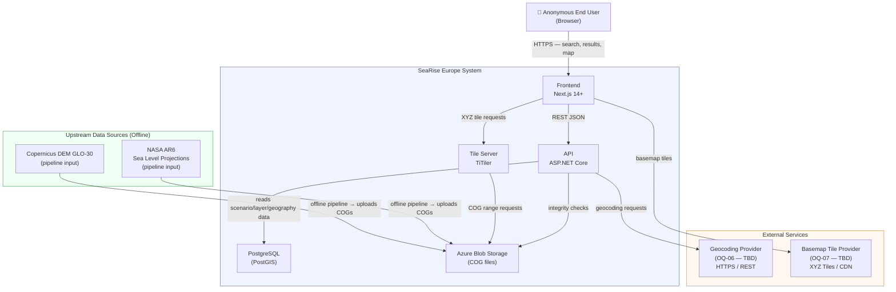

# 01 — System Context

> **Status:** Proposed Architecture
> **Source of truth:** PRD v0.1 — all FR, BR, NFR, and OQ references below are from `docs/product/PRD.md`

---

## 1. System Purpose

SeaRise Europe is a public, anonymous, read-only web application that accepts a free-text European location query and returns a scenario-based coastal sea-level exposure assessment for that location. The system combines precomputed sea-level projection layers with an interactive map to communicate whether a selected point falls within a modeled exposure zone under a chosen climate scenario and future time horizon.

The system does **not**:
- Store user data or personalize responses (BR-001, BR-016)
- Perform real-time sensor readings or live weather integration (Non-goal #4)
- Make parcel-level, engineering, legal, insurance, or financial determinations (Non-goal #3, FR-024, FR-025)
- Cover geographies outside Europe (BR-003)
- Assess inland hazards other than coastal sea-level exposure (BR-004)
- Allow user authentication, saved searches, or exports (Non-goals #8, #9)

These non-goals directly shape the architecture: no auth system, no user database, no real-time pipeline, no export service.

---

## 2. Actors and Users

### Human Users

| Actor | Type | Interaction | Key Requirement |
|---|---|---|---|
| Anonymous end user | Human — primary | Enters location query; selects candidate; views result; changes scenario/horizon; opens methodology panel | FR-001–FR-042 collectively |
| Climate-aware resident / researcher (P-01) | Human — primary persona | Searches specific European coastal address; reads result and methodology | Honest result framing; clear result-state distinction |
| Educator / communicator (P-02) | Human — secondary persona | Demonstrates tool live; expects methodology panel to be substantive | FR-033 methodology panel; visual clarity at projection size |
| Portfolio reviewer / technical evaluator (P-03) | Human — secondary persona | Reviews GitHub repo and live demo; tests edge cases | Graceful error handling; real data; documented limitations |

All human users interact through the same anonymous public interface — no role differentiation in MVP (BR-002).

### External Systems (Runtime)

| System | Type | Direction | Runtime? | Key Requirement |
|---|---|---|---|---|
| Geocoding provider | External HTTP API | Outbound from API container | Yes | FR-004; OQ-06 (BLOCKING — provider TBD) |
| Basemap tile provider | External CDN | Outbound from browser | Yes | FR-026; OQ-07 (basemap provider TBD) |
| Azure Blob Storage | Managed cloud service | Read by TiTiler + API | Yes | NFR-020 (COG format); stores precomputed raster assets |
| Azure Database for PostgreSQL | Managed cloud service | Read by API container | Yes | Stores scenario config, layer metadata, geography boundaries |

### External Systems (Offline / Upstream Pipeline)

| System | Type | Direction | Runtime? | Key Requirement |
|---|---|---|---|---|
| NASA AR6 Sea Level Projection Tool | External data source | Inbound to pipeline (manual download) | No — offline only | Dependency #1; source for sea-level projection data |
| Copernicus DEM (GLO-30) | External data source | Inbound to pipeline (manual download) | No — offline only | Elevation source for Europe; 30m resolution |
| Copernicus CDS | External data API | Inbound to pipeline | No — offline only | Supporting/contextual data (optional for MVP layers) |

---

## 3. System Boundary

```
┌─────────────────────── SeaRise Europe System ───────────────────────────┐
│                                                                           │
│  ┌─────────────┐    ┌────────────────┐    ┌──────────┐                  │
│  │  Frontend   │    │   API          │    │  TiTiler │                  │
│  │  (Next.js)  │◄──►│  (ASP.NET Core)│    │          │                  │
│  └─────────────┘    └────────────────┘    └──────────┘                  │
│                             │                   │                        │
│                    ┌────────┴──────┐    ┌───────┴──────┐               │
│                    │  PostgreSQL   │    │  Blob Storage│               │
│                    │  (PostGIS)    │    │  (COG files) │               │
│                    └───────────────┘    └──────────────┘               │
│                                                                           │
└───────────────────────────────────────────────────────────────────────────┘
         │                              │                     ▲
         ▼                              ▼                     │
  Geocoding provider           Basemap tile provider    Offline pipeline
  (external — OQ-06)           (external — OQ-07)       (NASA AR6 + Copernicus DEM)
```

**Inside the boundary**: Next.js frontend, ASP.NET Core API, TiTiler, PostgreSQL, Azure Blob Storage, Azure Container Registry, Azure Key Vault.

**Outside the boundary**: Geocoding provider (external API, runtime dependency), basemap tile provider (external CDN, runtime dependency), IPCC AR6 data source (offline, pipeline input), Copernicus DEM data source (offline, pipeline input), CI/CD pipeline infrastructure (GitHub Actions).

---

## 4. System Context Diagram



---

## 5. Upstream / Downstream Relationships

### Upstream (feeds the system)

| Source | Relationship | Timing | Notes |
|---|---|---|---|
| IPCC AR6 sea-level projections | Offline pipeline input | Phase 0 (initial setup) + periodic refresh (OQ-09) | Consumed via NASA AR6 web tool; license confirmation required (Dependency #1) |
| Copernicus DEM GLO-30 | Offline pipeline input | Phase 0 + as needed | Free with attribution; 30m resolution |
| Geocoding provider | Synchronous runtime dependency | Every user search | OQ-06 is blocking for production; Nominatim for dev only |

### Downstream (the system feeds)

| Consumer | What they receive | Notes |
|---|---|---|
| End user browser | Assessment result, map tiles, methodology text | The only external consumer |

### Key Dependency: Offline Pipeline

The offline geospatial pipeline is not a runtime service — it is a separate concern that populates Blob Storage and PostgreSQL. Once populated, the runtime system is self-contained. The pipeline must complete Phase 0 before Phase 1 development begins (ROADMAP.md Phase 0 exit criteria).

---

## 6. Major Constraints from the PRD

These constraints from the PRD most directly shape architectural decisions:

| Constraint | Source | Architectural Impact |
|---|---|---|
| Europe-only coverage | BR-003 | Geography validation must be server-side (PostGIS) — client-side is bypassable |
| Coastal-only scope | BR-004, OQ-04 | Coastal analysis zone must be a server-side configured geometry — zone definition is BLOCKING |
| No user data persistence | BR-016, NFR-007 | No user tables, no session storage, no address logging |
| Anonymous access | BR-001 | No auth infrastructure, no JWT, no session tokens |
| COG/PMTiles format required | NFR-020 | TiTiler required; full-file raster transfer is not acceptable |
| Methodology versioning | NFR-021, FR-035 | Every assess response carries a methodology version identifier; version is displayed in UI |
| No Kubernetes | NFR-023 | Azure Container Apps is the hosting ceiling |
| Stateless services | NFR-019 | No sticky sessions, no local state between replicas |
| WCAG 2.2 AA | NFR-015 | Accessibility is a first-class implementation requirement, not an afterthought |
| Performance NFRs | NFR-001–NFR-004 | Architecture choices (lazy loading, COG overviews, client-side caching) are driven by specific latency targets |
| No silent substitution | BR-014 | If a requested scenario/horizon has no data, return DataUnavailable — never fall back to another combination |
| Scientific honesty | VISION Pillar 1, FR-024, FR-025 | All result copy must use modeled language; no definitive claims permitted |

---

## 7. Non-Goals That Shape the Architecture

| Non-Goal | Source | Architectural impact |
|---|---|---|
| No user accounts or saved searches | PRD §5 #8 | No identity provider, no session management, no user tables |
| No native mobile app | PRD §5 #7 | Web-only; no PWA requirements; responsive design sufficient |
| No parcel-level claims | PRD §5 #3 | Assessment returns a zone-level binary result, not a property-level determination |
| No real-time data | PRD §5 #4 | All results are derived from precomputed static assets; no streaming pipeline |
| No Kubernetes | PRD §5 #10, NFR-023 | Container Apps is the hosting model; no Helm charts, no AKS |
| No admin UI | PRD §7 out-of-scope #7 | Dataset management is a pipeline operation, not a product feature |
| No export / PDF | PRD §7 out-of-scope #4 | No document generation service needed |

---

## 8. Key Assumptions at System Context Level

| # | Assumption | Risk if Wrong | Status |
|---|---|---|---|
| A-01 | Azure is the cloud provider | All infrastructure choices are Azure-specific | Confirmed by product docs |
| A-02 | Hosting region is EU (West Europe or North Europe) | GDPR data residency concern | Assumption — confirm before deployment |
| A-03 | Geocoding provider is a single configured external HTTP service | Architecture assumes one provider; multi-provider fallback not designed | Assumption — depends on OQ-06 |
| A-04 | Data refresh is a manual operational workflow in MVP | Dataset update process is undocumented if assumed to be automated | Confirmed — BR-018 |
| A-05 | The offline pipeline runs outside the container runtime | Pipeline is not a Container App; it is a separate script set | Assumption — aligns with ROADMAP Phase 0 scope |
| A-06 | Europe boundary geometry from a standard public source is sufficient | Islands, overseas territories, or ambiguous borders may produce unexpected results | Assumption — validate edge cases during Phase 0 |
