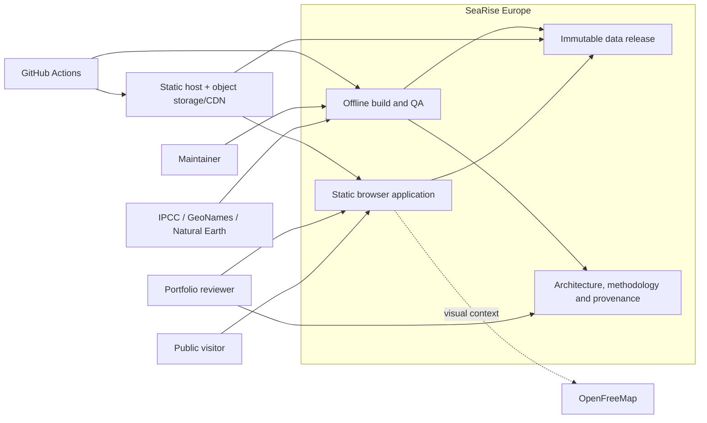

# 01 — System Context

> **Status:** Accepted static-first architecture
> **Decision:** [ADR-021 — Static-First Offline Geospatial Architecture](adr/ADR-021-static-first-offline-geospatial-architecture.md)
> **Implementation:** Static browser runtime; removed service-based code is recoverable through Git history only

## Purpose

SeaRise Europe is a public, read-only explorer that answers:

> What regional relative sea-level change does the selected IPCC AR6 scenario
> project at the nearest native source-grid location for this absolute horizon?

The product makes precomputed scientific results understandable and
inspectable. It does not determine flooding, inundation, terrain exposure,
flood probability, property risk, safety, or adaptation measures.

The target system is a static geospatial data product. Scientific processing
occurs before publication; a browser searches places, checks scope, reads the
selected native-grid projection values, and renders them without an application
API.

## People and systems

| Actor or system | Relationship to SeaRise Europe |
|---|---|
| Public visitor | Searches for a settlement, selects a scenario and horizon, explores the map, and reads methodology and limitations. No account is required. |
| Portfolio reviewer | Inspects the architecture page, release provenance, fitness results, open formats, cost model, and source code. |
| Maintainer | Pins source snapshots, runs and reviews the offline build, publishes an immutable release, and can roll back to an earlier app/release pair. |
| IPCC, GeoNames, Natural Earth | Versioned upstream sources used only by the offline build plane. They are not request-time dependencies. |
| Static host and object storage/CDN | Deliver the application shell, metadata, search indexes, and byte ranges from large geospatial artifacts. |
| OpenFreeMap | Supplies non-authoritative visual context. Search and assessment remain functional if it is unavailable. |
| GitHub Actions | Validates and publishes reviewed releases; it is outside the user request path. |

## System boundary

Inside the SeaRise Europe product boundary:

- a static React application and its service worker;
- browser-side search, scope validation, and assessment logic;
- immutable, versioned release artifacts and their public contracts;
- an offline data pipeline, scientific QA, provenance, and publication steps;
- infrastructure-as-code for static hosting, object storage, caching, CORS,
  and DNS;
- the public architecture and methodology presentation.

Outside the product boundary:

- upstream source production and scientific stewardship;
- the OpenFreeMap public service;
- browser implementation and device storage quotas;
- Cloudflare's platform and the public Internet;
- address-level geocoding, user accounts, saved projects, payments, and
  collaboration features.

## Context diagram

```mermaid
flowchart LR
    Visitor[Public visitor]
    Reviewer[Portfolio reviewer]
    Maintainer[Maintainer]

    subgraph SRE[SeaRise Europe]
        Browser[Static browser application]
        Release[Immutable data release]
        Pipeline[Offline build and QA]
        Evidence[Architecture, methodology and provenance]
    end

    Sources[IPCC / GeoNames / Natural Earth]
    Host[Static host + object storage/CDN]
    Basemap[OpenFreeMap]
    CI[GitHub Actions]

    Visitor --> Browser
    Reviewer --> Browser
    Reviewer --> Evidence
    Browser --> Release
    Browser -. visual context .-> Basemap
    Host --> Browser
    Host --> Release
    Sources --> Pipeline
    Maintainer --> Pipeline
    Pipeline --> Release
    Pipeline --> Evidence
    CI --> Pipeline
    CI --> Host
```

## Request-time and release-time boundaries

The architecture separates two fundamentally different workloads.

### Request time

The browser performs bounded, deterministic operations:

1. Load the static shell and its pinned release manifest.
2. Search a prebuilt settlement index in a Web Worker.
3. Test a selected coordinate against versioned support geometries.
4. Read only the required byte ranges from the selected analysis artifact.
5. Map the projection lookup to one of four result states.
6. Render the synchronized map, explanation, methodology version, and source
   attribution.

There is no request-time backend, database, tile server, geocoder, or source
data processing.

### Release time

The offline pipeline performs the expensive and stateful work:

1. Fetch and checksum pinned source snapshots.
2. Normalize, join, classify, and package data.
3. Produce all nine scenario/horizon combinations and settlement indexes.
4. Validate scientific control points, schemas, artifact integrity, licences,
   and performance budgets.
5. Generate STAC metadata, SLSA-compatible provenance, and a signed manifest.
6. Publish a new immutable release only after every gate passes.

## Product invariants at the boundary

- Scenario IDs are `ssp1-26`, `ssp2-45`, and `ssp5-85`.
- Horizons are `2030`, `2050`, and `2100`.
- Defaults are `ssp2-45` and `2050`.
- Every assessment returns exactly one of: `ProjectionAvailable`,
  `DataUnavailable`, `OutOfScope`, or `UnsupportedGeography`.
- Every `ProjectionAvailable` result discloses the AR6 median, likely range,
  baseline, source-grid identity and distance, and native 1° resolution.
- `OutOfScope` and `UnsupportedGeography` are domain results, not failures.
- Every visible result is tied to a methodology version and immutable data
  release.
- Searches and selected coordinates are not sent to a project-controlled
  server.

## Dependency posture

An upstream source outage can delay a new release but cannot break an already
published one. A basemap outage removes visual context but not the authoritative
assessment. A static-host or object-storage outage affects delivery and is
detected by synthetic checks. Previously cached core resources remain usable
within the documented offline scope.

Every scientific and browser artifact uses portable formats: JSON, PMTiles,
COG, GeoParquet, STAC, and Sigstore bundles. Cloudflare is the reference host,
not part of the product's scientific contract.

## Current-to-target transition

The repository still contains a Next.js runtime, ASP.NET Core API,
PostgreSQL/PostGIS, TiTiler, and local storage scaffolding. These describe the
current implementation, not the accepted production target. They are removed
only after real-source validation, client/server parity checks, artifact range
tests, browser performance tests, and the remaining ADR-021 migration gates
pass.
