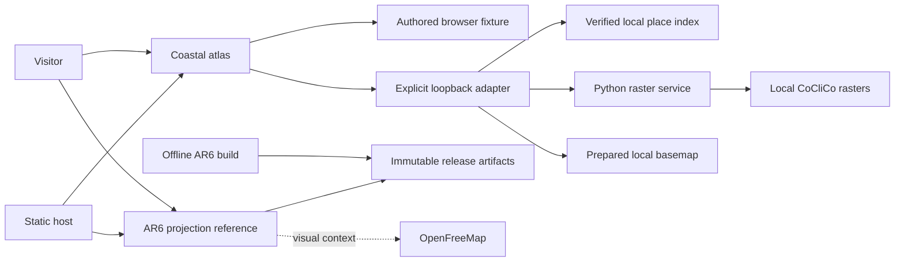

# 01 — System Context

> **Status:** Implemented repository architecture, reviewed 2026-10-04.
> **Scope:** Coastal atlas and retained AR6 projection reference.
> **Decision context:** [ADR-028](adr/ADR-028-coastal-atlas-adoption.md),
> [ADR-024](adr/ADR-024-ar6-regional-projection-contract.md).

## Product boundary

SeaRise Europe has two browser applications in one React/TypeScript/Vite
workspace. Their entry points, data sources, and scientific meanings differ.

| Surface | Implemented behavior | Data boundary |
|---|---|---|
| `/`, normal build | Coastal atlas with city search, point inspection, year/defense controls, comparison and shared views | Explicitly illustrative, browser-local fixture |
| `/`, `real-local` mode | The same atlas UI with CoCliCo depth cells and prepared European geography | Read-only loopback adapter and Python raster process; requires provisioned files |
| Sealed private demo | Source/app/data-bound real-local candidate served on loopback | Read-only candidate app; provisioned rasters remain external |
| `/projections/` | Retained AR6 regional relative sea-level explorer | Browser search and exact lookup against a pinned immutable release |
| `/about/architecture/` | AR6 reference architecture/status page | Build identity and release disposition; not a live atlas operations dashboard |

The atlas contract fixes SSP5-8.5 (`ssp585`), spring high tide, years
2030/2050/2100, and protected/unprotected defenses. Point values distinguish
positive modeled depth, valid zero, and unknown. The normal fixture does not
establish real-world flood coverage or scientific validity.

The projection reference fixes three scenarios and three horizons. It reports
relative AR6 change and its likely range, with four projection result states;
it does not calculate flood depth. These contracts are not interchangeable.
See [13 — Domain Model](13-domain-model.md).

## People and dependencies

| Actor or dependency | Relationship |
|---|---|
| Visitor/reviewer | Explores the fixture or projection reference without an account; can inspect source and status |
| Local operator | Provisions the real-local atlas workspace and explicitly starts its adapter |
| Maintainer | Changes source, contracts and fixtures; runs CI and controlled release tooling |
| CoCliCo rasters and prepared place/basemap files | Local atlas inputs; not fetched from upstream during ordinary interaction |
| IPCC AR6, GeoNames, Natural Earth | Retained pipeline source inputs, pinned before processing |
| Static HTTP host | Delivers built documents, app assets and the committed projection fixture |
| OpenFreeMap | Optional visual context for the projection map; atlas styles use fixture geography or local basemap assets |
| GitHub Actions | Runs checks and protected evidence workflows outside the browser request path |

```mermaid
flowchart LR
    User[Visitor] --> Atlas[Coastal atlas]
    Atlas --> Fixture[Authored browser fixture]
    Atlas --> Local[Explicit loopback adapter]
    Local --> Places[Verified local place index]
    Local --> Raster[Python raster service]
    Local --> Basemap[Prepared local basemap]
    Raster --> Files[Local CoCliCo rasters]
    User --> Projection[AR6 projection reference]
    Pipeline[Offline AR6 build] --> Release[Immutable release artifacts]
    Projection --> Release
    Projection -. visual context .-> OpenFreeMap
    Host[Static host] --> Atlas
    Host --> Projection
```

The edition is chosen at development/build startup, not by a query parameter,
service discovery, or saved browser state. Failure in `real-local` never
selects the synthetic provider.

## Request and build boundaries

Atlas fixture reads and tile generation run in the browser. Real-local search
queries and inspection coordinates are sent to the loopback adapter; raster
inspection and PNG rendering happen in Python. This is an implemented local
service boundary, not a public deployment design.

Projection search runs in a browser Worker. Geometry classification and exact
COG lookup run locally over release assets; its scientific values never come
from PMTiles display colors. Its service worker supports only its explicitly
verified offline resources. The atlas registers no service worker and has no
promised offline reload capability.

The repository contains no active Next.js server, ASP.NET API, PostGIS runtime,
or TiTiler service. Their removal is complete under ADR-025/027. The atlas
adapter is the separate development boundary allowed by ADR-028.

## Delivery status and implementation evidence

A successful build proves engineering behavior, not public data publication.
Cloudflare Static Assets/R2 remain a reference hosting direction; no checked-in
OpenTofu deployment or public atlas data distribution is implemented. Private
local inputs and Candidate-v7 are outside the built application inventory.

Source anchors:

- [Vite entries and plugins](../../src/web/vite.config.ts)
- [Atlas entry and edition selection](../../src/web/src/atlas/main.tsx)
- [Atlas adapter activation](../../src/web/scripts/real-local-atlas.mjs)
- [Private demo launcher](../../scripts/demo/demo.mjs)
- [Projection entry](../../src/web/src/main.tsx)
- [Architecture page](../../src/web/src/routes/ArchitecturePage.tsx)
- [Post-cutover validator](../../scripts/repository/validate_post_cutover.py)
