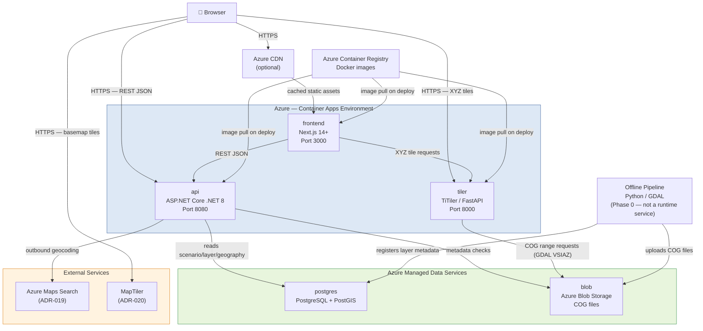

# 02 — Container View

> **Status:** Proposed Architecture
> **Level:** C4 Container
> This document maps to the C4 Architecture "Container" level — the independently deployable or runnable units of the system.

---

## 1. Container Overview

SeaRise Europe is composed of three runtime containers (frontend, api, tiler) and two managed data services (PostgreSQL, Blob Storage). All three runtime containers are stateless (NFR-019) and deploy to Azure Container Apps. An Azure Container Registry stores all Docker images. An offline geospatial pipeline (not a runtime container) populates the data services during Phase 0.

---

## 2. Containers Reference

| Container | Technology | Responsibility | Hosting | Status |
|---|---|---|---|---|
| **frontend** | Next.js 14+ (TypeScript) | Serves the web application shell, map interface, search, result panel, methodology panel | Azure Container Apps | Proposed Architecture |
| **api** | ASP.NET Core .NET 8+ (Minimal API) | Geocoding proxy, exposure assessment, scenario/methodology config, geography validation | Azure Container Apps | Proposed Architecture |
| **tiler** | TiTiler (Python/FastAPI) | Serves XYZ map tiles from COG files in Blob Storage | Azure Container Apps | Proposed Architecture |
| **postgres** | Azure Database for PostgreSQL Flexible Server (PostGIS) | Scenarios, horizons, layer metadata, methodology versions, geography boundaries | Azure Managed Service | Proposed Architecture |
| **blob** | Azure Blob Storage | COG raster files (one per scenario × horizon × methodology version) | Azure Managed Service | Proposed Architecture |
| **registry** | Azure Container Registry | Docker images for frontend, api, tiler | Azure Managed Service | Proposed Architecture |
| **cdn** *(optional)* | Azure CDN / Front Door | Caches Next.js static assets | Azure Managed Service | Assumption |
| Geocoding provider | Azure Maps Search (ADR-019) | Geocodes free-text queries to coordinates | External service | Confirmed |
| Basemap tile provider | MapTiler (ADR-020) | Serves vector basemap tiles (Dataviz Light) | External CDN | Confirmed |

---

## 3. Container Diagram

---

## 4. Container Responsibilities — Detail

### frontend (Next.js 14+)

**Primary responsibility:** Serve the interactive web application. Handles all user-facing UI: search bar, candidate list, map surface with MapLibre GL JS and deck.gl, result panel, scenario/horizon controls, methodology panel, all result states, and all error states.

**What it does NOT do:**
- Does not perform geocoding — delegates to the api container
- Does not perform geography validation — delegates to the api container
- Does not perform exposure assessment — delegates to the api container
- Does not store user data — no database, no localStorage for sensitive data (BR-016)
- Does not expose API keys for geocoding (NFR-006) — the api container owns that

**Key technical characteristics:**
- App Router with server components for the HTML shell/layout; client components for the interactive surface (map, search, results require browser APIs)
- MapLibre GL JS dynamically imported (SSR disabled) to avoid server-side WebGL dependency
- deck.gl TileLayer for exposure overlay — fetches XYZ tiles directly from tiler container
- TanStack Query for API request management (caching, cancellation, error handling)
- Zustand for UI state (panel visibility, application phase)
- AbortController for stale request cancellation (FR-040)

**State:** Stateless container. Any instance serves any request. Map viewport and application state live in the browser only. (NFR-019)

**Why separate from api:** The Next.js + mapping stack is a distinct concern from the API. Separation enables independent deployment, independent scaling, and clean team boundaries. The frontend is the user-facing portfolio artifact that must be high quality (P-03).

---

### api (ASP.NET Core .NET 8+)

**Primary responsibility:** Backend API that orchestrates geocoding, assessment, and configuration. Acts as the single integration point between the browser and all backend services.

**Core operations:**
1. Proxy geocoding requests to the configured provider (hiding provider details and API key from the browser)
2. Perform Europe geography validation via PostGIS (FR-009)
3. Perform coastal zone validation via PostGIS (FR-011, ADR-018)
4. Resolve scenario + horizon + active methodology version to an exposure layer
5. Evaluate point-in-exposure-zone using TiTiler or direct COG query
6. Return an AssessmentResult with the result state and methodology version
7. Serve scenario/horizon/methodology configuration (FR-014, FR-015, FR-033)
8. Expose a health/readiness endpoint (NFR-011)

**What it does NOT do:**
- Does not serve map tiles — that is tiler's responsibility
- Does not store raw user addresses (BR-016, NFR-007)
- Does not perform client-side JavaScript — it is a pure JSON HTTP API

**Key technical characteristics:**
- Minimal API style in ASP.NET Core — no MVC controller scaffolding
- Clean layered architecture: HTTP endpoints → Application services → Domain logic → Infrastructure adapters
- IGeocodingService abstraction — dev implementation against Nominatim, production against Azure Maps Search (ADR-019)
- Parameterized PostGIS queries via Npgsql (no SQL injection risk)
- All requests include a correlation ID in logs and responses (NFR-013)
- Raw addresses never written to logs (NFR-007)

**State:** Stateless. Any replica can handle any request. No in-memory shared state between replicas. (NFR-019)

**Why proxy geocoding:** Avoids exposing the geocoding provider's API key to the browser (NFR-006). Allows provider swap without any frontend changes. Normalizes provider response format to the internal GeocodingCandidate model.

---

### tiler (TiTiler)

**Primary responsibility:** Serve XYZ map tiles (/{z}/{x}/{y}.png) from Cloud-Optimized GeoTIFF files stored in Azure Blob Storage. The frontend requests tiles for the active exposure layer; TiTiler handles range-request-based COG reading, colormap application, and tile rendering.

**What it does NOT do:**
- Does not know about users, sessions, scenarios, or assessments
- Does not validate geography or perform any application-layer logic
- Does not write to any data store

**Key technical characteristics:**
- TiTiler is an off-the-shelf open-source tile server (FastAPI-based) — no custom Python code needed
- Reads COGs from Azure Blob Storage using the GDAL VSIAZ virtual filesystem driver
- The frontend constructs tile URLs with the COG path (which encodes methodology version, scenario, horizon) received from the api's assess response
- The tile URL template returned in the assess response prevents the frontend from constructing arbitrary layer URLs
- Colormap applied server-side by TiTiler based on request parameters

**State:** Stateless. (NFR-019)

**Why TiTiler instead of custom tile server:** TiTiler implements the COG tile-serving pattern correctly and is production-grade. Building a custom tile server would duplicate substantial geospatial engineering work without benefit. TiTiler adds one Python runtime to the system but eliminates a major implementation risk.

---

### postgres (Azure Database for PostgreSQL Flexible Server)

**Primary responsibility:** Persistent relational store for all structured application data.

**Stored data:**
- `scenarios`: configured scenario set (ADR-016: ssp1-26, ssp2-45, ssp5-85)
- `horizons`: 2030, 2050, 2100 (FR-015 — confirmed)
- `methodology_versions`: active and historical methodology records
- `layers`: layer metadata mapping scenario × horizon × version → blob path
- `geography_boundaries`: Europe boundary and coastal analysis zone geometries (PostGIS, ADR-018)

**What it does NOT store:** User data, raw addresses, search logs, or any session state.

**Why PostgreSQL / PostGIS:** The geography validation requirement (FR-009–FR-012) needs `ST_Within` point-in-polygon queries. PostGIS is the standard tool for this. Azure Flexible Server is a managed service with built-in backups, HA, and patching — aligned with the low-ops MVP goal (NFR-023).

---

### blob (Azure Blob Storage)

**Primary responsibility:** Durable object store for Cloud-Optimized GeoTIFF files. One COG per scenario × horizon × methodology version.

**Path convention:** `geospatial/layers/{methodologyVersion}/{scenarioId}/{horizonYear}.tif`

**Written by:** Offline geospatial pipeline (Phase 0) — not the runtime containers.

**Read by:** tiler container (via GDAL VSIAZ, HTTP range requests); api container (integrity checks).

**Why Blob Storage for COGs:** COG files can be tens to hundreds of MB. Azure Blob supports HTTP range requests natively, which is the mechanism COGs use for tile serving. Blob Storage scales without capacity planning and integrates directly with TiTiler via GDAL's VSIAZ driver.

---

## 5. Communication Patterns

| From | To | Protocol | Notes |
|---|---|---|---|
| Browser | frontend | HTTPS | TLS terminated at Azure Container Apps ingress |
| Browser | api | HTTPS | Direct REST calls (Option A — see below) |
| Browser | tiler | HTTPS | Direct XYZ tile requests |
| Browser | Basemap provider | HTTPS | Client-side, external CDN |
| frontend | api | HTTPS REST/JSON | Same as browser→api in Option A |
| api | PostgreSQL | TCP/PostgreSQL | Private network within Container Apps Environment |
| api | Blob Storage | HTTPS (Azure SDK) | Managed identity preferred |
| api | Geocoding provider | HTTPS | Outbound; API key in env var only |
| tiler | Blob Storage | HTTPS (GDAL VSIAZ) | HTTP range requests for COG byte ranges |

**Option A vs Option B for API access:**

> **Option A (Recommended for MVP):** External ingress on api — browser calls api directly.
> Simpler, no BFF overhead. Acceptable because the API serves public data with no auth.
>
> **Option B:** Internal ingress on api — Next.js server-side route handlers proxy to api (Backend-for-Frontend pattern).
> More secure (api not publicly accessible), but adds complexity and a Next.js server-side dependency.
>
> **Decision:** Option A for MVP. If auth or sensitive operations are added in future phases, reconsider Option B. Document this as a known tradeoff.

---

## 6. Why This Container Split Fits the Low-Ops MVP Goal

This topology requires no cluster management, no container orchestration beyond what Container Apps provides, and relies on Azure managed services for all stateful persistence:

- **Azure Container Apps** handles: auto-scaling, health probes, revision management, TLS termination, internal service discovery — no Kubernetes YAML needed (NFR-023)
- **PostgreSQL Flexible Server** handles: automated backups, patching, high availability — no database administration needed
- **Azure Blob Storage** handles: durability, redundancy, access control — no storage management needed
- **TiTiler** is off-the-shelf — no custom tile server code needed
- All three runtime containers are stateless — rolling deployments are safe, any replica handles any request (NFR-019)
- No message queues, no caches, no sidecar containers, no service mesh required for MVP

A single developer can set up and maintain this entire topology.
