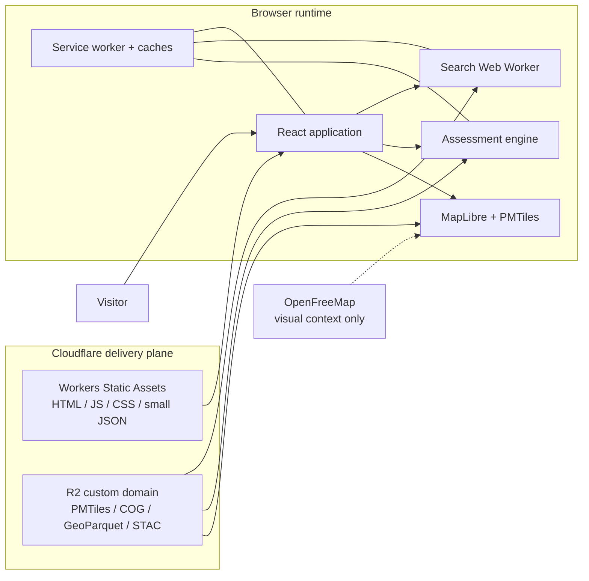
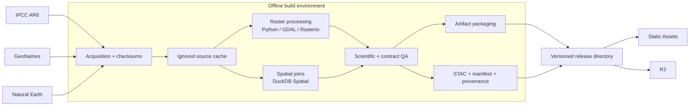

# 02 — Container View

> **Status:** Accepted target architecture
> **Decisions:** [ADR-021 — Static-First Offline Geospatial Architecture](adr/ADR-021-static-first-offline-geospatial-architecture.md) and [ADR-024 — AR6 Regional Projection Product Contract](adr/ADR-024-ar6-regional-projection-contract.md)

In this document, a container is an independently executed or deployed unit.
It does not necessarily mean a Docker container. The target production system
has two deployed origins and no continuously running application service.

## Container inventory

| Container | Technology | Runs where | Responsibility |
|---|---|---|---|
| Web application | React 19, TypeScript, Vite 8 | Cloudflare Workers Static Assets; browser | Delivers the shell, user interface, local domain logic, and architecture page. |
| Browser search worker | Web Worker, serialized MiniSearch-compatible index | Browser | Loads, normalizes, ranks, and returns settlement matches off the UI thread. |
| Browser assessment engine | TypeScript, geometry and COG readers | Browser | Validates scope, selects the nearest AR6 grid location, and returns exact projection values or an unavailable reason. |
| Map renderer | MapLibre GL JS with PMTiles protocol | Browser | Renders basemap, selected location, support geometry, and visual projection overlay. |
| Service worker | Web platform Cache API | Browser | Precaches the shell and caches versioned search/geospatial resources within a bounded policy. |
| Release artifact store | R2 through a custom domain/CDN | Cloudflare edge/object storage | Serves immutable PMTiles, COG, GeoParquet, STAC, manifest, and provenance objects with byte-range support. |
| Offline build pipeline | Python, GDAL, Rasterio, DuckDB Spatial, packaging/signing tools | Developer workstation or GitHub Actions | Acquires sources, produces artifacts, runs QA, records provenance, and publishes a complete release. |
| Source cache | Ignored local/CI filesystem | Build environment only | Holds pinned raw inputs; it is never served to visitors or committed by default. |

OpenFreeMap is an external visual dependency, not a SeaRise Europe container.

## Production container diagram

```mermaid
flowchart LR
    U[Visitor]

    subgraph Edge[Cloudflare delivery plane]
        Static[Workers Static Assets\nHTML / JS / CSS / small JSON]
        Objects[R2 custom domain\nPMTiles / COG / GeoParquet / STAC]
    end

    subgraph Browser[Browser runtime]
        App[React application]
        Search[Search Web Worker]
        Assess[Assessment engine]
        Map[MapLibre + PMTiles]
        SW[Service worker + caches]
    end

    Base[OpenFreeMap\nvisual context only]

    U --> App
    Static --> App
    App --> Search
    App --> Assess
    App --> Map
    SW --- App
    SW --- Search
    SW --- Assess
    Objects --> Search
    Objects --> Assess
    Objects --> Map
    Base -.-> Map
```

No production arrow terminates at an application API, relational database,
geocoding service, or tile-rendering service.

## Offline build container diagram

```mermaid
flowchart LR
    IPCC[IPCC AR6]
    Geo[GeoNames]
    NE[Natural Earth]

    subgraph Build[Offline build environment]
        Fetch[Acquisition + checksums]
        Cache[Ignored source cache]
        Raster[Raster processing\nPython / GDAL / Rasterio]
        Spatial[Spatial joins\nDuckDB Spatial]
        QA[Scientific + contract QA]
        Pack[Artifact packaging]
        Evidence[STAC + manifest + provenance]
    end

    Release[Versioned release directory]
    Static[Static Assets]
    R2[R2]

    IPCC --> Fetch
    Geo --> Fetch
    NE --> Fetch
    Fetch --> Cache
    Cache --> Raster
    Cache --> Spatial
    Raster --> QA
    Spatial --> QA
    QA --> Pack
    QA --> Evidence
    Pack --> Release
    Evidence --> Release
    Release --> Static
    Release --> R2
```

The build environment may be comparatively heavy. Its dependencies are
release tooling, not production services.

## Runtime responsibilities

### Web application

- Pins one `dataReleaseId` at build/deploy time.
- Loads and validates the release manifest before enabling assessment.
- Owns navigation, accessible UI, externalized copy, and URL state.
- Coordinates search, assessment, and map presentation without duplicating
  domain rules in components.
- Presents sources, methodology, limitations, release identity, and portfolio
  evidence.

### Search worker

- Initializes lazily on search focus or browser idle.
- Loads the smaller `europe-core` shard before the larger
  `europe-coastal` shard.
- Normalizes text and ranks exact canonical, exact alias, prefix, then fuzzy
  matches.
- Uses population, administrative importance, and coastal distance only as
  documented tie-breakers.
- Returns immutable settlement records with coordinates and disambiguating
  administration/country labels.

### Assessment engine

- Rejects invalid coordinates and unsupported configuration before reading a
  layer.
- Evaluates Europe support geometry before coastal scope.
- Resolves exactly one of nine artifacts from the pinned manifest.
- Selects the nearest native AR6 grid location by the ADR-024 distance and
  tie-break rules; it never infers a result from display colours.
- Maps a complete q0.167/q0.5/q0.833 triplet to `ProjectionAvailable` and
  excessive distance or source nodata to stable `DataUnavailable` reasons.
- Supplies the same artifact identity to the result panel and map.

### Map renderer

- Uses OpenFreeMap solely as visual context.
- Reads PMTiles byte ranges from the release origin.
- Shows a marker for every assessed coordinate.
- Keeps scenario, horizon, release, overlay, legend, and result text in sync.
- Degrades honestly if the basemap is unavailable.

### Service worker

- Namespaces all entries by application and data release.
- Precaches the shell and minimal configuration.
- Caches the core search index after first use and coastal data
  opportunistically.
- Caches geospatial byte ranges with a bounded policy.
- Never claims a layer is available offline unless the required data is
  present.

## Artifact responsibilities

The manifest is the release entry point and contract. It locates configuration,
support geometries, both search shards, all nine visual and analysis layers,
STAC metadata, hashes, source attribution, and quality summaries.

Versioned objects use immutable paths and long-lived cache headers. Mutable
pointers use short caching and cannot switch the release used by an active
session. Large artifacts must support `HEAD` and byte-range `GET`, expose range
headers through CORS, and be served from one canonical public URL.

## Communication patterns

| Interaction | Protocol | Pattern |
|---|---|---|
| Static host to browser | HTTPS | Whole-file GET for content-addressed app assets. |
| Artifact store to browser | HTTPS | Whole-file GET for small metadata; `HEAD` and range GET for large artifacts. |
| Application to search worker | Structured clone/message channel | Request/response with a monotonically increasing query token. |
| Application to assessment engine | In-process typed call | Pure domain evaluation plus abortable artifact reads. |
| Application to service worker | Fetch/Cache APIs | Version-aware cache lookup and revalidation. |
| Map renderer to OpenFreeMap | HTTPS | Non-authoritative style/tile requests with required attribution. |
| Build pipeline to sources | HTTPS | Release-time download of pinned snapshots followed by checksum verification. |
| Publication to hosting | Provider API/CLI | CI-only upload to a new immutable prefix, then app deployment. |

## Failure isolation

- A source outage blocks only a future build.
- A QA failure blocks publication and leaves the previous release intact.
- A basemap failure does not change search or assessment results.
- A missing or corrupt manifest disables assessment with an explicit technical
  error; the client never guesses artifact URLs.
- An unavailable, missing, or uncached range yields a connectivity/data access
  error. It is not converted into a scientific result state.
- A release rollback changes the app/release pairing; published objects are
  never edited in place.

## Deliberately absent from production

- ASP.NET Core API;
- PostgreSQL/PostGIS;
- TiTiler;
- Azure Blob/Azurite runtime scaffolding;
- external runtime geocoder and its keys;
- Next.js server, React Server Components, and server actions;
- server-side session, identity, and application logs.

These components may remain temporarily in the repository during migration,
but new target behaviour must not depend on them. Removal occurs only after the
ADR-021 scientific, parity, performance, and deployment gates pass.

## Local development

Developers use fixture releases or a validated local release directory. The
development static server must implement the same CORS and range behaviour used
in production; a plain file URL is not an adequate integration test. Raw source
downloads remain in the ignored build cache. Routine UI work must not require a
database, API, tile server, or cloud account.
