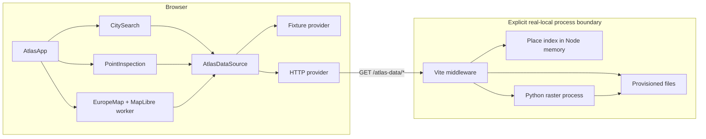
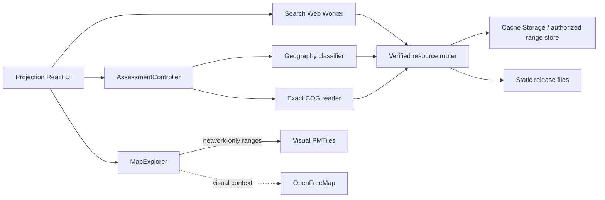

# 02 — Container View

> **Status:** Implemented execution units, reviewed 2026-10-04.
> A container here means an execution or deployment unit, not necessarily Docker.

## Execution inventory

| Unit | Implementation | When it runs |
|---|---|---|
| Static application build | React 19, TypeScript, Vite 8 in `src/web` | Fixture and real-local builds; three HTML routes |
| Coastal atlas | `atlas/AtlasApp.tsx` with one injected `AtlasDataSource` | Main route `/` |
| Fixture data provider | `atlas/fixture-data-source.ts` | Normal atlas build; catalog, four places, inspection and PNG generation in browser |
| Local atlas adapter | `scripts/real-local-atlas.mjs` and `real-local-context.mjs` | Only explicit real-local Vite dev/preview; serves catalog, search, place and basemap, proxies raster reads |
| Raster process | `scripts/atlas/europe_raster_service.py` | One child process per activated local adapter, on an ephemeral loopback port |
| Atlas map renderer | `atlas/EuropeMap.tsx`, bundled MapLibre worker | Lazy browser chunk; provider PNG overlay plus edition-specific geography |
| Private demo launcher | `scripts/demo/demo.mjs`, sealed preview and lifecycle modules at repository root | Preflight, prepare and serve exact source/app/data-bound local candidates |
| AR6 projection application | `App.tsx`, `application/`, `domain/`, `data/` | `/projections/`; architecture page shares its entry |
| Projection search Worker | `search/search.worker.ts` | Browser; verified core/coastal codepoint-trie shards |
| Projection map | `components/map/` | Browser; visual-only PMTiles and optional OpenFreeMap |
| Projection service worker/stores | `offline/` | Registered by projection entry after interactivity; verified resources and authorized COG chunks |
| Offline release builder | Python `searise_pipeline` and pinned build tooling | Maintainer/CI; candidate construction and evidence, outside browser requests |

Source directories in the table are relative to [src/web](../../src/web/),
except the [demo launcher](../../scripts/demo/demo.mjs), [raster process](../../scripts/atlas/europe_raster_service.py) and
[Python package](../../src/pipeline/searise_pipeline/).

## Atlas execution diagram

```mermaid
flowchart LR
    subgraph Browser
        UI[AtlasApp]
        Search[CitySearch]
        Point[PointInspection]
        Map[EuropeMap + MapLibre worker]
        Source[AtlasDataSource]
        Fixture[Fixture provider]
        HTTP[HTTP provider]
        UI --> Search & Point & Map
        Search & Point & Map --> Source
        Source --> Fixture & HTTP
    end
    subgraph Local[Explicit real-local process boundary]
        Vite[Vite middleware]
        Context[Place index in Node memory]
        Python[Python raster process]
        Inputs[Provisioned files]
        Vite --> Context & Python & Inputs
        Python --> Inputs
    end
    HTTP -->|GET /atlas-data/*| Vite
```

`AtlasApp` does not construct endpoints or choose a provider. The entry chooses
it once. MapLibre owns its rendering worker; this is not the projection search
Worker. Atlas search is in the fixture provider or Node adapter.

Startup validates the catalog and place index before starting Python. Python
verifies raster digests before announcing readiness. Adapter shutdown terminates
the child process; startup failure closes any child it has already created.

## Projection execution diagram

```mermaid
flowchart LR
    App[Projection React UI] --> Controller[AssessmentController]
    App --> Worker[Search Web Worker]
    Controller --> Geometry[Geography classifier]
    Controller --> COG[Exact COG reader]
    App --> Map[MapExplorer]
    Worker & Geometry & COG --> Router[Verified resource router]
    Router --> Stores[Cache Storage / authorized range store]
    Router --> Files[Static release files]
    Map -->|network-only ranges| PMTiles[Visual PMTiles]
    Map -. visual context .-> Base[OpenFreeMap]
```

The release context resolves artifact identities and URLs. No runtime database
or remote assessment endpoint participates. Whole-resource Cache Storage and
bounded COG range storage have different authorities; PMTiles is excluded from
those stores. See [17](17-atomic-projection-state.md) and
[ADR-026](adr/ADR-026-authoritative-browser-range-persistence.md).

## Deployment boundary

The normal build is portable static output. The built real-local edition still
requires its Vite adapter and provisioned files: `dist` alone cannot serve its
data. There is no automatic connection to cloud storage or a provisioned
production compute service. Hosting intentions are separated from executable
local workflows in [08](08-deployment-topology.md).

Source anchors:

- [Build entries](../../src/web/vite.config.ts)
- [Edition plugin](../../src/web/scripts/atlas-edition.mjs)
- [Atlas provider interface](../../src/web/src/atlas/data-source.ts)
- [Projection runtime assembly](../../src/web/src/application/browser-runtime.ts)
- [Service-worker runtime](../../src/web/src/offline/service-worker-runtime.ts)
