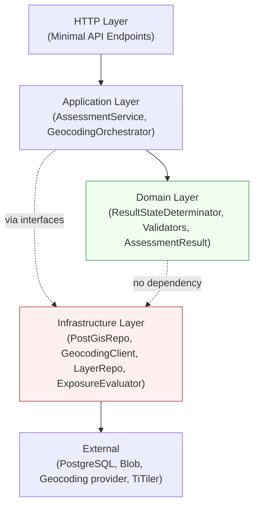
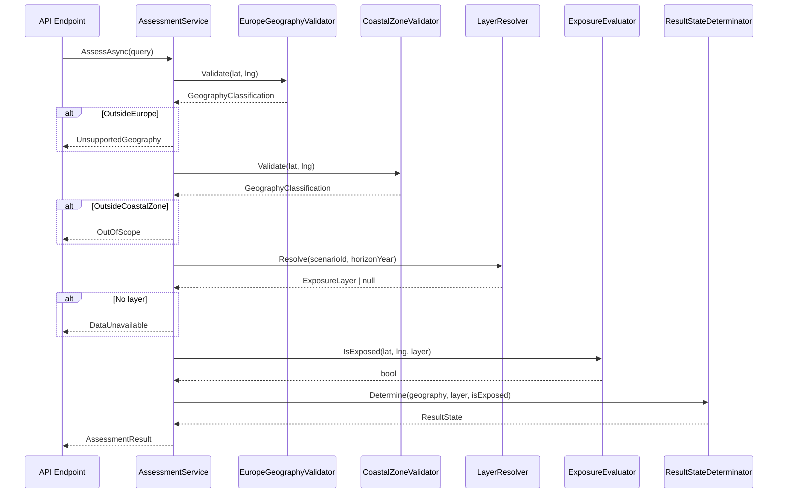

# 03 — Component View (API)

> **Status:** Proposed Architecture
> **Scope:** This document describes the internal structure of the **api** container (ASP.NET Core). TiTiler's responsibilities are noted briefly. Frontend internals are documented separately in [03a-frontend-architecture.md](03a-frontend-architecture.md).

---

## 1. Layer Architecture

The api container follows a clean layered architecture with explicit dependency direction. No layer references a layer above it.

```
┌────────────────────────────────────────────────────┐
│  HTTP Layer                                        │
│  Minimal API endpoints — routing, validation,      │
│  request/response mapping                          │
└──────────────────────┬─────────────────────────────┘
                       │
┌──────────────────────▼─────────────────────────────┐
│  Application Layer                                 │
│  Service orchestration — coordinates domain logic  │
│  and infrastructure adapters                       │
└──────────────────────┬─────────────────────────────┘
                       │
┌──────────────────────▼─────────────────────────────┐
│  Domain Layer                                      │
│  Pure business logic — geography validation,       │
│  result state determination, assessment rules      │
│  (no I/O, no infrastructure dependencies)          │
└──────────────────────┬─────────────────────────────┘
                       │
┌──────────────────────▼─────────────────────────────┐
│  Infrastructure Layer                              │
│  Adapters — Npgsql/PostGIS repos, geocoding        │
│  provider client, Azure Blob SDK, TiTiler client   │
└────────────────────────────────────────────────────┘
```

The domain layer has **no dependencies on infrastructure** — it contains pure C# logic with no HTTP clients, no EF Core, no Azure SDK. This makes it fully unit-testable without mocking infrastructure.

---

## 2. Key Components

### Geocoding Module

**Responsibility:** Accept a raw query string and return ranked geocoding candidates.

**Interfaces:**
```csharp
public interface IGeocodingService
{
    Task<IReadOnlyList<GeocodingCandidate>> GeocodeAsync(
        string query,
        CancellationToken cancellationToken);
}

public record GeocodingCandidate(
    int Rank,
    string Label,
    string Country,
    double Latitude,
    double Longitude,
    string DisplayContext);  // enough detail to distinguish duplicates (BR-009)
```

**Implementations:**
- `NominatimGeocodingClient` — dev only; uses Nominatim public API (acceptable-use constrained)
- `[Provider]GeocodingClient` — production (OQ-06 BLOCKING — class exists as a placeholder)

**Rules enforced here:**
- Returns at most 5 candidates (BR-007)
- Preserves provider rank order (BR-006)
- Normalizes provider-specific response format to `GeocodingCandidate`

**Belongs in:** Infrastructure Layer (provider communication) + Application Layer (orchestration)

**What it does NOT do:** Geography validation — that is done by `AssessmentService` after coordinates are obtained.

---

### Geography Validation Module

**Responsibility:** Determine whether a coordinate is in Europe (FR-009) and whether it is in the configured coastal analysis zone (FR-011).

**Interfaces:**
```csharp
public interface IGeographyRepository
{
    Task<bool> IsWithinEuropeAsync(double latitude, double longitude, CancellationToken ct);
    Task<bool> IsWithinCoastalZoneAsync(double latitude, double longitude, CancellationToken ct);
}
```

**Domain types:**
```csharp
public enum GeographyClassification
{
    InEuropeAndCoastalZone,
    InEuropeOutsideCoastalZone,  // → OutOfScope
    OutsideEurope                // → UnsupportedGeography
}
```

**Domain logic (`EuropeGeographyValidator`, `CoastalZoneValidator`):**
- Accept coordinates; call `IGeographyRepository`
- Return `GeographyClassification` — pure domain return type with no infrastructure dependency

**Infrastructure implementation:**
- `PostGisGeographyRepository` implements `IGeographyRepository` using Npgsql + parameterized PostGIS queries:

```sql
-- Europe check
SELECT ST_Within(
    ST_SetSRID(ST_Point(@longitude, @latitude), 4326),
    geom
) FROM geography_boundaries WHERE name = 'europe';

-- Coastal zone check (requires OQ-04 to be seeded)
SELECT ST_Within(
    ST_SetSRID(ST_Point(@longitude, @latitude), 4326),
    geom
) FROM geography_boundaries WHERE name = 'coastal_analysis_zone';
```

**Critical note:** The `coastal_analysis_zone` geometry is **BLOCKING** (OQ-04). The table row must be seeded before this check can return meaningful results. The check is architecturally complete; the geometry is the missing input.

**GIST index required:**
```sql
CREATE INDEX ON geography_boundaries USING GIST(geom);
```

**Belongs in:** Domain Layer (GeographyClassification, validator logic) + Infrastructure Layer (PostGIS repo)

---

### Assessment Module

**Responsibility:** Orchestrate the full exposure assessment pipeline for a given location + scenario + horizon.

**Top-level service:**
```csharp
public interface IAssessmentService
{
    Task<AssessmentResult> AssessAsync(AssessmentQuery query, CancellationToken ct);
}

public record AssessmentQuery(
    double Latitude,
    double Longitude,
    string ScenarioId,
    int HorizonYear);
```

**Pipeline steps (in order):**
1. Geography validation → if fails, return `UnsupportedGeography` or `OutOfScope` early
2. Layer resolution → if no valid layer, return `DataUnavailable` (BR-014 — no substitution)
3. Exposure evaluation → return `ModeledExposureDetected` or `NoModeledExposureDetected`
4. Assemble `AssessmentResult` with mandatory fields (methodology version, scenario, horizon, generated timestamp)

**Supporting components:**

`LayerResolver`:
```csharp
public interface ILayerResolver
{
    Task<ExposureLayer?> ResolveAsync(string scenarioId, int horizonYear, CancellationToken ct);
}
```
Returns `null` when no valid layer exists for the combination → triggers `DataUnavailable`.

`ExposureEvaluator`:
```csharp
public interface IExposureEvaluator
{
    Task<bool> IsExposedAsync(double latitude, double longitude, ExposureLayer layer, CancellationToken ct);
}
```
**Proposed implementation options (OQ-05 determines the correct approach):**
- Option A: Call TiTiler's `/point/{lng},{lat}` endpoint with the COG URL → get pixel value → apply methodology threshold
- Option B: Direct GDAL/rasterio raster query from within the API (adds rasterio Python dependency or GDAL.NET)
- Option C: Pre-materialized point lookup in PostgreSQL raster table (using PostGIS raster extension)

**Recommendation:** Option A (TiTiler `/point` endpoint) for MVP — avoids adding a raster processing dependency to the API container. Mark as Proposed; validate TiTiler `/point` performance in staging.

`ResultStateDeterminator`:
```csharp
public static class ResultStateDeterminator
{
    public static ResultState Determine(
        GeographyClassification geography,
        ExposureLayer? layer,
        bool? isExposed) => (geography, layer, isExposed) switch
    {
        (OutsideEurope, _, _) => ResultState.UnsupportedGeography,
        (InEuropeOutsideCoastalZone, _, _) => ResultState.OutOfScope,
        (InEuropeAndCoastalZone, null, _) => ResultState.DataUnavailable,
        (InEuropeAndCoastalZone, _, true) => ResultState.ModeledExposureDetected,
        (InEuropeAndCoastalZone, _, false) => ResultState.NoModeledExposureDetected,
        _ => ResultState.DataUnavailable  // safe fallback
    };
}
```

This function is **pure** — no I/O, no side effects — and is the canonical implementation of BR-010 and BR-011.

**Belongs in:** Application Layer (AssessmentService, LayerResolver orchestration) + Domain Layer (ResultStateDeterminator, GeographyClassification, AssessmentResult) + Infrastructure Layer (ILayerResolver impl, ExposureEvaluator impl)

---

### Scenario / Configuration Module

**Responsibility:** Provide scenario list, horizon list, defaults, and methodology metadata to the frontend.

**Interfaces:**
```csharp
public interface IScenarioRepository { Task<IReadOnlyList<Scenario>> GetAllAsync(CancellationToken ct); }
public interface IMethodologyRepository { Task<MethodologyVersion> GetActiveAsync(CancellationToken ct); }
```

**Notes:**
- Scenario IDs and display names: seeded from database (OQ-02 — BLOCKING)
- Default scenario and horizon: `is_default` field in database (OQ-03 — BLOCKING)
- Horizons are confirmed: {2030, 2050, 2100} (FR-015) — can be hardcoded or seeded
- Methodology metadata is read from `methodology_versions` WHERE `is_active = true`

**Caching:** For MVP, in-process memory cache per API instance (scenario/methodology config changes rarely). `IMemoryCache` with a 5-minute TTL is sufficient for demo-scale traffic.

---

### Health Module

**Responsibility:** Expose `/health` endpoint for Azure Container Apps liveness and readiness probes (NFR-011).

```csharp
// Checks: PostgreSQL connectivity (SELECT 1) + Blob Storage reachability
// Returns HTTP 200 (healthy) or HTTP 503 (unhealthy)
app.MapHealthChecks("/health", new HealthCheckOptions
{
    ResponseWriter = UIResponseWriter.WriteHealthCheckUIResponse
});
```

Registered health checks:
- `AddNpgsql(connectionString)` — PostgreSQL connectivity
- `AddAzureBlobStorage(connectionString, containerName)` — Blob reachability

---

### Logging / Observability Module (Cross-cutting)

**Responsibility:** Emit structured JSON logs with correlation IDs for all requests. Never log raw address strings.

**Implementation:**
- Serilog or `Microsoft.Extensions.Logging` with JSON formatter → stdout → Azure Monitor
- Middleware injects `X-Correlation-Id` into `ILogger` scope for all downstream log calls
- Correlation ID sourced from request header `X-Correlation-Id` or generated (UUID v4) if absent
- Correlation ID returned in all response bodies as `requestId`

**Critical constraint (NFR-007, BR-016):** The geocoding query string (raw address) must never appear in any log statement. Enforce via code review and log audits in testing.

---

## 3. Dependency Direction



The domain layer has no arrows pointing to infrastructure — this is enforced by not referencing any infrastructure namespace from domain classes.

---

## 4. Validation Boundaries

| Validation Type | Layer | Mechanism |
|---|---|---|
| Input format (query length ≤ 200) | HTTP Layer | FluentValidation or `.WithValidator()` in Minimal API |
| Coordinate range (lat/lng bounds) | HTTP Layer | Attribute validation on request DTO |
| Scenario exists | HTTP Layer / Application | Check against known scenarios before assessment |
| Horizon in {2030, 2050, 2100} | HTTP Layer | Enum/range validation |
| Europe geography | Domain | `EuropeGeographyValidator` → PostGIS `ST_Within` |
| Coastal zone | Domain | `CoastalZoneValidator` → PostGIS `ST_Within` |
| Result state determination | Domain | `ResultStateDeterminator` — pure function |

Geography validation is **always server-side**. Client-side validation is supplementary UX only and not relied on for correctness (FR-009–FR-012 must be enforced by the API).

---

## 5. Logic Ownership Summary

| Concern | Component | Layer |
|---|---|---|
| Input format validation | Minimal API validators | HTTP |
| Geocoding provider communication | `IGeocodingService` impl | Infrastructure |
| Candidate ranking / max-5 truncation | Geocoding adapter | Infrastructure |
| Europe geometry check | `EuropeGeographyValidator` → `IGeographyRepository` | Domain / Infra |
| Coastal zone check | `CoastalZoneValidator` → `IGeographyRepository` | Domain / Infra |
| Layer resolution for scenario+horizon | `ILayerResolver` | Application / Infra |
| Point-in-COG exposure evaluation | `IExposureEvaluator` | Application / Infra |
| Result state determination | `ResultStateDeterminator` (pure) | Domain |
| Methodology version tracking | `IMethodologyRepository` + `AssessmentResult` | Application / Infra |
| Structured logging + correlation ID | Middleware decorator | Cross-cutting |
| Map tile serving | TiTiler container (separate service) | N/A |
| Tile colorization | TiTiler (configured via URL params) | N/A |

---

## 6. Assessment Request Component Interaction



---

## 7. TiTiler Internal Responsibilities (Summary)

TiTiler is an off-the-shelf FastAPI application. Within SeaRise Europe its role is:
- Read COG files from Azure Blob Storage via GDAL VSIAZ driver
- Serve `/{z}/{x}/{y}.png` tiles with configurable colormap and rescale parameters
- Serve `/point/{lng},{lat}` — pixel value at a coordinate (used by ExposureEvaluator, Option A)
- No application-layer customization — only environment configuration (Blob connection, CORS, allowed origins)

**Open Question:** Whether assessment point evaluation uses TiTiler `/point` (Option A) or a direct GDAL query in the API. Resolve during Phase 0 spike based on latency and reliability testing.
