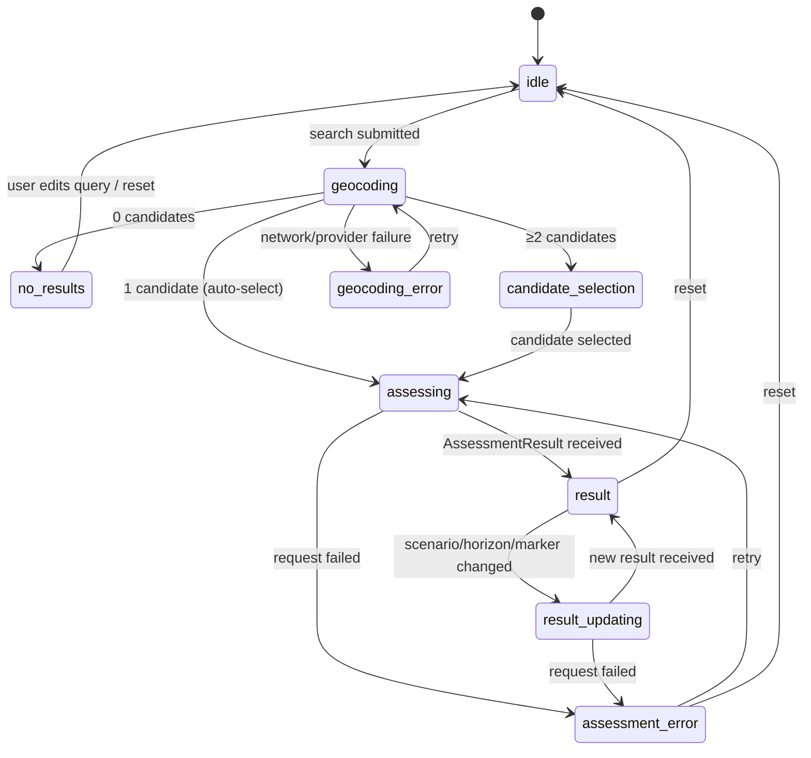
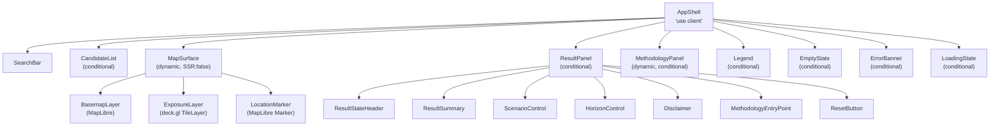

# 03a — Frontend Architecture

> **Status:** Proposed Architecture
> **This document is mandatory and treated as a first-class architecture concern.**
> Frontend is the primary delivery vehicle for the product's value. See [03-component-view.md](03-component-view.md) for API internals.

---

## 0. Visual Specification Authority

> The clickable prototype in `docs/product/Mock/pages/` is the **authoritative visual specification** for the production frontend. All component implementations must match the mocks in layout, spacing, color, typography, and copy. See `docs/product/Mock/MOCK_REQUIREMENTS_MAP.md` for the full traceability map linking each mock screen to its requirements and delivery stories.
>
> Where this architecture document describes component behavior or copy in generic terms, the mock provides the concrete visual reference. Where the mocks use simplified user-facing language (e.g., "Risk detected" instead of "Modeled Coastal Exposure Detected"), the simplified version is authoritative for the UI. Internal/API vocabulary remains unchanged.

---

## 1. Frontend Goals and Constraints

### Goals (derived from PRD, VISION, PERSONAS, METRICS_PLAN, CONTENT_GUIDELINES)

- Deliver a high-quality, honest, place-based coastal exposure experience (VISION Pillars 1–2)
- Make methodology transparent and first-class, not buried in a footer (VISION Pillar 3, P-02, P-03)
- Handle all 5 result states with clarity and visual/textual distinction (BR-010, CONTENT_GUIDELINES §3)
- Handle all edge/error states without blank or broken UI (NFR-010)
- Demonstrate strong frontend architecture quality for portfolio audience (P-03 — "edge cases handled gracefully")
- Meet WCAG 2.2 AA (NFR-015)
- Keep map and result panel synchronized at all times (FR-031)

### Constraints

- No user data persistence in the browser beyond session scope (BR-016)
- No secrets in client-side code (NFR-006) — no API keys visible to browser
- Only the latest assessment response is rendered when control changes occur rapidly (FR-040)
- All result copy must use modeled language; prohibited phrases enforced (CONTENT_GUIDELINES §9)
- English only in MVP; all copy externalized for future localization (NFR-018)
- MapLibre GL JS and deck.gl require browser APIs (WebGL, window) — cannot run server-side

---

## 2. Route Structure and App Shell

MVP has a single primary route: `/`

```
app/
  layout.tsx          ← Root layout (Server Component): html, head, global CSS, font loading
  page.tsx            ← Root page (Server Component): renders <AppShell />
  components/
    AppShell.tsx       ← 'use client' boundary — root of the interactive tree
    search/
      SearchBar.tsx
      CandidateList.tsx
    map/
      MapSurface.tsx   ← Dynamic import, SSR: false
      ExposureLayer.tsx
      LocationMarker.tsx
    results/
      ResultPanel.tsx
      ResultStateHeader.tsx
      ResultSummary.tsx
      ScenarioControl.tsx
      HorizonControl.tsx
      Disclaimer.tsx
    methodology/
      MethodologyEntryPoint.tsx
      MethodologyPanel.tsx
    shared/
      Legend.tsx
      EmptyState.tsx
      LoadingState.tsx
      ErrorBanner.tsx
  lib/
    store/
      appStore.ts      ← Zustand: application phase state machine
      mapStore.ts      ← Zustand: viewport + selected location
      uiStore.ts       ← Zustand: panel visibility, transient UI
    api/
      geocoding.ts     ← TanStack Query hooks for geocoding
      assessment.ts    ← TanStack Query hooks for assessment
      config.ts        ← TanStack Query hooks for config/methodology
    i18n/
      en.ts            ← All UI copy strings (NFR-018)
    types/
      index.ts         ← Shared TypeScript types
```

### Rendering Strategy

| Component | Rendering | Reason |
|---|---|---|
| `layout.tsx` | Server Component | Static HTML skeleton, metadata, font loading — no browser APIs needed |
| `page.tsx` | Server Component | Renders AppShell; no interactivity at this level |
| `AppShell.tsx` | Client Component (`'use client'`) | Root of interactive tree; must coordinate map + search + results |
| `MapSurface.tsx` | Dynamic import, SSR: false | MapLibre GL JS requires `window`, `WebGLRenderingContext` — will throw on server |
| `MethodologyPanel.tsx` | Dynamic import | Deferred load — only needed when user opens it |
| Config fetch | Client-side (TanStack Query) | Fetched on app load; changes infrequently |

**Why this boundary:** Next.js App Router allows keeping the static shell in server components (reducing client-side JS) while placing the entire interactive surface in a single client boundary. The alternative — trying to SSR more of the page — would fail because MapLibre GL JS is fundamentally browser-only.

---

## 3. Component Structure

### AppShell

The root client component. Orchestrates the application phase and renders child sections based on current state.

```tsx
// Reads: appStore (phase), mapStore (selectedLocation), uiStore (panel states)
// Renders: SearchBar, CandidateList (conditional), MapSurface, ResultPanel (conditional),
//          MethodologyPanel (conditional), Legend (conditional), EmptyState / LoadingState / ErrorBanner
```

### SearchBar

- Free-text input, max 200 characters (BR-008, FR-002)
- Submit on Enter or button click
- Inline validation: blocks empty submission (FR-003/AC-001); blocks >200 chars
- On valid submit: transitions appPhase → `geocoding`, fires TanStack Query geocoding mutation
- Does **not** store or log raw input text (BR-016)
- ARIA: `role="search"`, input `aria-label="Search for a European location"`

### CandidateList

- Shown when geocoding returns ≥2 candidates (if exactly 1, auto-select is a **proposed** behavior — mark as decision)
- Up to 5 items (BR-007), each showing `label + displayContext` (BR-009 — enough to distinguish duplicates)
- `role="listbox"`, each candidate `role="option"` — keyboard navigable (NFR-015)
- On selection: transitions appPhase → `assessing`, sets `selectedLocation` in mapStore
- Dismissed after selection

### MapSurface

- MapLibre GL JS instance (initialized once, stored in `useRef` — not React state)
- Europe-centered initial view: `center: [10, 54], zoom: 4` (FR-026)
- Pan and zoom enabled (FR-027)
- Click handler: if `selectedLocation` already set → capture click coords → new assessment (FR-007, FR-008)
- `ExposureLayer`: deck.gl `TileLayer` reading tiles from TiTiler URL template; visible only when `resultState === 'ModeledExposureDetected'` (FR-021)
- `LocationMarker`: rendered when `selectedLocation` is set; visually distinct from exposure overlay (FR-028)
- MapLibre attribution control enabled — required for basemap provider attribution (FR-034)

```tsx
// Initialization (runs once)
useEffect(() => {
  const map = new maplibregl.Map({
    container: containerRef.current,
    style: process.env.NEXT_PUBLIC_BASEMAP_STYLE_URL,
    center: [10, 54],
    zoom: 4,
  });
  mapRef.current = map;
  map.on('click', handleMapClick);
  return () => map.remove();
}, []);
```

### ResultPanel

Rendered when `appPhase` is in `['assessing', 'result', 'result_updating', 'assessment_error']`.

Contains:
- `ResultStateHeader`: headline from `strings.resultStates[result.resultState]` — one of 5 values (BR-010)
- `ResultSummary`: fills CONTENT_GUIDELINES §3 template with location label, scenario displayName, horizonYear
- `ScenarioControl`: vertical list of model cards (NASA optimistic / Copernicus moderate / IPCC worst case); shows active selection with highlight (FR-018); onChange → new assessment. See mock `06-exposure.html` sidebar for reference layout.
- `HorizonControl`: visual timeline selector with 5 stops `[+10 yr | +20 yr | +30 yr | +50 yr | +100 yr]`; gradient fill track showing progression; shows active horizon with absolute year annotation (FR-018); onChange → new assessment. See mock `06-exposure.html` for reference layout.
- `Disclaimer`: exact text from CONTENT_GUIDELINES §4 (FR-024)
- `MethodologyEntryPoint`: "How to interpret this result" button (FR-032)
- `ResetButton`: clears all state → returns to `idle` phase (FR-041)

**During `result_updating`:** Previous result text remains visible; a loading indicator appears alongside to signal that a new result is in progress. Stale text must not be shown as "active" (PRD §10.3).

### MethodologyPanel

- Drawer (desktop: right side or modal; mobile: full-screen bottom sheet)
- Dynamically imported — deferred until first open
- Content from `GET /v1/config/methodology` (TanStack Query, cached for session)
- Contains all elements required by FR-033 and CONTENT_GUIDELINES §5:
  - Methodology version identifier
  - Sea-level projection source (name, provider, URL)
  - Elevation source (name, provider)
  - What the methodology does (plain-language, 2–4 sentences)
  - What it does NOT account for (explicit list)
  - Dataset resolution note
  - Interpretation guidance
- `role="dialog"`, `aria-modal="true"`, focus trap while open
- On close: focus returns to `MethodologyEntryPoint` button

### Legend

- Shown when result has an exposure layer (`layerTileUrlTemplate` is not null)
- Reads `legendSpec` from the assessment result (colormap stops + labels)
- Updates whenever result changes (FR-029)
- Non-color-dependent: includes both color and text labels (NFR-015)

### EmptyState

- Shown when `appPhase === 'idle'`
- Heading and body from `strings.emptyState` (CONTENT_GUIDELINES §6)
- `aria-live="polite"` on the container to announce when it appears

### LoadingState / LoadingOverlay

- Shown when `appPhase === 'geocoding'` or `appPhase === 'assessing'`
- Copy: `strings.loading.geocoding` / `strings.loading.assessing(locationLabel)` (CONTENT_GUIDELINES §7)
- No "almost there!" copy — neutral only
- Map pan/zoom remains interactive during loading (PRD §10.3)
- `aria-busy="true"` on loading region

### ErrorBanner

- Shown when `appPhase === 'geocoding_error'` or `appPhase === 'assessment_error'`
- `role="alert"` for immediate screen reader announcement
- Copy from `strings.errors` (CONTENT_GUIDELINES §8)
- Retry button calls the failed request again (FR-039)

---

## 4. State Architecture

### 4.1 Application Phase State Machine (Zustand: appStore)

The application phase is a discriminated union that prevents impossible UI combinations:

```typescript
export type AppPhase =
  | { phase: 'idle' }
  | { phase: 'geocoding' }
  | { phase: 'geocoding_error'; error: GeocodingError }
  | { phase: 'no_geocoding_results' }
  | { phase: 'candidate_selection'; candidates: GeocodingCandidate[] }
  | { phase: 'assessing'; location: SelectedLocation }
  | { phase: 'result'; location: SelectedLocation; result: AssessmentResult }
  | { phase: 'result_updating'; location: SelectedLocation; previousResult: AssessmentResult }
  | { phase: 'assessment_error'; location: SelectedLocation; error: AssessmentError }
```

Valid transitions:
```
idle → geocoding (search submitted)
geocoding → no_geocoding_results | candidate_selection | geocoding_error | assessing (1 result)
candidate_selection → assessing (candidate selected)
geocoding_error → geocoding (retry)
assessing → result | assessment_error | unsupported_geography | out_of_scope | data_unavailable
result → assessing (map click or control change) | result_updating | idle (reset)
result_updating → result (new result received) | assessment_error
assessment_error → assessing (retry)
any → idle (reset — FR-041)
```

Note: `UnsupportedGeography`, `OutOfScope`, `DataUnavailable` are result states within the `result` phase variant, not separate phases — they are values of `AssessmentResult.resultState`.

### 4.2 Server State (TanStack Query)

| Query Key | Endpoint | Stale Time | Notes |
|---|---|---|---|
| `['config', 'scenarios']` | `GET /v1/config/scenarios` | Infinity (session) | Fetched once on app load; blocks ScenarioControl render until ready |
| `['config', 'methodology']` | `GET /v1/config/methodology` | Infinity | Fetched on first methodology panel open |
| `['geocode', query]` | `POST /v1/geocode` | 30s | Invalidated on query string change |
| `['assess', lat, lng, scenarioId, horizonYear]` | `POST /v1/assess` | 60s | Cache key includes all params — enables NFR-004 scenario/horizon cache hits |

The `staleTime: 60_000` on assessment queries means switching back to a previously viewed scenario/horizon combination returns the cached result instantly, satisfying NFR-004 without a new API call.

### 4.3 Stale Request Handling (FR-040)

FR-040: only the latest completed request result is rendered. Implementation:

```typescript
// useAssessment.ts
const abortControllerRef = useRef<AbortController | null>(null);
const requestSeqRef = useRef(0);

function triggerAssessment(params: AssessmentParams) {
  // Cancel any in-flight request
  abortControllerRef.current?.abort();
  const controller = new AbortController();
  abortControllerRef.current = controller;

  // Increment sequence number
  const seq = ++requestSeqRef.current;

  fetch('/v1/assess', { body: JSON.stringify(params), signal: controller.signal })
    .then(res => res.json())
    .then(result => {
      // Discard if a newer request has been started
      if (seq !== requestSeqRef.current) return;
      // Apply result to appStore
      appStore.getState().setResult(result);
    })
    .catch(err => {
      if (err.name === 'AbortError') return; // stale — ignore
      appStore.getState().setAssessmentError(err);
    });
}
```

TanStack Query's `AbortSignal` integration handles this automatically when using `useQuery` — the query key change aborts the previous query. This pattern is shown for custom fetch flows; TanStack Query is the preferred approach.

### 4.4 URL State (Proposed — OQ-08 readiness)

Frontend designed to serialize state to URL `searchParams` from the start, even before OQ-08 is resolved:

```
/?lat=52.37&lng=4.90&scenario=ssp2-45&horizon=2050&zoom=10
```

On load: initialize from URL params if valid; otherwise start in `idle`.
On state change: `router.replace(url)` — no navigation, just URL update.

This is low-cost to implement and prevents deep-linking from being a breaking change if OQ-08 resolves to "yes". If OQ-08 resolves to "no," URL state still functions but is not advertised.

### 4.5 Map State (Zustand: mapStore)

```typescript
type MapStore = {
  viewport: { center: [number, number]; zoom: number };
  selectedLocation: SelectedLocation | null;
  setViewport: (v: { center: [number, number]; zoom: number }) => void;
  setSelectedLocation: (l: SelectedLocation | null) => void;
};
```

MapSurface syncs MapLibre's `move` events into `mapStore`. Other components read `selectedLocation` and `viewport` from the store.

### 4.6 UI State (Zustand: uiStore)

```typescript
type UIStore = {
  isMethodologyPanelOpen: boolean;
  openMethodologyPanel: () => void;
  closeMethodologyPanel: () => void;
};
```

Panel visibility, tooltip visibility — no business logic.

---

## 5. UI State Model

| UI State | AppPhase | What the User Sees | Mock Reference |
|---|---|---|---|
| Initial Empty | `idle` | EmptyState + Map (Europe view) + SearchBar | `01-landing.html` |
| Geocoding Loading | `geocoding` | SearchBar (loading), map unchanged, "Searching for locations…" | `02-search-loading.html` |
| No Results | `no_geocoding_results` | "No locations found" message in panel area | `04-no-results.html` |
| Candidate Selection | `candidate_selection` | CandidateList (1–5 options) | `03-candidates.html` |
| Assessment Loading | `assessing` | Map with marker, "Calculating exposure…" loading state | `05-assessing.html` |
| Modeled Exposure Detected | `result` (ModeledExposureDetected) | Sidebar + ResultCard: "Risk detected" badge, sea-level value, exposure overlay | `06-exposure.html` |
| No Modeled Exposure | `result` (NoModeledExposureDetected) | Sidebar + ResultCard: "No risk detected" badge, marker, no overlay | `07-no-exposure.html` |
| Data Unavailable | `result` (DataUnavailable) | Sidebar + ResultCard: "Data not available" badge, action suggestions | `08-data-unavailable.html` |
| Out of Scope | `result` (OutOfScope) | Center card: "This location is too far from the coast" | `09-inland.html` |
| Unsupported Geography | `result` (UnsupportedGeography) | Center card: "This location is outside Europe" | `10-unsupported.html` |
| Control Changing | `result_updating` | Previous result still visible + inline loading indicator | (behavioral — see `06-exposure.html` layout) |
| Recoverable Error (geocoding) | `geocoding_error` | Center card with retry + clear actions | `12-error-geocoding.html` |
| Recoverable Error (assessment) | `assessment_error` | Sidebar visible + error card with retry | `13-error-assessment.html` |
| Methodology Panel | (any result state) | Right-side drawer overlay on result view | `11-methodology.html` |



---

## 6. Map Architecture

### 6.1 MapLibre GL JS

- Instance created once via `useRef` — not React state (no re-renders on map pan/zoom)
- Destroyed on component unmount (`map.remove()`)
- Basemap style URL from `NEXT_PUBLIC_BASEMAP_STYLE_URL` (OQ-07 — provider TBD)
- Attribution control: enabled, bottom-right corner

### 6.2 deck.gl Integration

deck.gl overlays MapLibre via `MapboxOverlay` adapter:

```tsx
import { MapboxOverlay } from '@deck.gl/mapbox';
import { TileLayer } from '@deck.gl/geo-layers';

const overlay = new MapboxOverlay({ layers: [] });
map.addControl(overlay);

// Update layers when result changes:
overlay.setProps({
  layers: [
    new TileLayer({
      id: 'exposure',
      data: layerTileUrlTemplate,  // from assess response
      visible: resultState === 'ModeledExposureDetected',
      opacity: 0.7,
    })
  ]
});
```

### 6.3 Location Marker

MapLibre Marker (HTML element) for the selected location:
- Placed at candidate coordinates on selection (FR-006)
- Moved to click coordinates on map click (FR-007)
- Visually distinct from exposure overlay — different color/icon (FR-028)

### 6.4 Legend Synchronization

Legend reads `legendSpec` from the TanStack Query assessment result. When the result changes (scenario/horizon switch), the legend re-renders from the new `legendSpec`. This ensures FR-029 and FR-031 are met without additional synchronization logic.

### 6.5 Attribution

MapLibre attribution control shows basemap provider attribution automatically from the style document. Data source attributions (IPCC AR6, Copernicus DEM) are shown in the methodology panel (FR-034, CONTENT_GUIDELINES §5). A static attribution bar below the map may also be needed — confirm during visual design.

---

## 7. Responsive Behavior

### Desktop (≥1024px) — Primary target
- Layout per mocks: left sidebar (280px) with location info + timeline selector + forecast model list, map area fills remaining width, floating result card (320px) overlaid on map right side. See `06-exposure.html`.
- MethodologyPanel: right-side drawer overlay with dimmed background. See `11-methodology.html`.
- Map controls: zoom buttons on map right edge, glass-morphism style.
- ScenarioControl + HorizonControl: visible in sidebar at all times (FR-030).

### Tablet (768–1023px)
- Map fills full width; ResultPanel as collapsible bottom panel
- ScenarioControl: compact tabs or dropdown
- All core flows remain operable (PRD §10.8)

### Mobile (<768px)
- Map fills full viewport
- ResultPanel: bottom sheet (~40% height, draggable to expand)
- MethodologyPanel: full-screen drawer
- SearchBar: top bar or floating

**Implementation:** TailwindCSS responsive prefixes (`md:`, `lg:`). No JavaScript-driven breakpoints — pure CSS. `OQ-12` (tablet/mobile visual parity requirement) is unresolved; mark mobile bottom sheet as Proposed.

---

## 8. Accessibility Strategy

**Required:** WCAG 2.2 AA (NFR-015)

### Keyboard Flow
1. `Tab` → SearchBar input → type query → `Enter` to submit
2. `Tab` through CandidateList (if shown) → `Enter`/`Space` to select
3. `Tab` → ScenarioControl → `Arrow` keys to change scenario
4. `Tab` → HorizonControl → `Arrow` keys to change horizon
5. `Tab` → MethodologyEntryPoint → `Enter` to open
6. Within panel: `Tab` through content → `Escape` or close button → focus returns to trigger
7. `Tab` → ResetButton → `Enter` to reset

### Focus Management
- CandidateList opens → focus first candidate
- Result updates → `aria-live="polite"` announces new result state
- MethodologyPanel opens → focus panel heading, trap focus within
- MethodologyPanel closes → return focus to trigger button

### ARIA and Live Regions
```html
<!-- SearchBar -->
<input aria-label="Search for a European location" role="combobox" />

<!-- CandidateList -->
<ul role="listbox">
  <li role="option" aria-selected="false">...</li>
</ul>

<!-- Result state announcement -->
<div aria-live="polite" aria-atomic="true">
  {resultState heading}
</div>

<!-- Loading -->
<div aria-busy="true" aria-live="polite">Calculating exposure…</div>

<!-- Error -->
<div role="alert">{error message}</div>

<!-- Methodology panel -->
<div role="dialog" aria-modal="true" aria-labelledby="methodology-heading">…</div>
```

### Non-Color-Dependent Communication (NFR-015, NFR-016)
- Result states: communicated via text heading AND visual state, not color alone
- Exposure overlay: should include pattern/opacity variation for colorblind users (validate in QA)
- Legend: text labels alongside color swatches
- ResultPanel is always the authoritative communication of exposure state (NFR-016)

### Map Accessibility
- Map container: `role="img"`, `aria-label` updated dynamically ("Interactive map showing [result state] for [location]")
- Map interaction is supplementary — keyboard users can complete the full flow via Search → CandidateList without clicking the map

---

## 9. Frontend Performance Strategy

### Initial Load (NFR-001: ≤4s p95)
- `MapSurface` dynamically imported with `{ ssr: false }` — MapLibre bundle deferred until mount
- `MethodologyPanel` dynamically imported — only loaded on first open
- TailwindCSS build-time purge — no unused CSS shipped
- Next.js automatic route-level code splitting
- `next/font` for web font loading (zero layout shift)
- Config data prefetched on app load (small payload)

**Critical bundle target:** Total initial JS (before lazy-loaded chunks) < 300KB gzipped.

### Assessment Latency (NFR-003/NFR-004)
- TanStack Query 60s cache on assessment results — scenario/horizon switches to a previously seen combination resolve instantly
- TiTiler tile loading: deck.gl `TileLayer` handles tile lifecycle (loading, error, cancellation) and uses HTTP range requests via COG overviews (NFR-020)
- AbortController ensures cancelled requests do not consume browser connections

### Code Splitting
```tsx
// MapSurface — large bundle, needs browser APIs
const MapSurface = dynamic(() => import('./map/MapSurface'), {
  ssr: false,
  loading: () => <div className="bg-gray-100 animate-pulse w-full h-full" />,
});

// MethodologyPanel — only needed on demand
const MethodologyPanel = dynamic(() => import('./methodology/MethodologyPanel'), {
  loading: () => null,
});
```

---

## 10. Security and Privacy Constraints

| Constraint | Source | Implementation |
|---|---|---|
| No API key in client code | NFR-006 | Geocoding key is only in api container env vars. Basemap key: use domain-restricted public key (Option A, see 07-security-architecture.md) |
| No raw address in analytics | BR-016, NFR-007 | `search_submitted` event sends `query_length` only — never query text |
| No raw address in localStorage | BR-016 | Never write search input to Web Storage |
| URL state: coordinates only | BR-016 | URL params use `lat`/`lng` numbers, not address strings |

---

## 11. Localization-Ready Content (NFR-018)

All UI strings in `lib/i18n/en.ts`:

```typescript
// lib/i18n/en.ts
export const strings = {
  emptyState: {
    heading: 'Explore coastal sea-level exposure in Europe',
    body: 'Enter a European address, city, or location...',
    subtext: 'Results are model-based estimates, not engineering assessments.',
  },
  // User-facing labels use simplified language per mock visual spec.
  // Internal API states remain unchanged (ModeledExposureDetected, etc.)
  resultStates: {
    ModeledExposureDetected: 'Risk detected',
    NoModeledExposureDetected: 'No risk detected',
    DataUnavailable: 'Data not available',
    OutOfScope: 'This location is too far from the coast',
    UnsupportedGeography: 'This location is outside Europe',
  },
  loading: {
    geocoding: 'Searching for locations…',
    assessing: (location: string) => `Calculating exposure for ${location}…`,
  },
  errors: {
    geocodingFailure: {
      heading: 'Search temporarily unavailable',
      body: 'We could not complete your search right now. Please try again.',
    },
    assessmentFailure: {
      heading: 'Result temporarily unavailable',
      body: 'We could not calculate the exposure for this location right now. Please try again.',
    },
    unexpected: {
      heading: 'Something went wrong',
      body: 'An unexpected error occurred. Reload the page and try again.',
    },
  },
  disclaimer: 'This result is a scenario-based model estimate for informational purposes only. It is not an engineering assessment, structural survey, legal determination, insurance evaluation, mortgage guidance, or financial advice. Do not rely on this result for decisions requiring professional expertise.',
  noResults: {
    heading: 'No locations found',
    body: (query: string) => `We could not find a match for "${query}". Try a more specific address, a city name, or a well-known landmark.`,
  },
} as const;
```

No component has hardcoded copy strings. Adding a language = add `fr.ts` and a locale selector.

---

## 12. Frontend Observability

- React Error Boundary at AppShell level → catches unhandled exceptions → logs to analytics error tracker (OQ-10)
- TanStack Query `onError` callbacks → capture API errors
- `performance.mark('assessment:start')` / `performance.mark('assessment:complete')` → feeds SM-4, SM-5 measurement
- If analytics enabled (OQ-10): events from METRICS_PLAN §6 sent with `duration_ms`, `result_state`, `country_code` — never raw addresses

---

## 13. Frontend Testing Summary

| Layer | Tool | Key Focus |
|---|---|---|
| State machine | Jest (no render) | AppPhase transitions, ResultStateDeterminator logic |
| Component unit | React Testing Library | Each result state renders correct headline; no prohibited language |
| Component integration | RTL + MSW | Full geocoding/assessment flows with mocked API |
| E2E | Playwright | All 28 AC, demo script D-01–D-10, keyboard flow |
| Accessibility | axe-core (Playwright) + manual | WCAG 2.2 AA, screen reader testing |
| Performance | Playwright performance API | TTI ≤ 4s (NFR-001) |

Full testing strategy in [10-testing-strategy.md](10-testing-strategy.md).

---

## 14. Component Tree Diagram


