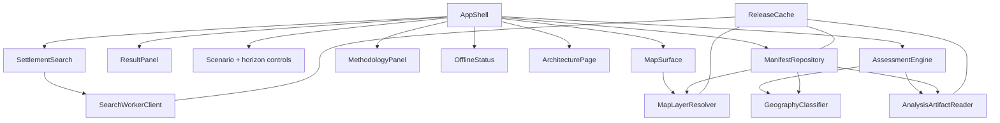

# 03a — Browser Application Architecture

> **Status:** Accepted target architecture
> **Decisions:** [ADR-021 — Static-First Offline Geospatial Architecture](adr/ADR-021-static-first-offline-geospatial-architecture.md) and [ADR-026 — Authoritative Browser Range Persistence](adr/ADR-026-authoritative-browser-range-persistence.md)
> **Role:** Primary runtime component view
> **Experience authority:** [SeaRise Flight](../product/Mock/SeaRise-Flight.html)
> and its [design contract](../product/Mock/DESIGN.md)

## Goals and constraints

The browser application provides the complete product experience without a
request-time application service. It must:

- search European settlements locally and privately;
- assess a coordinate from immutable, pinned data artifacts;
- preserve exactly four scientifically meaningful result states;
- keep location, scenario, horizon, layer, legend, methodology, and release in
  sync;
- remain useful after the core resources have been cached;
- meet WCAG 2.2 AA and the ADR-021 performance fitness functions;
- expose enough evidence to make the architecture and data pipeline reviewable
  as a portfolio project.

The target stack is React 19, TypeScript, Vite 8, MapLibre GL JS, PMTiles,
Web Workers, and standard browser caching APIs. React state is local by
default. Zustand is allowed only when a state genuinely spans independent
component subtrees. Immutable files are not a reason to add a server-state
framework.

## Routes and build output

| Route | Purpose | Rendering |
|---|---|---|
| `/` | Search, map exploration, controls, assessment, and result explanation | Static shell hydrated into an interactive client application |
| `/about/architecture` | Current release, sources, method, limitations, performance evidence, cost, STAC, and signed provenance | Generated from the pinned release manifest at build time, with links to immutable evidence |

Vite emits static HTML, CSS, JavaScript, worker, and service-worker assets.
There are no server components, server actions, SSR runtime, or API routes.
Both routes must provide meaningful document titles, landmarks, and fallback
content before JavaScript initialization.

## UI composition contract

The runtime implements the active canonical Flight visual and interaction
reference. Component boundaries, lazy loading, and scientific anti-corruption
layers must preserve its editorial map-first composition, information
hierarchy, dominant search entry, flight/arrival interaction character,
layered result panel, visible controls, progressive evidence disclosure, and
responsive behavior. Technical architecture is not permission to replace the
experience with a generic dashboard or disconnected map and form.

ADR-024 replaces only invalid scientific semantics. The mock's two binary
exposure cards become one `ProjectionAvailable` presentation; unavailable and
out-of-scope states map to `DataUnavailable` and `OutOfScope`; and the missing
`UnsupportedGeography` state is added. Terrain comparison, modeled-water/flood
meaning, binary exposure, and property claims are never implemented. The
surrounding visual structure and interaction character remain authoritative.

## Logical component structure


```mermaid
flowchart TD
    Shell[AppShell]
    Search[SettlementSearch]
    Results[ResultPanel]
    Controls[Scenario + horizon controls]
    Map[MapSurface]
    Method[MethodologyPanel]
    Offline[OfflineStatus]
    About[ArchitecturePage]

    Manifest[ManifestRepository]
    SearchClient[SearchWorkerClient]
    Assessor[AssessmentEngine]
    Geometry[GeographyClassifier]
    Raster[AnalysisArtifactReader]
    MapData[MapLayerResolver]
    Cache[ReleaseCache]

    Shell --> Search
    Shell --> Results
    Shell --> Controls
    Shell --> Map
    Shell --> Method
    Shell --> Offline
    Shell --> About
    Search --> SearchClient
    Shell --> Manifest
    Shell --> Assessor
    Assessor --> Geometry
    Assessor --> Raster
    Map --> MapData
    Manifest --> Geometry
    Manifest --> Raster
    Manifest --> MapData
    Cache --- Manifest
    Cache --- SearchClient
    Cache --- Raster
    Cache --- MapData
```

UI components display state and emit user intent. Repositories and domain
modules own artifact access and rules. A React component must not convert a map
colour, perform an ad-hoc point-in-polygon test, or construct a release URL.

## Suggested source boundaries

```text
src/
├── app/
│   ├── AppShell.tsx
│   ├── routes.tsx
│   └── state.ts
├── components/
│   ├── search/
│   ├── map/
│   ├── results/
│   ├── methodology/
│   └── shared/
├── domain/
│   ├── assessment.ts
│   ├── geography.ts
│   ├── result-state.ts
│   └── types.ts
├── data/
│   ├── manifest-repository.ts
│   ├── analysis-artifact-reader.ts
│   ├── map-layer-resolver.ts
│   └── schemas/
├── search/
│   ├── search-worker.ts
│   ├── search-worker-client.ts
│   ├── normalize.ts
│   └── ranking.ts
├── offline/
│   ├── release-cache.ts
│   └── service-worker.ts
├── pages/
│   └── ArchitecturePage.tsx
└── content/
    └── en.ts
```

This is a dependency boundary, not a mandatory directory-by-directory
refactor. `components` may depend on `domain`, `data`, `search`, and `offline`;
domain code must not depend on React, MapLibre, or the network.

## Bootstrap and manifest contract

The application build pins a `dataReleaseId`. Bootstrap performs:

1. Render the shell and default controls (`ssp2-45`, `2050`).
2. Fetch the pinned `manifest.json` and validate its release identity and
   schema before enabling assessment.
3. Resolve scenarios, horizons, methodology, support geometry, attribution,
   and artifact URLs only through the manifest.
4. Initialize MapLibre in a lazy chunk.
5. Schedule search-worker initialization on search focus or browser idle.
6. Register the service worker after the shell is interactive.

A malformed manifest, missing required scenario/horizon combination, or release
ID mismatch is a technical startup error. The application must retain the
shell, explain the problem, and provide a retry; it must not substitute an
artifact from another release.

The implemented `ManifestRepository` compiles the release v1 JSON Schemas,
then applies identity, disposition, canonical 3 × 3 matrix, reference-role,
media-type, path, and origin checks. It returns a deeply immutable
`ReleaseContext`; feature code receives resolved artifact URLs and never
constructs provider/storage paths. Generated TypeScript contracts are checked
against the schemas on every static-target lint run. Fetch, range, decode,
integrity, unsupported-browser, abort, schema, and identity failures form a
separate exhaustive technical-error vocabulary.

## Search subsystem

`SettlementSearch` communicates with a dedicated Web Worker through a small
typed protocol:

```typescript
type SearchWorkerRequest =
  | { kind: 'initialize'; token: number; authority: SearchShardAuthority }
  | { kind: 'load-shard'; token: number; authority: SearchShardAuthority }
  | { kind: 'query'; token: number; query: string }
  | { kind: 'terminate'; token: number };

type SearchWorkerResponse =
  | { kind: 'ready'; token: number; shardId: SearchShardId; durationMilliseconds: number }
  | { kind: 'results'; token: number; results: RankedSearchResult[]; readyShards: SearchShardId[] }
  | { kind: 'error'; token: number; error: TechnicalError };
```

The core shard becomes searchable first. Coastal results merge deterministically
when the second shard is ready. The worker applies the versioned normalization
and ranking rules; the UI never re-sorts results by a different rule.

The index is loaded on focus or idle, not on the critical rendering path.
Queries are debounced only to reduce unnecessary worker messages, not to make a
network call. The client applies a monotonically increasing token and ignores a
response for any earlier query. Country and first-level administration remain
visible for duplicate names, and all candidates are keyboard navigable.

The implemented static target verifies each shard's exact release-authorized
transport bytes before decoding. Identity JSON is parsed directly; Brotli
objects use a pinned decoder loaded lazily inside the Worker. Raw query text is
memory-only and never enters URLs, request bodies, storage, caches, logs, or
analytics. See the [static settlement search runbook](../operations/static-settlement-search.md).

## Assessment engine

The assessment engine exposes one typed operation:

```typescript
assess(query: AssessmentQuery, context: ReleaseContext, signal: AbortSignal)
  => Promise<AssessmentResult>
```

It evaluates in a fixed order:

1. Validate latitude, longitude, scenario, horizon, and release identity.
2. Return `UnsupportedGeography` when the coordinate lies outside the Europe
   support geometry.
3. Return `OutOfScope` when it lies inside Europe but outside the coastal
   analysis zone.
4. Resolve the exact scenario/horizon artifact from the manifest.
5. Select the nearest native AR6 grid location by unrounded Haversine distance
   and lowest-ID tie-break.
6. Return `DataUnavailable` when that location is farther than 100 km or any
   required quantile is source nodata.
7. Otherwise return `ProjectionAvailable` with q0.167, q0.5, q0.833, source
   identity and distance, baseline, scenario, horizon, and native resolution.

Network, parse, integrity, and cache-miss failures are technical errors, not
scientific result states. If a required range is unavailable, the engine does
not guess or convert the failure to `DataUnavailable`.

The visual overlay is resolved independently from the same release/scenario/
horizon key. It may use PMTiles, but the scientific value comes from the exact
analysis artifact; PMTiles is visual-only.

## Application state

Use a discriminated union so impossible UI combinations cannot be represented:

```typescript
type AppState =
  | { phase: 'booting' }
  | { phase: 'ready'; selection: Selection }
  | { phase: 'searching'; selection: Selection; query: string }
  | { phase: 'assessing'; selection: Selection; previous?: AssessmentResult }
  | { phase: 'result'; selection: Selection; result: AssessmentResult }
  | { phase: 'technical-error'; selection?: Selection; error: UserSafeError };
```

`AssessmentResult.resultState` carries all four domain outcomes. Do not create
separate error phases for `OutOfScope`, `UnsupportedGeography`, or
`DataUnavailable`.

Only one immutable `Selection` is current:

```typescript
type Selection = {
  location: SelectedLocation;
  scenarioId: 'ssp1-26' | 'ssp2-45' | 'ssp5-85';
  horizon: 2030 | 2050 | 2100;
  dataReleaseId: string;
};
```

The result panel, marker, overlay, legend, and share URL are derived from this
selection and change atomically. On a rapid scenario, horizon, search, or map
change, abort outstanding range reads and increment an evaluation token. A
completed evaluation is applied only if both its token and selection still
match the current state. A previous result may remain visible during an update,
but it must be labelled as updating and cannot appear associated with the new
controls.

## URL and persistence state

URL parameters are the durable, shareable state for coordinate or place,
scenario, horizon, and release. Parsing is strict; invalid or unavailable
values fall back to documented defaults with an accessible notice.

Do not persist raw search text or location history. Browser caches contain
public release resources, not user profiles. A page reload reconstructs a
selection from the URL and re-evaluates it against the pinned release.

## Map architecture

`MapSurface` initializes one MapLibre instance and keeps it outside React
render state. It:

- starts with a Europe-wide view;
- registers the PMTiles protocol before adding release layers;
- displays required OpenFreeMap/OpenMapTiles/OpenStreetMap attribution;
- keeps pan and zoom usable during assessment;
- renders a non-colour-only marker and accessible textual location;
- swaps overlays and legends as one operation after a selection is accepted;
- exposes a textual result and controls that do not require interaction with
  the canvas;
- shows assessment data without a basemap if the public basemap is unavailable.

Map clicks may refine a selected location. They use the same assessment engine
as settlement selections and must not create a second implementation of the
domain flow.

The Phase 2 implementation keeps `MapExplorer` and the MapLibre/PMTiles adapter
as separate dynamic entries. `MapExplorer` receives a controlled `Selection`
and `SelectionCommand`; only the visual quantile band is local presentation
state. `MapLayerResolver` can return only the active dataset's `visual-only`
PMTiles URL from `ReleaseContext`. Optional support/coastal boundary roles are
discovered from that same context when present. The committed synthetic fixture
currently contains the nine projection archives but no separate boundary
artifacts, so its grid-cell outlines and manifest extent are the only boundary
context shown in clean-clone tests.

## Offline and cache behaviour

The service worker uses release-scoped cache names. Cache Storage holds only
byte-verified complete shell and approved release resources. Bounded IndexedDB
may hold only complete integrity-authorized analysis COG chunks. PMTiles stays
network-only and visual-only with a `no-store` caching policy; it cannot enter
Cache Storage, IndexedDB, or the session-memory range store without the
separate promotion contract required by ADR-026. Cache cleanup may delete old
releases only when no active client uses them.

The UI distinguishes:

- online and complete for the current selection;
- available offline for resources already cached;
- online required because a needed range is absent;
- update available for a newer application/release pair.

The baseline does not download all nine Europe-wide layers to every device.
Region downloads require a separate measured design.

## Component behaviour

### Search and candidate list

- Accepts settlement names and aliases, not street addresses.
- Handles empty, overly long, no-result, loading, partial-shard, and worker
  error states.
- Uses combobox/listbox semantics, announces result count, and preserves focus.
- Never sends typed text to project-controlled infrastructure.

### Result panel and controls

- Displays location, scenario, horizon, result state, methodology, and release.
- Uses modeled language and the approved disclaimers.
- Provides text/icon distinctions in addition to colour.
- Keeps valid domain results visually distinct from technical failures.
- Changing a control starts a new local evaluation without an application API.

### Methodology panel

- Reads versioned content from the manifest release.
- Explains sources, transformation, limitations, resolution, vertical datum,
  coastal scope, and interpretation.
- Uses accessible dialog behaviour and restores focus to its trigger.

### Architecture page

- Leads with the product and cost outcomes, then explains technology choices.
- Shows the data release, Git commit, build date, source licences, artifact
  sizes, fitness results, STAC, and signed provenance.
- Separates measured values from targets and identifies the synthetic-data or
  migration state honestly.

## Performance and loading budgets

- Initial JavaScript is at most 250 KiB Brotli, excluding lazy map/search
  chunks.
- Map, architecture detail, search engine, and large indexes are lazy loaded.
- Search p95 after worker initialization is below 50 ms.
- Local assessment p95 after required data is cached is below 100 ms.
- Search-worker initialization is below 1,000 ms on reference mobile hardware.
- All four Lighthouse category scores are at least 90 on the agreed profile.
- Browser integration tests assert zero calls to `/assess`, `/geocode`, and
  `/config`.

These are CI fitness functions, not aspirational prose.

## Accessibility, security, and privacy

- Meet WCAG 2.2 AA for keyboard access, focus, contrast, status announcements,
  responsive layout, and reduced motion.
- Provide a non-map path to every result and explanation.
- Keep MapLibre and data-provider attribution visible.
- Use a restrictive Content Security Policy and narrow artifact-origin CORS.
- Ship no cloud credentials, API keys, raw source paths, or signing secrets.
- Do not add analytics that captures search text or coordinates. Any future
  analytics requires privacy review and explicit documentation.
- Treat manifest text, aliases, and external metadata as untrusted input; render
  it as text rather than HTML.

## Test boundaries

- Domain modules: unit and property tests for scope classification, source-grid
  selection, coordinate edges, quantile mapping, and all four states.
- Search worker: normalization, multilingual aliases, deterministic ranking,
  duplicate places, stale tokens, and both shards.
- Data adapters: manifest/schema failure, range reads, nodata, aborts, and
  release mismatches.
- Components: keyboard flows, focus recovery, live regions, controls, and all
  result/error presentations.
- Integration: search → select → assess → change controls → map click → share →
  reload, with network assertions proving that no application API is used.
- Offline: warm caches, remove the network, repeat supported flows, and verify
  honest failure for uncached data.

## Migration boundary

The current Next.js/TanStack Query/API implementation is not the target
frontend. Migration should first introduce fixture-compatible artifact
contracts and parity tests, then move to Vite and local assessment. Old runtime
code is removed only after ADR-021 Phases 0–3 pass. New target code must not
depend on the temporary API, PostGIS, TiTiler, Azure Maps, or Next.js runtime.
