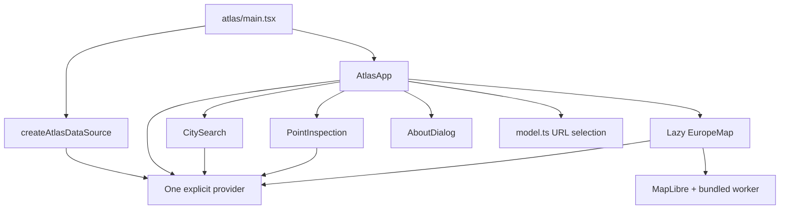

# 03a — Browser Application Architecture

> **Status:** Implemented frontend, reviewed 2026-10-04.
> **Decision context:** [ADR-028](adr/ADR-028-coastal-atlas-adoption.md) for atlas;
> ADR-024/026 for the retained projection application.

## Entries and source boundaries

[Vite configuration](../../src/web/vite.config.ts) emits three documents. These
are client-rendered React entries, not server-rendered pages or hydration of
pre-rendered results. The source HTML contains an empty `root` and metadata.

| Route | Entry | Responsibility |
|---|---|---|
| `/` | [`atlas/main.tsx`](../../src/web/src/atlas/main.tsx) | Chooses edition and injects a data source into `AtlasApp` |
| `/projections/` | [`main.tsx`](../../src/web/src/main.tsx) | Boots `App`, release context and projection service-worker registration |
| `/about/architecture/` | Same projection entry | Lazy `ArchitecturePage`, selected by pathname in `App` |

The actual source layout under `src/web/src` is:

```text
atlas/           Atlas UI, model, contracts, data providers and map adapter
application/     Projection controller, React hooks, URL/runtime coordination
domain/          Projection selection, reducer, scientific lookup and errors
data/            Manifest, geography, COG, integrity and methodology adapters
search/          Projection codepoint-trie runtime, Worker protocol and client
offline/         Projection resource authority, storage, update and retention
components/      Projection UI and map components
routes/          Projection ArchitecturePage
contracts/       Generated release validators and TypeScript contracts
```

React state is local. The current dependencies include neither Zustand nor a
server-state query framework. [Boundary checks](../../src/web/scripts/check-boundaries.mjs)
protect the implemented dependency direction.

## Atlas composition


```mermaid
flowchart TD
    Entry[atlas/main.tsx] --> Factory[createAtlasDataSource]
    Entry --> App[AtlasApp]
    Factory --> Provider[One explicit provider]
    App --> Search[CitySearch]
    App --> Point[PointInspection]
    App --> Map[Lazy EuropeMap]
    App --> About[AboutDialog]
    App --> Model[model.ts URL selection]
    App & Search & Point & Map --> Provider
    Map --> Runtime[MapLibre + bundled worker]
```

`AtlasApp` owns selection, catalog loading/retry, selected city, timeline,
comparison, map status, detail-panel visibility and sharing. UI components
receive `AtlasDataSource`; they do not import the disk manifest or issue raw
HTTP calls. `create-data-source.ts` chooses fixture unless explicitly given
`real-local`; the entry makes that choice from Vite mode.

The interface has `getCatalog`, `search`, `getPlace`, `inspect` and `getTile`.
All accept an optional cancellation signal. The HTTP provider validates response
shape, content type, edition, matching inspection coordinates/defenses, PNG
signature and measured pixel counts. Its failure vocabulary is
`invalid-request`, `unavailable`, `invalid-response`; cancellation preserves
`AbortError`. There is no automatic fallback between editions.

`CitySearch` debounces input and aborts obsolete searches. `PointInspection`
keys results by point, defenses and provider, aborts obsolete work and exposes
retry. It requests all three years together; selecting another displayed year
does not change the scientific meaning of the returned values.

## Atlas view state and map

[`model.ts`](../../src/web/src/atlas/model.ts) reads and writes `year`,
`defenses`, `flooding`, `city`, `compare`, `view` and `point`. Defaults are 2050,
unprotected, overlay visible and comparison off. `AtlasApp` uses
`history.replaceState` and restores on `popstate`; selection URLs are updated
during normal use, not only on Share. Invalid values use the model's defaults
or are omitted. Edition is never selected by the URL.

Comparison toggles between 2030 and 2100 at the same view; it is not a second
scientific scenario or a split-screen calculation. Timeline playback steps
through the three fixed years. It does not interpolate between them.

`EuropeMap` installs a per-instance protocol which asks the injected provider
for PNG bytes and validity/flood counts. Generation checks prevent stale tile
completions from changing the current layer status. Fixture geography is local
GeoJSON; real-local geography uses prepared Protomaps PMTiles, glyphs and
sprites. Flood values are independent of those geographic features.

Map mount waits for two animation frames to give controls a paint opportunity;
canvas pixel ratio is capped at 1.5 on dense displays. The map supports zoom to 16; flood tile zoom is capped at 13. Point inspection
uses source values, never rendered color. Larger map scale does not improve
the 25 m source-cell resolution. Map chunk failures have a retry boundary.

## Retained projection frontend

[`App.tsx`](../../src/web/src/App.tsx) retains Flight's layout and interactions.
It obtains an immutable `ReleaseContext` through `useReleaseContext` and binds
`useAssessmentRuntime` plus `useProjectionUrl`. `AssessmentController` owns
search/assessment operations and the framework-neutral reducer owns accepted
projection state. See [17](17-atomic-projection-state.md).

`ManifestRepository` validates browser manifest **v2** with generated standalone
AJV code. Private-engineering mode uses its separate private-binding validator.
It checks the pinned ID, disposition, exact 3 × 3 matrix, artifact roles, paths,
origins and scientific identities. This is not a direct v1-manifest consumer.

Projection search loads byte-verified core/coastal shards in a Worker with a
lazy Brotli decoder. The implementation is a codepoint trie, not MiniSearch.
The exact message shapes live in
[`worker-protocol.ts`](../../src/web/src/search/worker-protocol.ts); correlation
uses release, client generation, query identity and monotonic tokens. Raw text
stays in browser memory. Results do not initiate assessment until selected.

The assessment path validates selection, classifies support/coastal geometry,
then reads the nearest AR6 location's exact quantiles from a COG. Technical
errors remain separate from the four domain outcomes. `MapExplorer` and its
MapLibre/PMTiles runtime load separately; PMTiles remains visual-only.

Projection URL parsing is strict: invalid scenario, horizon, coordinates or
release mismatch produces a technical error, not a silently substituted result.
The accepted tuple drives result, map and shared selection.

## Offline boundary

Only the projection entry registers `/service-worker.js` after interactivity.
The worker's scope is `/`, but its sealed shell targets
`/projections/index.html` and the projection dependency graph. Atlas documents,
`/atlas-data` and architecture documents are excluded from precache; unrelated
requests pass through. No atlas offline guarantee follows from that root scope.

Projection Cache Storage admits verified complete resources; the bounded range
store admits only integrity-authorized COG chunks. Visual PMTiles is
network-only with `no-store`. The active and immediately previous complete
pairs survive retention; updates use natural activation after closing existing
tabs. Detailed flows are in [04](04-runtime-sequences.md).

## Implemented evidence and limits

`ArchitecturePage` renders build ID, release ID, status, manifest path and a
static explanation. It is not generated from release evidence at build time
and does not currently display a full cost, STAC, signature or performance
report. Methodology is a separate release-backed projection dialog; atlas
methods and edition disclosure are in `AboutDialog`.

Build inspection enforces separate initial JS budgets, lazy-worker boundaries,
CSP and the exact output/precache inventories. Component and browser tests cover
provider errors, cancellation, URL restoration, accessible controls and edition
disclosure. These checks do not establish public scientific qualification or
complete manual accessibility conformance; see [10](10-testing-strategy.md).
