# 04 — Runtime Sequences

> **Status:** Proposed Architecture
> Participants: **Browser** (frontend), **API** (ASP.NET Core), **Geocoder** (external geocoding provider), **Postgres** (PostgreSQL+PostGIS), **Tiler** (TiTiler), **Blob** (Azure Blob Storage)

---

## Sequence 1: Application Load

What happens when a user first opens the application.

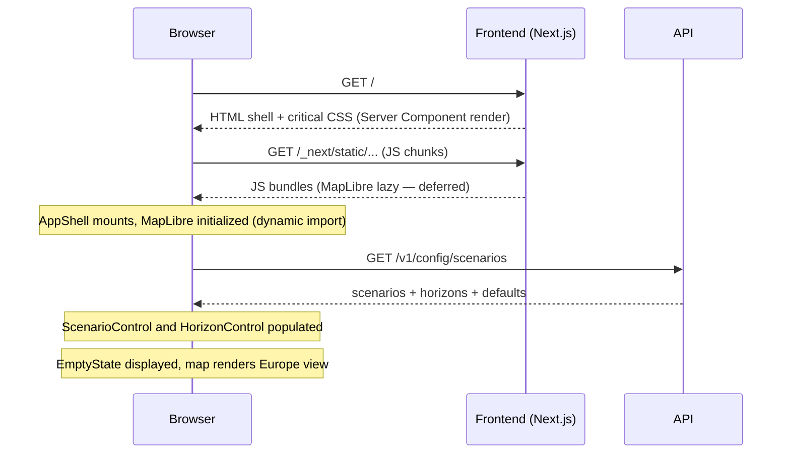

**Notes:**
- MapLibre is loaded via `dynamic(() => import('./MapSurface'), { ssr: false })` — defers the large bundle until after the page shell is interactive (NFR-001)
- `/v1/config/scenarios` is cached indefinitely for the session (TanStack Query `staleTime: Infinity`)
- No geocoding or assessment occurs on load

---

## Sequence 2: Happy Path — Valid Coastal Location

Full flow from search to result display.

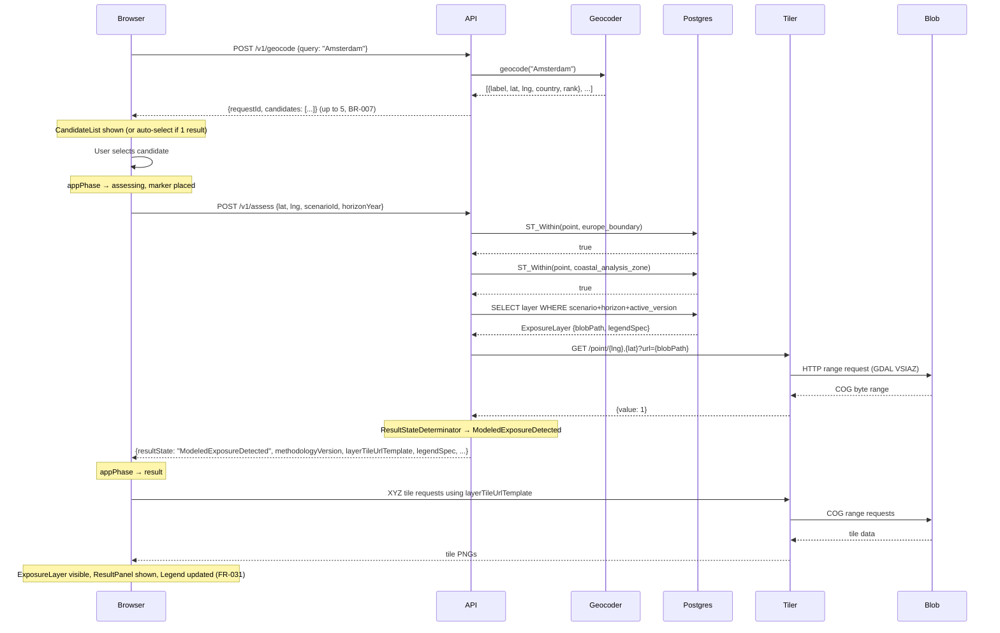

**Key FR compliance:** FR-020 (result includes location + scenario + horizon + state), FR-021 (overlay shown for ModeledExposureDetected), FR-029 (legend updated), FR-031 (map and summary synchronized), FR-035 (methodologyVersion in response).

---

## Sequence 3: Ambiguous Geocoding — Multiple Candidates

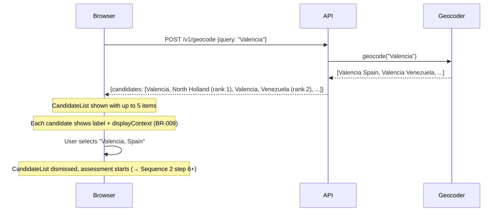

**Key BR compliance:** BR-006 (provider rank preserved), BR-007 (max 5 candidates), BR-009 (enough context to distinguish).

---

## Sequence 4: Map Refinement (FR-007, FR-008)

User already has a result; refines location by clicking map.

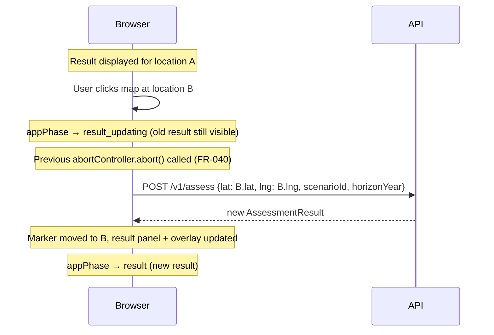

**Notes:**
- The old result remains visible during loading (prevents blank state — PRD §10.3)
- The map click handler only fires when `selectedLocation` is already set; first location selection comes via CandidateList

---

## Sequence 5: Scenario Change (FR-017, FR-031)

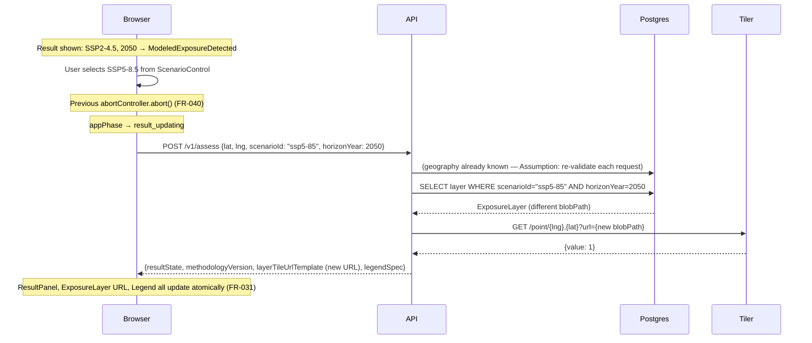

**Note on cached results:** If the user previously viewed SSP5-8.5 / 2050 for this location, TanStack Query returns the cached result instantly (NFR-004, staleTime 60s). No API call occurs.

---

## Sequence 6: Rapid Control Changes — Stale Response Handling (FR-040)

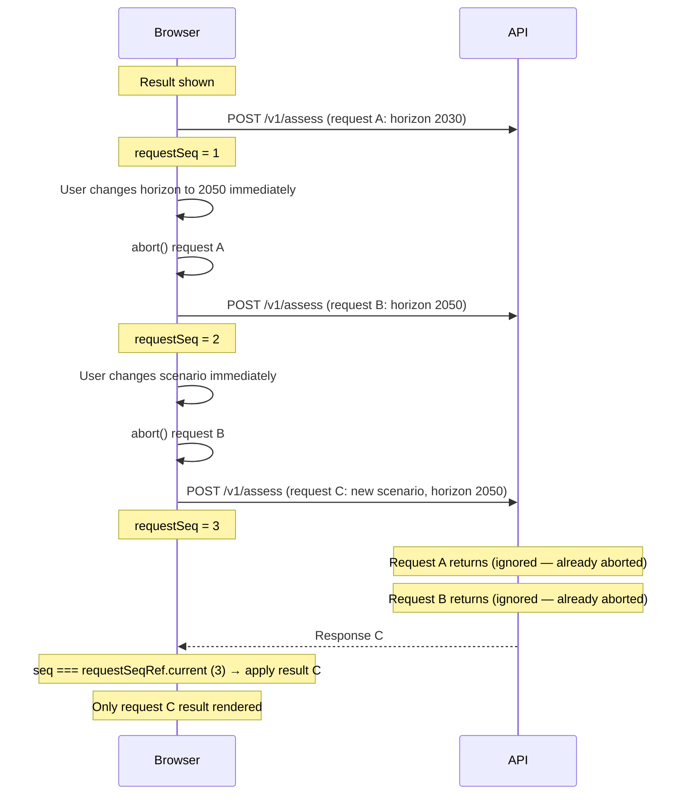

**How it works:** AbortController cancels HTTP requests. The requestSeq counter guards against race conditions where two responses arrive nearly simultaneously. Only the response matching the current sequence number is applied to the UI.

---

## Sequence 7: Out of Scope — Inland European Location

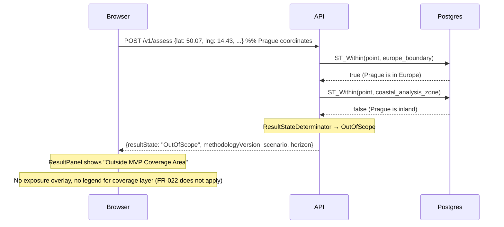

**Key rule:** `OutOfScope` is a 200 OK response — it is a valid result state, not an error (BR-010). No assessment is run for inland locations (FR-012, FR-013).

---

## Sequence 8: Unsupported Geography

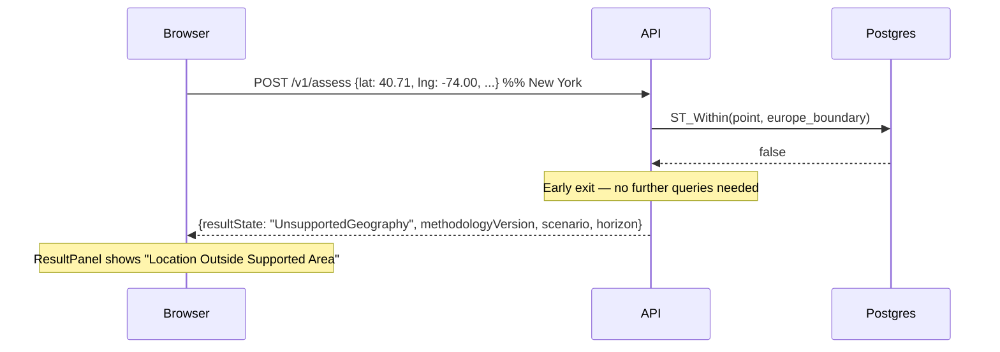

**Note:** Geography validation is always server-side (FR-009). Even if a geocoding provider theoretically filters to European results, the API must always validate — the client can call `/v1/assess` with any coordinates.

---

## Sequence 9: Data Unavailable (BR-014)

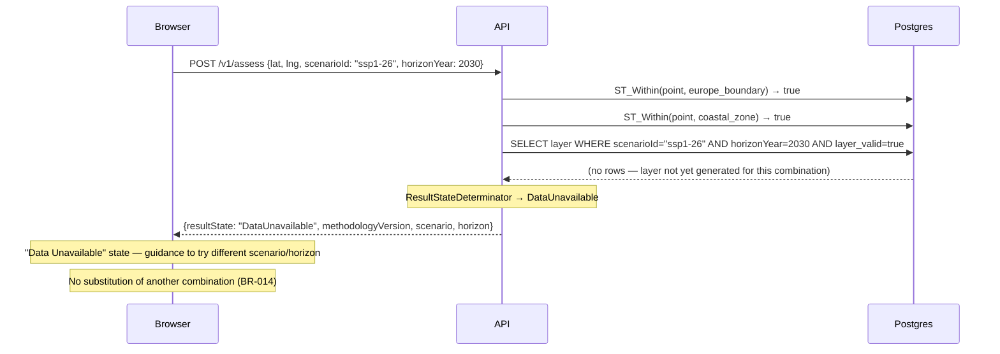

---

## Sequence 10: Recoverable Request Failure (FR-039)

**10A — Geocoding failure:**

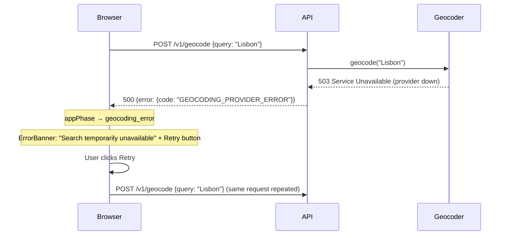

**10B — Assessment failure:**

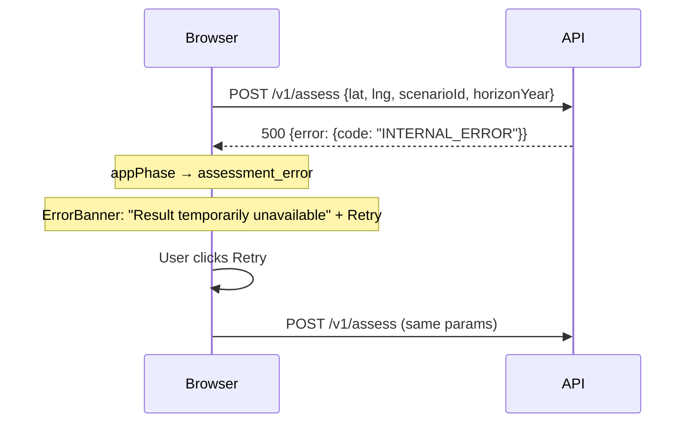

---

## Sequence 11: Methodology Panel Access (FR-032, FR-033)

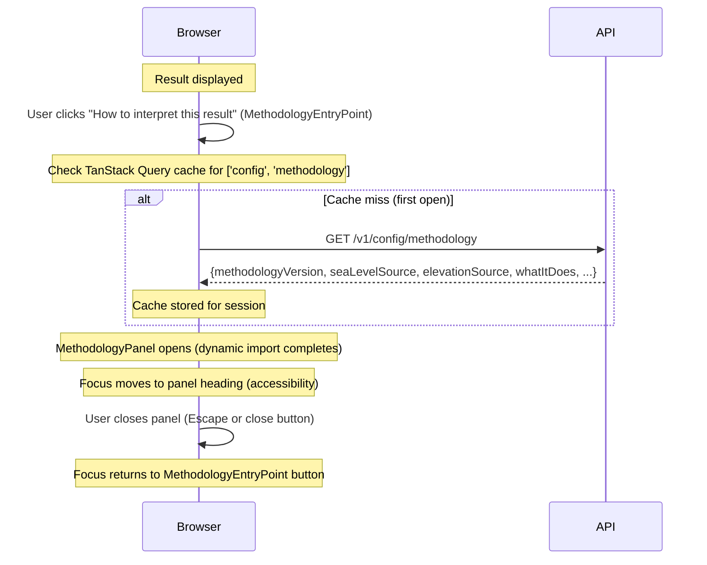

---

## Sequence 12: Reset (FR-041)

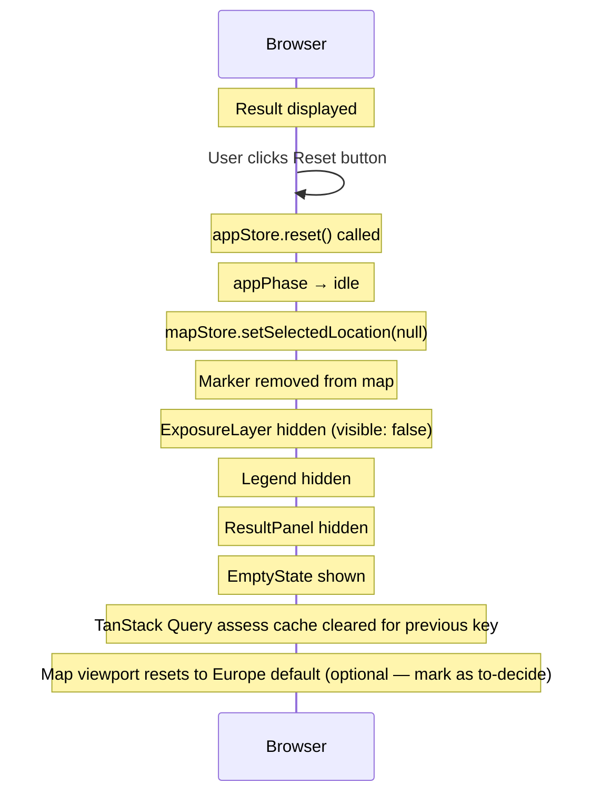

**Note:** The TanStack Query cache for config (scenarios, methodology) is NOT cleared on reset — those are session-level caches that survive resets. Only the specific assessment result for the current location is cleared.
