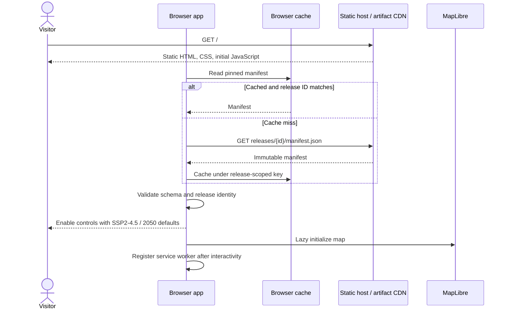
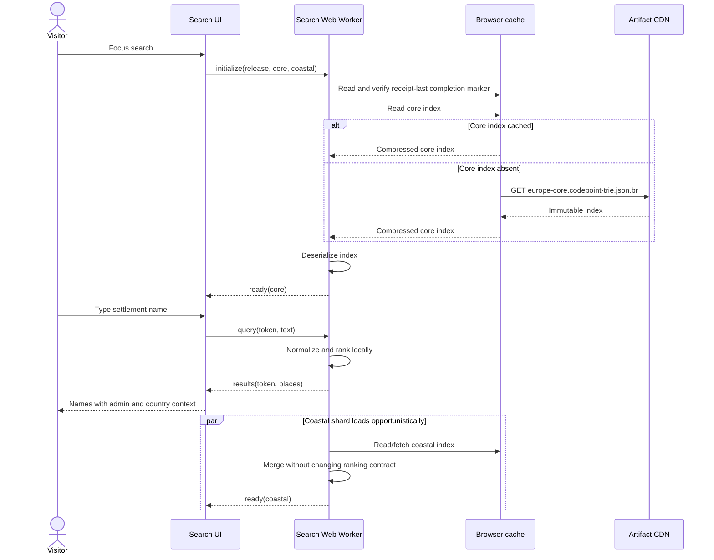
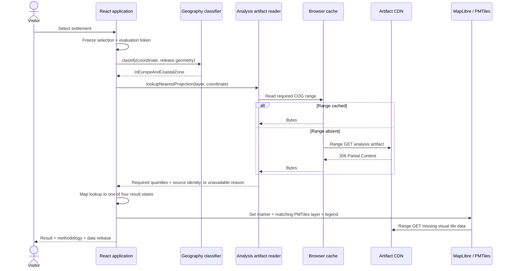
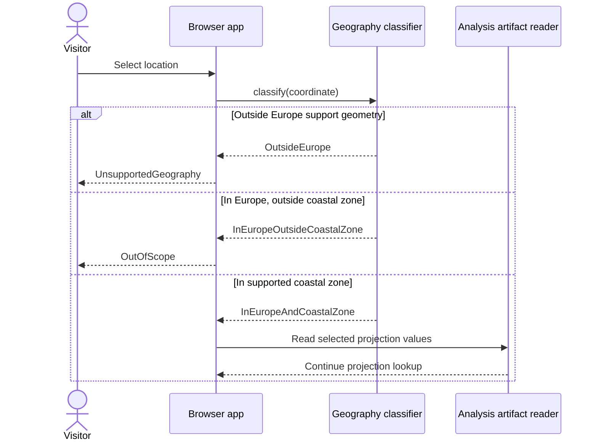
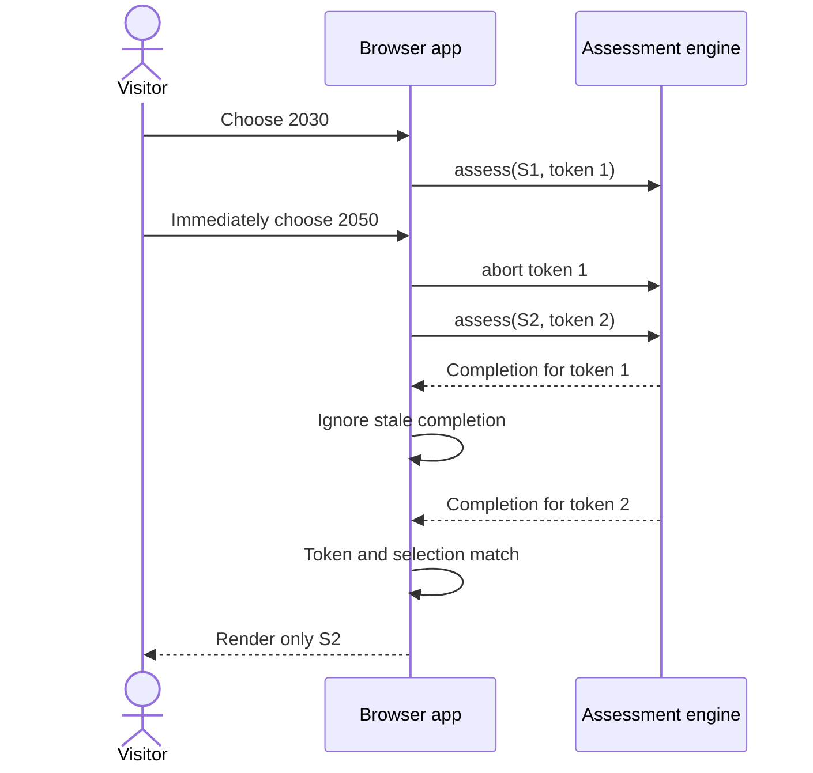

# 04 — Browser Runtime Sequences

> **Status:** Accepted target architecture
> **Decisions:** [ADR-021 — Static-First Offline Geospatial Architecture](adr/ADR-021-static-first-offline-geospatial-architecture.md) and [ADR-026 — Authoritative Browser Range Persistence](adr/ADR-026-authoritative-browser-range-persistence.md)

All sequences below run without an application API, runtime database,
geocoding service, or tile server. `CDN` represents static assets and immutable
release objects delivered through HTTPS.

## 1. Application bootstrap

```mermaid
sequenceDiagram
    actor U as Visitor
    participant B as Browser app
    participant C as Browser cache
    participant CDN as Static host / artifact CDN
    participant M as MapLibre

    U->>CDN: GET /
    CDN-->>U: Static HTML, CSS, initial JavaScript
    B->>C: Read pinned manifest
    alt Cached and release ID matches
        C-->>B: Manifest
    else Cache miss
        B->>CDN: GET releases/{id}/manifest.json
        CDN-->>B: Immutable manifest
        B->>C: Cache under release-scoped key
    end
    B->>B: Validate schema and release identity
    B-->>U: Enable controls with SSP2-4.5 / 2050 defaults
    B->>M: Lazy initialize map
    B->>B: Register service worker after interactivity
```

The initial path does not load all search and layer data. A corrupt manifest,
missing required artifact, or wrong release ID produces a recoverable technical
error and disables assessment.

## 2. Settlement search

```mermaid
sequenceDiagram
    actor U as Visitor
    participant UI as Search UI
    participant W as Search Web Worker
    participant C as Browser cache
    participant CDN as Artifact CDN

    U->>UI: Focus search
    UI->>W: initialize(release, core, coastal)
    W->>C: Read and verify receipt-last completion marker
    W->>C: Read core index
    alt Core index cached
        C-->>W: Compressed core index
    else Core index absent
        C->>CDN: GET europe-core.codepoint-trie.json.br
        CDN-->>C: Immutable index
        C-->>W: Compressed core index
    end
    W->>W: Deserialize index
    W-->>UI: ready(core)
    U->>UI: Type settlement name
    UI->>W: query(token, text)
    W->>W: Normalize and rank locally
    W-->>UI: results(token, places)
    UI-->>U: Names with admin and country context
    par Coastal shard loads opportunistically
        W->>C: Read/fetch coastal index
        W->>W: Merge without changing ranking contract
        W-->>UI: ready(coastal)
    end
```

The UI applies only the response carrying the current query token. Search text
and coordinates never leave the browser for project-controlled infrastructure.
No address-level search is promised.

## 3. Select and assess a coastal location

```mermaid
sequenceDiagram
    actor U as Visitor
    participant UI as React application
    participant G as Geography classifier
    participant A as Analysis artifact reader
    participant C as Browser cache
    participant CDN as Artifact CDN
    participant Map as MapLibre / PMTiles

    U->>UI: Select settlement
    UI->>UI: Freeze selection + evaluation token
    UI->>G: classify(coordinate, release geometry)
    G-->>UI: InEuropeAndCoastalZone
    UI->>A: lookupNearestProjection(layer, coordinate)
    A->>C: Read required COG range
    alt Range cached
        C-->>A: Bytes
    else Range absent
        C->>CDN: Range GET analysis artifact
        CDN-->>C: 206 Partial Content
        C-->>A: Bytes
    end
    A-->>UI: Required quantiles + source identity, or unavailable reason
    UI->>UI: Map lookup to one of four result states
    UI->>Map: Set marker + matching PMTiles layer + legend
    Map->>CDN: Range GET missing visual tile data
    UI-->>U: Result + methodology + data release
```

The analysis values come from the nearest native AR6 grid location within
100 km. They are never interpolated or derived from rendered colour. Result,
layer, and legend share the same release/scenario/horizon identity.

The implemented adapters are `StaticGeographyClassifier` and
`CogAnalysisArtifactReader`. The classifier verifies the release-bound support
and coastal GeoParquet bytes before decoding them. The COG reader requires an
HTTP `206` response for every range, validates the declared native grid and
three-band contract, and reads the selected pixel with no resampling option.
`AssessmentEngine` owns cancellation, monotonic evaluation tokens, and the
exhaustive result mapping. See the
[static scientific lookup runbook](../operations/static-scientific-lookup.md).

## 4. Scope short-circuits

```mermaid
sequenceDiagram
    actor U as Visitor
    participant UI as Browser app
    participant G as Geography classifier
    participant A as Analysis artifact reader

    U->>UI: Select location
    UI->>G: classify(coordinate)
    alt Outside Europe support geometry
        G-->>UI: OutsideEurope
        UI-->>U: UnsupportedGeography
    else In Europe, outside coastal zone
        G-->>UI: InEuropeOutsideCoastalZone
        UI-->>U: OutOfScope
    else In supported coastal zone
        G-->>UI: InEuropeAndCoastalZone
        UI->>A: Read selected projection values
        A-->>UI: Continue projection lookup
    end
```

`UnsupportedGeography` and `OutOfScope` are successful domain outcomes. They do
not trigger retries and do not read a projection layer.

## 5. Result-state mapping

After coordinate and scope validation, the browser uses the following
exhaustive mapping:

| Condition | Result |
|---|---|
| Outside Europe support geometry | `UnsupportedGeography` |
| Inside Europe, outside coastal analysis zone | `OutOfScope` |
| Coastal coordinate; nearest grid location exceeds 100 km | `DataUnavailable/source-location-too-distant` |
| Coastal coordinate; any required source quantile is nodata | `DataUnavailable/source-value-nodata` |
| Coastal coordinate; q0.167, q0.5, and q0.833 are available | `ProjectionAvailable` |

An HTTP failure, corrupt byte range, invalid manifest, unsupported browser, or
missing uncached resource is a technical error. It must not be mapped to
`DataUnavailable`.

## 6. Scenario or horizon change

```mermaid
sequenceDiagram
    actor U as Visitor
    participant UI as Browser app
    participant A as Assessment engine
    participant Map as Map renderer

    Note over UI: Result R1 matches selection S1
    U->>UI: Change scenario or horizon to S2
    UI->>UI: Abort outstanding reads; increment token
    UI-->>U: Keep R1 visibly labelled as updating
    UI->>A: assess(S2, token 2)
    A-->>UI: Result R2, token 2
    UI->>UI: Confirm token and selection still current
    UI->>Map: Apply S2 overlay + marker + legend atomically
    UI-->>U: Display R2
```

The geography classification may be reused for an unchanged coordinate, but
the selected layer and exact pixel lookup are reevaluated. There is no fallback
to a different scenario, horizon, methodology, or release.

## 7. Rapid changes and stale work

```mermaid
sequenceDiagram
    actor U as Visitor
    participant UI as Browser app
    participant A as Assessment engine

    U->>UI: Choose 2030
    UI->>A: assess(S1, token 1)
    U->>UI: Immediately choose 2050
    UI->>A: abort token 1
    UI->>A: assess(S2, token 2)
    A-->>UI: Completion for token 1
    UI->>UI: Ignore stale completion
    A-->>UI: Completion for token 2
    UI->>UI: Token and selection match
    UI-->>U: Render only S2
```

This guard applies equally to search results, map clicks, artifact reads, and
control changes. Abort signals reduce wasted work; tokens preserve correctness
when cancellation is too late.

## 8. Map refinement

A map click after a location is selected creates a new `Selection` with the
clicked coordinate and current scenario/horizon/release. It follows the same
geography and assessment path as a settlement selection. The marker may move
immediately, but a prior result must remain visibly associated with its prior
coordinate until the new evaluation succeeds.

## 9. Cached offline flow

```mermaid
sequenceDiagram
    actor U as Visitor
    participant UI as Browser app
    participant SW as Service worker / caches

    Note over SW: Complete resources cached; required authorized COG chunks in IndexedDB
    U->>UI: Reopen site without network
    UI->>SW: Request core resources
    SW-->>UI: Release-matched cached resources
    U->>UI: Search and select cached location/layer
    UI->>SW: Request analysis COG range
    SW-->>UI: Verified single-chunk slice
    UI-->>U: Complete result marked available offline
```

The offline label describes resources actually cached, not the entire Europe
dataset.

## 10. Uncached data while offline

```mermaid
sequenceDiagram
    actor U as Visitor
    participant UI as Browser app
    participant SW as Service worker / caches

    U->>UI: Select scenario/location needing an uncached range
    UI->>SW: Request analysis range
    SW-->>UI: Cache miss; network unavailable
    UI-->>U: Explain that this data needs a connection
```

The app keeps the last valid result, if any, clearly labelled. It does not
display a new domain result for the uncached selection.

## 11. Release update and rollback

An active session remains pinned to one release. A newer deployment may notify
the visitor that an update is available, but it does not mix manifests,
indexes, geometries, or byte ranges. On reload, the new app/release pairing
initializes in a new cache namespace. Rollback deploys the previous complete
pair; immutable artifacts are never overwritten.

The static-host update coordinator is a pure user-intent state machine over
injected ports. Its waiting-candidate identity binds the exact app/release pair
to the accepted shell precache hash, resource-plan hash, and core
admission-receipt hash. Inspection can report only `sealed`, `incomplete`,
`corrupt`, `mixed`, or `stale`; only a sealed waiting candidate can produce a
confirmation token.

Starting newer preparation synchronously enters `preparing` and revokes the
prior pending confirmation before the first asynchronous port call. The
coordinator wraps the provider token in its own monotonic, one-time generation,
so provider reuse or collision cannot authorize a later intent and a consumed
confirmation cannot be replayed.

Explicit confirmation records only a one-shot transition intent and presents
the exact instruction: `Update ready. Close all SeaRise tabs and reopen to use
it.` It does not swap browser-storage authority, activate a worker, call
`skipWaiting`, call `clients.claim`, navigate, reload, or claim that the new
pair is current. Existing tabs remain pinned to their controlling worker. A
verified waiting worker becomes eligible to activate naturally only after all
clients of the prior worker close.

On the subsequent fresh boot, activation is recognized only when the page
proves a different boot identity controlled by the exact confirmed
app/release/precache/core identity and atomically consumes the matching
one-shot intent. Same-page, mismatched-controller, stale-intent, missing-intent,
and replay attempts fail closed while the actually controlling pair remains
usable. Candidate evidence failures remain distinct from technical controller,
inspection-port, token-provider, and intent-store failures. All are technical
update states, never scientific outcomes.

Browser storage is not application rollback authority. Rollback requires a
verified static deployment, using repository Git history when source recovery
is needed. The browser coordinator reports `deployment-required` and keeps the
current controller usable; it never claims a local application rollback.

## 12. Architecture and methodology access

Opening methodology uses already loaded release metadata or a small immutable
JSON file. Opening `/about/architecture` loads only the evidence needed for the
page; large GeoParquet and geospatial artifacts are linked for inspection, not
downloaded automatically. Neither flow depends on a live server-side report.
