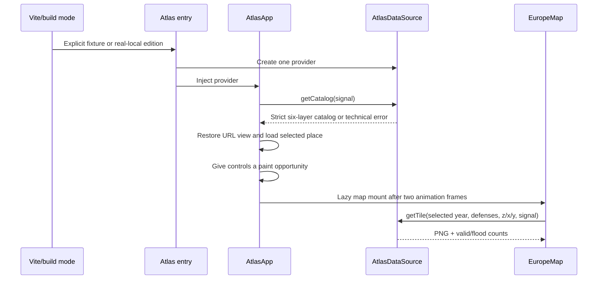
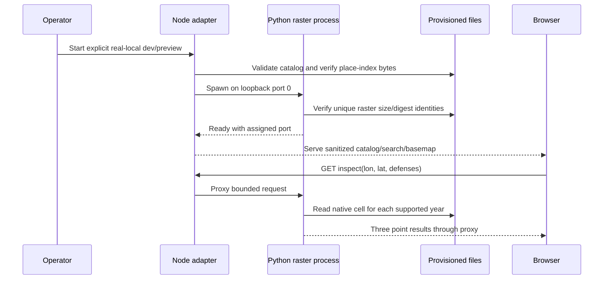
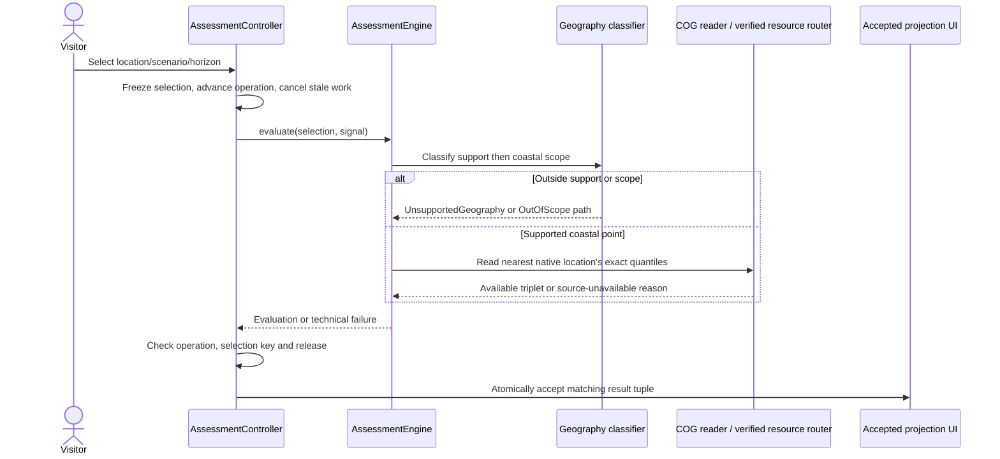

# 04 — Runtime Sequences

> **Status:** Implemented flows, reviewed 2026-10-04.
> Atlas and AR6 sequences have different data and persistence authorities.

## Atlas bootstrap

```mermaid
sequenceDiagram
    participant V as Vite/build mode
    participant E as Atlas entry
    participant UI as AtlasApp
    participant D as AtlasDataSource
    participant M as EuropeMap
    V->>E: Explicit fixture or real-local edition
    E->>D: Create one provider
    E->>UI: Inject provider
    UI->>D: getCatalog(signal)
    D-->>UI: Strict six-layer catalog or technical error
    UI->>UI: Restore URL view and load selected place
    UI->>UI: Give controls a paint opportunity
    UI->>M: Lazy map mount after two animation frames
    M->>D: getTile(selected year, defenses, z/x/y, signal)
    D-->>M: PNG + valid/flood counts
```

The normal provider reads authored browser data. The real-local provider sends
GET requests to `/atlas-data`. Edition never depends on service availability.
Catalog failure has an explicit retry; failure does not mount another edition.
No atlas service-worker registration or release-manifest bootstrap occurs.

## Real-local startup and request processing

```mermaid
sequenceDiagram
    participant O as Operator
    participant N as Node adapter
    participant P as Python raster process
    participant F as Provisioned files
    participant B as Browser
    O->>N: Start explicit real-local dev/preview
    N->>F: Validate catalog and verify place-index bytes
    N->>P: Spawn on loopback port 0
    P->>F: Verify unique raster size/digest identities
    P-->>N: Ready with assigned port
    N-->>B: Serve sanitized catalog/search/basemap
    B->>N: GET inspect(lon, lat, defenses)
    N->>P: Proxy bounded request
    P->>F: Read native cell for each supported year
    P-->>B: Three point results through proxy
```

Startup errors stop activation. Tile requests take the same proxy path but warp
rasters into display PNGs. Raster-read failure becomes an HTTP/technical error;
no valid sample is the distinct successful `unknown` value. All private atlas
and basemap responses are `no-store`. Closing the local server closes its owned
child; the demo lifecycle also reaps children interrupted before readiness.

## Atlas interaction and stale work

`CitySearch` debounces and aborts superseded queries. Selecting a place updates
view state and point inspection; clicking the map chooses a point.
`PointInspection` validates exact point/defense correspondence and keys data by
provider and request. Aborted work cannot replace current values.

Changing year or defenses replaces the map layer generation. Late tile
completions cannot update the new generation's counts/errors. Inspection returns
all years for a defense setting, so the displayed year selects from that result.
Comparison switches between 2030 and 2100 at the same view; timeline playback
steps discrete years without interpolation.

The app writes current state with `history.replaceState` and restores it on
`popstate`. Share copies that URL, with a fallback when clipboard access fails.
It restores a view against the chosen provider; atlas URLs do not pin a data
release or choose the edition.

## Sealed local demo sequence

[`demo.mjs`](../../scripts/demo/demo.mjs) adds a reproducible local handoff:

1. `demo:preflight` checks explicit input paths, toolchain and local adapter
   startup, then closes it and rechecks metadata identities.
2. `demo:prepare` requires clean exact source, builds real-local assets, records
   app hashes plus six external metadata identities, verifies the candidate and
   marks its files/directories read-only. Existing output is never overwritten.
3. `demo:serve` requires the same clean commit and matching app/data identities,
   starts the adapter and serves the sealed app on loopback with config/env
   discovery disabled. It rechecks identities after startup.
4. Shutdown closes preview and reaps native children, including interrupted
   startup. Candidate rollback means using its matching source and data.

The record explicitly sets `publicPromotionAuthorized=false` and
`mvpRelease=false`. Preparing/serving does not publish data or create a stable
MVP release.

## Projection bootstrap and search

The retained [`main.tsx`](../../src/web/src/main.tsx) renders `App` and registers
the projection worker after interactivity. Release bootstrap reads the pinned
browser v2 manifest (or explicit private binding), validates identity/disposition
and the exact dataset matrix, then creates `ReleaseContext`. Malformed data is
a technical startup error, not a substituted release.

Search initializes lazily on focus/idle, verifies core shard bytes before
JSON/Brotli decoding and queries a Worker. Coastal results become available
separately; merging is core-first with ID deduplication. Search completion is
not assessment. Only explicit selection hands an immutable `Selection` to the
controller. Query tokens, client generation, query key and release identity
reject obsolete responses.

## Projection assessment and control changes

```mermaid
sequenceDiagram
    actor U as Visitor
    participant C as AssessmentController
    participant E as AssessmentEngine
    participant G as Geography classifier
    participant R as COG reader / verified resource router
    participant UI as Accepted projection UI
    U->>C: Select location/scenario/horizon
    C->>C: Freeze selection, advance operation, cancel stale work
    C->>E: evaluate(selection, signal)
    E->>G: Classify support then coastal scope
    alt Outside support or scope
        G-->>E: UnsupportedGeography or OutOfScope path
    else Supported coastal point
        E->>R: Read nearest native location's exact quantiles
        R-->>E: Available triplet or source-unavailable reason
    end
    E-->>C: Evaluation or technical failure
    C->>C: Check operation, selection key and release
    C->>UI: Atomically accept matching result tuple
```

The COG reader uses verified range access; rendering PMTiles does not supply the
scientific value. A nearest location beyond 100 km or source nodata yields
`DataUnavailable`; a missing/corrupt range is a technical failure. See
[13](13-domain-model.md) for the exhaustive mapping.

When controls change, a previous accepted result keeps its original selection
while the new one evaluates. Result, marker, layer, legend and accepted URL
never combine pending controls with an old result. Abort reduces work; identity
guards preserve correctness even if cancellation arrives too late.

## Projection offline, update and retention

A warmed projection document can reload from its sealed shell. Verified whole
resources and authorized COG chunks support only the flows actually admitted.
An uncached layer produces `connection-required` and retains the prior accepted
tuple; it does not fabricate a domain outcome. PMTiles remains network-only.
The root-scoped worker passes atlas requests through and does not precache
atlas or architecture documents.

The update coordinator verifies a waiting worker's exact build-sealed identity;
only sealed evidence can produce a confirmation token. New preparation revokes
the prior generation. Confirmation writes a non-consumable `PENDING` intent,
then arms that exact intent in a separate durable transaction. Only `ARMED` can
be consumed once. Stale, missing, mismatched, tombstoned and replayed intents
fail closed.

Confirmation instructs the user to close all SeaRise tabs and reopen. It does
not call `skipWaiting`, `clients.claim`, navigate or swap active authority. On
fresh boot, the page challenges its actual controller and reconciles exact
app/release/precache plus admitted resource-plan/receipt identity before
consuming the intent. A changed controller on the same page is not fresh boot.

Durable mutations use an exclusive guard with bounded abort-aware operations;
concurrent/reentrant mutations return `mutation-busy`. A stalled adapter remains
a technical state. Rollback tombstones intent before reporting
`deployment-required`; browser storage cannot perform deployment rollback.

Retention then considers only eligible `cleanup-pending` older pairs. Exact-pair
locks, leases and controlling-worker client census block deletion for active,
unknown or unresponsive clients. The active and immediately previous complete
pairs remain. Cleanup fences preserve safety across partial failure/retry;
private candidate sessions do not enter production retention.

The protocol details and implementation links are in
[offline lifecycle](../operations/static-offline-client-lifecycle.md),
[production retention](../operations/production-browser-retention.md), and
[`offline/`](../../src/web/src/offline/).

## Methodology and architecture access

Atlas opens its edition-aware `AboutDialog`; projection methodology loads
release-backed content. `/about/architecture/` lazily renders projection build
identity and status copy. It does not fetch/display a complete live performance,
cost, STAC or signature report. Neither page is a report-generation server.
