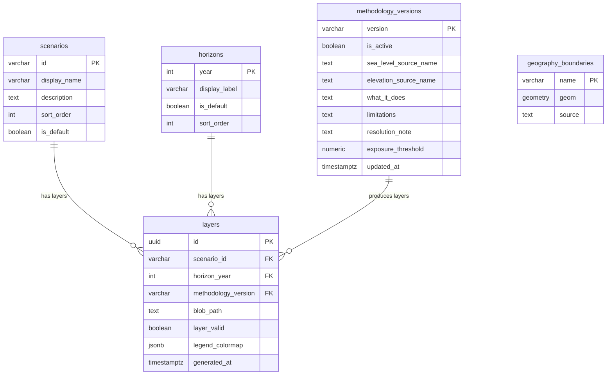

# 05 — Data Architecture

> **Status:** Confirmed
> **Note:** All blocking open questions (OQ-02 through OQ-05) have been resolved. Schema structure and seed data values are confirmed. See [`docs/delivery/artifacts/seed-data-spec.sql`](../delivery/artifacts/seed-data-spec.sql) for the complete seed specification.

---

## 1. Data Overview

The system has two data realms:

| Realm | Store | Content | Who writes | Who reads |
|---|---|---|---|---|
| Structured application data | PostgreSQL (PostGIS) | Scenarios, horizons, methodology versions, layer metadata, geography boundaries | Offline pipeline + manual seed | API (runtime reads only) |
| Geospatial raster assets | Azure Blob Storage | COG files, one per scenario × horizon × methodology version | Offline pipeline only | TiTiler (tile serving) + API (integrity checks) |

**No user data is persistently stored.** Raw addresses are never written to any store (BR-016, NFR-007). There are no user tables, no session tables, no search history tables.

---

## 2. PostgreSQL Schema

> Requires `CREATE EXTENSION postgis;` on the database.

### scenarios

```sql
CREATE TABLE scenarios (
    id           VARCHAR(64)  PRIMARY KEY,
    display_name VARCHAR(255) NOT NULL,
    description  TEXT,
    sort_order   INTEGER      NOT NULL,
    is_default   BOOLEAN      NOT NULL DEFAULT false,
    created_at   TIMESTAMPTZ  NOT NULL DEFAULT now()
);
-- Constraint: at most one row has is_default = true (enforced by partial unique index)
-- Values: ADR-016 — 'ssp1-26', 'ssp2-45', 'ssp5-85'
-- Default: ADR-017 — 'ssp2-45'
```

### horizons

```sql
CREATE TABLE horizons (
    year          INTEGER     PRIMARY KEY,   -- CONFIRMED: 2030, 2050, 2100 (FR-015)
    display_label VARCHAR(32) NOT NULL,
    is_default    BOOLEAN     NOT NULL DEFAULT false,
    sort_order    INTEGER     NOT NULL
);
-- is_default: ADR-017 — 2050
INSERT INTO horizons VALUES (2030, '2030', false, 1);
INSERT INTO horizons VALUES (2050, '2050', true,  2);  -- ADR-017: default horizon
INSERT INTO horizons VALUES (2100, '2100', false, 3);
```

### methodology_versions

```sql
CREATE TABLE methodology_versions (
    version                  VARCHAR(32)  PRIMARY KEY,
    is_active                BOOLEAN      NOT NULL DEFAULT false,
    sea_level_source_name    TEXT         NOT NULL,
    elevation_source_name    TEXT         NOT NULL,
    what_it_does             TEXT         NOT NULL,
    limitations              TEXT         NOT NULL,   -- JSON array string or newline-delimited
    resolution_note          TEXT         NOT NULL,
    exposure_threshold       NUMERIC,                 -- ADR-015: NULL for v1.0 (binary, no runtime threshold)
    exposure_threshold_desc  TEXT         NOT NULL,
    updated_at               TIMESTAMPTZ  NOT NULL DEFAULT now()
);
-- Invariant: exactly one row has is_active = true at any time
-- Enforced by: transaction during activation swap
```

### layers

```sql
CREATE TABLE layers (
    id                   UUID         PRIMARY KEY DEFAULT gen_random_uuid(),
    scenario_id          VARCHAR(64)  NOT NULL REFERENCES scenarios(id),
    horizon_year         INTEGER      NOT NULL REFERENCES horizons(year),
    methodology_version  VARCHAR(32)  NOT NULL REFERENCES methodology_versions(version),
    blob_path            TEXT         NOT NULL,
    blob_container       TEXT         NOT NULL DEFAULT 'geospatial',
    cog_format           BOOLEAN      NOT NULL DEFAULT true,
    layer_valid          BOOLEAN      NOT NULL DEFAULT false,
    legend_colormap      JSONB,
    generated_at         TIMESTAMPTZ  NOT NULL,
    UNIQUE (scenario_id, horizon_year, methodology_version)
);
CREATE INDEX layers_lookup_idx ON layers (scenario_id, horizon_year, methodology_version)
    WHERE layer_valid = true;
-- layer_valid = false until pipeline QA validation passes
-- layer_valid gates whether a layer is served to users
```

### geography_boundaries

```sql
CREATE TABLE geography_boundaries (
    name        VARCHAR(64)               PRIMARY KEY,
    geom        GEOMETRY(MULTIPOLYGON, 4326) NOT NULL,
    description TEXT,
    source      TEXT,
    created_at  TIMESTAMPTZ               NOT NULL DEFAULT now()
);
CREATE INDEX geography_boundaries_geom_idx ON geography_boundaries USING GIST(geom);
-- Required rows:
--   'europe'               — WGS84 Europe boundary geometry (source: Natural Earth 10m cultural vectors)
--   'coastal_analysis_zone' — ADR-018: Copernicus Coastal Zones 2018, dissolved, ~10 km inland
```

---

## 3. Azure Blob Storage Layout

```
Container: geospatial (private)
  layers/
    v1.0/
      ssp1-26/
        2030.tif     ← COG, EPSG:4326, binary 0/1/NoData
        2050.tif
        2100.tif
      ssp2-45/
        2030.tif
        2050.tif
        2100.tif
      ssp5-85/
        ...
    v2.0/            ← new methodology version (future)
      ...
```

**Blob properties:**
- Tier: Hot (accessed frequently for tile serving)
- Content-Type: `image/tiff`
- Cache-Control: `max-age=86400, public` (COG content is static)
- Access: Private — TiTiler and API access via managed identity or connection string from Key Vault

---

## 4. Core Entities and Relationships



---

## 5. Data Ownership Boundaries

| Data | Owner | Written By | When |
|---|---|---|---|
| Scenario config | Engineering / Product | Manual DB seed | Phase 0 (ADR-016) |
| Horizon config | Engineering | Manual DB seed | Phase 0 (confirmed as 2030/2050/2100) |
| Methodology versions | Engineering | Manual DB seed | Phase 0 + version bumps |
| Geography boundaries | Engineering | Offline pipeline | Phase 0 |
| Layer metadata | Engineering | Offline pipeline | Phase 0 + reruns |
| COG files | Engineering | Offline pipeline | Phase 0 + reruns |
| Raw user addresses | Nobody | NOT STORED | N/A |

---

## 6. Methodology Version Handling (NFR-021)

Every assessment result carries the active methodology version (FR-035). The version is determined at assessment time and is immutable for that result.

**Version activation process (atomic):**
```sql
BEGIN;
  UPDATE methodology_versions SET is_active = false WHERE is_active = true;
  UPDATE methodology_versions SET is_active = true WHERE version = 'v2.0';
COMMIT;
```

This is the only step that makes new layers visible to users. New layers are registered with `layer_valid = false` until pipeline QA passes.

**Old versions:** Previous methodology_version rows and their layers are never deleted. This provides:
- Traceability (retroactive reconstruction of what data produced a result)
- Rollback capability (reactivate old version if needed)
- Audit trail for methodology changes (NFR-021)

---

## 7. Read/Write Paths

### Runtime Read Path (API per assessment request)

```
POST /v1/assess received
  → Postgres: ST_Within(point, europe_boundary)        [≤ 20ms, GIST indexed]
  → Postgres: ST_Within(point, coastal_analysis_zone)  [≤ 20ms, GIST indexed]
  → Postgres: SELECT layers WHERE scenario_id=? AND horizon_year=?
              AND methodology_version = (SELECT version FROM methodology_versions WHERE is_active=true)
              AND layer_valid = true                    [≤ 10ms, composite index]
  → Tiler: GET /point/{lng},{lat}?url={blob_path}      [≤ 200ms, COG range request]
  → Return AssessmentResult
```

Total DB contribution: ~50ms. Full assessment p95 target: ≤ 3.5s (NFR-003). See [15-performance-and-scalability.md](15-performance-and-scalability.md) for full latency budget.

### Offline Write Path (Pipeline)

```
Pipeline runs
  → Download IPCC AR6 + Copernicus DEM
  → Generate COG files for each scenario × horizon
  → Upload COGs to Azure Blob Storage (geospatial/layers/{version}/{scenario}/{horizon}.tif)
  → INSERT INTO layers (scenario_id, horizon_year, methodology_version, blob_path, ...) layer_valid = false
  → Run QA validation → UPDATE layers SET layer_valid = true (on pass)
  → (Manual) Activate new methodology version (atomic swap)
```

---

## 8. Data Lifecycle

| Data | Created | Retained | Deleted |
|---|---|---|---|
| Scenario/horizon config | Phase 0 | Indefinitely | Never in MVP |
| Methodology versions | Phase 0 + bumps | All versions — never deleted | Never |
| Layer metadata rows | Phase 0 + reruns | All versions — never deleted | Never in MVP |
| COG files (Blob) | Phase 0 + reruns | All methodology versions | Never in MVP (storage cheap) |
| Geography boundaries | Phase 0 | Replaced on update | Previous version replaced |
| Raw user addresses | Request processing | Duration of HTTP request only | Immediately — never persisted |
| Backend structured logs | Runtime | Azure Monitor retention policy (e.g., 30–90 days) | Per policy |
| Analytics events (if OQ-10) | If enabled | Per provider policy + GDPR review | Per privacy policy |

---

## 9. Provenance and Lineage

Every `AssessmentResult` returned by the API carries:

```json
{
  "methodologyVersion": "v1.0",
  "scenario": { "id": "ssp2-45", "displayName": "Intermediate emissions (SSP2-4.5)" },
  "horizon": { "year": 2050, "displayLabel": "2050" },
  "layerId": "uuid-of-layers-row",
  "generatedAt": "2026-03-30T12:00:00Z"
}
```

The `layerId` links back to the exact `layers` row in PostgreSQL, which records the `blob_path` and `generated_at` timestamp. The `methodology_versions` row records the source dataset names. This chain provides full lineage from a displayed result back to the raw data source.

---

## 10. Privacy

- Raw addresses are **never written** to PostgreSQL, Blob, logs, or analytics events (BR-016, NFR-007)
- Coordinates are used for the duration of a request and not persisted in user-associated tables
- Backend logs may include country-code-level location in structured log fields (METRICS_PLAN §7)
- Precise coordinates must not appear in production logs or analytics
- If analytics are enabled (OQ-10): event properties use country_code only, not lat/lng (METRICS_PLAN §6)

---

## 11. Where Structured Data Ends and Geospatial Assets Begin

**PostgreSQL** answers the question: "What layer should be used and where is it?"
**Azure Blob Storage** stores the layer (the raster data itself).
**TiTiler** reads the raster data and serves it as map tiles.
**API** joins these: queries Postgres for `blob_path`, queries TiTiler (which reads Blob) for pixel values.

PostgreSQL never stores raster pixel data. Blob Storage never knows about scenarios or assessments. This separation means:
- Changing the layer for a scenario/horizon = update `blob_path` in the `layers` table + re-upload to Blob
- Changing the methodology version = new `methodology_versions` row + new `layers` rows + new COG files
- Neither change requires modifications to the API or TiTiler containers
