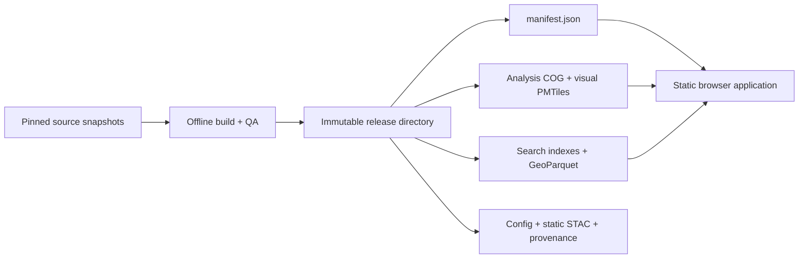

# 05 — Data Architecture

> **Status:** Accepted target architecture; migration in progress
>
> **Source of truth:** [ADR-021](adr/ADR-021-static-first-offline-geospatial-architecture.md)
> **Important:** checked-in demo rasters and the current pipeline are not a validated real-data release.

## 1. Data model in one sentence

SeaRise Europe is an immutable, versioned geospatial data product: an offline
build turns pinned source snapshots into browser-ready files, and the browser
reads those files directly without an application API, PostgreSQL, PostGIS, or
a runtime tile server.


```mermaid
flowchart LR
    Sources["Pinned source snapshots"] --> Build["Offline build + QA"]
    Build --> Release["Immutable release directory"]
    Release --> Manifest["manifest.json"]
    Release --> Raster["Analysis COG + visual PMTiles"]
    Release --> Search["Search indexes + GeoParquet"]
    Release --> Metadata["Config + static STAC + provenance"]
    Manifest --> Browser["Static browser application"]
    Raster --> Browser
    Search --> Browser
```

## 2. Data realms and ownership

| Realm | Content | Location | Writer | Runtime reader |
|---|---|---|---|---|
| Source cache | Original IPCC, GeoNames, and Natural Earth snapshots | Ignored local/CI storage | Acquisition stage | None |
| Build workspace | Normalized arrays, temporary rasters, DuckDB files, intermediate tables | Ephemeral local/CI workspace | Offline pipeline | None |
| Release artifacts | Manifest, config, boundaries, search indexes, COG, PMTiles, GeoParquet, STAC, provenance | Versioned static host/object storage | Controlled publish job | Browser and reviewers |
| Browser cache | App shell, config, search indexes, and requested byte ranges | User device | Service worker/browser | Browser only |

No project-controlled system stores user searches, selected places, or precise
coordinates. GeoNames place coordinates and scientific source coordinates are
public dataset content, not user data.

## 3. Immutable release layout

Every published data release is self-contained and addressable by
`dataReleaseId`:

```text
releases/{dataReleaseId}/
├── manifest.json
├── manifest.schema.json
├── manifest.sigstore.json
├── provenance.intoto.jsonl
├── config/
│   ├── scenarios.json
│   ├── methodology.json
│   └── source-attribution.json
├── geography/
│   ├── europe.pmtiles
│   ├── coastal-analysis-zone.pmtiles
│   └── boundaries.parquet
├── search/
│   ├── europe-core.index.br
│   ├── europe-coastal.index.br
│   └── settlements.parquet
├── layers/
│   ├── ssp1-26/{2030,2050,2100}.pmtiles
│   ├── ssp2-45/{2030,2050,2100}.pmtiles
│   └── ssp5-85/{2030,2050,2100}.pmtiles
├── analysis/
│   ├── ssp1-26/{2030,2050,2100}.tif
│   ├── ssp2-45/{2030,2050,2100}.tif
│   └── ssp5-85/{2030,2050,2100}.tif
└── stac/
    ├── catalog.json
    ├── collection.json
    └── items/*.json
```

Paths are release-versioned or content-addressed and are never overwritten.
Versioned objects use `Cache-Control: public, max-age=31536000, immutable`.
A mutable `/release.json`, if used, has a short TTL and only points to a
release; an application build pins one release for the duration of a session.

## 4. Public contracts

### 4.1 Release manifest

`manifest.json` is the application entry point and authoritative release
inventory. Its authoritative shape is the versioned
[`manifest.schema.json`](../../contracts/release/v1/manifest.schema.json); the
complete contract catalogue and compatibility policy live beside the schemas
in [`contracts/release/README.md`](../../contracts/release/README.md).

Publication fails if the schema, sizes, hashes, source metadata, licence
mapping, or nine-combination matrix is incomplete.

### 4.2 Configuration

Configuration is data, not code. Its exact shapes are defined by
[`scenario-config.schema.json`](../../contracts/release/v1/scenario-config.schema.json),
[`methodology.schema.json`](../../contracts/release/v1/methodology.schema.json),
and [`attribution.schema.json`](../../contracts/release/v1/attribution.schema.json).
The release fixes:

- scenarios: `ssp1-26`, `ssp2-45`, and `ssp5-85`;
- horizons: `2030`, `2050`, and `2100`;
- defaults: `ssp2-45` and `2050`;
- methodology text, limitations, units, nodata meaning, result-state mapping,
  and source attribution.

Changing scientific semantics requires a new methodology version and release.
The UI must display the release and methodology used for every assessment.

### 4.3 Raster artifacts

Each scenario/horizon produces two derived views of the same validated,
source-native projection array:

| Artifact | Purpose | Contract |
|---|---|---|
| Analysis COG | Exact nearest-grid projection lookup | Lossless Int16 millimetres for q0.167, q0.5, and q0.833 plus nodata; valid COG; fixed CRS/grid recorded in manifest |
| Visual PMTiles | Efficient overlay rendering | Byte-range readable; visually consistent with the analysis COG; never interpreted from rendered colours |

All three required quantiles map to `ProjectionAvailable`; source nodata or a
nearest location beyond the 100 km guardrail maps to `DataUnavailable`. The
COG is the scientific lookup source and PMTiles remains visual-only.

### 4.4 Boundaries and analytical tables

Europe support and coastal analysis geometry are versioned release inputs and
outputs. Browser-oriented geometry is packaged as PMTiles; transparent,
queryable tables are published as GeoParquet. DuckDB Spatial performs offline
spatial joins and validation; it is not a production database.

The checked-in Natural Earth-derived boundary and 25 km coastal zone are
explicit approximations for migration and Phase 0. They do not become
canonical production data merely by being packaged.

### 4.5 Settlement catalog and search indexes

The source is a pinned GeoNames dump plus `alternateNamesV2`. The pipeline
produces two logical catalogs:

- `europe-core`: active populated places in the support geometry with
  population at least 500, plus national and administrative capitals;
- `europe-coastal`: all active populated places in the coastal zone, without a
  population threshold.

Included feature codes are `PPL`, `PPLA`, `PPLA2`, `PPLA3`, `PPLA4`, `PPLA5`,
`PPLC`, `PPLF`, `PPLG`, `PPLL`, and `PPLR`. Historical, abandoned, destroyed,
and section-only records (`PPLH`, `PPLQ`, `PPLW`, `PPLX`) are excluded unless a
documented data-quality exception says otherwise.

The authoritative normalized record is
[`search-record.schema.json`](../../contracts/release/v1/search-record.schema.json).

The canonical records are published as GeoParquet. Compact Brotli-compressed
indexes are built ahead of time and loaded into a Web Worker. The build proves
that every qualifying source record is either present exactly once or listed
in an auditable rejection report.

### 4.6 Static STAC and provenance

The STAC catalog describes spatial assets, bounds, time/scenario properties,
roles, and links without operating a STAC API. `manifest.json` remains the
browser contract; STAC is the standards-based discovery and portfolio layer.
The repository's closed STAC 1.1.0 profile is
[`stac.schema.json`](../../contracts/release/v1/stac.schema.json).

The build emits SLSA-compatible provenance and a keyless Cosign/Sigstore bundle
covering the manifest and release inventory. CI performs full verification;
the public architecture page links to the evidence.

## 5. Versioning, promotion, and rollback

1. Build into a new, unpublished `dataReleaseId` prefix.
2. Validate every source, contract, artifact, scientific control, and licence.
3. Upload immutable files without changing the production pointer.
4. Verify public `HEAD` and partial `GET` responses, hashes, CORS, and cache
   headers.
5. Deploy an application build pinned to the release, or atomically update the
   small release pointer.
6. Keep the previous application/release pair available for rollback.

Corrections create a new release. Existing artifacts are not edited in place,
and browser caches are namespaced by `dataReleaseId` so versions cannot mix.

## 6. Lifecycle and retention

| Data | Retention rule |
|---|---|
| Raw downloads | Keep in ignored local/CI cache only as licence permits; reacquire by pinned URL/checksum |
| Build intermediates | Disposable after a successful release; retain only when needed to investigate QA |
| Published releases | Keep the active and rollback releases; archive or remove older versions only under a documented retention policy |
| Manifests, source records, provenance, QA summaries | Retain with every published release |
| Browser cache | Bounded and versioned; evict least-recently-used ranges first |
| User search/location data | Never collected or retained by project infrastructure |

## 7. Licence and integrity rules

- Raw files are not published by default; redistribution must be explicitly
  permitted.
- Every derivative maps to its source, licence, attribution, and checksum.
- IPCC AR6, GeoNames, Natural Earth, and basemap attribution follow
  the exact terms recorded in the release manifest.
- Source and artifact SHA-256 values are verified before use and after upload.
- The browser rejects an unsupported manifest schema or mismatched pinned
  release instead of silently falling back.

## 8. Migration boundary

The existing PostgreSQL schema, Azure Blob registration, TiTiler integration,
and synthetic `demo.tif` describe the legacy runtime and are not part of this
target data architecture. They remain only until ADR-021 Phases 0–3 establish
scientific validity and parity. Removal is allowed only at the Phase 4 gate.

See [16 — Geospatial Data Pipeline](16-geospatial-data-pipeline.md) for build
stages and [10 — Testing Strategy](10-testing-strategy.md) for publication
gates.
