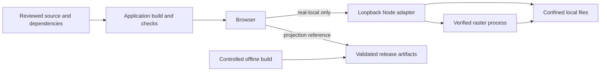

# 07 — Security, Privacy, and Supply Chain

> **Status:** Implemented controls and explicit limits, reviewed 2026-10-04.
> **Scope:** Atlas fixture, loopback atlas adapter, projection reference and build tooling.

## Trust boundaries



There is no account system, application database, upload endpoint or server-side
user session. Real-local atlas nevertheless has a request-time service: the
browser sends searches and coordinates to its loopback adapter. The fixture
provider and AR6 projection search/lookup execute locally in the browser.

## Local atlas controls

The [edition plugin](../../src/web/scripts/atlas-edition.mjs) attaches the adapter
only for `real-local`, rejects non-loopback listen hosts, and checks the built
edition before preview. No service discovery or failure-driven fixture fallback
exists. [Adapter activation](../../src/web/scripts/real-local-atlas.mjs):

- accepts only the expected six layer identities and confined regular raster files;
- checks manifest metadata, source size, CRS and 25 m pixel size;
- validates and hashes the prepared place index before exposing search;
- waits for Python's raster SHA-256 verification before admitting requests;
- returns a browser catalog without local paths, hashes or private receipts;
- permits `GET` only on its atlas routes; confines basemap paths via `realpath`;
- starts one Python process on `127.0.0.1` and closes it with the server.

[Vite filesystem restrictions](../../src/web/vite.config.ts) deny `local-data`
and constrain `/@fs/` access. Private inputs must not be copied into public
assets or `dist`. Basemap path confinement is implemented; the adapter does not
claim per-file basemap digest verification equivalent to its raster checks.

Atlas JSON, derived PNG and local basemap responses use `no-store`, including
tile errors. The HTTP provider also requests `cache: "no-store"`. Python's bounded RAM tile cache is not browser
persistence. The projection worker excludes atlas documents/data from precache
and passes unowned requests through.

## Private demo sealing

[Demo tooling](../../scripts/demo/demo.mjs) requires explicit CLI paths and
rejects `SEARISE_*`/`VITE_*` overrides and active app/root dotenv files. Preparation
and serving require the exact clean commit. Candidate verification binds app
bytes, real-local edition/build ID and six external metadata/receipt identities;
it rejects symlinks and refuses overwrite of an existing output.

[Sealed preview](../../scripts/demo/sealed-preview.mjs) disables project config
and dotenv discovery, binds `127.0.0.1` with a strict port, and serves only the
candidate app plus explicit adapters. The lifecycle owner reaps native children
on interrupted startup as well as normal shutdown. Sealing is local integrity
control, not a signature or public/scientific approval.

## Browser policy

All three checked-in entry documents contain the same meta CSP and
`no-referrer`; [build inspection](../../src/web/scripts/inspect-build.mjs)
requires their exact values:

```http
Content-Security-Policy: default-src 'self'; script-src 'self' 'wasm-unsafe-eval'; worker-src 'self' blob:; style-src 'self' 'unsafe-inline'; img-src 'self' data: blob: https://tiles.openfreemap.org; connect-src 'self' https://tiles.openfreemap.org; font-src 'self'; object-src 'none'; base-uri 'none'; form-action 'none'; frame-src 'none'; manifest-src 'self'; media-src 'none'
Referrer-Policy: no-referrer
```

The implementation permits WASM compilation but rejects JavaScript
`unsafe-eval`/runtime validator generation. Release validation uses generated
standalone AJV code. Style and worker allowances support the map runtime.
OpenFreeMap is an allowed optional projection-map origin; atlas geography is
same-origin. A new remote data origin needs a corresponding policy change.

The source HTML's meta CSP does **not** provide `frame-ancestors`, HSTS or other
response-only protections. Those are hosting requirements, not deployed
controls proven by this repository. There is no checked-in OpenTofu or
Cloudflare response-header deployment to claim otherwise.

Untrusted place names and metadata are rendered as React text. Strict atlas
validators reject additional private fields; projection validators constrain
schema, disposition, release identity, role, path and origin before use.

## Privacy by edition

| Flow | Actual handling |
|---|---|
| Atlas fixture search/inspection | Provider computes in browser memory |
| Real-local atlas search/inspection | Query text and coordinates appear in loopback GET requests |
| Projection search | Query text is Worker/browser memory only; no geocoding request |
| Shared/current selection | Both apps write view or selected-coordinate state to URL query parameters |
| Python request logging | Handler suppresses default per-request access logging |
| Analytics | No application analytics/error-reporting backend is installed |

URLs can appear in browser history and in document requests to a host on
navigation/reload. `no-referrer` limits referrer transmission; it is not a
promise that selected coordinates can never reach a static host. Do not describe
all editions as having zero query/coordinate transport or guaranteed absence
of provider logs. A future telemetry integration needs explicit data minimization.

## Projection integrity and supply chain

[ManifestRepository](../../src/web/src/data/manifest-repository.ts) enforces the
pinned browser v2 manifest or explicit private binding. Complete resources are
verified before Cache Storage admission; COG chunks require release-authorized
integrity metadata. Projection PMTiles is visual-only and network-only with
`no-store`, as defined by [ADR-026](adr/ADR-026-authoritative-browser-range-persistence.md).
Private-engineering sessions cannot enter production retention authority.

The worker verifies its sealed shell at install and on controlled reads.
Update/retention code requires exact app/release identities, client authority
and safe cleanup; it does not force activation with `skipWaiting`/`clients.claim`.
See [04](04-runtime-sequences.md).

Implemented build controls include pinned dependencies/actions, the v2
supply-chain profile, SBOM/evidence validators, output isolation, private-candidate
isolation, critical production npm audit and CodeQL workflows. Protected signing
and readback tools exist separately from ordinary app builds. A synthetic
fixture is not a cryptographically approved scientific release.

[Post-cutover validation](../../scripts/repository/validate_post_cutover.py)
protects historical removal authority. Local `--evidence-only` validation and
CI `--verify-owner-comment` have deliberately different evidence scopes.

## Operational limits

Public atlas hosting, release qualification, source redistribution and
production response headers remain unresolved delivery work. Local adapter
controls do not authorize exposing its listener publicly. Recovery uses reviewed
source/builds and exact data identities; changing a document or passing a fixture
test does not authorize publication or alteration of historical evidence.
