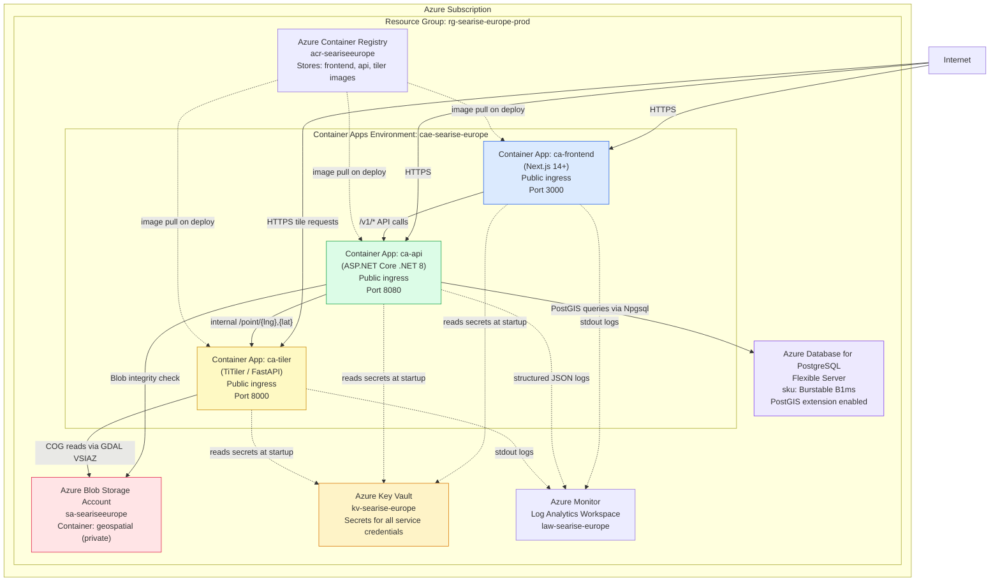
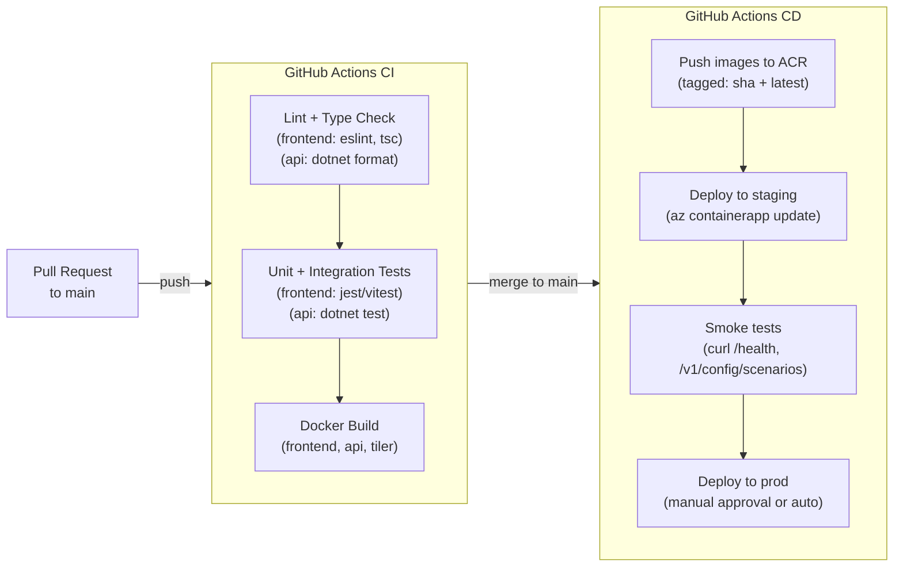

# 08 — Deployment Topology

> **Status:** Proposed Architecture
> **Platform:** Microsoft Azure. Target region: West Europe (Amsterdam) as primary, consistent with SeaRise Europe's audience and data geography.

---

## 1. Hosting Platform Choice

**Azure Container Apps** is the selected hosting platform for all three runtime containers.

**Rationale (Tradeoff):**
- Portfolio-grade deployment with production-capable infrastructure
- Consumption plan: pay-per-use, scales to zero between demo sessions (cost-effective for low-traffic portfolio use)
- No Kubernetes cluster management; Azure manages the underlying container orchestration
- Built-in HTTPS, custom domains, revision management, and health probes without additional configuration
- Key Vault references and Managed Identity are first-class features

**Alternative considered:** Azure App Service (simpler) — rejected because it does not support multiple containers as a logical application group. Azure Kubernetes Service — rejected as over-engineered for a single-engineer portfolio project.

---

## 2. Azure Resource Topology



---

## 3. Container App Configurations

### 3.1 Frontend (ca-frontend)

| Setting | Value |
|---|---|
| Image | `acr-seariseeurope.azurecr.io/searise-frontend:{tag}` |
| Port | 3000 |
| Ingress | External (public) |
| Min replicas | 0 (scale to zero) |
| Max replicas | 3 |
| CPU | 0.5 vCPU |
| Memory | 1.0 Gi |
| Scale trigger | HTTP concurrency ≥ 10 |

**Environment variables:**
```
NEXT_PUBLIC_API_BASE_URL=https://api.searise-europe.example.com
NEXT_PUBLIC_BASEMAP_STYLE_URL=...              # ADR-020: Azure Maps Light style URL with subscription key
# Note: no secret keys in frontend env vars (NFR-006)
```

**Health probe:**
```
GET /api/health → HTTP 200
```

### 3.2 API (ca-api)

| Setting | Value |
|---|---|
| Image | `acr-seariseeurope.azurecr.io/searise-api:{tag}` |
| Port | 8080 |
| Ingress | External (public) |
| Min replicas | 0 (scale to zero) |
| Max replicas | 5 |
| CPU | 0.5 vCPU |
| Memory | 1.0 Gi |
| Scale trigger | HTTP concurrency ≥ 10 |

**Environment variables (all via Key Vault references):**
```
DATABASE_URL               → secretref:kv-searise-europe/postgres-connection-string
GEOCODING_API_KEY          → secretref:kv-searise-europe/geocoding-provider-api-key
BLOB_CONNECTION_STRING     → secretref:kv-searise-europe/blob-storage-connection-string
CORS_ALLOWED_ORIGINS       → secretref:kv-searise-europe/cors-allowed-origins
TILER_BASE_URL             → https://tiler.searise-europe.example.com   # or internal DNS
ASPNETCORE_ENVIRONMENT     → Production
```

**Health probe (NFR-011):**
```
GET /health → HTTP 200 (healthy) or HTTP 503 (unhealthy)
Startup probe: delay 10s, period 5s, failure threshold 3
Liveness probe: period 30s, failure threshold 3
Readiness probe: period 10s, failure threshold 3
```

### 3.3 TiTiler (ca-tiler)

| Setting | Value |
|---|---|
| Image | `acr-seariseeurope.azurecr.io/searise-tiler:{tag}` or `ghcr.io/developmentseed/titiler:{tag}` |
| Port | 8000 |
| Ingress | External (public — browser tile requests require public access) |
| Min replicas | 0 (scale to zero) |
| Max replicas | 5 |
| CPU | 1.0 vCPU |
| Memory | 2.0 Gi |
| Scale trigger | HTTP concurrency ≥ 10 |

**Environment variables:**
```
AZURE_STORAGE_CONNECTION_STRING  → secretref:kv-searise-europe/blob-storage-connection-string
TITILER_API_CORS_ORIGINS         → https://www.searise-europe.example.com
GDAL_DISABLE_READDIR_ON_OPEN     → EMPTY_DIR
CPL_VSIL_USE_TEMP_FILE_FOR_RANDOM_WRITE → NO
VSI_CACHE                        → TRUE
VSI_CACHE_SIZE                   → 52428800   # 50 MB in-process COG byte cache
```

**Health probe:**
```
GET /healthz → HTTP 200
```

---

## 4. Network Topology

### 4.1 DNS and Custom Domains

| Container | Custom Domain | TLS |
|---|---|---|
| Frontend | `www.searise-europe.example.com` | Azure managed certificate (auto-renew) |
| API | `api.searise-europe.example.com` | Azure managed certificate |
| TiTiler | `tiler.searise-europe.example.com` | Azure managed certificate |

DNS records: CNAME pointing to Container Apps environment FQDN.

### 4.2 Internal vs External Traffic

```
External (internet-facing):
  www.searise-europe.example.com  → ca-frontend
  api.searise-europe.example.com  → ca-api
  tiler.searise-europe.example.com → ca-tiler (for browser tile requests)

Internal (Container Apps environment):
  ca-api → ca-tiler assessment queries use internal FQDN
  (ca-tiler.internal.{env-fqdn} or via Container Apps service discovery)
```

### 4.3 PostgreSQL Network Access

Azure Database for PostgreSQL Flexible Server is configured to allow connections only from the Container Apps environment's outbound IP range or via VNet integration. Direct internet access to PostgreSQL is disabled.

---

## 5. Environments

| Environment | Purpose | Scale-to-Zero | Data |
|---|---|---|---|
| **dev** | Local developer machines | N/A (Docker Compose) | Local Postgres + seeded test data |
| **staging** | Integration testing, demo rehearsal, architecture validation | Yes | Seeded with real layers; mirrors prod schema |
| **prod** | Live portfolio demo | Yes | Real IPCC + Copernicus layers |

### 5.1 Local Development (Docker Compose)

```yaml
# docker-compose.yml (outline)
services:
  frontend:
    build: ./frontend
    ports: ["3000:3000"]
    environment:
      NEXT_PUBLIC_API_BASE_URL: http://localhost:8080

  api:
    build: ./api
    ports: ["8080:8080"]
    environment:
      DATABASE_URL: "Host=postgres;Database=searise;Username=searise;Password=dev"
      GEOCODING_API_KEY: "${GEOCODING_API_KEY}"   # from .env.local
      TILER_BASE_URL: http://tiler:8000
      CORS_ALLOWED_ORIGINS: http://localhost:3000

  tiler:
    image: ghcr.io/developmentseed/titiler:latest
    ports: ["8000:8000"]
    environment:
      AZURE_STORAGE_CONNECTION_STRING: "${AZURE_STORAGE_CONNECTION_STRING}"
      TITILER_API_CORS_ORIGINS: http://localhost:3000

  postgres:
    image: postgis/postgis:16-3.4
    ports: ["5432:5432"]
    environment:
      POSTGRES_DB: searise
      POSTGRES_USER: searise
      POSTGRES_PASSWORD: dev
    volumes:
      - ./infra/db/init.sql:/docker-entrypoint-initdb.d/init.sql
```

`.env.local` (gitignored): holds `GEOCODING_API_KEY` and `AZURE_STORAGE_CONNECTION_STRING` for local use.

---

## 6. CI/CD Pipeline (Proposed Architecture)



**Deploy command:**
```bash
az containerapp update \
  --name ca-api \
  --resource-group rg-searise-europe-prod \
  --image acr-seariseeurope.azurecr.io/searise-api:${GIT_SHA}
```

Container Apps supports **rolling updates** (new revision deployed alongside old; traffic shifted after health checks pass). Rollback = update to previous image tag.

---

## 7. Offline Pipeline Execution Environment

The geospatial data pipeline (see [16-geospatial-data-pipeline.md](16-geospatial-data-pipeline.md)) is **not a runtime service**. It runs as a one-off or scheduled process:

| Option | When | Environment |
|---|---|---|
| Developer workstation | Phase 0 bootstrap | Python + GDAL + Azure CLI installed locally |
| GitHub Actions (manual trigger) | Data refresh | GitHub-hosted runner with GDAL and Azure credentials via secrets |
| Azure Container Instance (ACI) | Scheduled reprocessing | Disposable container, run-to-completion |

Pipeline writes COGs to Blob Storage and updates the `layers` table in PostgreSQL. No ongoing hosting cost between pipeline runs.

---

## 8. Cost Profile (Estimated — MVP)

> Assumptions: Scale to zero when idle; demo-level traffic (< 100 concurrent users peak).

| Resource | SKU | Est. Monthly Cost |
|---|---|---|
| Container Apps (3 apps, Consumption) | Per-request billing at idle; ~0.5 vCPU active | ~$5–15 |
| Azure Database for PostgreSQL | Burstable B1ms (1 vCPU, 2 GB) | ~$15 |
| Azure Blob Storage | LRS, Hot tier, ~10 GB for all COG layers | ~$0.20 |
| Azure Container Registry | Basic tier | ~$5 |
| Azure Key Vault | Standard, < 10k operations/month | < $1 |
| Azure Monitor | Log ingestion ~1 GB/month | ~$2 |
| **Total** | | **~$30–40/month** |

This is well within a portfolio project budget. At higher traffic, Container Apps Consumption plan scales proportionally.

---

## 9. Phase-by-Phase Infrastructure Rollout

> **Delivery strategy: local-first, Azure-last.** All development, testing, and validation happen against the local Docker Compose environment first. Azure resources are provisioned and deployed only as the final release step (Epic 08). This minimizes cloud spend during development and eliminates Azure availability as a blocker for feature work.

| Phase | Infrastructure Work |
|---|---|
| **Phase 0 — Local Foundation** | Set up Docker Compose (PostgreSQL + PostGIS, TiTiler, API, frontend); run data pipeline locally; seed local database; establish CI for lint, type check, and unit tests |
| **Phase 1 — Local MVP** | Develop and test all features against Docker Compose; run authored Playwright E2E tests locally; use `playwright-cli` for exploratory UI validation; all acceptance criteria pass locally |
| **Release — Azure Deployment** | Provision Resource Group, ACR, Key Vault, Azure PostgreSQL, Blob Storage, Container Apps; configure CI/CD with deployment pipeline; deploy all 3 containers to staging; run E2E suite against staging; configure custom domains + TLS; security hardening against cloud environment; release readiness checklist |
| **Post-MVP** | Evaluate CDN for frontend assets; evaluate autoscaling rules tuning; configure Azure Monitor alerts; review costs |
