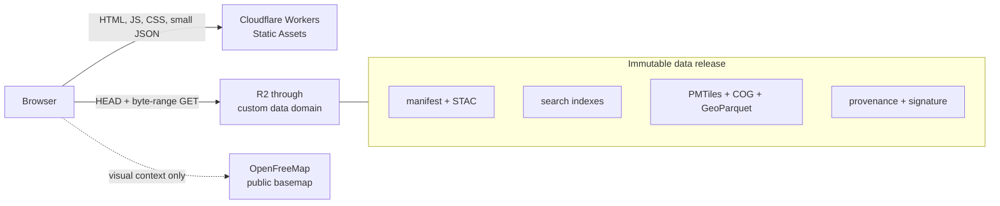
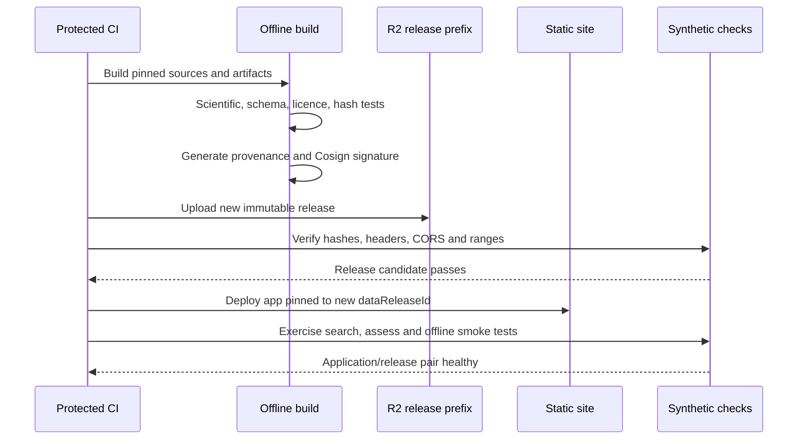

# Deployment Topology

> **Status:** Accepted target topology
> **Authority:** [ADR-021](adr/ADR-021-static-first-offline-geospatial-architecture.md)

## Production shape

Production contains two deployable surfaces and no application compute:

```mermaid
flowchart LR
    User[Browser]
    Site[Cloudflare Workers\nStatic Assets]
    Data[R2 through\ncustom data domain]
    Map[OpenFreeMap\npublic basemap]

    User -->|HTML, JS, CSS, small JSON| Site
    User -->|HEAD + byte-range GET| Data
    User -. visual context only .-> Map

    subgraph Release[Immutable data release]
        Manifest[manifest + STAC]
        Search[search indexes]
        Geo[PMTiles + COG + GeoParquet]
        Proof[provenance + signature]
    end

    Data --- Release
```

There is no production ASP.NET service, Next.js server, PostgreSQL/PostGIS,
TiTiler, Azurite, queue, runtime geocoder, or application-managed session. A
Cloudflare Worker function is not part of the baseline; Workers Static Assets
is used as a static host.

## Origin allocation

| Content | Canonical origin | Cache policy |
|---|---|---|
| HTML entry points and service worker | Static site domain | Short TTL or revalidation; must activate atomically |
| Hashed JavaScript, CSS, fonts, icons | Static site domain | `public, max-age=31536000, immutable` |
| Small pinned config/search files within platform limits | Static site or canonical data domain | Immutable release path |
| PMTiles, COG, GeoParquet, large indexes, STAC and provenance | R2 custom data domain | `public, max-age=31536000, immutable` |
| `/release.json`, if used | Static site domain | Short TTL plus revalidation; discovery only |

An application build contains or resolves one explicit `dataReleaseId`. It
must not consume “latest” during a session. Each release is stored under
`/releases/{dataReleaseId}/...`; objects in that prefix are append-only.

R2 must support `GET`, `HEAD`, and byte-range requests with the CORS and exposed
headers in ADR-021. Large artifacts use one public canonical URL so browser,
STAC, manifest, and smoke tests all address the same object.

## Environments

| Environment | Purpose | Data | Publication rule |
|---|---|---|---|
| Local | UI and pipeline development | Small checked-in fixtures or ignored source cache | No cloud credential required |
| Pull request | Static preview and browser/contract tests | Fixed fixture release | Untrusted; cannot publish production data |
| Staging | Real regional spike and release candidate | Immutable `rc-*` prefix | Protected approval; production-like headers/ranges |
| Production | Public portfolio site | Signed, validated release | Protected environment and explicit activation |

Preview deployments may use the static host's preview URLs, but R2 CORS must
not be expanded to arbitrary origins. Use a controlled preview-origin pattern
or a separate non-production bucket. Production and non-production publish
credentials are distinct.

## Infrastructure as code

OpenTofu is the source of truth for provider-managed infrastructure. The
configuration should stay small and portable and manage, at minimum:

- R2 production and non-production buckets;
- bucket CORS and lifecycle protections;
- custom data domain and required DNS records;
- cache rules and security headers that cannot be expressed in the static app;
- static-site project/environment bindings;
- budget or usage notifications where supported;
- least-privilege CI publication identities and protected variables, without
  storing secret values in state or Git.

Remote OpenTofu state, if used, is encrypted, access-controlled, and not public.
State changes and plans are reviewed before apply. Tool and provider versions
are pinned. The infrastructure must not introduce Cloudflare D1, KV, Durable
Objects, Queues, or Worker-only business logic into the baseline.

## Build and release flow

Data release and application deployment are separate, ordered jobs:

```mermaid
sequenceDiagram
    participant CI as Protected CI
    participant B as Offline build
    participant R2 as R2 release prefix
    participant S as Static site
    participant Q as Synthetic checks

    CI->>B: Build pinned sources and artifacts
    B->>B: Scientific, schema, licence, hash tests
    B->>B: Generate provenance and Cosign signature
    CI->>R2: Upload new immutable release
    CI->>Q: Verify hashes, headers, CORS and ranges
    Q-->>CI: Release candidate passes
    CI->>S: Deploy app pinned to new dataReleaseId
    CI->>Q: Exercise search, assess and offline smoke tests
    Q-->>CI: Application/release pair healthy
```

The required order is:

1. Build from a clean code revision and pinned source manifest.
2. Pass scientific, contract, security, licence, and architecture fitness
   functions.
3. Generate `manifest.json`, STAC, SLSA-compatible provenance, and a keyless
   Cosign signature.
4. Upload into a new release prefix; never overwrite a released object.
5. Read back and verify every checksum plus representative full and range
   requests from the public custom domain.
6. Deploy the small application build pinned to that release.
7. Run production browser and synthetic smoke tests.
8. Record the successful app commit/release pairing in the release inventory.

Failure before step 6 leaves an unreferenced candidate release and does not
affect users. Failure after step 6 triggers application rollback.

## Rollback and retention

Rollback is a pointer/deployment change, never in-place data mutation:

- redeploy the last known-good application build pinned to its original
  `dataReleaseId`;
- verify the previous manifest, range requests, search, and representative
  assessments;
- retain the failed release for investigation and reproducibility;
- remove a release only under a reviewed retention or security/legal procedure.

Keep at least the current and previous production application/release pairs
available. A rollback drill is a release gate before decommissioning the old
runtime.

## Availability and failure isolation

- The application shell and cached data continue to work according to the
  explicit offline policy when origins are unavailable.
- R2 outage or missing uncached ranges produces an availability message, never
  a guessed assessment.
- OpenFreeMap outage removes visual context only; local search and assessment
  remain authoritative and functional when their data is cached.
- A broken mutable release pointer cannot alter an already loaded session
  because the application pins its release.
- Old immutable releases remain cacheable and recoverable during a new release
  incident.

## Cost controls

The intended idle infrastructure cost is EUR 0/month while usage remains in
the current Cloudflare free allowances, excluding the custom-domain
registration. This is a target, not a guarantee.

Before activation, each release records:

- R2 stored bytes by artifact type;
- expected initial and typical user transfer;
- representative range-request count per assessment and map session;
- current dated provider allowance/pricing assumptions;
- threshold alerts and the cost owner.

Aggregate storage, operations, traffic, error, and cost metrics are reviewed.
An architecture change is required before introducing paid always-on compute.

## Portability contract

Cloudflare is the reference host, not an application dependency. A replacement
platform must provide:

- HTTPS static hosting;
- object storage or CDN with `GET`, `HEAD`, byte ranges, CORS, and immutable
  cache headers;
- atomic deployment or a recoverable application pointer;
- the ability to serve PMTiles, COG, GeoParquet, JSON, STAC, and Sigstore
  bundles without format conversion.

Provider-specific business logic is prohibited in the baseline. This keeps a
future move to Azure, AWS, another CDN, or self-hosted object storage a delivery
change rather than a product rewrite.

## Deployment acceptance checks

A production deployment is complete only when automation proves:

- the app and manifest pin the same `dataReleaseId`;
- all nine scenario/horizon artifacts exist and match declared hashes/sizes;
- HTML is revalidated and content-hashed assets are immutable;
- R2 `HEAD` and partial `GET` return correct range and CORS headers;
- no runtime request targets an application API, database, or tile server;
- a representative cached flow works after network removal;
- `/about/architecture` exposes the release, commit, provenance, sizes, and
  current fitness-function evidence;
- rollback metadata identifies a verified previous pair.
