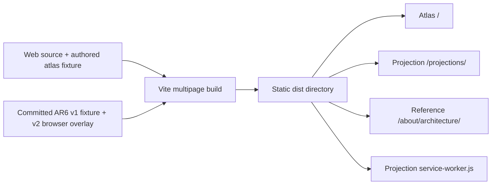
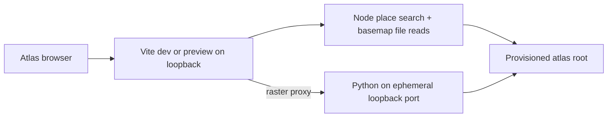

# 08 — Build and Deployment Topology

> **Status:** Implemented local/static topology, reviewed 2026-10-04.
> Cloudflare Static Assets + R2 is a retained reference direction, not an
> installed infrastructure deployment in this checkout.

## Executable environments

| Environment | Command from repository root | Dependencies |
|---|---|---|
| Fixture development | `npm run web:dev` | Node/npm workspace; authored atlas fixture |
| Fixture build and preview | `npm run web:build`, then `npm run web:serve` | Built `src/web/dist`; preview at `127.0.0.1:4173` |
| Real-local development | `npm run local:start` | Provisioned atlas data and Python; `127.0.0.1:4181` |
| Real-local build and preview | `npm run local:build`, then `npm run local:serve` | Matching built edition plus the same local data/Python |
| Private demo candidate | `npm run demo:preflight`, `demo:prepare`, `demo:serve` with explicit paths | Clean exact source, pinned tools, provisioned data and sealed app inventory |
| Generic static-host validation | Tools under `tools/static-quality` | Normal fixture build and isolated quality-tool dependencies |
| Controlled AR6 build/signing | Explicit GitHub workflow dispatch | Pinned inputs, toolchains and protected evidence authority |

Commands are defined in [root package.json](../../package.json) and
[web package.json](../../src/web/package.json). Use Node 20.20.1 and npm 11.12.1.
The real-local environment is provisioned separately; details and overrides are
in the [development runbook](../operations/coastal-atlas-development.md).

## Normal build

```mermaid
flowchart LR
    Source[Web source + authored atlas fixture] --> Vite[Vite multipage build]
    AR6[Committed AR6 v1 fixture + v2 browser overlay] --> Vite
    Vite --> Dist[Static dist directory]
    Dist --> Root[Atlas /]
    Dist --> Reference[Projection /projections/]
    Dist --> About[Reference /about/architecture/]
    Dist --> Worker[Projection service-worker.js]
```

Vite copies the committed projection fixture for the default synthetic release.
Build finalization seals the projection precache, emits deterministic delivery
sidecars, and validates target content and the exact output inventory. Unknown
files, symlinks and private candidate material are rejected by build checks.
See [vite.config.ts](../../src/web/vite.config.ts),
[finalize-service-worker.mjs](../../src/web/scripts/finalize-service-worker.mjs)
and [inspect-build.mjs](../../src/web/scripts/inspect-build.mjs).

The architecture route remains a projection reference page, not a generated
atlas release report. Its document is not part of the offline precache.

## Real-local runtime

```mermaid
flowchart LR
    Browser[Atlas browser] --> Vite[Vite dev or preview on loopback]
    Vite --> Context[Node place search + basemap file reads]
    Vite -->|raster proxy| Python[Python on ephemeral loopback port]
    Context --> Local[Provisioned atlas root]
    Python --> Local
```

The edition plugin installs middleware only in real-local mode. It verifies
that a preview's mode matches the HTML edition marker. Normal fixture mode does
not load the local adapter. Starting or previewing real-local launches Python;
a Vite build by itself does not provision data or start that service.

The default root is the main checkout's `local-data/atlas/europe`, including
from a Git worktree. `SEARISE_ATLAS_ROOT` and `SEARISE_ATLAS_PYTHON` are explicit
operator overrides. Copying real-local `dist` to a generic static host leaves
`/atlas-data` unavailable; it is not a deployable real-data atlas by itself.

## Sealed local demo

The [candidate launcher](../../scripts/demo/demo.mjs) preflights provisioned
inputs, builds a clean exact source commit into a new
`.cache/demo-candidates/<name>/app`, records inventory/data identities in
`candidate.json`, verifies them and seals the output read-only. It never
packages the external rasters or overwrites an earlier candidate.

Serve verifies that same clean commit and candidate/data hashes, starts the
local adapter, and runs a [sealed Vite preview](../../scripts/demo/sealed-preview.mjs)
with `configFile: false`, `envDir: false`, loopback host and strict port. The
retained reference uses manifest-allowlisted release delivery from the sealed
app. Static shell responses revalidate; private atlas responses remain
`no-store`. A lifecycle owner closes preview and reaps the raster process.

This is the implemented private demo workflow described in the
[candidate runbook](../operations/local-demo-candidate.md), not an automatic
public deployment. The checked-in [demo prerelease notes](../releases/v0.1.0-rc.1.md)
describe a source-only prerelease with no private data distribution.

## HTTP and storage requirements

Projection artifacts use the checked-in
[delivery policy](../../contracts/http-delivery/v1/policy.json): correct media
types, lengths, hashes/ETags and byte ranges; visual PMTiles overrides immutable
caching with `no-store`. Current fixture output is same-origin. Any separate
public data origin requires reviewed CSP/CORS and public readback evidence.

Atlas catalog/search/inspection/tiles and local basemap full/range responses
use `no-store`. These local routes are GET-only,
not the projection release's GET/HEAD interface.

The generic-host harness checks all three documents, static 404s, build/release
identity, assets and absence of retired endpoints. It proves portable fixture
delivery; it does not prove public R2 provisioning or real-local portability.

## Publication and rollback status

No `.tf`/OpenTofu configuration or Cloudflare application deployment config is
checked in. The protected offline builder, signing and owner-promotion workflows
produce/validate candidate evidence; they are not a public atlas deployment
pipeline. Public rights, acquisition reproducibility and distribution remain
open under ADR-028.

For a future public projection deployment, preserve immutable release paths and
redeploy a verified previous app/release pair on rollback. Browser storage is
not deployment authority. Projection updates activate naturally after existing
tabs close; the active session cannot switch to a different release mid-flow.
Local atlas rollback instead requires matching application source and a verified
provisioned workspace; there is no atlas versioned offline update mechanism.

Cloudflare's cost target and two-origin model belong to the retained design.
There is no measured production bill, configured uptime monitor or installed
budget alert to report as current implementation. See [09](09-observability-and-operations.md).
