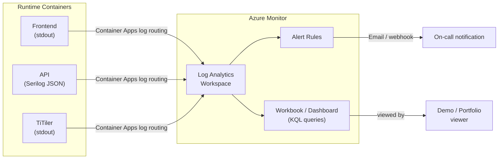

# 09 — Observability and Operations

> **Status:** Proposed Architecture
> **References:** NFR-008 (request/response logging), NFR-009 (no PII in logs), NFR-013 (correlation IDs), METRICS_PLAN.md (product metric taxonomy)

---

## 1. Observability Goals

1. **Diagnose failures quickly** — a broken assessment or geocoding error should be traceable via `requestId` within minutes
2. **Confirm NFR compliance** — p95 latencies measurable against NFR-001 through NFR-004 targets
3. **Privacy-preserving** — no raw addresses, no precise coordinates, no user identifiers in any log or metric
4. **Demo-ready** — the system's health is visibly demonstrable to portfolio evaluators (P-03 Yuki)

---

## 2. Logging

### 2.1 Log Format

All containers emit structured JSON logs to stdout. Azure Container Apps routes stdout to the attached Log Analytics Workspace.

**Standard log envelope:**
```json
{
  "timestamp": "2026-03-30T12:00:00.123Z",
  "level": "Information",
  "requestId": "req_abc123",
  "service": "searise-api",
  "event": "AssessmentCompleted",
  "properties": {
    "resultState": "ModeledExposureDetected",
    "scenarioId": "ssp2-45",
    "horizonYear": 2050,
    "countryCode": "NL",
    "durationMs": 412,
    "methodologyVersion": "v1.0"
  }
}
```

**ASP.NET Core configuration (Serilog):**
```csharp
Log.Logger = new LoggerConfiguration()
    .Enrich.FromLogContext()
    .Enrich.WithProperty("service", "searise-api")
    .WriteTo.Console(new JsonFormatter())
    .MinimumLevel.Information()
    .MinimumLevel.Override("Microsoft.AspNetCore", LogEventLevel.Warning)
    .CreateLogger();
```

### 2.2 Correlation ID Middleware

Every request gets a `requestId` (UUID v4) either from the incoming `X-Correlation-Id` header or generated fresh. It is:
1. Injected into the `ILogger` scope for all downstream log calls
2. Returned in every API response body as `requestId`

```csharp
app.Use(async (context, next) =>
{
    var correlationId = context.Request.Headers["X-Correlation-Id"].FirstOrDefault()
                        ?? $"req_{Guid.NewGuid():N}"[..16];
    using var _ = logger.BeginScope(new Dictionary<string, object>
        { ["requestId"] = correlationId });
    context.Response.Headers["X-Correlation-Id"] = correlationId;
    await next();
});
```

### 2.3 Log Events by Endpoint

| Event | Level | Key Properties | Never Log |
|---|---|---|---|
| `GeocodeRequested` | Debug | `requestId` | query string |
| `GeocodeCompleted` | Info | `requestId`, `candidateCount`, `durationMs` | query string |
| `GeocodeProviderError` | Error | `requestId`, `providerStatusCode`, `durationMs` | — |
| `AssessmentRequested` | Debug | `requestId`, `scenarioId`, `horizonYear` | lat/lng |
| `AssessmentCompleted` | Info | `requestId`, `resultState`, `scenarioId`, `horizonYear`, `countryCode`, `durationMs`, `methodologyVersion` | lat/lng |
| `AssessmentError` | Error | `requestId`, `errorCode`, `durationMs` | lat/lng |
| `GeographyCheckCompleted` | Debug | `requestId`, `isEurope`, `isCoastal` | lat/lng |
| `LayerResolved` | Debug | `requestId`, `layerId`, `blobPath` | — |
| `LayerNotFound` | Info | `requestId`, `scenarioId`, `horizonYear` | — |
| `TilerQueryCompleted` | Debug | `requestId`, `pixelValue`, `durationMs` | lat/lng |
| `HealthCheckCompleted` | Debug | `postgres`, `blobStorage` | — |

**Privacy enforcement:** `lat`/`lng` coordinates and query strings must never appear in any log field. This is enforced by: (a) not logging request bodies, (b) using event-specific log statements (not generic request/response body dump middleware), (c) code review.

### 2.4 Log Levels by Environment

| Environment | Minimum Level |
|---|---|
| Development | Debug |
| Staging | Information |
| Production | Information |

---

## 3. Metrics

### 3.1 Infrastructure Metrics (Azure Monitor — automatic)

Azure Container Apps and Azure Database for PostgreSQL emit these metrics automatically:

| Metric | Source | Alert Threshold |
|---|---|---|
| `ReplicaCount` | Container Apps | > 0 when traffic exists |
| `RequestCount` | Container Apps | — |
| `RequestLatencyP95` | Container Apps | > 4000 ms (NFR-003 + buffer) |
| `FailedRequestCount` | Container Apps | > 5/min (alert) |
| `CpuUsage` | Container Apps | > 80% (scaling signal) |
| `MemoryUsage` | Container Apps | > 80% (alert) |
| `active_connections` | PostgreSQL | > 80 (near limit) |
| `cpu_percent` | PostgreSQL | > 80% |
| `storage_percent` | PostgreSQL | > 70% |

### 3.2 Application Metrics (Derived from Logs)

Extracted from structured logs via KQL queries in Log Analytics:

```kql
// Assessment p95 latency (last 1 hour)
AppTraces
| where Properties.event == "AssessmentCompleted"
| summarize p95 = percentile(todouble(Properties.durationMs), 95) by bin(TimeGenerated, 5m)
| render timechart

// Result state distribution
AppTraces
| where Properties.event == "AssessmentCompleted"
| summarize count() by tostring(Properties.resultState), bin(TimeGenerated, 1h)
| render columnchart

// Error rate
AppTraces
| where Properties.event in ("AssessmentError", "GeocodeProviderError")
| summarize errors = count() by bin(TimeGenerated, 5m)
```

### 3.3 Product Metrics

Per [METRICS_PLAN.md](../product/METRICS_PLAN.md), the following are Tier 1 health metrics tracked via log-derived queries:

| Metric | Source |
|---|---|
| Assessment completion rate | `AssessmentCompleted` / (`AssessmentCompleted` + `AssessmentError`) |
| Geocoding success rate | `GeocodeCompleted` / (`GeocodeCompleted` + `GeocodeProviderError`) |
| Result state distribution | `resultState` field in `AssessmentCompleted` events |
| p95 assessment latency | `durationMs` in `AssessmentCompleted` |
| p95 geocoding latency | `durationMs` in `GeocodeCompleted` |

---

## 4. Distributed Tracing

For MVP, full distributed tracing (OpenTelemetry) is **not implemented**. The `requestId` correlation ID propagated through all log events provides sufficient traceability for:
- Linking a geocode request to its provider call
- Linking an assess request through geography checks, layer resolution, and TiTiler query
- Frontend-to-API correlation when the browser sends `X-Correlation-Id`

**Phase 2 consideration:** Add OpenTelemetry SDK to API + TiTiler for end-to-end trace spans. Export to Azure Monitor Application Insights or Jaeger.

---

## 5. Alerting

### 5.1 Alert Rules (Proposed)

| Alert | Condition | Severity | Action |
|---|---|---|---|
| High error rate | > 10% of assess requests return 500 in a 5-min window | High | Email / notify |
| Geocoding provider down | > 3 consecutive `GeocodeProviderError` events | High | Email / notify |
| PostgreSQL connection failure | `/health` returns `postgres: unhealthy` | Critical | Email / notify |
| High latency | `RequestLatencyP95` > 5000ms on ca-api for 10 min | Medium | Email |
| Container restart loop | Replica restart count > 3 in 10 min | High | Email |

### 5.2 Health Endpoint as Probe

The `GET /health` endpoint (see [06-api-and-contracts.md](06-api-and-contracts.md) §2) serves both:
1. **Azure Container Apps readiness/liveness probes** — platform automatically restarts unhealthy replicas
2. **External uptime monitoring** — can be pinged by an uptime service (e.g., Azure Monitor availability test, UptimeRobot, or similar)

---

## 6. Operations Runbook (Key Scenarios)

### 6.1 Geocoding Provider Outage

**Symptom:** `GeocodeProviderError` events spike; frontend shows "Search temporarily unavailable."

**Diagnosis:**
```kql
AppTraces
| where Properties.event == "GeocodeProviderError"
| order by TimeGenerated desc
| take 20
```

**Action:** Check provider status page. No automated fallback at MVP. If sustained, consider temporarily surfacing a static message. Provider is configured in `GEOCODING_API_KEY` env var — swapping provider requires new key + code change (OQ-06 unresolved at MVP).

### 6.2 TiTiler Returning No Pixel Values

**Symptom:** `resultState` unexpectedly high `DataUnavailable`; `TilerQueryCompleted` logs show `pixelValue: null`.

**Diagnosis:**
1. Check `GET /health` — is `blobStorage` healthy?
2. Check TiTiler logs for GDAL VSIAZ errors
3. Verify COG blob path exists: `az storage blob exists --container-name geospatial --name layers/v1.0/...`

**Action:** Re-upload affected COG if missing. Check `layers.layer_valid` flag in PostgreSQL.

### 6.3 Assessment Latency Spike

**Symptom:** p95 > 3500ms on `/v1/assess` (NFR-003 violation).

**Diagnosis:**
```kql
AppTraces
| where Properties.event == "AssessmentCompleted"
| extend tilerMs = todouble(Properties.tilerDurationMs)
| extend dbMs = todouble(Properties.dbDurationMs)
| summarize avg(tilerMs), avg(dbMs) by bin(TimeGenerated, 5m)
```

**Common causes:**
- TiTiler cold start (scale-from-zero adds 10–20s latency on first request)
- PostgreSQL connection pool exhausted (check `active_connections`)
- GDAL VSIAZ cache miss causing full COG scan

**Action:** Set TiTiler min replicas to 1 if cold start is unacceptable for demo. Tune `VSI_CACHE_SIZE`.

### 6.4 Database Schema Migration

The schema is stable for MVP. For future methodology version addition:
```sql
-- Add new methodology version row
INSERT INTO methodology_versions (version, is_active, ...) VALUES ('v2.0', false, ...);
-- Upload new COGs to Blob
-- Register new layer rows
UPDATE layers SET layer_valid = true WHERE methodology_version = 'v2.0';
-- Atomic activation swap (see 05-data-architecture.md §6)
BEGIN;
  UPDATE methodology_versions SET is_active = false WHERE is_active = true;
  UPDATE methodology_versions SET is_active = true WHERE version = 'v2.0';
COMMIT;
```

No API code changes required for new methodology version.

### 6.5 Deployment Rollback

```bash
# List recent revisions
az containerapp revision list --name ca-api --resource-group rg-searise-europe-prod

# Activate previous revision
az containerapp revision activate \
  --revision ca-api--{previous-revision-suffix} \
  --resource-group rg-searise-europe-prod

# Or: redeploy previous image tag
az containerapp update \
  --name ca-api \
  --resource-group rg-searise-europe-prod \
  --image acr-seariseeurope.azurecr.io/searise-api:{previous-sha}
```

---

## 7. Log Retention

| Log Type | Retention | Rationale |
|---|---|---|
| Application logs (Log Analytics) | 30 days (default) | Sufficient for incident diagnosis at MVP scale |
| Azure activity logs (resource changes) | 90 days (Azure default) | Compliance / audit |
| Container Apps system logs | 30 days | |
| PostgreSQL audit logs | Not enabled at MVP | No sensitive operations; reconsider if admin access widens |

---

## 8. Observability Architecture Diagram


