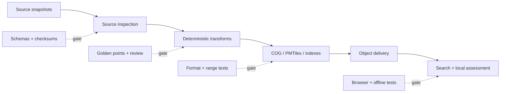

# 10 — Testing Strategy

> **Status:** Accepted target strategy; Phase 1 locked after the Phase 0 no-go
>
> **Source of truth:** [ADR-021](adr/ADR-021-static-first-offline-geospatial-architecture.md)
> **Quality rule:** no artifact is publishable merely because it builds. Scientific validity, contracts, browser parity, and delivery behaviour are release gates.

The executable inventory, changed-path commands, fixture ownership, and legacy
removal rules are defined in [`../testing/README.md`](../testing/README.md).

## 1. Testing model

Testing follows the complete data path rather than the boundaries of the
legacy API, database, and tile server:

Fast unit and contract tests run on every change. Representative regional
artifacts run in normal CI. The expensive Europe-wide build runs only after
the smaller gates pass and still cannot publish without the full release gate.

## 2. Phase 0 scientific gate

Phase 0 precedes the static migration and uses real, licensed inputs for a
small representative region. It must answer questions the existing synthetic
pipeline cannot answer:

1. Inspect the actual IPCC AR6 dimensions, coordinate model, quantiles, units,
   and missing values.
2. Document how location-based projections become an analysis grid; do not
   assume a regular latitude/longitude raster.
3. Confirm DEM product/resolution, CRS, vertical datum, resampling, and nodata
   treatment.
4. Compare the checked-in coastal approximation with the intended canonical
   coastal product.
5. Test coastline connectivity and disconnected inland false positives only
   after the approved uncertainty interval produces vertically eligible cells.
6. Compare independently reviewed control locations with the derived array
   and browser lookup.
7. Measure COG/PMTiles size, byte-range count, lookup latency, map quality, and
   browser memory.
8. Complete redistribution and attribution review.

A failed or ambiguous result stops publication. If it invalidates methodology
v1.0, the methodology and ADR must be superseded before Europe-wide output is
built.

The [Phase 0.9 gate](../evidence/phase-0-9-regional-gate.md) completed with an
explicit `BLOCKED` decision: all nine combinations have exact preflight lineage
but no arrays or artifacts. The later
[Phase 0.14 gate](../evidence/phase-0-14-final-no-go.md) completed the
investigation as `complete-with-no-go`. Issue #95's automated recommendation
is `rejected`, while the authoritative scientific and release disposition
remains `blocked` because independent review is pending.

Recovery tests follow the dependency chain
[#106](https://github.com/artemsemdev/SeaRise-Europe/issues/106) →
([#107](https://github.com/artemsemdev/SeaRise-Europe/issues/107),
[#108](https://github.com/artemsemdev/SeaRise-Europe/issues/108)) →
[#109](https://github.com/artemsemdev/SeaRise-Europe/issues/109) →
[#110](https://github.com/artemsemdev/SeaRise-Europe/issues/110). Before an
independently reviewed `approved` #110 with zero blockers:

- v1 contract tests must continue rejecting release artifacts and direct
  AR6-relative-versus-absolute-terrain comparison;
- missing or unbounded MSS, DTM, transformation, mask, licence, or review
  evidence must produce `DataUnavailable` or stop preflight;
- blocked preflight must emit no all-nodata, synthetic, or placeholder release;
- CI may validate hashes and invariants but may not populate or approve an
  independent review;
- [#48](https://github.com/artemsemdev/SeaRise-Europe/issues/48) and Phase 1
  remain locked.

## 3. Test layers

### 3.1 Pipeline unit tests

Pure functions and small fixture files cover:

- source metadata parsing, URL pinning, and SHA-256 verification;
- CRS and coordinate normalization;
- grid alignment, nearest-neighbour class resampling, and nodata propagation;
- binary result classification;
- shoreline distance and spatial predicates;
- GeoNames feature-code filters, normalization, aliases, and deduplication;
- deterministic search ranking;
- manifest construction and release path generation.

The same input and parameter set must yield byte-identical logical arrays and
stable records. Container/image and tool versions are recorded where file
encoders may legitimately change physical bytes.

### 3.2 Property-based and boundary tests

Generated inputs exercise:

- coordinates immediately inside, outside, and on geometry boundaries;
- pixel, tile, and COG-block edges;
- negative longitudes and longitude normalization;
- nodata masks, empty regions, malformed values, and non-finite coordinates;
- duplicate and accent-equivalent place names;
- deterministic tie-breaking for equal search scores;
- cache/release namespace isolation.

Binary class lookup always uses nearest-neighbour semantics. Tests fail if an
interpolation path invents a fractional class.

### 3.3 Data-contract tests

Validate all public contracts before packaging and again after upload:

- `manifest.json` and config JSON against versioned JSON Schemas;
- static STAC catalog, collection, items, links, assets, and roles;
- GeoParquet schema, geometry type, CRS metadata, and required columns;
- unique settlement IDs, finite coordinates, allowed feature codes, valid
  country/admin references, and no orphan aliases;
- exactly nine unique scenario/horizon layer pairs;
- every artifact URL, byte size, SHA-256, licence, and attribution mapping;
- manifest release ID equal to the path and application pin.

The settlement build also emits accepted/rejected counts per rule. The sum
must reconcile with the pinned source snapshot.

### 3.4 Scientific and geospatial tests

Required checks include:

- approved exposed, non-exposed, nodata, inland, and unsupported control
  locations;
- known coastal cities, small villages, islands, ports, estuaries, and low
  terrain;
- source-unit and plausible-range checks before calculation;
- raster bounds, dimensions, transform, CRS, class domain, nodata, and coverage;
- topology validity for support/coastal geometry;
- connectivity checks designed to reveal isolated inland exposure;
- scenario/horizon monotonicity checks only where scientifically justified;
- summary-statistic and spatial-difference reports against the prior release.

Large changes are review evidence, not automatically failures. They must be
explained by an intentional source or methodology change.

### 3.5 Artifact and delivery tests

For every published candidate:

- validate analysis GeoTIFFs as Cloud-Optimized GeoTIFFs;
- run PMTiles structural verification and sample tiles at multiple zooms;
- prove visual PMTiles classes agree with the corresponding COG samples;
- compare local and uploaded sizes and SHA-256 values;
- issue `HEAD` and partial `GET` requests and verify `Accept-Ranges`,
  `Content-Range`, `ETag`, cache headers, and allowed CORS origin;
- verify immutable paths are not overwritten;
- verify SLSA provenance and the keyless Cosign/Sigstore signature bundle.

### 3.6 Search tests

Search fixtures cover multilingual names, diacritics, ASCII fallbacks,
alternate names, duplicate names across countries, capitals, small villages,
zero-population records, and transcontinental boundary cases.

Assertions cover the ranking contract:

1. exact canonical name;
2. exact localized or alternate name;
3. prefix;
4. fuzzy match;
5. population and administrative importance;
6. coastal proximity as the final tie-breaker.

`europe-core` loads first; merging `europe-coastal` must not reorder a better
exact match incorrectly or create duplicate results.

### 3.7 Browser integration and end-to-end tests

Playwright exercises the production static build against release fixtures:

- load shell, focus search, initialize worker, and find a place;
- select a result and obtain each of the four domain states;
- switch all scenarios and horizons and keep map/assessment in sync;
- share a URL, reload it, and reproduce the same pinned result;
- show methodology, release, limitations, and source attribution;
- handle missing/corrupt artifacts and basemap failure without inventing a
  scientific result;
- assert zero calls to `/assess`, `/geocode`, and `/config`.

Browser lookup and Python pipeline sampling run against shared golden fixtures.
Any difference in source-grid selection, distance, quantile values, nodata, or
result state fails the parity gate.

### 3.8 Offline, accessibility, and visual tests

Offline tests warm only the explicitly supported cache, disable the network,
and repeat shell, configuration, boundary, search, and cached-layer flows. An
uncached required range must produce an honest connectivity/data-availability
message. Tests must not imply that all nine Europe-wide layers are always
offline.

Accessibility and visual coverage includes keyboard search, focus order,
screen-reader result messaging, contrast, reduced motion, responsive layouts,
map alternatives, and visible data/basemap attribution.

## 4. Shared fixtures and test data

Fixtures are small, licensed or generated, deterministic, and labelled by
purpose:

- `synthetic`: proves code behaviour only;
- `source-sample`: a pinned excerpt of a real source where redistribution is
  permitted;
- `golden`: independently reviewed expected result with methodology/release;
- `invalid`: deliberately corrupt schema, geometry, COG, PMTiles, or index.

Each golden coordinate records longitude, latitude, expected support/coastal
classification, expected pixel class or nodata, scenario, horizon,
methodology, and rationale. Python and TypeScript consume the same serialized
fixture. Synthetic results must never be presented as evidence that the real
Europe-wide data is valid.

## 5. CI and release fitness functions

| Gate | Required target |
|---|---:|
| Initial JavaScript, Brotli | <= 250 KiB, excluding lazy map/search chunks |
| Lighthouse performance/accessibility/best-practices/SEO | >= 90 each on agreed mobile profile |
| Search p95 after worker initialization | < 50 ms |
| Local assessment p95 after required data is cached | < 100 ms |
| Search worker initialization on reference mobile | < 1,000 ms |
| Runtime application API calls | 0 to `/assess`, `/geocode`, `/config` |
| Scenario/horizon coverage | Exactly 9 validated combinations |
| Large-object range support | `HEAD` and partial `GET` pass for every artifact |
| Manifest integrity | Schema, size, and SHA-256 all match |
| Scientific regression | Every approved golden point passes |
| Licence completeness | Every artifact resolves to source/licence metadata |
| Offline core | Shell, config, boundaries, and loaded index survive network removal |

Use a production-like browser and a documented hardware/network profile.
Store machine-readable results with the candidate release and expose the
current summary on `/about/architecture`.

## 6. CI stages

1. **Fast checks:** format, lint, type check, unit, property, schema, and small
   artifact tests.
2. **Regional candidate:** after #106–#109 provide approved inputs, #110 runs
   the reference-region transform, shared golden tests, browser parity, and
   performance budgets; a failed preflight emits no substitute artifacts.
3. **Full release build:** all sources and nine layer combinations, full data
   QA, diff report, inventory, STAC, provenance, and signatures.
4. **Staged delivery:** upload immutable prefix; verify hashes, range requests,
   headers, CORS, and browser smoke tests from the public origin.
5. **Promotion:** approval only after the required independent evidence review;
   retain the prior app/release pair for rollback.

A waiver must identify the failed budget, measured regression, rationale,
owner, and expiry date. Scientific, integrity, licence, scenario completeness,
and zero-runtime-API gates are not silently waivable.

## 7. Legacy parity and removal gate

Until ADR-021 Phases 0–3 pass, the legacy and static paths run against common
golden coordinates. Every mismatch is investigated; neither path is assumed
correct. Backend/database-specific tests may be deleted only with the Phase 4
components they protect. Their long-term replacements are artifact, browser,
scientific, and delivery-contract tests described here.
