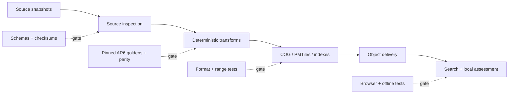

# 10 — Testing Strategy

> **Status:** Accepted target strategy; Phase 0R owner gate pending
>
> **Sources of truth:** [ADR-021](adr/ADR-021-static-first-offline-geospatial-architecture.md), amended by [ADR-024](adr/ADR-024-ar6-regional-projection-contract.md)
> **Quality rule:** no artifact is publishable merely because it builds. Scientific validity, contracts, browser parity, and delivery behaviour are release gates.

The executable inventory, changed-path commands, fixture ownership, and legacy
removal rules are defined in [`../testing/README.md`](../testing/README.md).

## 1. Testing model

Testing follows the complete data path rather than the boundaries of the
legacy API, database, and tile server:

Fast unit and contract tests run on every change. Representative regional
artifacts run in normal CI. The expensive Europe-wide build runs only after
the smaller gates pass and still cannot publish without the full release gate.

## 2. Phase 0 scientific gate

Phase 0R precedes the static migration and uses the locked, licensed AR6 source
with independently extracted golden values. Its active gates are:

1. Inspect the actual IPCC AR6 dimensions, coordinate model, quantiles, units,
   and missing values.
2. Preserve native grid location IDs, exact integer millimetres, required
   quantiles, nodata, and scope precedence without interpolation or fallback.
3. Compare independently extracted NetCDF values and source identities with
   Python, TypeScript, COG, GeoParquet, PMTiles, and real browser lookup.
4. Prove archive/member hashes, licences, attribution, manifest/STAC, receipts,
   candidate binding, and cross-environment reproducibility.
5. Measure COG/PMTiles size, build duration, byte-range count and bytes, cold
   and warm lookup latency, and browser memory.
6. Bind the owner disposition to the exact trusted build and evidence-only
   merge topology; CI cannot approve it.

The [Phase 0.14 gate](../evidence/phase-0-14-final-no-go.md) preserves the
terminal v1 binary result as `complete-with-no-go`. Permanent regression tests
continue rejecting direct AR6-relative-versus-absolute-terrain comparison and
any attempt to reinterpret that evidence as approved.

The active recovery chain is
[#106](https://github.com/artemsemdev/SeaRise-Europe/issues/106) →
[#135](https://github.com/artemsemdev/SeaRise-Europe/issues/135) →
[#110](https://github.com/artemsemdev/SeaRise-Europe/issues/110). #135 has
completed the independent-reader and Python/TypeScript lookup parity scope.
#110 remains locked until:

- both pinned Linux and macOS ARM64 jobs build the exact same source commit;
- candidate digests and exact scientific values agree;
- the committed evidence-only delta contains the trusted receipts, timings,
  raw browser trace, reports, checksums, and zero-blocker automated gate;
- a protected workflow verifies the `master@S` build and `S → E` evidence-only
  merge topology before the project owner records `releaseDisposition`;
- [#48](https://github.com/artemsemdev/SeaRise-Europe/issues/48) and Phase 1
  remain locked until that disposition is `approved`.

## 3. Test layers

### 3.1 Pipeline unit tests

Pure functions and small fixture files cover:

- source metadata parsing, URL pinning, and SHA-256 verification;
- CRS and coordinate normalization;
- source-grid identity, Haversine distance, lowest-ID tie-break, and the
  inclusive 100 km guardrail;
- exact q0.167/q0.5/q0.833 integer values and nodata propagation;
- shoreline distance and spatial predicates;
- GeoNames feature-code filters, normalization, aliases, and deduplication;
- deterministic search ranking;
- manifest construction and release path generation.

The same input and parameter set must yield byte-identical logical arrays and
stable records. Container/image and tool versions are recorded where file
encoders may legitimately change physical bytes.

### 3.2 Property-based and boundary tests

Generated inputs exercise:

- coordinates immediately inside, outside, and on geometry boundaries;
- pixel, tile, and COG-block edges;
- negative longitudes and longitude normalization;
- nodata masks, empty regions, malformed values, and non-finite coordinates;
- duplicate and accent-equivalent place names;
- deterministic tie-breaking for equal search scores;
- cache/release namespace isolation.

Projection lookup always uses the native grid without interpolation or
fallback. Tests fail if an alternate location or invented fractional value is
substituted.

### 3.3 Data-contract tests

Validate all public contracts before packaging and again after upload:

- `manifest.json` and config JSON against versioned JSON Schemas;
- static STAC catalog, collection, items, links, assets, and roles;
- GeoParquet schema, geometry type, CRS metadata, and required columns;
- unique settlement IDs, finite coordinates, allowed feature codes, valid
  country/admin references, and no orphan aliases;
- exactly nine unique scenario/horizon layer pairs;
- every artifact URL, byte size, SHA-256, licence, and attribution mapping;
- manifest release ID equal to the path and application pin.

The settlement build also emits accepted/rejected counts per rule. The sum
must reconcile with the pinned source snapshot.

### 3.4 Scientific and geospatial tests

Required checks include:

- independently extracted real-source projection values, source-nodata
  mutation controls, inland, and unsupported locations;
- known coastal cities, small villages, islands, ports, estuaries, and all four
  European basin contexts;
- source-unit and plausible-range checks before calculation;
- raster bounds, dimensions, transform, CRS, band order, integer values,
  nodata, and coverage;
- topology validity for support/coastal geometry;
- source-location identity and distance checks across runtimes and artifacts;
- summary-statistic and spatial-difference reports against the prior release.

Large changes are review evidence, not automatically failures. They must be
explained by an intentional source or methodology change.

### 3.5 Artifact and delivery tests

For every published candidate:

- validate analysis GeoTIFFs as Cloud-Optimized GeoTIFFs;
- run PMTiles structural verification and deterministic QA renders at zooms
  0, 3, and 6, covering lower/median/upper value bins and transparent
  source-nodata probes;
- prove PMTiles and GeoParquet integer values and source IDs agree exactly with
  the corresponding COG cells;
- require a pinned metadata-free Arrow schema and the RFC 1952 portable gzip
  operating-system marker before hashing cross-platform artifacts;
- compare local and uploaded sizes and SHA-256 values;
- issue `HEAD` and partial `GET` requests and verify `Accept-Ranges`,
  `Content-Range`, `ETag`, cache headers, and allowed CORS origin;
- verify immutable paths are not overwritten;
- verify SLSA provenance and the keyless Cosign/Sigstore signature bundle.

### 3.6 Search tests

Search fixtures cover multilingual names, diacritics, ASCII fallbacks,
alternate names, duplicate names across countries, capitals, small villages,
zero-population records, and transcontinental boundary cases.

Assertions cover the ranking contract:

1. exact canonical name;
2. exact localized or alternate name;
3. prefix;
4. fuzzy match;
5. population and administrative importance;
6. coastal proximity as the final tie-breaker.

`europe-core` loads first; merging `europe-coastal` must not reorder a better
exact match incorrectly or create duplicate results.

### 3.7 Browser integration and end-to-end tests

Playwright exercises the production static build against release fixtures:

- load shell, focus search, initialize worker, and find a place;
- select a result and obtain each of the four domain states;
- switch all scenarios and horizons and keep map/assessment in sync;
- share a URL, reload it, and reproduce the same pinned result;
- show methodology, release, limitations, and source attribution;
- handle missing/corrupt artifacts and basemap failure without inventing a
  scientific result;
- assert zero calls to `/assess`, `/geocode`, and `/config`.

Browser lookup and Python pipeline sampling run against shared golden fixtures.
Any difference in source-grid selection, distance, quantile values, nodata, or
result state fails the parity gate.

The checked-in exact-lookup suite exercises all nine scenario/horizon
combinations across seven independently recorded available locations (63
browser/Python comparisons). It also covers release-bound source-grid identity,
COG embedded scenario/horizon/source/band identity, canonical chunk hashes,
exact `HEAD`/CORS/`206` delivery, corrupt and missing ranges, cancellation that
does not poison shared resources, exact-artifact cache isolation, boundary
classification, nodata, the inclusive distance limit, lowest-ID ties, and
generated coordinate and grid candidates. A pinned browser-only polygon at
62°N, 44°E makes the real geography-to-COG `DataUnavailable/source-value-nodata`
path reproducible; it is explicitly excluded from audited geometry and
real-source releases. Disjointness, pinned cross-platform Arrow schemas, and
all 27 nodata samples are checked. The operational
commands and measured local gate are in
the [static scientific lookup runbook](../operations/static-scientific-lookup.md).

### 3.8 Offline, accessibility, and visual tests

Offline tests warm only the explicitly supported cache, disable the network,
and repeat shell, configuration, boundary, search, and cached-layer flows. An
uncached required range must produce an honest connectivity/data-availability
message. Tests must not imply that all nine Europe-wide layers are always
offline.

Accessibility and visual coverage includes keyboard search, focus order,
screen-reader result messaging, contrast, reduced motion, responsive layouts,
map alternatives, and visible data/basemap attribution.

## 4. Shared fixtures and test data

Fixtures are small, licensed or generated, deterministic, and labelled by
purpose:

- `synthetic`: proves code behaviour only;
- `source-sample`: a pinned excerpt of a real source where redistribution is
  permitted;
- `golden`: expected AR6 values, source identity, and selection result extracted
  independently from a pinned source with complete provenance;
- `invalid`: deliberately corrupt schema, geometry, COG, PMTiles, or index.

Each golden coordinate records longitude, latitude, expected support/coastal
classification, source location ID and coordinates, distance, q0.167/q0.5/
q0.833 values or nodata reason, scenario, horizon, method, and provenance.
Python and TypeScript consume the same serialized fixture. Synthetic results
must never be presented as evidence that the real Europe-wide data is valid.

## 5. CI and release fitness functions

| Gate | Required target |
|---|---:|
| Initial JavaScript, Brotli | <= 250 KiB, excluding lazy map/search chunks |
| Lighthouse performance/accessibility/best-practices/SEO | >= 90 each on agreed mobile profile |
| Search p95 after worker initialization | < 50 ms |
| Local assessment p95 after required data is cached | < 100 ms |
| Search worker initialization on reference mobile | < 1,000 ms |
| Runtime application API calls | 0 to `/assess`, `/geocode`, `/config` |
| Scenario/horizon coverage | Exactly 9 validated combinations |
| Large-object range support | `HEAD` and partial `GET` pass for every artifact |
| Manifest integrity | Schema, size, and SHA-256 all match |
| Scientific regression | Every approved golden point passes |
| Licence completeness | Every artifact resolves to source/licence metadata |
| Offline core | Shell, config, boundaries, and loaded index survive network removal |

Use a production-like browser and a documented hardware/network profile.
Store machine-readable results with the candidate release and expose the
current summary on `/about/architecture`.

## 6. CI stages

1. **Fast checks:** format, lint, type check, unit, property, schema, and small
   artifact tests.
2. **Regional candidate:** fixture and source-replay tests exercise the nine
   layer combinations, exact parity, browser lookup, and budgets.
3. **Trusted full-source build:** after code/workflows reach `master@S`, pinned
   Linux and macOS ARM64 jobs independently build the same locked source.
4. **Evidence-only merge:** commit the trusted candidate bindings, receipts,
   timings, raw browser trace, reports, automated gate, and checksums on a head
   based exactly on `S`.
5. **Owner promotion:** a protected workflow verifies source/run/artifact
   provenance and the `S → E` merge topology before recording the project
   owner's disposition. Permanent decision records follow in Git.
6. **Phase 1 delivery:** later work adds public-origin headers/CORS checks,
   SLSA/Cosign evidence, activation, and rollback.

A waiver must identify the failed budget, measured regression, rationale,
owner, and expiry date. Scientific, integrity, licence, scenario completeness,
and zero-runtime-API gates are not silently waivable.

## 7. Legacy parity and removal gate

Until ADR-021 Phases 0–3 pass, the legacy and static paths run against common
golden coordinates. Every mismatch is investigated; neither path is assumed
correct. Backend/database-specific tests may be deleted only with the Phase 4
components they protect. Their long-term replacements are artifact, browser,
scientific, and delivery-contract tests described here.
