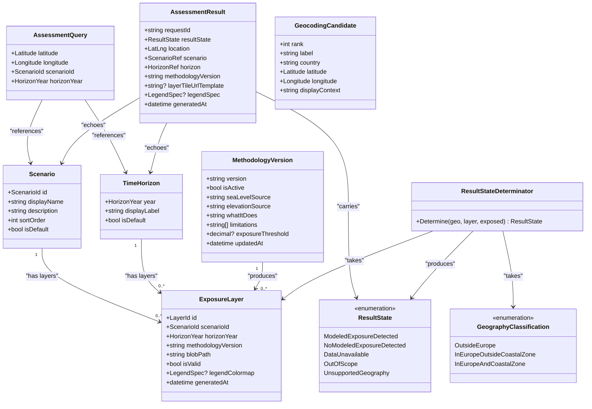

# 13 — Domain Model

> **Status:** Confirmed (core entities and rules) | Proposed Architecture (C# representations)
> **Scope:** This document defines the domain entities, value objects, rules, and invariants that govern the SeaRise Europe system. This is the conceptual model — independent of database schema or API wire format.

---

## 1. Domain Overview

SeaRise Europe answers one question: **"Is this coastal location projected to be exposed to sea-level rise under this scenario and time horizon?"**

The domain has three core concerns:
1. **Geography** — Is the queried location within the supported area?
2. **Data availability** — Does a valid exposure layer exist for the requested parameters?
3. **Exposure evaluation** — Does the location fall within a modeled exposure zone?

The result of combining these three concerns is a **ResultState** — one of exactly five values (BR-010).

---

## 2. Core Domain Entities

### 2.1 Scenario

A climate scenario represents a projected greenhouse gas emissions pathway.

**Domain definition:**
```
Scenario {
  id:          ScenarioId        -- unique identifier, stable (e.g. "ssp2-45")
  displayName: string            -- human-readable label
  description: string            -- CONTENT_GUIDELINES-compliant explanation
  sortOrder:   int               -- display ordering
  isDefault:   bool              -- at most one scenario is default (OQ-02, OQ-03)
}

Invariant: At most one Scenario has isDefault = true at any time.
```

**Note:** Scenario IDs are stable keys used in blob paths. They must not change after layers are generated.

---

### 2.2 TimeHorizon

A future year for which projections are available.

**Domain definition:**
```
TimeHorizon {
  year:         HorizonYear      -- 2030 | 2050 | 2100 (FR-015, confirmed)
  displayLabel: string           -- "2030", "2050", "2100"
  isDefault:    bool             -- OQ-03
}

HorizonYear = 2030 | 2050 | 2100   -- exhaustive enumeration (NOT extensible without API version bump)

Invariant: At most one TimeHorizon has isDefault = true at any time.
```

---

### 2.3 MethodologyVersion

Describes the scientific method and data sources used to compute exposure layers.

**Domain definition:**
```
MethodologyVersion {
  version:              string    -- "v1.0", "v2.0", etc.
  isActive:             bool      -- exactly one is active at any time
  seaLevelSource:       string    -- "IPCC AR6 sea-level projections"
  elevationSource:      string    -- "Copernicus DEM GLO-30"
  whatItDoes:           string    -- plain-language methodology description
  limitations:          string[]  -- "whatItDoesNotAccountFor" list
  resolutionNote:       string    -- ~30m resolution caveat
  exposureThreshold:    decimal?  -- OQ-05 (if continuous: the threshold value)
  updatedAt:            datetime
}

Invariant: Exactly one MethodologyVersion has isActive = true at any time.
Invariant: Past MethodologyVersions are never deleted (NFR-021).
```

---

### 2.4 ExposureLayer

Represents a precomputed geospatial exposure raster for a specific (scenario, horizon, methodology) combination.

**Domain definition:**
```
ExposureLayer {
  id:                  LayerId
  scenarioId:          ScenarioId
  horizonYear:         HorizonYear
  methodologyVersion:  string
  blobPath:            string          -- path within Azure Blob Storage container
  isValid:             bool            -- true only after pipeline QA passes
  legendColormap:      LegendSpec?     -- colormap for tile rendering
  generatedAt:         datetime
}

Invariant: At most one ExposureLayer per (scenarioId, horizonYear, methodologyVersion) combination.
Invariant: Only layers with isValid = true are served to users.
```

**Relationship:** `ExposureLayer` is the bridge between structured data (PostgreSQL) and geospatial data (COG in Blob Storage). The API uses `ExposureLayer.blobPath` to query TiTiler.

---

### 2.5 AssessmentQuery (Value Object)

The input to an exposure assessment.

**Domain definition:**
```
AssessmentQuery {
  latitude:   Latitude    -- float, -90 to 90
  longitude:  Longitude   -- float, -180 to 180
  scenarioId: ScenarioId
  horizonYear: HorizonYear
}

Latitude  = float in [-90, 90]
Longitude = float in [-180, 180]

Invariant: Coordinates are validated at system boundary (HTTP layer). Domain never receives invalid coordinates.
Privacy rule: AssessmentQuery is never persisted and never logged with coordinates (NFR-007, BR-016).
```

---

### 2.6 GeographyClassification (Value Object)

The result of checking an AssessmentQuery's location against known geography boundaries.

**Domain definition:**
```
GeographyClassification =
  | OutsideEurope                  -- ST_Within(point, europe_boundary) = false
  | InEuropeOutsideCoastalZone     -- in Europe, but outside coastal_analysis_zone
  | InEuropeAndCoastalZone         -- in Europe AND in coastal_analysis_zone
```

**Note:** `InEuropeOutsideCoastalZone` maps to `OutOfScope` result state. `OutsideEurope` maps to `UnsupportedGeography`. Only `InEuropeAndCoastalZone` proceeds to layer resolution and exposure evaluation.

---

### 2.7 ResultState (Value Object — Fixed Enum)

The single output of the assessment pipeline. Defined by BR-010. **Fixed and exhaustive.**

```
ResultState =
  | ModeledExposureDetected       -- coastal, layer exists, pixel value indicates exposure
  | NoModeledExposureDetected     -- coastal, layer exists, pixel value indicates no exposure
  | DataUnavailable               -- coastal, no valid layer for this scenario+horizon+version
  | OutOfScope                    -- European but outside coastal analysis zone
  | UnsupportedGeography          -- not in Europe
```

**Invariant:** The API must never return a `resultState` string outside this set (BR-010). `ResultStateDeterminator` is the only place that produces `ResultState` values.

---

### 2.8 AssessmentResult (Entity — Output)

The complete output of a successful assessment.

**Domain definition:**
```
AssessmentResult {
  requestId:            string          -- correlation ID (NFR-013)
  resultState:          ResultState     -- one of the 5 fixed states
  location:             LatLng          -- echoed from request
  scenario:             ScenarioRef     -- id + displayName (FR-020)
  horizon:              HorizonRef      -- year + displayLabel (FR-020)
  methodologyVersion:   string          -- always present (FR-035)
  layerTileUrlTemplate: string?         -- non-null iff ModeledExposureDetected (FR-021)
  legendSpec:           LegendSpec?     -- non-null iff ModeledExposureDetected (FR-029)
  generatedAt:          datetime
}

Invariant: methodologyVersion is always present.
Invariant: scenario and horizon are always present.
Invariant: layerTileUrlTemplate is non-null iff resultState == ModeledExposureDetected.
```

---

### 2.9 GeocodingCandidate (Value Object — Input)

A geocoded location candidate returned from the geocoding provider.

```
GeocodingCandidate {
  rank:           int       -- 1-based, preserves provider order (BR-006)
  label:          string    -- "Amsterdam, North Holland, Netherlands"
  country:        string    -- ISO 3166-1 alpha-2 ("NL")
  latitude:       Latitude
  longitude:      Longitude
  displayContext: string    -- "North Holland, Netherlands" — disambiguates duplicates (BR-009)
}

Invariant: At most 5 candidates returned (BR-007).
Invariant: Rank order preserves provider ranking (BR-006).
```

---

## 3. Domain Rules (Business Rules → Domain Invariants)

| BR | Rule | Enforced By |
|---|---|---|
| BR-006 | Geocoding candidate rank order preserved | `GeocodingAdapter` in Infrastructure |
| BR-007 | At most 5 geocoding candidates returned | `GeocodingAdapter.Truncate(5)` |
| BR-008 | Query string 1–200 characters | HTTP validation before domain |
| BR-009 | Candidates include enough context to disambiguate | `displayContext` field always populated |
| BR-010 | ResultState is one of 5 fixed values | `ResultStateDeterminator` (pure function) |
| BR-011 | Result state determined by geography → layer → exposure | `ResultStateDeterminator` switch expression |
| BR-014 | DataUnavailable — no substitution of another combination | `AssessmentService`: returns `DataUnavailable` immediately; no fallback lookup |
| BR-015 | methodologyVersion always present in result | `AssessmentResult` constructor requires it |
| BR-016 | Raw addresses never persisted | Domain never stores `AssessmentQuery.rawQuery` |

---

## 4. Domain Model Diagram



---

## 5. Assessment Pipeline — Domain Flow

```
AssessmentQuery (lat, lng, scenarioId, horizonYear)
    │
    ▼
[GeographyClassification]
    │ OutsideEurope ──────────────────────────────► UnsupportedGeography
    │ InEuropeOutsideCoastalZone ─────────────────► OutOfScope
    │ InEuropeAndCoastalZone
    │
    ▼
[ExposureLayer? = LayerResolver(scenarioId, horizonYear, activeVersion)]
    │ null (no valid layer) ──────────────────────► DataUnavailable
    │ ExposureLayer found
    │
    ▼
[bool = ExposureEvaluator(lat, lng, layer)]
    │ true ───────────────────────────────────────► ModeledExposureDetected
    │ false ──────────────────────────────────────► NoModeledExposureDetected
    │
    ▼
AssessmentResult (resultState, methodologyVersion, scenario, horizon, layerTileUrlTemplate?, legendSpec?)
```

This flow is the canonical translation of BR-010, BR-011, and BR-014 into executable logic.

---

## 6. Frontend Domain Types (TypeScript)

The frontend mirrors the backend domain model in TypeScript for type safety:

```typescript
// Result state — exact string enum matching BR-010
type ResultState =
  | 'ModeledExposureDetected'
  | 'NoModeledExposureDetected'
  | 'DataUnavailable'
  | 'OutOfScope'
  | 'UnsupportedGeography'

// Assessment result from API
interface AssessmentResult {
  requestId: string
  resultState: ResultState
  location: { latitude: number; longitude: number }
  scenario: { id: string; displayName: string }
  horizon: { year: number; displayLabel: string }
  methodologyVersion: string
  layerTileUrlTemplate: string | null    // non-null iff ModeledExposureDetected
  legendSpec: LegendSpec | null          // non-null iff ModeledExposureDetected
  generatedAt: string                    // ISO 8601
}

// Type guard — used by ResultPanel to narrow resultState
function isExposureDetected(result: AssessmentResult): result is AssessmentResult & {
  layerTileUrlTemplate: string;
  legendSpec: LegendSpec;
} {
  return result.resultState === 'ModeledExposureDetected'
}

// Geocoding candidate
interface GeocodingCandidate {
  rank: number
  label: string
  country: string
  latitude: number
  longitude: number
  displayContext: string
}
```

**Invariant in TypeScript:** `layerTileUrlTemplate` is typed as `string | null`. The `isExposureDetected` type guard narrows it to `string` — the ExposureLayer component only mounts when this guard passes. This prevents the exposure layer from rendering without a valid tile URL.

---

## 7. Ubiquitous Language Glossary

| Term | Definition |
|---|---|
| **Scenario** | A climate emissions pathway (e.g., SSP2-4.5). Determines projected sea-level rise magnitude. |
| **Time horizon** | A future year (2030, 2050, or 2100) for which projections are computed. |
| **Exposure layer** | A precomputed binary raster showing which locations are modeled to be exposed under a specific scenario+horizon+methodology combination. |
| **Coastal analysis zone** | The geographic area within which the application performs assessments. Locations outside this zone return `OutOfScope`. |
| **Assessment** | The process of evaluating whether a specific coordinate is exposed under given scenario and horizon. |
| **Result state** | One of five fixed strings describing the assessment outcome. Never a numeric code. |
| **Methodology version** | A string label identifying the scientific method and data sources used to compute exposure layers. |
| **Layer validity** | A flag (`layer_valid`) that gates whether a layer is served to users. Set to `true` only after pipeline QA. |
| **Geography boundary** | A stored geometry (MULTIPOLYGON) used for server-side spatial containment checks. |
| **COG** | Cloud-Optimized GeoTIFF. A GeoTIFF variant structured for efficient HTTP range request reading. |
| **Tile URL template** | A URL with `{z}/{x}/{y}` placeholders used by MapLibre to fetch map tiles from TiTiler. |
| **displayContext** | The administrative context portion of a geocoding candidate label (e.g., "North Holland, Netherlands") used to disambiguate same-named places. |
