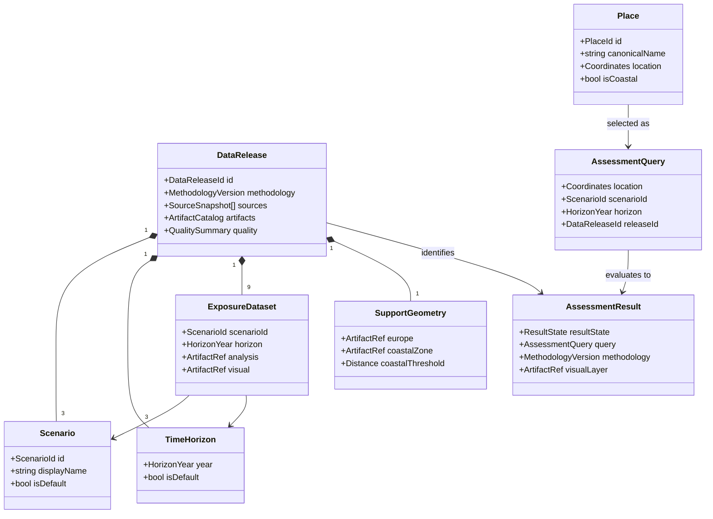
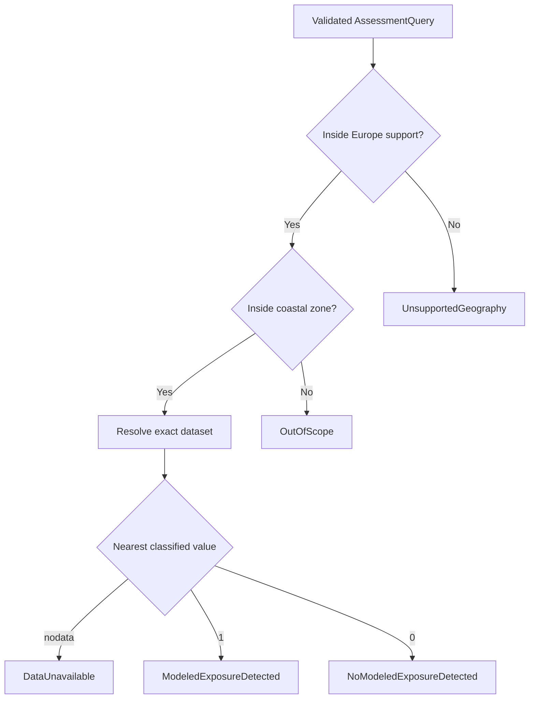

# 13 — Domain Model

> **Status:** Accepted
> **Decision:** [ADR-021 — Static-First Offline Geospatial Architecture](adr/ADR-021-static-first-offline-geospatial-architecture.md)
> **Scope:** Browser and pipeline domain contracts, independent of UI, hosting provider, and storage layout

## Domain question

SeaRise Europe answers:

> Is this supported coastal coordinate modeled as exposed to sea-level rise
> under the selected scenario and time horizon in this data release?

The answer is a classification derived from precomputed scientific artifacts.
It is not a flood probability, a property-level forecast, a safety guarantee,
or an adaptation recommendation.

The domain has four concerns:

1. **Release identity** — which immutable data and methodology are in use?
2. **Geography** — is the coordinate supported and within coastal scope?
3. **Data availability** — is the classified scientific value available at
   that coordinate?
4. **Exposure classification** — is the exact value exposed or not exposed?

## Aggregate and entity overview


```mermaid
classDiagram
    class DataRelease {
        +DataReleaseId id
        +MethodologyVersion methodology
        +SourceSnapshot[] sources
        +ArtifactCatalog artifacts
        +QualitySummary quality
    }
    class Scenario {
        +ScenarioId id
        +string displayName
        +bool isDefault
    }
    class TimeHorizon {
        +HorizonYear year
        +bool isDefault
    }
    class ExposureDataset {
        +ScenarioId scenarioId
        +HorizonYear horizon
        +ArtifactRef analysis
        +ArtifactRef visual
    }
    class SupportGeometry {
        +ArtifactRef europe
        +ArtifactRef coastalZone
        +Distance coastalThreshold
    }
    class Place {
        +PlaceId id
        +string canonicalName
        +Coordinates location
        +bool isCoastal
    }
    class AssessmentQuery {
        +Coordinates location
        +ScenarioId scenarioId
        +HorizonYear horizon
        +DataReleaseId releaseId
    }
    class AssessmentResult {
        +ResultState resultState
        +AssessmentQuery query
        +MethodologyVersion methodology
        +ArtifactRef visualLayer
    }

    DataRelease "1" *-- "3" Scenario
    DataRelease "1" *-- "3" TimeHorizon
    DataRelease "1" *-- "9" ExposureDataset
    DataRelease "1" *-- "1" SupportGeometry
    ExposureDataset --> Scenario
    ExposureDataset --> TimeHorizon
    Place --> AssessmentQuery : selected as
    AssessmentQuery --> AssessmentResult : evaluates to
    DataRelease --> AssessmentResult : identifies
```

## Core types

### DataRelease

An immutable, complete, reproducible data product. The manifest is its public
serialized representation.

```text
DataRelease {
  id:                   DataReleaseId
  methodology:          MethodologyVersion
  builtAt:              Instant
  gitCommit:            GitCommit
  scenarios:            Scenario[3]
  horizons:             TimeHorizon[3]
  exposureDatasets:     ExposureDataset[9]
  supportGeometry:      SupportGeometry
  settlementCatalog:    SettlementCatalogRef
  sources:              SourceSnapshot[]
  artifacts:            ArtifactCatalog
  quality:              QualitySummary
  previousReleaseId:    DataReleaseId?
}
```

Invariants:

- `id` is stable and appears in every artifact/cache namespace.
- The release contains exactly one validated dataset for each of the nine
  scenario/horizon combinations.
- Source versions, licences, checksums, processing parameters, artifact hashes,
  and the code revision are present.
- A published release is never modified in place.
- The browser never combines domain objects from different releases.

### Scenario

```text
ScenarioId = "ssp1-26" | "ssp2-45" | "ssp5-85"

Scenario {
  id:          ScenarioId
  displayName: string
  description: string
  sortOrder:   integer
  isDefault:   boolean
}
```

Exactly one scenario is default: `ssp2-45`. Scenario labels and explanations
come from the release, but stable IDs drive lookup and URL state.

### TimeHorizon

```text
HorizonYear = 2030 | 2050 | 2100

TimeHorizon {
  year:       HorizonYear
  label:      string
  isDefault:  boolean
}
```

Exactly one horizon is default: `2050`.

### MethodologyVersion

```text
MethodologyVersion {
  id:                    string
  projectionSource:      SourceRef
  elevationSource:       SourceRef
  coastalGeometrySource: SourceRef
  classificationRule:    string
  coordinateReference:   string
  verticalDatum:         string
  resolution:            string
  limitations:           string[]
}
```

The version identifies the complete scientific method, not only the UI copy.
Changing data interpretation, coastal connectivity, vertical datum, or the
classification algorithm requires a new methodology version and release.

### ExposureDataset

One precomputed scientific dataset and one visual representation for a
scenario/horizon pair.

```text
ExposureDataset {
  scenarioId:       ScenarioId
  horizon:          HorizonYear
  methodology:      MethodologyVersionId
  analysisArtifact: ArtifactRef    // exact classified lookup, normally COG
  visualArtifact:   ArtifactRef    // map rendering, normally PMTiles
  legend:           LegendSpec
  bounds:           BoundingBox
}
```

The analysis and visual artifacts are two views of the same classified source
array. A scientific result must not be inferred from a visual colour or an
interpolated value.

### ArtifactRef

```text
ArtifactRef {
  href:       ReleaseRelativeUrl
  mediaType:  string
  roles:      string[]
  byteSize:   integer
  sha256:     Sha256
  bounds:     BoundingBox?
}
```

URLs are resolved relative to the validated release manifest. Domain code does
not construct provider-specific bucket URLs.

### Coordinates and selection

```text
Latitude  = finite number in [-90, 90]
Longitude = finite number in [-180, 180]

Coordinates {
  latitude:  Latitude
  longitude: Longitude
}

Selection {
  location:      Coordinates
  scenarioId:    ScenarioId
  horizon:       HorizonYear
  dataReleaseId: DataReleaseId
}
```

Invalid or non-finite coordinates are input-validation failures. They are not
`UnsupportedGeography`.

### Place

A normalized GeoNames populated-place record used for local search and for
creating a `Selection`.

```text
Place {
  id:                    PlaceId
  canonicalName:         string
  asciiName:             string
  alternateNames:        string[]
  countryCode:           ISO3166Alpha2
  admin1Code:            string?
  admin1Name:            string?
  location:              Coordinates
  population:            non-negative integer?
  featureCode:           SupportedPopulatedPlaceCode
  distanceToCoastMeters: non-negative number
  isCoastal:             boolean
  sourceUpdatedAt:       LocalDate?
}
```

`isCoastal` is derived from the versioned coastal analysis zone. It is not
inferred from a name. The catalog contains:

- `europe-core`: active places with population at least 500 plus national and
  administrative capitals, enabling meaningful inland search;
- `europe-coastal`: every active place within the coastal zone, with no
  population threshold.

Qualifying records are defined by the pinned source and methodology; the
product does not claim that GeoNames contains every real-world settlement.

### GeographyClassification

```text
GeographyClassification =
  | OutsideEurope
  | InEuropeOutsideCoastalZone
  | InEuropeAndCoastalZone
```

Europe support is evaluated before coastal scope. Both geometries belong to the
same data release as the selected exposure dataset.

### ClassifiedValue

```text
ClassifiedValue = Exposed | NotExposed | NoData
```

The reader uses exact nearest-neighbour semantics. Bilinear interpolation and
display-colour sampling are forbidden for this binary classification.

### ResultState

The result vocabulary is fixed and exhaustive:

```text
ResultState =
  | ModeledExposureDetected
  | NoModeledExposureDetected
  | DataUnavailable
  | OutOfScope
  | UnsupportedGeography
```

Meanings:

| Result state | Meaning |
|---|---|
| `ModeledExposureDetected` | Supported coastal coordinate; classified value is exposed for the selected scenario/horizon/release. |
| `NoModeledExposureDetected` | Supported coastal coordinate; classified value is not exposed for the selected scenario/horizon/release. |
| `DataUnavailable` | Supported coastal coordinate; the scientific artifact contains nodata or explicitly unavailable data at that coordinate. |
| `OutOfScope` | Coordinate is within the Europe support geometry but outside the versioned coastal analysis zone. |
| `UnsupportedGeography` | Coordinate is outside the Europe support geometry. |

The final two values are normal domain outcomes. `DataUnavailable` describes
scientific coverage, not an HTTP, cache, schema, or decoding failure.

### AssessmentQuery and AssessmentResult

```text
AssessmentQuery {
  location:      Coordinates
  scenarioId:    ScenarioId
  horizon:       HorizonYear
  dataReleaseId: DataReleaseId
}

AssessmentResult {
  query:              AssessmentQuery
  resultState:        ResultState
  methodologyVersion: MethodologyVersionId
  evaluatedAt:        Instant
  analysisArtifact:   ArtifactRef?
  visualArtifact:     ArtifactRef?
  legend:             LegendSpec?
}
```

The result always echoes the complete selection and methodology version.
Artifact references are present only when appropriate to the outcome and
presentation. They always belong to the same release.

## Assessment rules

The domain function is deterministic for a release:

```text
assess(query, release):
  require query.releaseId == release.id
  require valid coordinates, scenario, and horizon

  geography = classify(query.location, release.supportGeometry)

  if geography == OutsideEurope:
    return UnsupportedGeography

  if geography == InEuropeOutsideCoastalZone:
    return OutOfScope

  dataset = release.dataset(query.scenarioId, query.horizon)
  value = readNearestClassifiedValue(dataset.analysisArtifact, query.location)

  if value == NoData:
    return DataUnavailable
  if value == Exposed:
    return ModeledExposureDetected
  if value == NotExposed:
    return NoModeledExposureDetected
```

No alternative scenario, horizon, layer, or release is substituted. Missing or
corrupt required artifacts make the release invalid or cause a technical
runtime error; they do not change the scientific answer.

## Domain flow


```mermaid
flowchart TD
    Q[Validated AssessmentQuery]
    E{Inside Europe support?}
    C{Inside coastal zone?}
    D[Resolve exact dataset]
    P{Nearest classified value}
    UG[UnsupportedGeography]
    OS[OutOfScope]
    DU[DataUnavailable]
    ME[ModeledExposureDetected]
    NM[NoModeledExposureDetected]

    Q --> E
    E -- No --> UG
    E -- Yes --> C
    C -- No --> OS
    C -- Yes --> D --> P
    P -- nodata --> DU
    P -- 1 --> ME
    P -- 0 --> NM
```

## Search ranking contract

Search returns `Place` values; it does not assess them. Ranking is deterministic
within one release:

1. exact canonical name;
2. exact alternate/localized name;
3. prefix;
4. fuzzy match;
5. population and administrative importance as tie-breakers;
6. coastal proximity as the final tie-breaker.

Normalization is accent-insensitive while display names preserve source
spelling. Country and first-level administration are always available for
disambiguation where the source provides them.

## Release consistency rules

- Manifest, config, indexes, geometries, analysis layers, visual layers, and
  methodology form one release aggregate.
- Cache keys include `dataReleaseId`.
- An active session never follows a mutable pointer to a different release.
- Rollback selects an earlier complete aggregate; it does not edit objects.
- Release publication is allowed only when the aggregate has all nine datasets,
  valid contracts, checksums, source licences, and passing scientific QA.

## Technical errors outside the domain vocabulary

The browser presents technical failures separately from `ResultState`, for
example:

- network or offline cache miss;
- invalid manifest or release mismatch;
- missing artifact or unsupported byte-range response;
- checksum, parse, or decoding failure;
- unsupported browser capability;
- aborted or superseded evaluation.

An aborted/superseded evaluation normally produces no user-visible error. Its
result is discarded because it no longer matches the current selection token.

## Privacy invariants

- `AssessmentQuery` and search text are not persisted or sent to a
  project-controlled server.
- Shared URLs may contain coordinates only because the visitor explicitly
  chooses to share or retain that URL.
- Public caches contain release artifacts, never per-user domain records.
- Future analytics must not capture raw search queries or coordinates without a
  separate privacy decision.

## Ubiquitous language

| Term | Definition |
|---|---|
| Assessment | Deterministic classification of one selection against one immutable release. |
| Modeled exposure | Binary output of the published scientific method; not observed flooding or probability. |
| Europe support geometry | Versioned boundary deciding whether a coordinate is supported. |
| Coastal analysis zone | Versioned product-scope geometry; initially the documented 25 km approximation pending source validation. |
| Data release | Immutable aggregate of artifacts, metadata, source records, quality evidence, and methodology. |
| Analysis artifact | Lossless artifact used for exact classified lookup. |
| Visual artifact | Map-optimized representation used for display. |
| Settlement catalog | Versioned, normalized set of qualifying GeoNames populated places. |
| Domain result | One of the five fixed `ResultState` values. |
| Technical error | Delivery or execution failure that must never be disguised as a domain result. |

## Migration note

The current C# API types and database entities are implementation artifacts of
the superseded runtime architecture. Parity fixtures may reuse their values
during migration, but the accepted domain contract is the release-scoped model
above. It has no request ID, API response, database identity, blob-storage
record, or TiTiler URL as a domain requirement.
