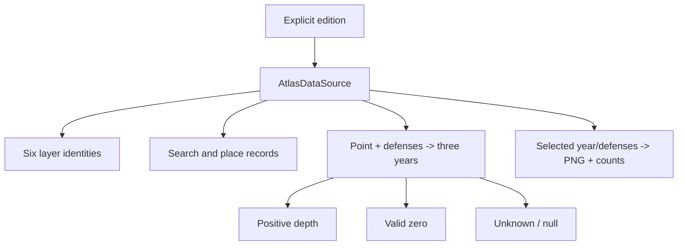

# 13 — Domain Model

> **Status:** Implemented types and rules, reviewed 2026-10-04.
> The atlas depth contract and retained AR6 projection contract are independent.

## Atlas domain

Authoritative types and exact-field validators are in
[`browser-data-contract.ts`](../../src/web/src/atlas/browser-data-contract.ts).

| Type | Meaning and invariants |
|---|---|
| `AtlasEdition` | `synthetic-fixture` or `real-local`; chosen by entry, never by response failure |
| `AtlasCatalogV1` | `coastal-atlas-browser-v1`, explicit edition/source/bounds, SSP585, spring high tide, 25 m cell-size label, all six unique layers |
| `AtlasLayerV1` | ID `ssp585-{year}-{protection}`, year 2030/2050/2100, protected/unprotected, available/no-valid-data |
| `AtlasPlaceV1` | Stable string ID, name, country code/name, `[longitude, latitude]` |
| `AtlasPlaceSearchV1` | At most 12 unique places plus total corpus count |
| `AtlasInspectionV1` | Exact requested point and defenses, 25 m cell size, one result per supported year |
| `AtlasPointResultV1` | `flooded` with finite positive depth, `zero` with 0, `unknown` with null |
| `AtlasTileCountsV1` | Nonnegative integer valid/flood pixel counts; flooded <= valid <= 256 × 256 |

Atlas coordinates must be finite, longitude within ±180 and latitude within
±85. View URL parsing uses the narrower Europe navigation envelope and camera
limits in [`model.ts`](../../src/web/src/atlas/model.ts). Source storage paths,
hashes, receipts and byte counts do not belong in the browser catalog.

```mermaid
flowchart TD
    Edition[Explicit edition] --> Source[AtlasDataSource]
    Source --> Catalog[Six layer identities]
    Source --> Places[Search and place records]
    Source --> Inspect[Point + defenses -> three years]
    Source --> Tiles[Selected year/defenses -> PNG + counts]
    Inspect --> Flooded[Positive depth]
    Inspect --> Zero[Valid zero]
    Inspect --> Unknown[Unknown / null]
```

In real-local mode, inspection samples the containing native 25 m EPSG:3035
cell. When multiple sources provide valid nonnegative values, Python selects
the maximum for that year. No valid value produces unknown. Tiles warp for
display and preserve a separate validity mask. Neither map color nor detailed
basemap geometry is point-value authority.

The fixture supplies illustrative values over a bounded grid. Its 25 m contract
label does not make it a measured CoCliCo source. `AtlasDataSourceError` is a
technical failure outside `flooded`/`zero`/`unknown`; unknown is not a catch-all
for failed transport.

## Retained AR6 domain

The implemented definitions live in
[`domain/release.ts`](../../src/web/src/domain/release.ts),
[`scientific-lookup.ts`](../../src/web/src/domain/scientific-lookup.ts) and
[generated release types](../../src/web/src/contracts/generated/release-contract.ts).
These replace the former conceptual pseudotypes; there are no active C# entities.

| Type | Actual responsibility |
|---|---|
| `ReleaseContext` | Frozen browser v2 manifest, disposition, methodology, defaults, resolved artifact/dataset maps |
| `SelectedLocation` | Discriminated coordinate or settlement with coordinates and `placeId` |
| `Selection` | `location`, `scenario`, `horizon`, `dataReleaseId` |
| `ResolvedArtifact` | Validated v2 artifact plus resolved URL |
| `GeographyClassification` | Outside Europe / inside Europe outside coastal zone / inside both |
| `AssessmentResult` | Discriminated scientific outcome with release/selection/method and outcome-specific projection data |
| `AcceptedProjection` | One release identity, selection/key and completed result; sole accepted render authority |
| `TechnicalError` | Kind, code, safe message and recoverability, separate from domain outcomes |

Scenarios are `ssp1-26`, `ssp2-45`, `ssp5-85`; horizons are 2030/2050/2100;
defaults are `ssp2-45` and 2050. Methodology is
`ar6-regional-projection-v1`. Browser dispositions are `synthetic-fixture`,
`private-engineering`, `public-promoted`; these are not atlas editions or the
same vocabulary as an owner's release disposition in scientific evidence.

## AR6 outcome mapping

| Condition, in evaluation order | Scientific outcome |
|---|---|
| Coordinate outside release support geometry | `UnsupportedGeography` |
| Supported Europe point outside coastal product scope | `OutOfScope` |
| Nearest native grid location exceeds 100 km | `DataUnavailable/source-location-too-distant` |
| Any required source quantile is nodata | `DataUnavailable/source-value-nodata` |
| Complete q0.167/q0.5/q0.833 triplet at accepted source location | `ProjectionAvailable` |

Coordinate/configuration/release validation happens before that mapping.
Nearest selection uses unrounded Haversine distance and lowest source-location
ID for an exact tie. The source grid is native 1°; values are relative to the
1995–2014 baseline. There is no interpolation, alternative-location fallback,
terrain comparison or flood-depth calculation.

Fetch, range, decode, integrity and unsupported-browser failures remain
technical states. The [atomic state view](17-atomic-projection-state.md) explains
why an old accepted result cannot be relabelled with a pending selection.

## Search contracts are also separate

Atlas's local search normalizes aliases and ranks exact, prefix, then substring
matches; ties use population, name and ID. Its browser fixture uses the small
authored place set. Neither uses the AR6 Worker shard contract.

Projection [`SettlementSearchRecord`](../../src/web/src/search/types.ts) uses
`placeId`, `displayName`, `searchNames`, country/admin, population, feature code,
coastal fields and latitude/longitude. [`ranking.ts`](../../src/web/src/search/ranking.ts)
orders shard results by match tier, edit distance, population, administrative
priority, coastal distance, numeric GeoNames ID and shard tie-break. The result
merge is **core-first**, deduplicated by ID, then fills from coastal results to
the limit (10 by default); it is not a global resort of both lists.

## Identity and URL consistency

Projection selection URLs include scenario, horizon, coordinate/place and the
pinned release. Unsupported values or a release mismatch are rejected. Atlas
URLs contain year, defenses, layer visibility, city, comparison, camera and point,
but no immutable data-release pin. They restore a view against the selected
edition's current provider, not a historical dataset identity.

Both applications put selected state into URLs during interaction. Search text
is not stored as selection history. Real-local queries/points cross loopback;
projection query text stays in memory. [07](07-security-architecture.md) describes
the resulting privacy boundary without promising that URLs never reach a host.
