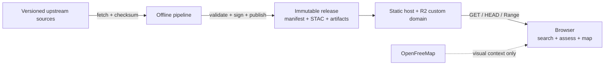

# Integration and Static Contract Patterns

> **Status:** Accepted target patterns
> **Authority:** [ADR-021](adr/ADR-021-static-first-offline-geospatial-architecture.md)

## Boundary principle

SeaRise Europe has no application API in the production request path. Its
integrations are deliberately split into:

- **build-time ingestion**, where upstream scientific and geographic sources
  are downloaded, verified, normalized, and converted;
- **release publication**, where one immutable, validated artifact set is
  uploaded and signed;
- **browser delivery**, where ordinary HTTPS static files and byte ranges are
  read from a pinned release;
- **non-authoritative visual context**, where OpenFreeMap supplies a basemap.

The release, not a service endpoint, is the integration unit.



## Integration matrix

| Boundary | Direction/time | Contract | Failure policy |
|---|---|---|---|
| IPCC AR6 | Inbound, build time | Pinned source URL/version, size, SHA-256, documented dimensions/units/licence | Fail build; never fall back to an unrecorded release |
| GeoNames + alternate names | Inbound, build time | Pinned snapshot, feature-code policy, CC BY attribution, normalized schema | Fail build or explicitly quarantine invalid rows with counts |
| Natural Earth | Inbound, build time | Pinned version/checksum and derived-geometry parameters | Fail geometry build |
| Pipeline -> release | Internal, release time | Manifest/JSON Schema, static STAC, GeoParquet schemas, PMTiles/COG validation, provenance | Block publication on any incomplete or inconsistent contract |
| CI -> R2 | Outbound, release time | New immutable prefix, least-privilege credential, checksum read-back | Leave candidate unreferenced; never overwrite production objects |
| Browser -> static site | Runtime | Versioned HTML/JS/CSS/config over HTTPS | Use valid cached shell or show availability state |
| Browser -> R2 custom domain | Runtime | `GET`, `HEAD`, byte-range `GET`, CORS, immutable caching | Use cached ranges or report missing data; never guess |
| Browser -> OpenFreeMap | Runtime, optional | MapLibre style/tile protocol and attribution | Degrade to no basemap; assessment remains independent |

No browser integration targets ASP.NET, Next.js server routes, PostgreSQL,
TiTiler, Azure Maps geocoding, or a runtime configuration service.

## Release manifest contract

`manifest.json` is the browser entry point and authoritative contract for one
`dataReleaseId`. It must be schema-versioned and contain, at minimum:

- release ID, methodology version, build time, code commit, and previous
  release ID;
- each source's authoritative URL, snapshot/version, licence, attribution,
  byte size, and SHA-256;
- pinned processing tools and scientific parameters;
- Europe support and coastal-zone rules;
- exactly nine scenario/horizon entries for `ssp1-26`, `ssp2-45`, and
  `ssp5-85` crossed with `2030`, `2050`, and `2100`;
- for every artifact: canonical URL, media type, role, byte size, bounds, and
  SHA-256;
- control-point, coverage, and data-quality summaries;
- links to STAC, SLSA-compatible provenance, and the Cosign/Sigstore bundle.

The browser rejects an unsupported schema, mismatched release ID, duplicate or
missing scenario/horizon, unsafe origin, invalid bounds, or artifact role it
does not understand. Additive optional fields are allowed within the current
schema rules; a breaking shape or semantic change increments the schema and
requires coordinated app support.

An application deployment pins one manifest URL/release ID. A short-lived
`/release.json` may support discovery or the architecture page, but it must not
silently switch scientific data inside a session.

## Artifact contracts

### Analysis and visualization

- Visual projection layers are PMTiles archives addressable with HTTP ranges.
- Exact projection lookup uses the corresponding three-band lossless analysis
  COG; PMTiles is never a scientific lookup source.
- Both representations derive from the same source-native array and share bounds,
  CRS/transform metadata, scenario, horizon, nodata, release, and checksum
  lineage.
- Lookup selects the nearest native AR6 grid location within 100 km without
  interpolation or fallback. Rendered colour is never read as a scientific value.
- Static STAC describes discovery and provenance; there is no STAC API.

### Geography and search

- Europe support and coastal-analysis geometry are versioned release artifacts.
- `europe-core` contains qualifying populated places with population >= 500
  plus national/administrative capitals, so inland search can return
  `OutOfScope`.
- `europe-coastal` retains all qualifying active populated places inside the
  coastal analysis zone without a population threshold.
- Normalized place records use stable numeric IDs and include canonical/ASCII/
  alternate names, country/admin, coordinates, population, feature code,
  distance to coast, coastal flag, and source update time.
- Serialized indexes are Brotli-compressed, loaded lazily, and initialized in a
  Web Worker. The normalized record schema and ranking fixtures are the public
  contract; the chosen open-source search library is replaceable.

### Configuration and methodology

Scenarios, horizons, display copy, result-state mapping, source attribution,
and methodology are versioned files in the release. Product/scientific
invariants cannot be overridden by an environment variable or mutable remote
configuration. A content change that affects interpretation requires a new data
release and, where ADR-021 requires it, a new ADR.

## HTTP delivery contract

Versioned artifacts use:

```http
Cache-Control: public, max-age=31536000, immutable
Access-Control-Allow-Origin: https://<production-site>
Access-Control-Allow-Methods: GET, HEAD
Access-Control-Allow-Headers: Range, If-Match
Access-Control-Expose-Headers: Accept-Ranges, Content-Length, Content-Range, ETag
```

The data origin must return correct `Content-Type`, `Content-Length`, `ETag`,
and `Accept-Ranges: bytes`; a valid partial request returns `206` and
`Content-Range`. HTML and a mutable discovery pointer are short-lived and
revalidated. Content-hashed application assets and release-versioned data are
immutable.

Production and preview CORS origins are explicit. Public open-data access with
`Access-Control-Allow-Origin: *` would be a product/distribution decision and
must not be introduced accidentally as a hosting workaround.

## Build-time ingestion pattern

Each upstream adapter follows the same deterministic sequence:

1. Resolve the source only from a reviewed source manifest.
2. Download into an ignored, isolated cache; never commit raw data by default.
3. Verify expected size and SHA-256 before parsing.
4. Inspect actual schema, dimensions, CRS, datum, units, nodata, and licence.
5. Normalize through a pinned toolchain without modifying the cached original.
6. Record row/pixel counts, exclusions, transformations, and warnings.
7. Produce candidate artifacts in a new release workspace.
8. Pass scientific, contract, licence, and release-diff checks.

Acquisition retries use bounded exponential backoff with jitter for transient
network/5xx failures. Authentication errors, checksum mismatch, unexpected
schema, or licence uncertainty fail immediately and require review. A cached
source may be reused only when its recorded hash matches the requested
snapshot.

## Publication pattern

Publication is append-only and two-phase:

1. Upload and verify a new immutable release prefix.
2. Deploy/activate the application build that pins that verified release.

An interrupted upload cannot affect the active app. If post-deploy smoke tests
fail, redeploy the previous application/release pair. Do not patch or overwrite
a released object; corrections receive a new `dataReleaseId` and provenance.

OpenTofu owns buckets, domains, CORS, cache policy, and publication identities.
CI owns release content and activation. Neither the browser nor a developer
workstation has publish credentials.

## Browser integration and failure semantics

The browser assessment order is stable:

1. Validate coordinates and supported geometry.
2. Return `UnsupportedGeography` outside the Europe support geometry.
3. Return `OutOfScope` inside Europe but outside the coastal zone.
4. Resolve the scenario/horizon artifact from the pinned manifest.
5. Select the nearest native AR6 grid location and read all three required
   quantiles.
6. Map a valid triplet to `ProjectionAvailable`; map excessive distance or
   source nodata to the corresponding `DataUnavailable` reason.

Technical failures do not masquerade as domain results. A missing uncached
range, malformed manifest, checksum/schema mismatch, unsupported version, or
network outage displays an explicit technical availability message. Domain
states keep the meanings defined by ADR-024.

The service worker namespaces caches by application and `dataReleaseId`.
Previously loaded core data can work offline; the app does not promise that all
nine Europe-wide layers are cached. Search and assessment remain usable without
the basemap when required authoritative artifacts are available.

## Compatibility and contract testing

Release CI and production smoke tests must cover:

- JSON Schema and STAC validation;
- exactly nine complete scenario/horizon combinations;
- artifact existence, size, SHA-256, role, bounds, and licence lineage;
- PMTiles and COG structural verification;
- public `HEAD` and beginning/middle/end range requests;
- CORS, cache, content type, ETag, and security headers;
- GeoParquet/search schema, stable IDs, valid coordinates, duplicates, feature
  codes, aliases, and deterministic ranking;
- shared Python/TypeScript coordinate-to-cell golden cases;
- browser network assertions proving zero `/assess`, `/geocode`, and `/config`
  requests;
- cached offline success and honest uncached failure;
- restore of the previous immutable application/release pair.

## Explicit non-patterns

Do not introduce:

- a “temporary” runtime API for deterministic static configuration or lookup;
- direct browser access to raw IPCC, DEM, or GeoNames source files;
- runtime fallback to a different dataset, scenario, or release;
- database or bucket polling for “latest” during a session;
- rendered pixel-colour interpretation as scientific assessment;
- silent suppression of schema, source, CORS, or range failures;
- synchronous search/index work on the UI thread;
- provider-specific Worker logic that makes static artifacts non-portable.

If a measured requirement cannot be met by these static contracts, document the
evidence and make the new runtime boundary explicit in a separate ADR.
