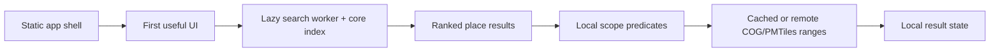

# 15 — Performance and Scalability

> **Status:** Accepted target architecture; budgets require implementation measurements
> **Source of truth:** [ADR-021](adr/ADR-021-static-first-offline-geospatial-architecture.md)

## 1. Performance model

The critical path contains no application server, geocoder, database, or tile
server. Scalability comes from immutable files, CDN/object-storage byte-range
delivery, and bounded browser work.

This changes the scaling question from “how many API/database instances are
needed?” to “how small are the initial assets, how local are the requested
ranges, and how effectively are immutable bytes cached?”

## 2. Release budgets

| Fitness function | Target |
|---|---:|
| Initial application JavaScript, Brotli | <= 250 KiB, excluding lazy map/search chunks |
| Lighthouse performance/accessibility/best-practices/SEO | >= 90 each on the agreed mobile profile |
| Search response p95 after worker initialization | < 50 ms |
| Local assessment p95 after required data is cached | < 100 ms |
| Search worker initialization on reference mobile hardware | < 1,000 ms |
| Runtime application API calls | 0 calls to `/assess`, `/geocode`, or `/config` |
| Scenario/horizon coverage | Exactly 9 complete, validated combinations |
| PMTiles/COG delivery | Every large artifact passes `HEAD` and partial `GET` |
| Manifest integrity | Schema-valid; every byte size and SHA-256 matches |
| Offline core | Shell, config, boundaries, and loaded search index work after network removal |

Budgets are CI gates, not current measurements. A dated performance report
records browser, device/CPU, network profile, cold/warm cache, release ID, and
artifact sizes. A waiver records the regression, rationale, owner, and expiry.

## 3. Initial-load strategy

The first route delivers semantic HTML, critical CSS, and the smallest useful
React bundle. It does not fetch scientific layers or the full settlement
catalog before rendering.

- split MapLibre/PMTiles, search, architecture-page, and optional analytics
  code from the initial chunk;
- load the map only when the explorer needs it;
- initialize search on focus or browser idle in a Web Worker;
- fetch `europe-core` before the larger `europe-coastal` shard;
- keep methodology/config compact and pin them to `dataReleaseId`;
- avoid decorative images and third-party scripts on the critical path;
- use local component state by default and avoid a server-state framework for
  immutable file reads.

Track compressed transfer, parsed JavaScript, main-thread execution, largest
contentful paint, interaction responsiveness, and cumulative layout shift.
Bundle size alone is not enough.

## 4. Search performance

Search work never blocks the UI thread. The build performs normalization,
alias expansion, coastal classification, and index serialization; the browser
only loads and queries the resulting index.

Performance controls:

- Brotli-compressed serialized indexes;
- core/coastal sharding and lazy initialization;
- numeric IDs and compact repeated fields;
- bounded fuzzy candidate expansion and result count;
- deterministic ranking without per-query network calls;
- transfer the index to one worker rather than copying it repeatedly;
- measure peak worker memory as well as latency.

Use multilingual, duplicate-name, and small-village fixtures when benchmarking;
a tiny best-case corpus is not representative. The first release must record
raw/compressed shard sizes, record counts, initialization p50/p95, query
p50/p95, and peak memory on the reference mobile device.

## 5. Map and assessment performance

### 5.1 Visual layers

PMTiles stores each visual layer in one immutable archive and uses HTTP byte
ranges. The build should optimize directory locality, zoom limits, tile
extent, and compression against measured map quality. MapLibre loads only the
selected scenario/horizon layer and the visible viewport.

Cancel or ignore stale range work when a user switches controls quickly. Do
not preload all nine layers. The basemap is non-authoritative: its outage may
degrade visual context but must not block a cached assessment.

### 5.2 Exact lookup

The analysis COG is read only for the block needed by the selected coordinate.
The browser:

1. resolves the pinned artifact from `manifest.json`;
2. converts longitude/latitude with the shared, golden-tested transform;
3. reads the smallest required byte range;
4. performs nearest-neighbour class lookup;
5. maps `0`, `1`, or nodata to the domain result.

Cache COG metadata and recently used blocks, but keep a bounded
least-recently-used policy. PMTiles colours are never reverse-engineered into a
scientific result.

### 5.3 Release/cache consistency

Every cache key includes `dataReleaseId`. An application session never mixes
config, geometry, index, or raster ranges from different releases. Immutable
assets receive a one-year cache lifetime; only a small release pointer may use
a short TTL and revalidation.

## 6. Scalability and cost

Static assets scale at the CDN/object-storage layer without application
autoscaling. Origin load is primarily cache misses and range requests. The
relevant capacity variables are:

- total retained release bytes;
- average range count and bytes per map/assessment interaction;
- cache-hit ratio by artifact and region;
- Class A/Class B object-storage operations;
- browser memory and persistent-cache quota;
- publish-job compute, duration, and temporary storage.

Before each release, generate a dated cost model with active/rollback release
sizes, expected traffic, requests per journey, cache assumptions, and provider
free-tier/pricing inputs. The target is EUR 0/month while Cloudflare allowances
cover the workload, excluding the domain, but architecture correctness must
not depend on an unchanged free tier.

Open formats keep scale-out portable: another provider needs static HTTPS,
CORS, `HEAD`, byte-range `GET`, and suitable cache headers. No proprietary
runtime compute is required.

## 7. Build-plane performance

Offline work is allowed to be heavy, but must remain reproducible and
operable:

- acquire each pinned source once and reuse a checksum-verified cache;
- chunk rasters to cap peak memory and expose resumable stages;
- share normalized DEM/boundary work across all nine combinations;
- use DuckDB Spatial for set-based settlement joins and GeoParquet output;
- parallelize independent scenario/horizon transforms within measured CPU,
  memory, and I/O limits;
- record per-stage wall time, peak memory, input/output bytes, and cache hits;
- do not publish partial combinations after a failed build.

Optimization never bypasses scientific validation. A faster transform that
changes values or connectivity requires review and a new methodology release.

## 8. Measurement plan

Measure four profiles separately:

| Profile | Purpose |
|---|---|
| Cold first visit | App-shell and critical-path budget |
| Search first use | Index transfer, worker initialization, memory |
| Cold assessment | Object range count/bytes and end-to-end interaction |
| Warm/offline assessment | Local calculation and cache behaviour |

Collect p50, p95, and failure rate over enough iterations after a documented
warm-up. Browser E2E must assert zero legacy application API calls. Delivery
smoke tests run from at least two European regions and verify `HEAD`, partial
`GET`, CORS, cache headers, and content integrity.

Publish the current results and artifact-size breakdown on
`/about/architecture`. Until these measurements exist, documentation must say
“target” rather than claim the budgets have been achieved.

The [Phase 0.3 regional measurement](../evidence/phase-0-regional-fixture.md)
proves exact `206` ranges and lookup mechanics only for a 143,754-byte real DEM
derivative on a loopback reference profile. It explicitly does not validate
production-network latency, mobile performance, PMTiles, or nine-layer scale;
the scientific gate blocked those measurements before class generation.

## 9. Failure and degradation rules

- If a required uncached range is unavailable, return a clear
  connectivity/data-availability state; never guess.
- If the basemap fails, preserve search and assessment and explain the visual
  degradation.
- If worker initialization exceeds its budget, keep input responsive and show
  explicit loading state.
- If a release exceeds storage or request budgets, do not silently reduce
  scientific resolution; review packaging, scope, and cost explicitly.
- If a manifest, checksum, or release identity is inconsistent, fail closed
  for assessment and retain the previous valid release.

The legacy 3.5-second API budget, database indexes, container autoscaling, and
TiTiler load tests are superseded by the browser, artifact, and delivery
budgets above.
