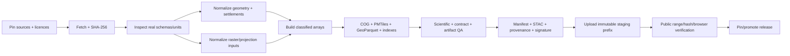

# 16 — Offline Geospatial Data Pipeline

> **Status:** Accepted target design; not yet implemented end to end with real sources
>
> **Source of truth:** [ADR-021](adr/ADR-021-static-first-offline-geospatial-architecture.md)
> **Publication warning:** the repository's current `demo.tif` and synthetic tests prove software mechanics only. They are not scientific evidence or a production data release.

## 1. Purpose

The pipeline moves expensive and stateful work out of user requests. It
downloads a pinned source snapshot once, transforms it reproducibly, validates
scientific and technical contracts, and publishes an immutable release that a
static browser application can query directly.



The pipeline may use Python, GDAL, Rasterio, rio-pmtiles, DuckDB Spatial, and
other pinned command-line tools. Its native dependencies do not run in
production.

## 2. Current implementation boundary

The current modules under `src/pipeline/` implement the legacy Azure/PostGIS/
TiTiler flow: they assume an IPCC grid, create COGs, upload to Blob Storage,
register database rows, and optionally spot-check TiTiler. That code remains a
migration input, not the target pipeline described here.

Known gaps that prohibit a production claim:

- the real IPCC AR6 source has not passed end-to-end schema and methodology
  validation in this repository;
- checked-in demo output is synthetic;
- current acquisition/alignment assumptions may not match the source's actual
  location-based dimensions;
- the checked-in 25 km coastal zone is a Natural Earth approximation;
- PMTiles, GeoNames catalogs/indexes, GeoParquet, manifest/STAC generation,
  release signing, and R2 publication are not yet the proven end-to-end path.

The target pipeline is introduced incrementally. Legacy upload/register steps
are removed only at ADR-021 Phase 4, after scientific and browser parity gates.

## 3. Inputs and pinning

| Source | Role | Pinning requirements |
|---|---|---|
| IPCC AR6 sea-level projections | Scenario/horizon projection input | Authoritative release/version, exact asset URL, size, SHA-256, citation, licence/acknowledgements |
| Copernicus DEM | Terrain input | Product edition, GLO-30 or GLO-90 decision, tiles, datum/CRS, size, SHA-256, derivative attribution |
| Copernicus coastal product or approved replacement | Canonical analysis-zone evidence | Product/version, acquisition record, interpretation rule, licence, SHA-256 |
| GeoNames dump + `alternateNamesV2` | Places and multilingual search | Snapshot date, exact dump files, sizes, SHA-256, CC BY 4.0 attribution |
| Natural Earth | Support/shoreline seed and labels | Dataset/release, layer names, public-domain provenance, SHA-256 |

Acquisition writes to an ignored cache such as `data/raw/{source}/{version}/`.
It never relies on an unversioned “latest” response without capturing the
resolved version and checksum. A second run reuses only a matching verified
file. HTML login pages, truncated ranges, unexpected media types, and checksum
mismatches fail immediately.

Before download, the build records whether the raw source and intended
derivatives may be stored, redistributed, and publicly attributed. No licence
means no publication.

## 4. Phase 0 — prove the science first

Phase 0 uses a small region that includes straightforward coast, a port or
estuary, low terrain, inland low terrain, nodata, and an island. It must:

1. Inspect the exact IPCC variables, dimensions, coordinates/locations,
   quantiles, units, and missing-value semantics.
2. Document and test the transformation from projection locations to the
   analysis grid. A regular lat/lon raster must not be assumed.
3. Inspect the DEM grid, horizontal and vertical datum, resolution, units,
   masks, voids, and resampling requirements.
4. Define the target CRS/grid and every reprojection/resampling operation.
5. Compare the current coastal approximation with the intended canonical
   coastal product.
6. Test whether the binary exposure model creates disconnected inland regions
   that should not be considered coastal exposure.
7. Compare independently reviewed control locations with array values and
   exact browser lookup.
8. Measure source, intermediate, COG, PMTiles, and index size; build time;
   browser range requests; latency; and memory.

Results and reviewer decisions are committed as methodology documentation and
machine-readable golden fixtures. If the binary model is not defensible, stop
and supersede the methodology/ADR before building Europe.

## 5. Workspace and release directories

Recommended local/CI layout:

```text
data/
├── raw/                         # ignored, checksum-verified source cache
├── work/{buildId}/              # ignored, resumable intermediates
├── geometry/                    # checked-in migration/reference fixtures
└── releases/{dataReleaseId}/    # candidate immutable release tree
```

`dataReleaseId` must be stable and unique, for example a source-date plus a
short content hash. A stage may be resumed only when its input hashes,
parameters, code version, and tool-image digest match its recorded receipt.
Partial or failed releases are never promoted.

## 6. Processing stages

### 6.1 Inspect and normalize sources

- validate expected files, variables, columns, geometry types, CRS, units, and
  ranges before transformation;
- normalize timestamps, nodata, longitude convention, field names, and text
  encoding explicitly;
- write a machine-readable inspection report and row/cell counts;
- retain source-native identifiers throughout lineage.

Unexpected source schema is a hard failure. The code must not “best effort” a
scientific interpretation.

### 6.2 Build support and coastal geometry

Use valid polygonal geometry in the chosen analysis CRS for metric operations,
then derive WGS84/browser forms. Record source layers, filters, clipping,
buffer distances, simplification tolerances, and topology repairs.

Validate:

- geometry validity and expected bounds;
- known inside/outside/boundary controls;
- islands, ports, estuaries, and transcontinental edge cases;
- area and spatial differences against the previous release;
- explicit treatment of Russia, Turkey, and other open support-boundary cases.

The current Natural Earth-derived 25 km zone is labelled `approximation` in
all candidate metadata until replaced or re-confirmed by a methodology
decision.

### 6.3 Build the settlement catalog

DuckDB Spatial performs the reproducible joins:

1. ingest pinned GeoNames places and alternate names;
2. retain active populated-place feature codes defined in ADR-021;
3. normalize canonical/ASCII/alternate names and administrative labels;
4. intersect records with the versioned Europe support geometry;
5. compute metric `distanceToCoastMeters` and `isCoastal` against the versioned
   coastal rule;
6. create `europe-core` and `europe-coastal` logical sets;
7. reconcile accepted, duplicate, and rejected counts;
8. write canonical `settlements.parquet` and deterministic serialized indexes;
9. Brotli-compress `europe-core.index.br` and `europe-coastal.index.br`.

The core set uses population >= 500 plus national/administrative capitals. The
coastal set keeps every qualifying active place in the coastal zone, including
villages with zero or missing population. Catalog membership is a statement
about the pinned GeoNames snapshot, not a claim of perfect real-world coverage.

### 6.4 Normalize projection and terrain inputs

The output grid, CRS, resolution, extent, transform, vertical reference, and
nodata rule are fixed by methodology metadata. Projection and DEM values are
converted to compatible units and references using transformations proven in
Phase 0.

Continuous values may use a scientifically approved interpolation during
normalization. The final binary class is never bilinearly/cubically resampled;
categorical reprojection and browser lookup use nearest neighbour.

### 6.5 Compute classified exposure arrays

The current methodology candidate is:

```text
classified = 1      where projected sea level >= terrain elevation
classified = 0      where projected sea level < terrain elevation
classified = nodata where inputs are unavailable or outside analysis scope
```

This formula is not considered validated until Phase 0 establishes the
projection-to-grid method, vertical compatibility, coastal masking, and
connectivity behaviour. Calculations use chunked arrays, preserve masks, and
write statistics for each of the nine scenario/horizon combinations.

### 6.6 Package scientific and visual artifacts

From the same validated class array, produce:

- a lossless analysis COG for exact lookup;
- visual PMTiles for MapLibre overlay rendering;
- browser PMTiles and analytical GeoParquet for support/coastal geometry;
- canonical settlement GeoParquet and compact search indexes.

COG validation covers tiling, overviews, compression, CRS/transform, nodata,
and class domain. PMTiles validation covers archive structure, zoom/bounds,
sample tiles, byte ranges, and parity with sampled COG classes. Rendered colour
is never a source value.

### 6.7 Generate contracts and evidence

After data QA passes, generate:

- scenario, methodology, and source-attribution JSON;
- versioned `manifest.schema.json` and valid `manifest.json`;
- a static STAC catalog, collection, and item for each relevant spatial asset;
- source/build inspection and data-quality summaries;
- SLSA-compatible `provenance.intoto.jsonl`;
- keyless Cosign/Sigstore signature bundle for the manifest/provenance
  inventory.

The final manifest is generated after artifact bytes are stable so sizes and
SHA-256 values are exact.

## 7. Release validation gates

The candidate fails unless all of these pass:

- source schemas, units, coordinates, checksums, and licences;
- exactly 3 scenarios x 3 horizons, with unique and complete layer pairs;
- approved scientific golden points and Python/browser lookup parity;
- raster statistics, topology, connectivity, nodata, and release-diff review;
- COG, PMTiles, GeoParquet, search-index, JSON Schema, and STAC validation;
- settlement reconciliation and required search ranking cases;
- manifest inventory, sizes, checksums, source/licence mappings, provenance,
  and signature verification;
- initial bundle, worker, search, assessment, Lighthouse, and offline budgets;
- zero browser calls to `/assess`, `/geocode`, or `/config`.

See [10 — Testing Strategy](10-testing-strategy.md) for fixtures and exact
fitness functions.

## 8. Staging, publication, and rollback

1. Upload to a new `releases/{dataReleaseId}/` prefix in Cloudflare R2/static
   assets; never overwrite a prior path.
2. Compare every uploaded size and hash with the local manifest.
3. Verify public `HEAD`, byte-range `GET`, `Content-Range`, `ETag`, immutable
   cache headers, and narrow CORS from the production origin.
4. Run browser smoke tests against the public candidate from at least two
   European regions.
5. Promote by deploying an application build pinned to the release, or by
   atomically changing the small release pointer.
6. Retain the prior application/release pair. Roll back by repinning it, never
   by mutating artifacts.

The target recurring infrastructure cost is zero while the workload fits the
documented Cloudflare allowances. Every candidate records total bytes,
estimated range operations, retained releases, and a dated cost model before
promotion.

## 9. Reproducibility and supply-chain rules

- Pin Python and native tool versions, lock dependencies, and record the build
  image digest.
- Record source and intermediate receipts, parameters, code commit, commands,
  timings, and output hashes.
- Make stages deterministic and side-effect free until the explicit staging
  step.
- Give publishing credentials only to the protected CI environment, with
  least-privilege write access to new release paths.
- Sign from CI with keyless identity; do not place long-lived signing keys in
  the repository.
- Never publish from an unreviewed local working tree.

## 10. Implementation sequence

1. Implement the Phase 0 regional spike and source-inspection reports.
2. Define schemas and shared Python/TypeScript golden fixtures.
3. Add DuckDB Spatial boundary/GeoNames processing and GeoParquet/index output.
4. Produce COG and PMTiles from one classified array and prove exact parity.
5. Generate manifest, static STAC, provenance, and signature bundle.
6. Publish a non-production immutable release and run public delivery tests.
7. Build all nine real-data layers and complete old/new browser parity.
8. Only then remove Azure Blob registration, PostgreSQL/PostGIS, TiTiler,
   Azurite, and the legacy pipeline branches.

This sequence keeps scientific proof ahead of presentation and makes every
portfolio claim traceable to release evidence.
