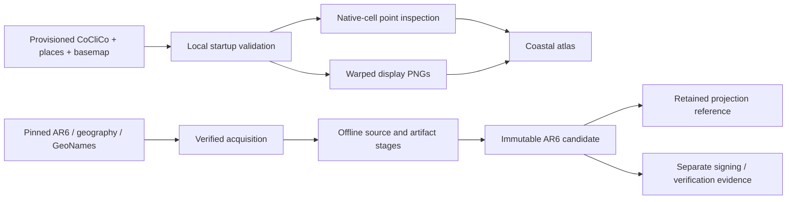

# 16 — Geospatial Data Processing

> **Status:** Implemented atlas raster adapter and retained offline AR6 pipeline,
> reviewed 2026-10-04. These are independent processing paths.

## Processing map


```mermaid
flowchart LR
    Provisioned[Provisioned CoCliCo + places + basemap] --> Verify[Local startup validation]
    Verify --> Inspect[Native-cell point inspection]
    Verify --> Tiles[Warped display PNGs]
    Inspect & Tiles --> Atlas[Coastal atlas]
    Sources[Pinned AR6 / geography / GeoNames] --> Acquire[Verified acquisition]
    Acquire --> Build[Offline source and artifact stages]
    Build --> Candidate[Immutable AR6 candidate]
    Candidate --> Browser[Retained projection reference]
    Candidate --> Evidence[Separate signing / verification evidence]
```

Neither path derives atlas flood depth by comparing relative AR6 change with
absolute terrain. The rejected binary methodology remains historical.

## Atlas source boundary

The checked-in atlas implementation consumes an existing local workspace; it
does not acquire CoCliCo rasters or construct the full place/basemap package
from a clean clone. [Node activation](../../src/web/scripts/real-local-atlas.mjs)
validates disk manifest v2, six unique SSP585 year/defense combinations, confined
TIFF paths, expected bytes, EPSG:3035 and 25 m pixel-size metadata. It emits a
separate browser-safe catalog.

[`loadRealLocalContext`](../../src/web/scripts/real-local-context.mjs) checks the
Brotli place-index size/hash, schema, count and unique IDs. Source aliases and
population remain Node search inputs; only safe place fields go to the browser.
Prepared basemap files are confined by path/media type when served.

Python verifies each unique source raster SHA-256 before readiness and rejects
conflicting identities for a reused file. No private input is copied into the
application build. Demo preflight exercises this startup; candidate preparation
also binds six external manifest/receipt identities without packaging their
large source files.

## Atlas point and tile processing

[`Atlas.inspect`](../../scripts/atlas/europe_raster_service.py) performs:

1. Validate finite longitude/latitude and supported defense setting.
2. For each of 2030, 2050 and 2100, inspect sources whose declared bounds contain
   the coordinate.
3. Require the original north-up 25 m EPSG:3035 grid; transform the point from
   WGS84 and read the containing native cell with no interpolation.
4. Keep finite, unmasked, nonnegative values. Where sources overlap, use their
   maximum valid depth.
5. Return positive depth as `flooded`, valid 0 as `zero`, no valid sample as
   `unknown`/null. Read failures propagate as technical failures.

`Atlas._render_tile` creates a 256 × 256 Web Mercator grid, selects eligible
source overviews, warps with nearest-neighbor resampling and combines overlapping
valid values by maximum. It keeps an independent validity mask. Positive depth
gets color/alpha; valid zero and unknown both appear transparent, so measured
valid/flood counts accompany every PNG.

Display overview/warp choices do not alter point inspection or the native
resolution claim. Raster work uses bounded concurrency and RAM caching;
[15](15-performance-and-scalability.md) records the actual limits. This is
request-time local raster processing, not the retained AR6 offline builder.

## Retained Python package

[`src/pipeline/searise_pipeline`](../../src/pipeline/searise_pipeline/) contains:

| Package | Current responsibility |
|---|---|
| `sources` | Source locks, verified acquisition/cache and receipts |
| `science` | AR6 readers/lookup plus retained scientific and historical no-go controls |
| `settlements` | Raw GeoNames parsing, catalogues, pinned spatial stages, coast distance, reconciliation and search projection |
| `release` | COG, GeoParquet, PMTiles, source grid, contracts, evidence, reproducibility and promotion validation |
| `offline_release` | Receipt-bound build profiles, stages, cache reuse and atomic local candidate assembly |
| `candidate_completeness` | Assembly, artifact/byte QA and complete-candidate validation |
| `supply_chain` | Tool/dependency profiles, SBOM, signing/verification/readback and evidence retention |
| `regional_fixture` | Retained regional evidence, including superseded blocked-method controls |

The package entry points are defined in
[`pyproject.toml`](../../src/pipeline/pyproject.toml). Checked-in source locks,
requirements and profile files define the exact tools for a given operation;
this is not a runtime database or a blanket claim that all profiles are
self-contained in a clean clone.

## AR6 sources and artifact rules

The source reader preserves locked archive/member identity, native locations,
scenario/horizon, units and required quantiles. The regional release contract
uses a 76 × 46 one-degree subset. Each of the nine combinations retains:

```text
band 1: q0.167, Int16 millimetres
band 2: q0.5,   Int16 millimetres
band 3: q0.833, Int16 millimetres
nodata: -32768
```

COG, analytical GeoParquet and visual PMTiles preserve source IDs and exact
integer values. Browser lookup selects the nearest native location with the
inclusive 100 km guardrail and lowest-ID ties; it does not interpolate or use
rendered color. Scientific parity and format correctness are separate checks.

Support/coastal geometry is release-scoped product scope, not flood reach.
The retained settlement path validates raw GeoNames/alternate-name inputs,
normalizes eligible places, performs pinned spatial classification and shoreline
distance work, reconciles accepted/rejected records, and publishes GeoParquet
plus serialized browser indexes. Core membership uses population >=500 or
administrative/national capitals; coastal membership uses the versioned coastal
zone without a population threshold. Actual source contracts and anomaly
policies live beside the implementation, not in atlas's simpler place schema.

## Offline build graph

[`StageName`](../../src/pipeline/searise_pipeline/offline_release/model.py)
defines the implemented ordered graph:

```text
verify-sources → inspect → normalize → derive → package → validate → assemble-release
```

[`profiles.py`](../../src/pipeline/searise_pipeline/offline_release/profiles.py)
compiles fixture, regional and full-Europe profiles, with explicit fixture-ready
or controlled-input-required availability. The engine binds inputs, parameters,
code and tools to receipts before cache reuse. It validates stage outputs and
atomically assembles a new local candidate; failures do not promote partial
candidates. The pinned offline build runner keeps execution separate from source
acquisition and public publication.

The v1 offline release and v2 browser derivation retain separate schemas and
identities. The ordinary web build copies committed fixture payloads/overlay;
it does not run a full source build. See [05](05-data-architecture.md).

## Validation and promotion

Required evidence is owned by the executable scientific, artifact, candidate
and supply-chain validators: source hashes/rights, exact matrix and values,
format integrity, settlement reconciliation, manifest inventory, receipts and
reproducibility. Browser tests add lookup, range delivery and resource authority.

Protected workflows exist for offline builds, keyless signing and owner
promotion. Building a candidate or obtaining a signature does not independently
authorize public atlas hosting or source redistribution. Public readback and
approval remain separate gates. [The builder runbook](../operations/offline-release-builder.md)
and [source acquisition guide](../delivery/source-acquisition.md) give exact
operator procedures.

AR6 Phase 0R recovery approval is recorded; the old runtime removal is complete.
There is no remaining implementation step to register blobs in a database or
retire TiTiler after building these artifacts. Git history and immutable evidence
preserve those past transitions. Atlas public acquisition/distribution and
scientific qualification remain open under ADR-028.
