# UML System Architecture

| Field | Value |
|---|---|
| **Document** | UML System Architecture Diagrams |
| **Version** | 0.1-draft |
| **Last Updated** | 2026-03-31 |
| **Status** | Draft |

> All diagrams use Mermaid notation. Render with any Mermaid-compatible viewer (GitHub, VS Code preview, mermaid.live).

---

## Table of Contents

1. [System Context Diagram](#1-system-context-diagram)
2. [Container Diagram](#2-container-diagram)
3. [Component Diagram — API](#3-component-diagram--api)
4. [Component Diagram — Frontend](#4-component-diagram--frontend)
5. [Class Diagram — Domain Model](#5-class-diagram--domain-model)
6. [Class Diagram — Infrastructure Interfaces](#6-class-diagram--infrastructure-interfaces)
7. [Sequence Diagram — Assessment Happy Path](#7-sequence-diagram--assessment-happy-path)
8. [Sequence Diagram — Geocoding Flow](#8-sequence-diagram--geocoding-flow)
9. [Sequence Diagram — Scenario/Horizon Change](#9-sequence-diagram--scenariohorizon-change)
10. [State Machine — Frontend Application Phase](#10-state-machine--frontend-application-phase)
11. [Deployment Diagram](#11-deployment-diagram)
12. [Activity Diagram — Offline Geospatial Pipeline](#12-activity-diagram--offline-geospatial-pipeline)
13. [Package Diagram — Layered Architecture](#13-package-diagram--layered-architecture)

---

## 1. System Context Diagram

Shows SeaRise Europe and its external actors and systems.

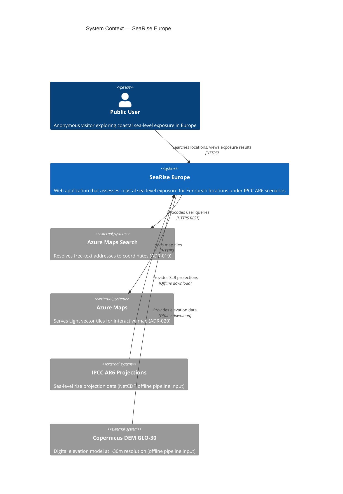

---

## 2. Container Diagram

Shows the runtime containers, managed services, and their interactions.

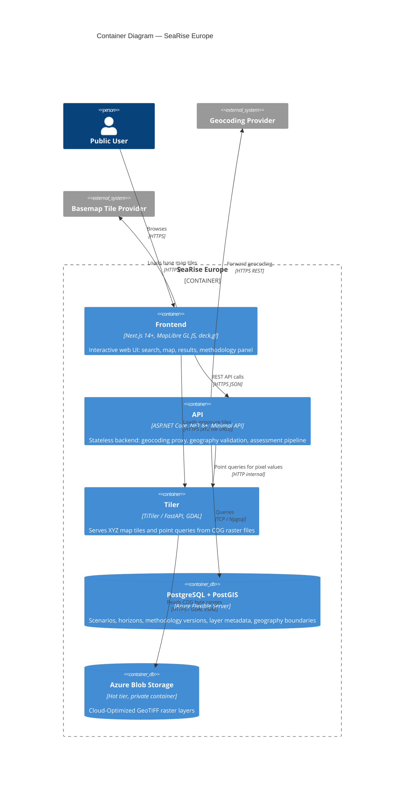

---

## 3. Component Diagram — API

Shows the internal layered architecture of the ASP.NET Core API container.

```mermaid
classDiagram
    direction TB

    namespace HTTP_Layer {
        class GeocodeEndpoint {
            +POST /v1/geocode(query)
        }
        class AssessEndpoint {
            +POST /v1/assess(lat, lng, scenarioId, horizonYear)
        }
        class ConfigEndpoints {
            +GET /v1/config/scenarios
            +GET /v1/config/methodology
        }
        class HealthEndpoint {
            +GET /health
        }
    }

    namespace Application_Layer {
        class GeocodingOrchestrator {
            +GeocodeAsync(query) GeocodingResponse
        }
        class AssessmentService {
            +AssessAsync(query) AssessmentResult
        }
    }

    namespace Domain_Layer {
        class ResultStateDeterminator {
            +Determine(geography, layer, isExposed) ResultState
        }
        class GeographyClassification {
            <<enumeration>>
            OutsideEurope
            InEuropeOutsideCoastalZone
            InEuropeAndCoastalZone
        }
        class ResultState {
            <<enumeration>>
            ModeledExposureDetected
            NoModeledExposureDetected
            DataUnavailable
            OutOfScope
            UnsupportedGeography
        }
    }

    namespace Infrastructure_Layer {
        class PostGisGeographyRepository {
            +IsWithinEuropeAsync(lat, lng) bool
            +IsWithinCoastalZoneAsync(lat, lng) bool
        }
        class LayerResolver {
            +ResolveAsync(scenarioId, horizonYear) ExposureLayer?
        }
        class ExposureEvaluator {
            +IsExposedAsync(lat, lng, layer) bool
        }
        class GeocodingServiceImpl {
            +GeocodeAsync(query) List~GeocodingCandidate~
        }
    }

    GeocodeEndpoint --> GeocodingOrchestrator
    AssessEndpoint --> AssessmentService
    GeocodingOrchestrator --> GeocodingServiceImpl
    AssessmentService --> PostGisGeographyRepository
    AssessmentService --> LayerResolver
    AssessmentService --> ExposureEvaluator
    AssessmentService --> ResultStateDeterminator
```

---

## 4. Component Diagram — Frontend

Shows the key frontend components and their relationships.

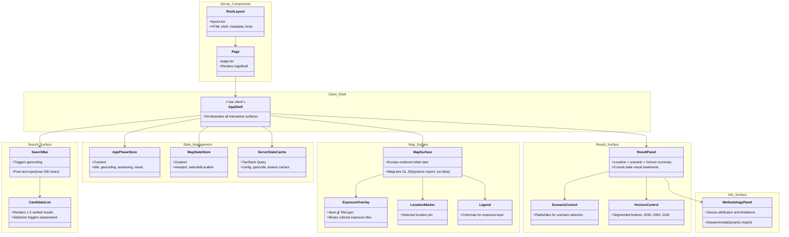

---

## 5. Class Diagram — Domain Model

Shows all domain entities, value objects, and enumerations with their attributes.

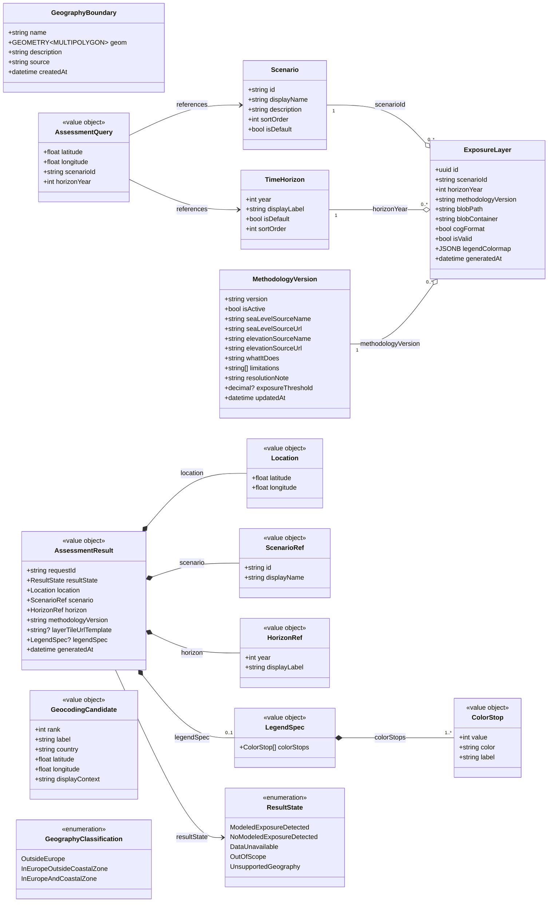

---

## 6. Class Diagram — Infrastructure Interfaces

Shows the dependency inversion between domain and infrastructure layers.

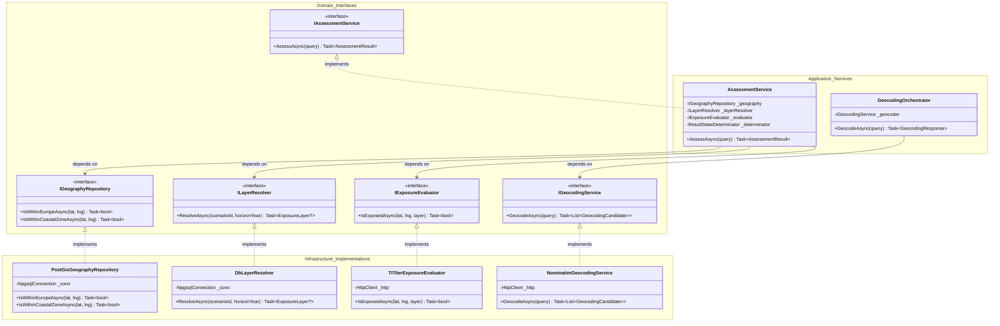

---

## 7. Sequence Diagram — Assessment Happy Path

Full assessment flow for a valid coastal European location with exposure detected.

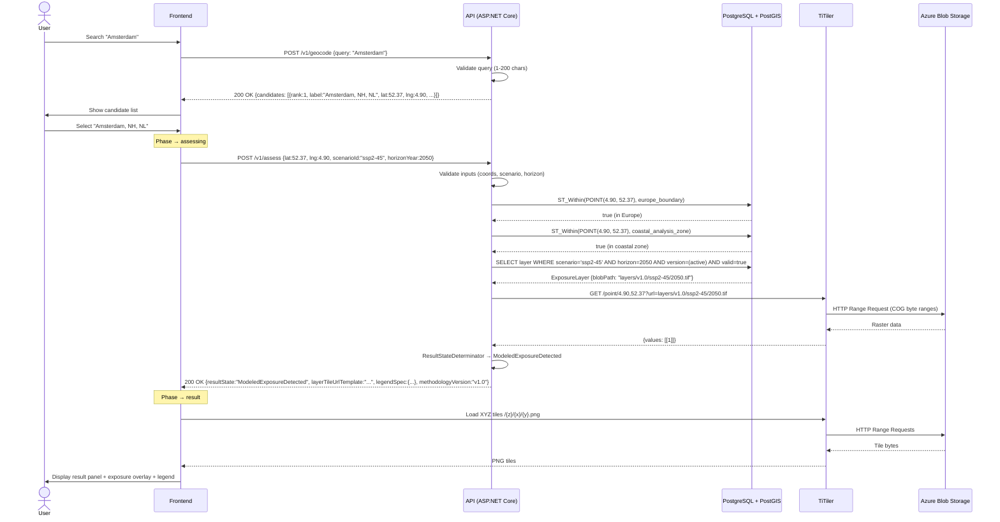

---

## 8. Sequence Diagram — Geocoding Flow

Shows the full geocoding flow including edge cases.

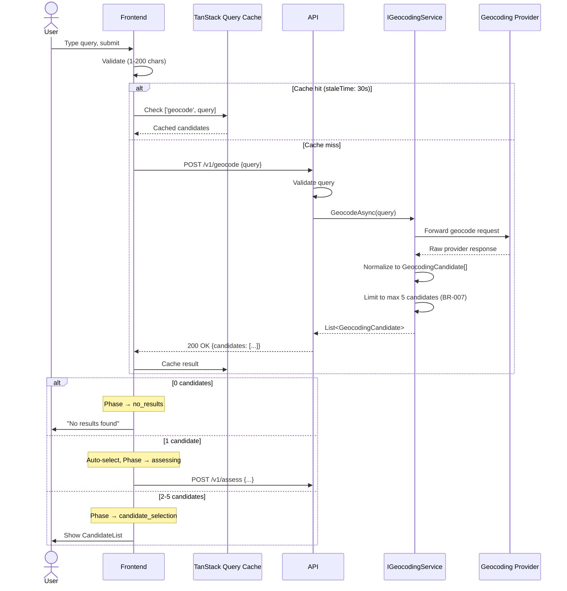

---

## 9. Sequence Diagram — Scenario/Horizon Change

Shows the control-change flow with stale request handling.

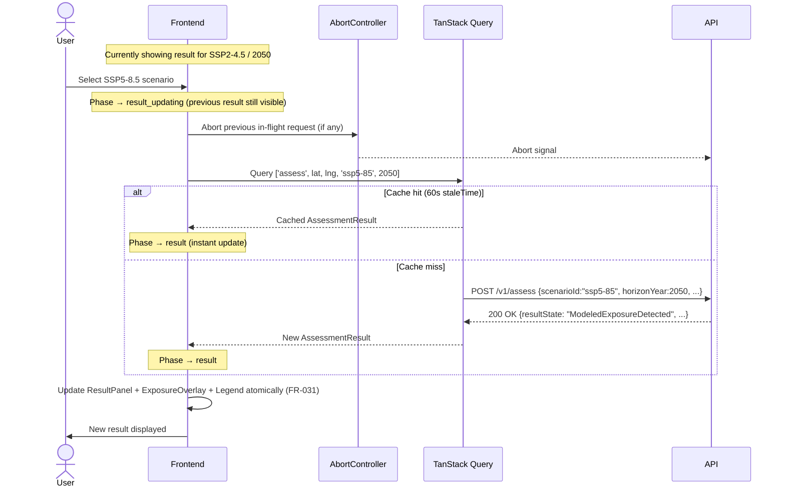

---

## 10. State Machine — Frontend Application Phase

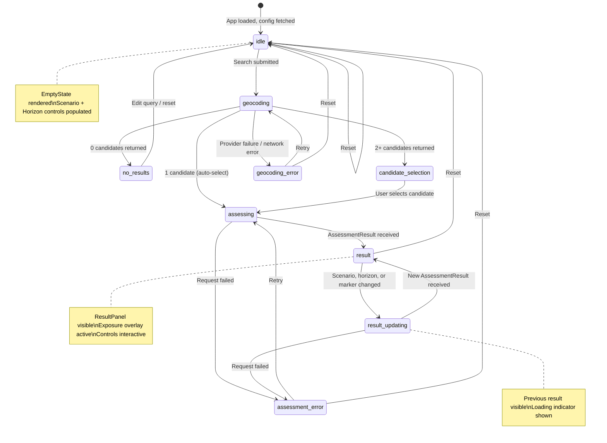

---

## 11. Deployment Diagram

Shows the Azure infrastructure topology.

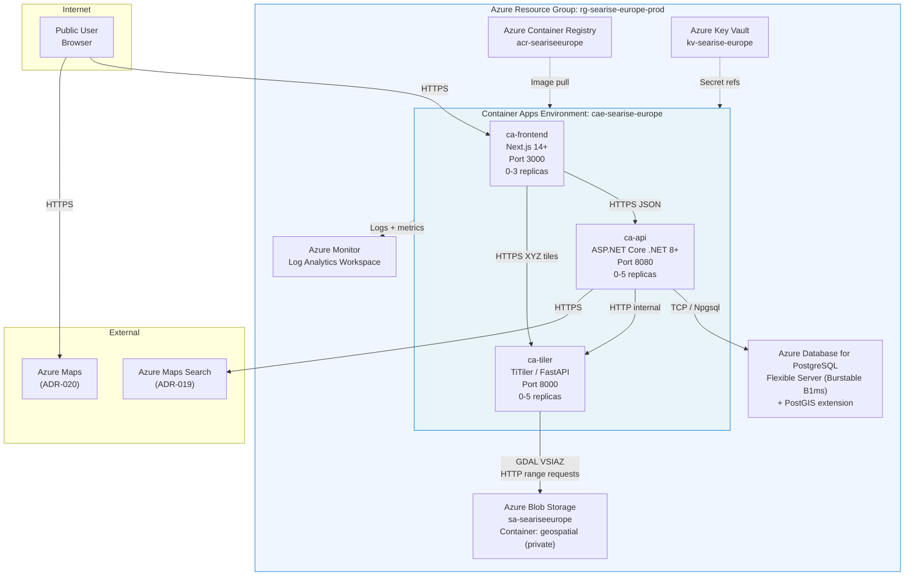

---

## 12. Activity Diagram — Offline Geospatial Pipeline

Shows the Phase 0 data pipeline that generates COG raster assets.

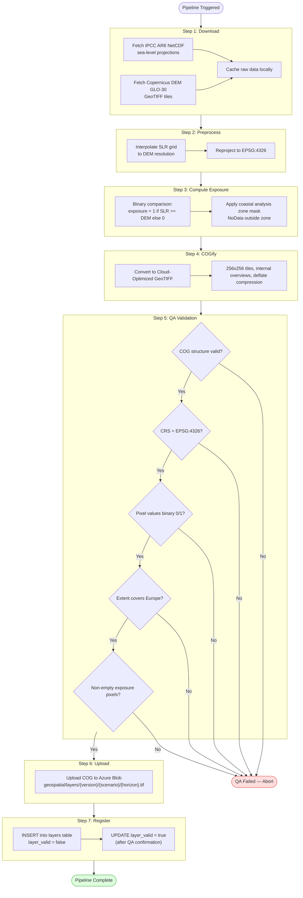

---

## 13. Package Diagram — Layered Architecture

Shows the dependency direction between architectural layers (clean architecture).

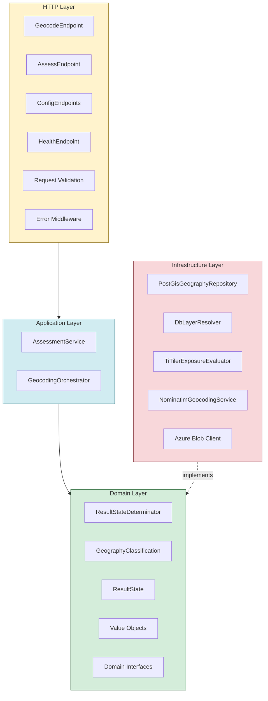

**Dependency Rule:** Dependencies point inward. The Domain layer has zero references to Infrastructure. Infrastructure implements Domain interfaces (dependency inversion).

---

## Cross-References

| Diagram | Related Architecture Document |
|---|---|
| System Context | [01-system-context.md](01-system-context.md) |
| Container | [02-container-view.md](02-container-view.md) |
| API Components | [03-component-view.md](03-component-view.md) |
| Frontend Components | [03a-frontend-architecture.md](03a-frontend-architecture.md) |
| Sequence Diagrams | [04-runtime-sequences.md](04-runtime-sequences.md) |
| Domain Model Classes | [13-domain-model.md](13-domain-model.md) |
| Deployment | [08-deployment-topology.md](08-deployment-topology.md) |
| Pipeline Activity | [16-geospatial-data-pipeline.md](16-geospatial-data-pipeline.md) |
| API Contracts | [06-api-and-contracts.md](06-api-and-contracts.md) |
