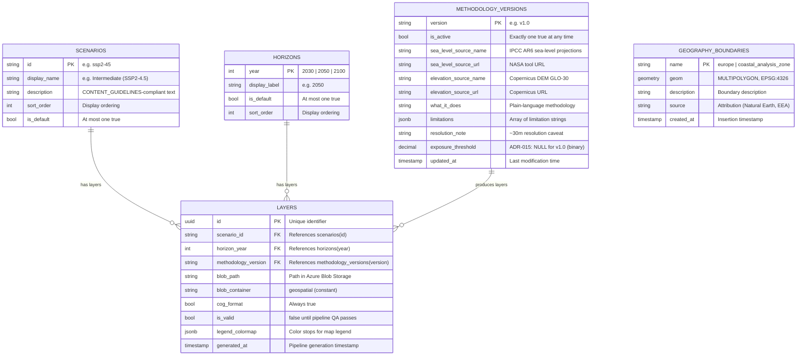
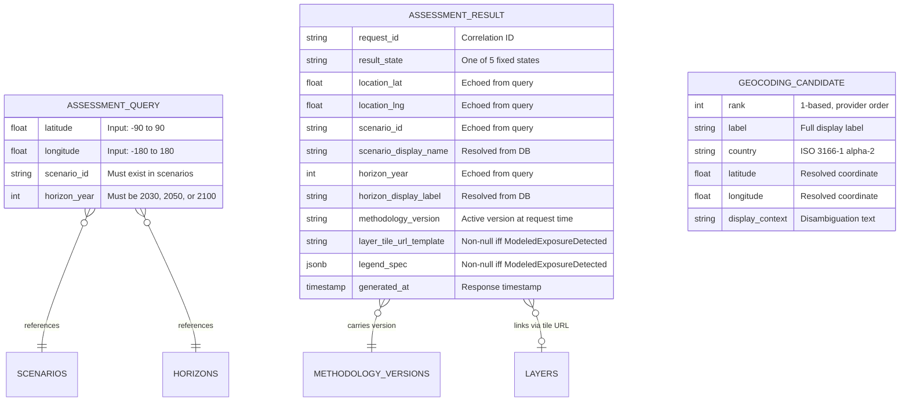
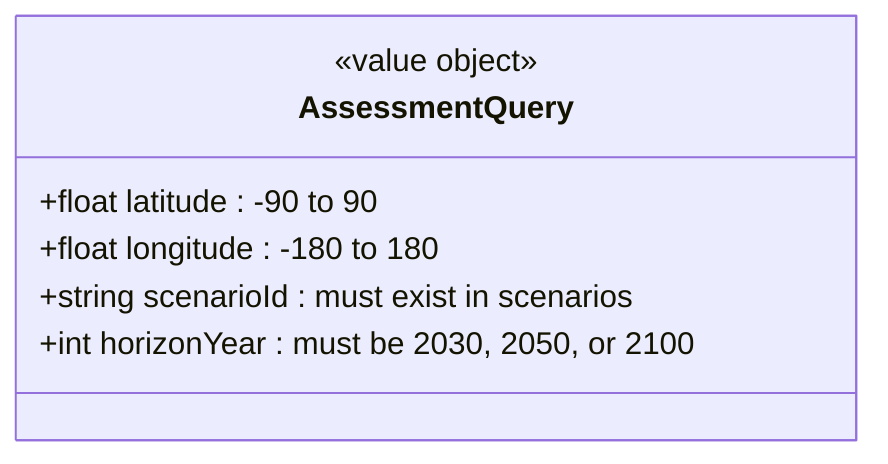
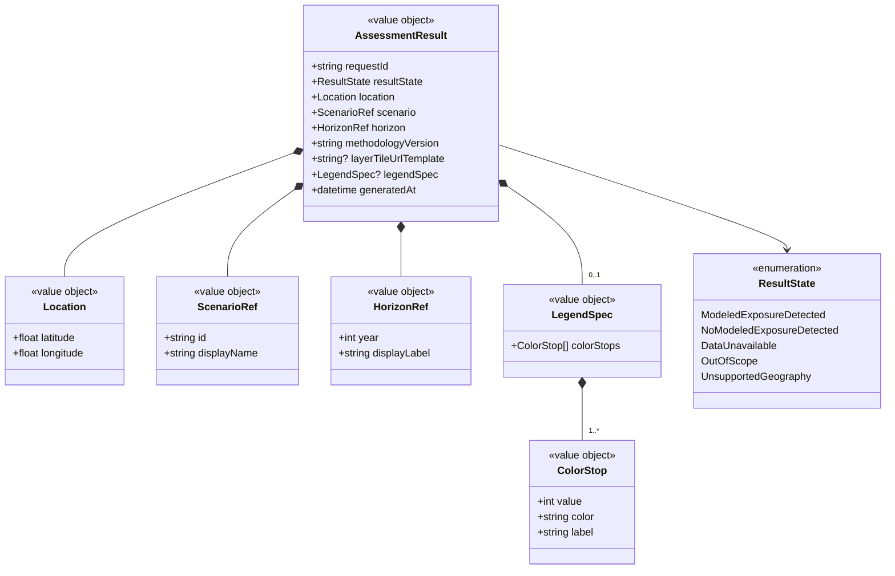
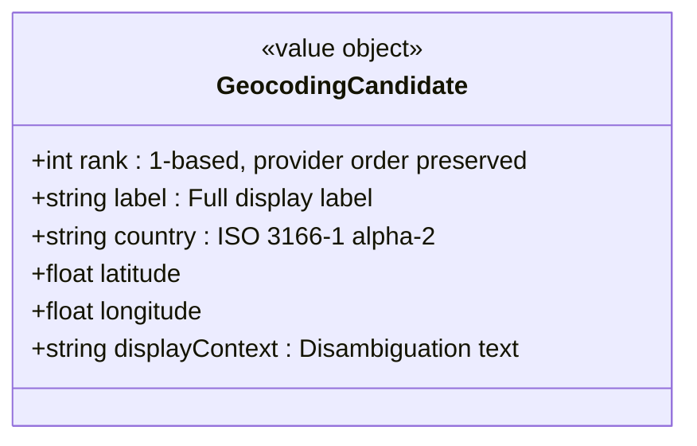

# Entity-Relationship Model

| Field | Value |
|---|---|
| **Document** | Entity-Relationship Modeling |
| **Version** | 0.1-draft |
| **Last Updated** | 2026-03-31 |
| **Status** | Draft |

> All diagrams use Mermaid notation. Render with any Mermaid-compatible viewer (GitHub, VS Code preview, mermaid.live).

---

## Table of Contents

1. [ER Diagram — Full Data Model](#1-er-diagram--full-data-model)
2. [Entity Definitions](#2-entity-definitions)
3. [Relationship Descriptions](#3-relationship-descriptions)
4. [Constraints and Invariants](#4-constraints-and-invariants)
5. [Indexes](#5-indexes)
6. [Value Objects (Non-Persisted)](#6-value-objects-non-persisted)
7. [Physical Schema (DDL Reference)](#7-physical-schema-ddl-reference)

---

## 1. ER Diagram — Full Data Model

### Persisted Entities (PostgreSQL + PostGIS)



### Transient Entities (Request/Response — Not Persisted)



---

## 2. Entity Definitions

### 2.1 `scenarios`

The set of climate emissions pathways (Shared Socioeconomic Pathways) available in the application.

| Column | Type | Nullable | Description |
|---|---|---|---|
| `id` | `VARCHAR` | NO (PK) | Stable identifier, e.g., `ssp2-45` |
| `display_name` | `VARCHAR(200)` | NO | Human-readable name, e.g., `Intermediate (SSP2-4.5)` |
| `description` | `TEXT` | NO | CONTENT_GUIDELINES-compliant explanation of the pathway |
| `sort_order` | `INTEGER` | NO | Controls display ordering in UI |
| `is_default` | `BOOLEAN` | NO | At most one row may be `true` (ADR-017: ssp2-45) |

**Cardinality:** Exactly 3 rows: ssp1-26, ssp2-45, ssp5-85 (ADR-016).

---

### 2.2 `horizons`

Fixed set of future time horizons for sea-level projections.

| Column | Type | Nullable | Description |
|---|---|---|---|
| `year` | `INTEGER` | NO (PK) | Projection year: 2030, 2050, or 2100 |
| `display_label` | `VARCHAR(10)` | NO | Display string, e.g., `"2050"` |
| `is_default` | `BOOLEAN` | NO | At most one row may be `true` (ADR-017: 2050) |
| `sort_order` | `INTEGER` | NO | Controls display ordering |

**Cardinality:** Exactly 3 rows. Not extensible without API version bump (FR-015 confirmed).

---

### 2.3 `methodology_versions`

Tracks the scientific methodology and data sources used to compute exposure layers. Supports versioning for audit trail compliance.

| Column | Type | Nullable | Description |
|---|---|---|---|
| `version` | `VARCHAR(20)` | NO (PK) | Semantic version, e.g., `v1.0` |
| `is_active` | `BOOLEAN` | NO | Exactly one row `true` at any time |
| `sea_level_source_name` | `VARCHAR(200)` | NO | e.g., `IPCC AR6 sea-level projections` |
| `sea_level_source_url` | `TEXT` | NO | Direct URL to data source |
| `elevation_source_name` | `VARCHAR(200)` | NO | e.g., `Copernicus DEM GLO-30` |
| `elevation_source_url` | `TEXT` | NO | Direct URL to data source |
| `what_it_does` | `TEXT` | NO | Plain-language methodology description (2-4 sentences) |
| `limitations` | `JSONB` | NO | Array of known limitation strings |
| `resolution_note` | `TEXT` | NO | Resolution caveat text |
| `exposure_threshold` | `DECIMAL(10,4)` | YES | ADR-015: NULL for v1.0 (binary methodology, no runtime threshold) |
| `updated_at` | `TIMESTAMPTZ` | NO | Last modification timestamp |

**Invariant:** Old versions are never deleted (NFR-021 audit trail). Activation is an atomic swap: deactivate current, activate new.

---

### 2.4 `layers`

Maps the combination of (scenario, horizon, methodology version) to a specific COG raster file in Azure Blob Storage.

| Column | Type | Nullable | Description |
|---|---|---|---|
| `id` | `UUID` | NO (PK) | Unique identifier |
| `scenario_id` | `VARCHAR` | NO (FK) | References `scenarios(id)` |
| `horizon_year` | `INTEGER` | NO (FK) | References `horizons(year)` |
| `methodology_version` | `VARCHAR(20)` | NO (FK) | References `methodology_versions(version)` |
| `blob_path` | `TEXT` | NO | Full path in blob, e.g., `layers/v1.0/ssp2-45/2050.tif` |
| `blob_container` | `VARCHAR(50)` | NO | Always `geospatial` |
| `cog_format` | `BOOLEAN` | NO | Always `true` (NFR-020 mandates COG) |
| `is_valid` | `BOOLEAN` | NO | `false` until pipeline QA passes |
| `legend_colormap` | `JSONB` | YES | `{colorStops: [{value, color, label}]}` |
| `generated_at` | `TIMESTAMPTZ` | NO | When pipeline created this layer |

**Unique Constraint:** `(scenario_id, horizon_year, methodology_version)` — one layer per combination.

**Cardinality:** `num_scenarios x num_horizons x num_versions`. For MVP: ~3 scenarios x 3 horizons x 1 version = 9 rows.

---

### 2.5 `geography_boundaries`

Stores PostGIS geometries used for server-side geography validation.

| Column | Type | Nullable | Description |
|---|---|---|---|
| `name` | `VARCHAR(100)` | NO (PK) | Boundary identifier |
| `geom` | `GEOMETRY(MULTIPOLYGON, 4326)` | NO | WGS84 polygon geometry |
| `description` | `TEXT` | YES | Human-readable description |
| `source` | `VARCHAR(200)` | YES | Attribution (e.g., Natural Earth, EEA) |
| `created_at` | `TIMESTAMPTZ` | NO | Insertion timestamp |

**Required Rows:**

| `name` | Purpose | Source |
|---|---|---|
| `europe` | Europe boundary for `UnsupportedGeography` check | Natural Earth 10m cultural vectors |
| `coastal_analysis_zone` | Coastal zone for `OutOfScope` check | ADR-018: Copernicus Coastal Zones 2018, ~10 km inland |

---

## 3. Relationship Descriptions

### 3.1 `scenarios` → `layers` (One-to-Many)

Each scenario can have multiple layers (one per horizon per methodology version). A layer always belongs to exactly one scenario.

- **Parent:** `scenarios.id`
- **Child:** `layers.scenario_id`
- **Cascade:** Restrict delete (scenarios with layers cannot be removed)

### 3.2 `horizons` → `layers` (One-to-Many)

Each time horizon can have multiple layers (one per scenario per methodology version). A layer always belongs to exactly one horizon.

- **Parent:** `horizons.year`
- **Child:** `layers.horizon_year`
- **Cascade:** Restrict delete

### 3.3 `methodology_versions` → `layers` (One-to-Many)

Each methodology version produces a complete set of layers. A layer is always associated with exactly one methodology version.

- **Parent:** `methodology_versions.version`
- **Child:** `layers.methodology_version`
- **Cascade:** Restrict delete (NFR-021: versions never deleted)

### 3.4 `layers` — Composite Relationship

A layer is the intersection entity that bridges scenarios, horizons, and methodology versions to physical raster assets. It exists at the intersection of all three dimensions:

```
Layer = f(Scenario, Horizon, MethodologyVersion) → COG blob
```

### 3.5 `geography_boundaries` (Independent)

No foreign key relationships. Used exclusively by spatial queries (`ST_Within`) during assessment. Referenced by name, not by foreign key.

---

## 4. Constraints and Invariants

### Business Rule Constraints

| Rule | Entity | Constraint | Enforcement |
|---|---|---|---|
| BR-010 | `assessment_result` | `result_state` must be one of 5 fixed values | Application enum; API contract |
| FR-015 | `horizons` | Only years {2030, 2050, 2100} permitted | Check constraint on `year` |
| NFR-021 | `methodology_versions` | Past versions never deleted | Application-level; no cascade delete |
| BR-014 | `assessment_result` | No silent substitution of result states | Application-level domain logic |

### Database-Level Constraints

```sql
-- At most one default scenario
CREATE UNIQUE INDEX idx_scenarios_single_default
    ON scenarios (is_default) WHERE is_default = true;

-- At most one default horizon
CREATE UNIQUE INDEX idx_horizons_single_default
    ON horizons (is_default) WHERE is_default = true;

-- Exactly one active methodology version
CREATE UNIQUE INDEX idx_methodology_single_active
    ON methodology_versions (is_active) WHERE is_active = true;

-- One layer per scenario+horizon+version combination
ALTER TABLE layers
    ADD CONSTRAINT uq_layers_scenario_horizon_version
    UNIQUE (scenario_id, horizon_year, methodology_version);

-- Horizon year must be a known value
ALTER TABLE horizons
    ADD CONSTRAINT chk_horizon_year
    CHECK (year IN (2030, 2050, 2100));

-- Foreign keys
ALTER TABLE layers
    ADD CONSTRAINT fk_layers_scenario
    FOREIGN KEY (scenario_id) REFERENCES scenarios(id) ON DELETE RESTRICT;

ALTER TABLE layers
    ADD CONSTRAINT fk_layers_horizon
    FOREIGN KEY (horizon_year) REFERENCES horizons(year) ON DELETE RESTRICT;

ALTER TABLE layers
    ADD CONSTRAINT fk_layers_methodology
    FOREIGN KEY (methodology_version) REFERENCES methodology_versions(version) ON DELETE RESTRICT;
```

---

## 5. Indexes

| Table | Index | Type | Purpose |
|---|---|---|---|
| `layers` | `(scenario_id, horizon_year, methodology_version)` | UNIQUE B-tree | Layer resolution query (assessment pipeline) |
| `layers` | `(methodology_version) WHERE is_valid = true` | Partial B-tree | Filter to active, valid layers |
| `geography_boundaries` | `geom` | GIST | Spatial `ST_Within` queries (~20ms per query) |
| `methodology_versions` | `(is_active) WHERE is_active = true` | Unique partial | Enforce single active version; fast lookup |
| `scenarios` | `(is_default) WHERE is_default = true` | Unique partial | Enforce single default scenario |
| `horizons` | `(is_default) WHERE is_default = true` | Unique partial | Enforce single default horizon |

---

## 6. Value Objects (Non-Persisted)

These entities exist only within request/response lifecycles. They are never stored in the database.

### 6.1 `AssessmentQuery`

Input value object for the assessment pipeline. Validated at the HTTP layer, consumed by the application layer, discarded after response.



**Privacy:** Raw query strings (user-typed addresses) are never associated with `AssessmentQuery`. Only coordinates are present after geocoding selection (BR-016, NFR-007).

### 6.2 `AssessmentResult`

Output value object assembled from domain logic, database lookups, and TiTiler pixel queries.



**Conditional Fields:**
- `layerTileUrlTemplate` is non-null **only** when `resultState = ModeledExposureDetected`
- `legendSpec` is non-null **only** when `resultState = ModeledExposureDetected`

### 6.3 `GeocodingCandidate`

Normalized geocoding result, independent of upstream provider format.



**Constraint:** Maximum 5 candidates per geocoding response (BR-007).

---

## 7. Physical Schema (DDL Reference)

Complete DDL for the persisted data model. Intended as a reference for database migration scripts.

```sql
-- Enable PostGIS
CREATE EXTENSION IF NOT EXISTS postgis;

-- =============================================================================
-- scenarios
-- =============================================================================
CREATE TABLE scenarios (
    id              VARCHAR(50)     PRIMARY KEY,
    display_name    VARCHAR(200)    NOT NULL,
    description     TEXT            NOT NULL,
    sort_order      INTEGER         NOT NULL,
    is_default      BOOLEAN         NOT NULL DEFAULT false
);

CREATE UNIQUE INDEX idx_scenarios_single_default
    ON scenarios (is_default) WHERE is_default = true;

-- =============================================================================
-- horizons
-- =============================================================================
CREATE TABLE horizons (
    year            INTEGER         PRIMARY KEY CHECK (year IN (2030, 2050, 2100)),
    display_label   VARCHAR(10)     NOT NULL,
    is_default      BOOLEAN         NOT NULL DEFAULT false,
    sort_order      INTEGER         NOT NULL
);

CREATE UNIQUE INDEX idx_horizons_single_default
    ON horizons (is_default) WHERE is_default = true;

-- =============================================================================
-- methodology_versions
-- =============================================================================
CREATE TABLE methodology_versions (
    version                 VARCHAR(20)     PRIMARY KEY,
    is_active               BOOLEAN         NOT NULL DEFAULT false,
    sea_level_source_name   VARCHAR(200)    NOT NULL,
    sea_level_source_url    TEXT            NOT NULL,
    elevation_source_name   VARCHAR(200)    NOT NULL,
    elevation_source_url    TEXT            NOT NULL,
    what_it_does            TEXT            NOT NULL,
    limitations             JSONB           NOT NULL DEFAULT '[]'::jsonb,
    resolution_note         TEXT            NOT NULL,
    exposure_threshold      DECIMAL(10,4),
    updated_at              TIMESTAMPTZ     NOT NULL DEFAULT now()
);

CREATE UNIQUE INDEX idx_methodology_single_active
    ON methodology_versions (is_active) WHERE is_active = true;

-- =============================================================================
-- layers
-- =============================================================================
CREATE TABLE layers (
    id                      UUID            PRIMARY KEY DEFAULT gen_random_uuid(),
    scenario_id             VARCHAR(50)     NOT NULL REFERENCES scenarios(id) ON DELETE RESTRICT,
    horizon_year            INTEGER         NOT NULL REFERENCES horizons(year) ON DELETE RESTRICT,
    methodology_version     VARCHAR(20)     NOT NULL REFERENCES methodology_versions(version) ON DELETE RESTRICT,
    blob_path               TEXT            NOT NULL,
    blob_container          VARCHAR(50)     NOT NULL DEFAULT 'geospatial',
    cog_format              BOOLEAN         NOT NULL DEFAULT true,
    is_valid                BOOLEAN         NOT NULL DEFAULT false,
    legend_colormap         JSONB,
    generated_at            TIMESTAMPTZ     NOT NULL DEFAULT now(),

    CONSTRAINT uq_layers_scenario_horizon_version
        UNIQUE (scenario_id, horizon_year, methodology_version)
);

CREATE INDEX idx_layers_valid_lookup
    ON layers (methodology_version, scenario_id, horizon_year)
    WHERE is_valid = true;

-- =============================================================================
-- geography_boundaries
-- =============================================================================
CREATE TABLE geography_boundaries (
    name            VARCHAR(100)    PRIMARY KEY,
    geom            GEOMETRY(MULTIPOLYGON, 4326) NOT NULL,
    description     TEXT,
    source          VARCHAR(200),
    created_at      TIMESTAMPTZ     NOT NULL DEFAULT now()
);

CREATE INDEX idx_geography_boundaries_geom
    ON geography_boundaries USING GIST (geom);
```

---

## Blob Storage Layout (Non-Relational)

Azure Blob Storage holds the COG raster files referenced by the `layers` table. Not a relational entity, but documented here for completeness.

```
sa-seariseeurope / geospatial /
└── layers/
    └── {methodology_version}/
        └── {scenario_id}/
            └── {horizon_year}.tif

Example:
    layers/v1.0/ssp1-26/2030.tif
    layers/v1.0/ssp1-26/2050.tif
    layers/v1.0/ssp1-26/2100.tif
    layers/v1.0/ssp2-45/2030.tif
    layers/v1.0/ssp2-45/2050.tif
    layers/v1.0/ssp2-45/2100.tif
    layers/v1.0/ssp5-85/2030.tif
    layers/v1.0/ssp5-85/2050.tif
    layers/v1.0/ssp5-85/2100.tif
```

**Naming Convention:** Path segments match the primary key values from their respective tables, ensuring deterministic resolution without additional lookup.

---

## Cross-References

| Topic | Related Document |
|---|---|
| Domain model narrative | [13-domain-model.md](13-domain-model.md) |
| Data architecture | [05-data-architecture.md](05-data-architecture.md) |
| API contracts (JSON shapes) | [06-api-and-contracts.md](06-api-and-contracts.md) |
| UML system diagrams | [18-uml-system-architecture.md](18-uml-system-architecture.md) |
| Pipeline (layer generation) | [16-geospatial-data-pipeline.md](16-geospatial-data-pipeline.md) |
| Container view | [02-container-view.md](02-container-view.md) |
