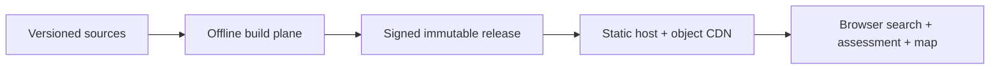

# Architecture Documentation

> **Status:** Current for the accepted target architecture
> **Last reviewed:** 2026-08-04
> **Authoritative decision:** [ADR-021 — Static-First Offline Geospatial Architecture](adr/ADR-021-static-first-offline-geospatial-architecture.md)

## Architecture in one paragraph

SeaRise Europe is becoming a static geospatial data product. A reproducible
offline pipeline acquires pinned IPCC, Copernicus, GeoNames, and Natural Earth
snapshots; validates and packages immutable COG, PMTiles, GeoParquet, JSON, and
STAC artifacts; and publishes them with checksums and signed provenance. A
static React browser application searches settlements, validates scope, and
calculates one of five result states locally. Production has no application
API, runtime database, tile server, or geocoding service.

The checked-in application still uses the retiring service-based stack. These
documents describe the accepted target; the
[migration plan](../delivery/README.md) records the gates that must pass before
legacy code is removed.

## Start here

Read in this order:

1. [ADR-021](adr/ADR-021-static-first-offline-geospatial-architecture.md) — decision,
   alternatives, consequences, costs, scientific gates, and migration.
2. [System context](01-system-context.md) — actors, boundaries, dependencies,
   and project outcomes.
3. [Container view](02-container-view.md) — build, artifact, delivery, and
   browser responsibilities.
4. [Browser application](03a-frontend-architecture.md) — runtime components,
   search, assessment, map, state, and offline behaviour.
5. [Data architecture](05-data-architecture.md) — immutable release layout and
   public data contracts.
6. [Pipeline](16-geospatial-data-pipeline.md) — reproducible source-to-release
   processing and publication gates.
7. [Deployment](08-deployment-topology.md) — Cloudflare/R2 reference topology
   and portable delivery requirements.

## Current document set

| Document | Purpose |
|---|---|
| [01 — System Context](01-system-context.md) | Users, external sources, trust boundaries, and success outcomes |
| [02 — Container View](02-container-view.md) | Executable/deployable units and their responsibilities |
| [03a — Browser Application](03a-frontend-architecture.md) | React/Vite, Web Worker search, local assessment, MapLibre, caching |
| [04 — Runtime Sequences](04-runtime-sequences.md) | Bootstrap, search, assessment, scenario switch, offline, and release-update flows |
| [05 — Data Architecture](05-data-architecture.md) | Release structure, schemas, COG/PMTiles/GeoParquet/STAC, GeoNames datasets |
| [07 — Security Architecture](07-security-architecture.md) | Browser privacy, CSP/CORS, artifact integrity, CI supply chain, threats |
| [08 — Deployment Topology](08-deployment-topology.md) | Static Assets, R2 custom domain, OpenTofu, environments, rollback |
| [09 — Observability and Operations](09-observability-and-operations.md) | Release evidence, synthetic checks, privacy-safe telemetry, runbooks |
| [10 — Testing Strategy](10-testing-strategy.md) | Scientific, contract, artifact, browser, offline, accessibility, and parity gates |
| [11 — Decision Register](11-architecture-decisions.md) | Compact list of active and superseded decisions |
| [12 — Risks and Open Questions](12-risks-assumptions-and-open-questions.md) | Current uncertainty and required exit evidence |
| [13 — Domain Model](13-domain-model.md) | Five result states and browser/pipeline domain contracts |
| [14 — Integration Patterns](14-integration-patterns.md) | Build ingestion, publication, HTTPS artifact contracts, basemap boundary |
| [15 — Performance and Scalability](15-performance-and-scalability.md) | Browser/CDN budgets, caching, range requests, and cost controls |
| [16 — Geospatial Pipeline](16-geospatial-data-pipeline.md) | Real-data workflow, settlement index, reproducibility, and validation |
| [ADR directory](adr/README.md) | Standalone architecture decision records and ADR conventions |
| [ADR-021](adr/ADR-021-static-first-offline-geospatial-architecture.md) | Authoritative static-first architecture decision |

Supporting current documents:

- [Provisional methodology](../methodology.md)
- [Static-first migration plan](../delivery/README.md)
- [Product requirements](../product/PRD.md)
- [Content guidelines](../product/CONTENT_GUIDELINES.md)

## Status model

Documents use these terms consistently:

| Status | Meaning |
|---|---|
| Accepted target | The decision is approved for new work, even if migration is incomplete |
| Migration in progress | Legacy implementation still exists and must be handled explicitly |
| Provisional | Evidence is incomplete; the content cannot authorize a real-data release |
| Released | Immutable artifacts have passed all scientific and technical gates and were published |
| Superseded | No longer active guidance; retained only in Git history or the decision register |

No document may use “implemented,” “validated,” or “production-ready” for the
target architecture without executable evidence.

## Fixed architecture contracts

- Scenarios: `ssp1-26`, `ssp2-45`, `ssp5-85`.
- Horizons: `2030`, `2050`, `2100`.
- Defaults: `ssp2-45`, `2050`.
- Result states: `ModeledExposureDetected`,
  `NoModeledExposureDetected`, `DataUnavailable`, `OutOfScope`, and
  `UnsupportedGeography`.
- Normal runtime API calls: zero.
- Data selection: one pinned `dataReleaseId` per application session.
- Published releases: immutable and checksum-addressable.
- Binary assessment: exact nearest-neighbour class lookup, never rendered
  colour sampling.
- Search: local qualifying records from a declared GeoNames snapshot.

## Deliberately removed documents

The following documents were deleted because they described retired runtime
components or duplicated current views:

- API component view;
- REST API contracts;
- Azure/open-question closure proposal;
- monolithic UML view of the legacy distributed system;
- relational entity-relationship model.

Historical decisions remain recoverable through Git. They are not kept in the
active index because a reader should not have to guess which architecture is
current.

## Documentation maintenance rules

- ADR-021 wins when another document conflicts with it.
- A materially different runtime, scientific method, hosting dependency, or
  privacy model requires a new ADR.
- Update diagrams and prose in the same pull request as a contract change.
- Keep product language independent from storage/provider implementation.
- Link to one canonical definition instead of copying large contracts.
- Remove completed/superseded plans; use pull requests and signed manifests as
  historical evidence.
- Run a relative-link check and `git diff --check` before review.
