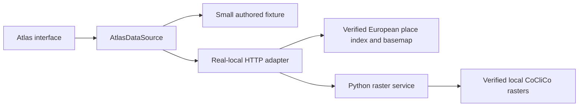

# Architecture Documentation

The main application is the coastal atlas defined by
[ADR-028](adr/ADR-028-coastal-atlas-adoption.md). The normal route `/` uses a
small illustrative fixture; the provisioned local edition uses the same UI
with verified CoCliCo rasters and the prepared European basemap. The retained
AR6 projection application is at `/projections/`.

## Coastal atlas runtime

`AtlasApp` receives one `AtlasDataSource`. Its catalog, place search, point
inspection, and tile methods use strict browser contracts without filesystem
paths. The fixture provider is deterministic and browser-local. The real-local
HTTP provider talks only to the explicitly started loopback adapter, which
verifies local inputs and owns the Python raster process. A service failure
remains a technical error; it never selects a different data edition.

The edition is selected at build/development startup. Preview verifies that its
mode matches the built document. Real-local listeners are restricted to
loopback. Large source files stay outside the application build and Git.
The atlas does not register a service worker; the retained projection worker
precaches its own document and resources and passes atlas requests through.

MapLibre and its bundled worker load separately from the initial interface.
The map displays Europe, including complete Ukraine and Crimea. Geographic
detail and modeled depth are separate layers; closer zoom does not increase
the source's native 25-meter cell resolution. See the
[product contract](../product/COASTAL_ATLAS_PRD.md) and
[development workflow](../operations/coastal-atlas-development.md) for the
six supported combinations and reproducible local commands.

## Retained projection architecture

The following decisions and evidence describe the AR6 reference application.
Its offline pipeline builds immutable COG, PMTiles, GeoParquet, JSON, and STAC
artifacts; its static browser searches settlements and returns ADR-024's four
projection result states. Its source identities, scientific evidence, and
release history remain independent of the coastal atlas. The retired
service-based application remains removed under ADR-025.

### Projection reference decisions

Read in this order:

1. [ADR-021](adr/ADR-021-static-first-offline-geospatial-architecture.md) — decision,
   alternatives, consequences, costs, scientific gates, and migration.
2. [System context](01-system-context.md) — actors, boundaries, dependencies,
   and project outcomes.
3. [ADR-026](adr/ADR-026-authoritative-browser-range-persistence.md) — exact
   complete-resource, COG-range, PMTiles, failure, and private-candidate storage
   boundaries.
4. [Container view](02-container-view.md) — build, artifact, delivery, and
   browser responsibilities.
5. [Browser application](03a-frontend-architecture.md) — runtime components,
   search, assessment, map, state, and offline behaviour.
6. [Atomic projection state](17-atomic-projection-state.md) — release-scoped
   transitions and stale-completion guards.
7. [Data architecture](05-data-architecture.md) — immutable release layout and
   public data contracts.
8. [Pipeline](16-geospatial-data-pipeline.md) — reproducible source-to-release
   processing and publication gates.
9. [Deployment](08-deployment-topology.md) — Cloudflare/R2 reference topology
   and portable delivery requirements.

## Retained projection document set

| Document | Purpose |
|---|---|
| [01 — System Context](01-system-context.md) | Users, external sources, trust boundaries, and success outcomes |
| [02 — Container View](02-container-view.md) | Executable/deployable units and their responsibilities |
| [03a — Browser Application](03a-frontend-architecture.md) | React/Vite, Web Worker search, local assessment, MapLibre, caching |
| [04 — Runtime Sequences](04-runtime-sequences.md) | Bootstrap, search, assessment, scenario switch, offline, and release-update flows |
| [05 — Data Architecture](05-data-architecture.md) | Release structure, schemas, COG/PMTiles/GeoParquet/STAC, GeoNames datasets |
| [07 — Security Architecture](07-security-architecture.md) | Browser privacy, CSP/CORS, artifact integrity, CI supply chain, threats |
| [08 — Deployment Topology](08-deployment-topology.md) | Static Assets, R2 custom domain, OpenTofu, environments, rollback |
| [09 — Observability and Operations](09-observability-and-operations.md) | Release evidence, synthetic checks, privacy-safe telemetry, runbooks |
| [10 — Testing Strategy](10-testing-strategy.md) | Scientific, contract, artifact, browser, offline, accessibility, and parity gates |
| [11 — Decision Register](11-architecture-decisions.md) | Compact list of active and superseded decisions |
| [12 — Risks and Open Questions](12-risks-assumptions-and-open-questions.md) | Current uncertainty and required exit evidence |
| [13 — Domain Model](13-domain-model.md) | Four projection result states and browser/pipeline domain contracts |
| [14 — Integration Patterns](14-integration-patterns.md) | Build ingestion, publication, HTTPS artifact contracts, basemap boundary |
| [15 — Performance and Scalability](15-performance-and-scalability.md) | Browser/CDN budgets, caching, range requests, and cost controls |
| [16 — Geospatial Pipeline](16-geospatial-data-pipeline.md) | Real-data workflow, settlement index, reproducibility, and validation |
| [17 — Atomic Projection State](17-atomic-projection-state.md) | Immutable result/selection/release tuple and guarded state transitions |
| [Public release contracts](../../contracts/release/README.md) | Authoritative JSON Schemas, version compatibility, deprecation, and rollback |
| [ADR directory](adr/README.md) | Standalone architecture decision records and ADR conventions |
| [ADR-021](adr/ADR-021-static-first-offline-geospatial-architecture.md) | Authoritative static-first architecture decision |
| [ADR-026](adr/ADR-026-authoritative-browser-range-persistence.md) | Authoritative complete-resource, COG range, and PMTiles persistence boundary |

Supporting projection reference documents:

- [Provisional methodology](../methodology.md)
- [Static-first migration plan](../delivery/README.md)
- [Product requirements](../product/PRD.md)
- [Content guidelines](../product/CONTENT_GUIDELINES.md)
- [Canonical Flight visual and interaction contract](../product/Mock/DESIGN.md)

Retained AR6 components implement the canonical Flight experience rather than
substituting a generic dashboard or map utility. ADR-024 overrides the mock's
binary exposure, terrain comparison, modeled-water/flood meaning, and related
scientific copy; it does not override Flight's layout, information hierarchy,
map-first composition, controls, responsive behavior, or interaction character.

## Status model

Documents use these terms consistently:

| Status | Meaning |
|---|---|
| Current | Implemented repository architecture backed by executable gates |
| Accepted target | The decision is approved for new work, even if migration is incomplete |
| Provisional | Evidence is incomplete; the content cannot authorize a real-data release |
| Released | Immutable artifacts have passed all scientific and technical gates and were published |
| Superseded | No longer active guidance; retained only in Git history or the decision register |

No document may use “implemented,” “validated,” or “production-ready” for the
target architecture without executable evidence.

## Fixed AR6 reference contracts

- Scenarios: `ssp1-26`, `ssp2-45`, `ssp5-85`.
- Horizons: `2030`, `2050`, `2100`.
- Defaults: `ssp2-45`, `2050`.
- Result states: `ProjectionAvailable`, `DataUnavailable`, `OutOfScope`, and
  `UnsupportedGeography`.
- Normal runtime API calls: zero.
- Data selection: one pinned `dataReleaseId` per application session.
- Published releases: immutable and checksum-addressable.
- Projection lookup: nearest native AR6 grid location within 100 km, with no
  interpolation, fallback, or rendered-colour sampling.
- Search: local qualifying records from a declared GeoNames snapshot.
- Browser persistence: verified complete resources use Cache Storage;
  integrity-authorized COG chunks may use bounded IndexedDB; PMTiles remains
  network-only and visual-only with a `no-store` caching policy.

## Deliberately removed documents

The following documents were deleted because they described retired runtime
components or duplicated current views:

- API component view;
- REST API contracts;
- Azure/open-question closure proposal;
- monolithic UML view of the legacy distributed system;
- relational entity-relationship model.

Historical decisions remain recoverable through Git. They are not kept in the
active index because a reader should not have to guess which architecture is
current.

## Documentation maintenance rules

- ADR-028 governs the coastal atlas; ADR-021 and its amendments govern the
  retained AR6 reference and their explicitly retained delivery contracts.
- A materially different runtime, scientific method, hosting dependency, or
  privacy model requires a new ADR.
- Update diagrams and prose in the same pull request as a contract change.
- Keep product language independent from storage/provider implementation.
- Link to one canonical definition instead of copying large contracts.
- Remove completed/superseded plans; use pull requests and signed manifests as
  historical evidence.
- Run a relative-link check and `git diff --check` before review.
