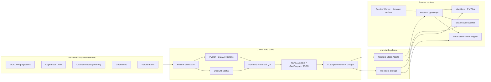
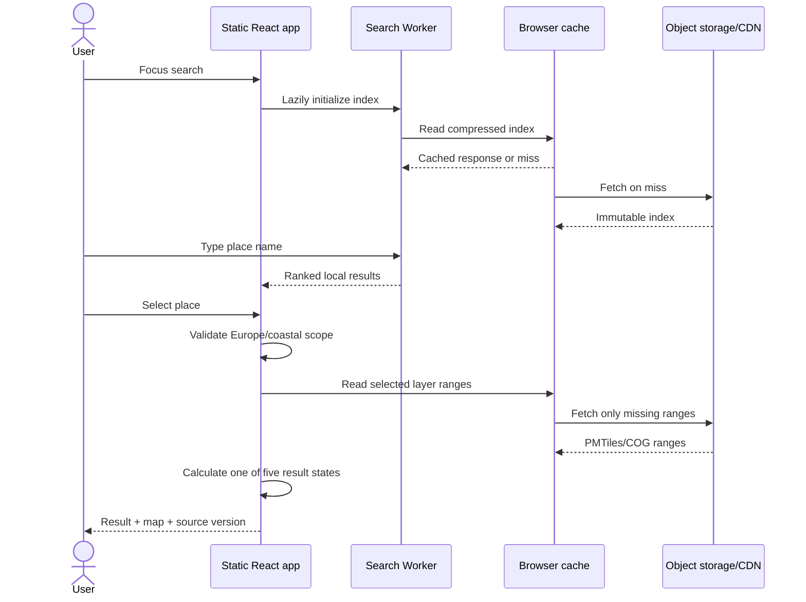

# ADR-021 — Static-First Offline Geospatial Architecture

> **Status:** Accepted
> **Decision date:** 2026-08-04
> **Decision owner:** Project owner
> **Scope:** Production architecture, data distribution, search, hosting, delivery pipeline, and portfolio presentation
> **Implementation state:** Accepted target architecture; Phase 0 investigation complete with no-go, Phase 1 locked pending an approved recovery gate

## 1. Decision

SeaRise Europe will move from a request-time distributed system to a
**static-first geospatial application**. All expensive, stateful, and
scientific processing happens before a release. The production site serves a
versioned set of immutable files; the browser performs place search,
geographic scope checks, and exposure assessment locally.

The target production runtime has:

- no application backend;
- no runtime relational or spatial database;
- no runtime tile server;
- no runtime geocoding API;
- no user accounts or server-side session state;
- no source-data processing in a user request.

The default deployment target is **Cloudflare Workers Static Assets** for the
web application and small metadata files, plus **Cloudflare R2** behind a custom
domain for large geospatial artifacts. This choice is replaceable: every
published artifact uses an open format and the browser reads ordinary HTTPS
resources with byte-range support.

The reference frontend is a static **React 19 + TypeScript application built
with Vite 8**. Map rendering uses **MapLibre GL JS**. Large map layers use
**PMTiles**; exact pixel lookup uses lossless, analysis-grade artifacts rather
than rendered colours. Search runs in a Web Worker against a prebuilt local
index.

The decision is intentionally both practical and portfolio-oriented. The
architectural story is not “many services”; it is “a reproducible geospatial
data product with no request-time backend, database, or tile server.”

## 2. Why this decision is needed

The implemented architecture currently requires a Next.js runtime, an ASP.NET
Core API, PostgreSQL/PostGIS, TiTiler, blob storage, a geocoder, and multiple
containers. That topology is credible for a multi-user transactional product,
but SeaRise Europe is a public, read-only explorer over data that changes only
when a dataset is released.

The current design creates costs and failure modes without adding equivalent
product value:

- cold starts and sequential network calls delay the first useful result;
- the same static geography and scenario lookup is recomputed per request;
- PostgreSQL and containers remain allocated even when the portfolio site is
  idle;
- the production path depends on several independently deployable services;
- local development needs Docker services before the UI can demonstrate the
  core experience;
- the system is harder to explain, verify, and maintain than the product
  requires;
- the repository currently contains a synthetic demo raster while the real
  source pipeline has not yet passed an end-to-end scientific validation.

Source datasets can be downloaded once per data release, processed locally or
in CI, validated, and published as browser-ready artifacts. The user should pay
only the cost of downloading the small files and map ranges needed for the
current interaction.

## 3. Decision drivers

In priority order:

1. Scientifically reproducible results and explicit data provenance.
2. Fast first interaction with no backend cold start.
3. Zero or near-zero idle cost for a portfolio workload.
4. A small operational surface that one engineer can maintain.
5. Local-first development and deterministic releases.
6. Open-source software and portable data formats.
7. Complete, fast settlement search without a paid geocoding service.
8. Graceful use on unreliable networks and useful offline behaviour.
9. A modern, legible architecture that demonstrates senior engineering
   judgement rather than unnecessary infrastructure.

## 4. Product and scientific invariants

The migration must preserve these invariants:

- The supported scenario IDs remain `ssp1-26`, `ssp2-45`, and `ssp5-85`.
- The supported horizons remain `2030`, `2050`, and `2100`.
- The defaults remain `ssp2-45` and `2050`.
- Results remain one of five domain states:
  `ModeledExposureDetected`, `NoModeledExposureDetected`, `DataUnavailable`,
  `OutOfScope`, or `UnsupportedGeography`.
- `OutOfScope` and `UnsupportedGeography` are valid domain outcomes, not
  technical errors.
- An assessment identifies modeled exposure; it is not a property-level flood
  forecast, probability, safety guarantee, or adaptation recommendation.
- Every visible result identifies the methodology and dataset release that
  produced it.
- Every release is reproducible from recorded source versions, checksums,
  parameters, and code revision.
- Source licences and attribution must permit redistribution of every published
  derivative.

“All European coastal cities and villages” has an operational definition:
**all active populated-place records present in the selected GeoNames snapshot
whose coordinates fall inside the versioned Europe support geometry and the
versioned coastal analysis zone**. It does not claim that GeoNames contains
every settlement that exists in reality.

## 5. Options considered

| Option | Runtime shape | Cost and operations | Decision |
|---|---|---|---|
| Keep the current distributed architecture | Next.js + .NET API + PostGIS + TiTiler + storage + external maps | Highest idle cost and most failure modes | Rejected |
| Consolidate into one backend | Static/SPA frontend + one API using SQLite/COG | Cheaper, but still has cold starts, a runtime, and an API deployment | Rejected as the default |
| Static-first application | Static frontend + immutable object artifacts + in-browser computation | Lowest idle cost and smallest runtime surface | **Accepted** |
| Send raw scientific sources to the browser | Browser downloads and processes original IPCC/DEM data | Excessive transfer, memory, processing time, and scientific complexity | Rejected |
| Pre-render one page per place | Static pages for every settlement and scenario | Explodes file count, duplicates data, and complicates updates | Rejected |

A small edge function remains an allowed future extension only if a measured
requirement cannot be met with static delivery. It is not part of the baseline
and must receive its own ADR.

## 6. Target architecture



### 6.1 Build plane

The build plane may run on a developer workstation or a scheduled/manual CI
job. It is not reachable from production traffic. It may use heavy native
tools because their complexity does not become production operational
complexity.

Responsibilities:

1. Download an explicit source snapshot into a local, ignored cache.
2. Verify source size and SHA-256 before processing.
3. Normalize CRS, geometry, nodata values, and field schemas.
4. Build nine scenario/horizon exposure layers.
5. Build the Europe support geometry and coastal analysis geometry.
6. Build settlement catalogs and their serialized search indexes.
7. Execute scientific golden-point, topology, schema, and coverage tests.
8. Generate a release manifest and static STAC catalog.
9. Generate provenance and sign the release manifest.
10. Publish only after every required gate passes.

The reference build tools are:

- Python for orchestration and scientific code;
- GDAL, Rasterio, and rio-pmtiles for raster transformation and packaging;
- DuckDB with its Spatial extension for repeatable spatial joins and
  GeoParquet production;
- JSON Schema for public contract validation;
- PMTiles tooling for archive inspection and byte-range smoke tests;
- Cosign for keyless signing of the release manifest and provenance bundle.

PostGIS is deliberately absent from production. DuckDB Spatial replaces it in
the offline workflow, where an embedded analytical engine is easier to run,
pin, test, and reproduce.

### 6.2 Artifact plane

Each release is a self-contained, immutable directory:

```text
releases/{dataReleaseId}/
├── manifest.json
├── manifest.schema.json
├── manifest.sigstore.json
├── provenance.intoto.jsonl
├── config/
│   ├── scenarios.json
│   ├── methodology.json
│   └── source-attribution.json
├── geography/
│   ├── europe.pmtiles
│   ├── coastal-analysis-zone.pmtiles
│   └── boundaries.parquet
├── search/
│   ├── europe-core.index.br
│   ├── europe-coastal.index.br
│   └── settlements.parquet
├── layers/
│   ├── ssp1-26/{2030,2050,2100}.pmtiles
│   ├── ssp2-45/{2030,2050,2100}.pmtiles
│   └── ssp5-85/{2030,2050,2100}.pmtiles
├── analysis/
│   ├── ssp1-26/{2030,2050,2100}.tif
│   ├── ssp2-45/{2030,2050,2100}.tif
│   └── ssp5-85/{2030,2050,2100}.tif
└── stac/
    ├── catalog.json
    ├── collection.json
    └── items/*.json
```

The exact lookup COGs under `analysis/` and visual PMTiles under `layers/` are
two views of the same classified source array. Keeping them separate avoids
using rendered colours as scientific values. If a validated implementation can
prove bit-exact lookup directly from the PMTiles payload, a later ADR may
remove the duplicate COGs.

Large files live in R2. Files under the 25 MiB static-assets limit may live with
the application, but there must be one canonical public URL per artifact.
Analytical GeoParquet files are published for transparency and portfolio
inspection; the normal user flow does not download them.

`manifest.json` is the browser entry point and the release source of truth. It
contains at least:

- `dataReleaseId`, methodology version, build time, and Git commit;
- source name, authoritative URL, snapshot date/version, licence, attribution,
  byte size, and SHA-256;
- processing image/tool versions and every scientific parameter;
- the Europe support rule and coastal-zone rule;
- every artifact URL, media type, role, byte size, bounds, and SHA-256;
- scenario/horizon completeness;
- control-point test summary and data-quality summary;
- previous release ID, when applicable.

The static STAC catalog provides standard discovery and metadata for
geospatial artifacts without requiring a STAC API.

### 6.3 Delivery plane

The site is deployed as static assets. Large objects are served from R2 through
a custom domain with byte-range requests, CORS, immutable cache headers, and an
edge cache.

Required headers for versioned artifacts:

```http
Cache-Control: public, max-age=31536000, immutable
Access-Control-Allow-Origin: https://<production-site>
Access-Control-Allow-Methods: GET, HEAD
Access-Control-Allow-Headers: Range, If-Match
Access-Control-Expose-Headers: Accept-Ranges, Content-Length, Content-Range, ETag
```

Mutable pointers such as `/release.json` use a short TTL plus revalidation. An
application deployment pins a known `dataReleaseId`; it never silently changes
scientific data in the middle of a user session.

The deployment must use content-addressed or release-versioned paths. Existing
objects are never overwritten. Rollback means redeploying the previous small
application build or repointing the release pointer, not mutating data files.

### 6.4 Browser runtime

The browser owns only bounded, deterministic work:

- load small configuration and geometry metadata;
- search a prebuilt settlement index in a Web Worker;
- render an OpenFreeMap basemap with MapLibre;
- read PMTiles ranges for the selected exposure overlay;
- evaluate one coordinate against local boundaries and exact classified data;
- render methodology, provenance, and attribution;
- cache the shell, index, and recently used artifact ranges.

React Server Components, server actions, SSR, and an application server are
not required for this product. The static build emits semantic HTML for the
shell and an interactive client bundle for the explorer.

Use React state locally by default. Retain Zustand only for genuinely shared
cross-component state; do not reintroduce a server-state library solely to
fetch immutable files. URL parameters remain the durable, shareable state for
location, scenario, horizon, and release.

## 7. Runtime interaction



The normal assessment performs no `/assess`, `/geocode`, or `/config` request.
A selected result is derived in this order:

1. Validate coordinates and supported geometry.
2. If outside the Europe support geometry, return `UnsupportedGeography`.
3. If inside Europe but outside the coastal analysis zone, return
   `OutOfScope`.
4. Resolve the selected scenario/horizon artifact from the pinned manifest.
5. Read the exact nearest-neighbour classified pixel from the analysis COG.
6. Map nodata to `DataUnavailable`, `1` to `ModeledExposureDetected`, and `0`
   to `NoModeledExposureDetected`.
7. Display the methodology/data release and keep the corresponding visual
   PMTiles overlay in sync.

All coordinate, tile, and row/column transformations have shared golden tests
between the pipeline and TypeScript assessment engine. Interpolation is never
used for a binary class lookup.

## 8. Settlement catalog and local search

### 8.1 Source and scope

Use a pinned GeoNames dump and `alternateNamesV2`, licensed under CC BY 4.0.
Natural Earth administrative/shoreline data may support labeling and distance
calculations. The pipeline stores the source date and checksums in the release
manifest.

Create two logical datasets:

1. `europe-core`: active populated places inside the Europe support geometry
   with population at least 500, plus national and administrative capitals.
   This allows an inland search to return a useful `OutOfScope` result.
2. `europe-coastal`: every active populated place inside the coastal analysis
   zone, without a population threshold, so villages and small settlements are
   retained.

The first release uses the checked-in Natural Earth-derived **25 km** coastal
zone as an explicitly labelled approximation. The pipeline must replace it, or
re-confirm it in a superseding methodology decision, after the canonical
Copernicus coastal product is acquired and compared. The 25 km distance is a
product-scope rule chosen to compensate for the coarse shoreline around ports
and estuaries; it is not a statement about flood reach.

Included GeoNames feature codes are `PPL`, `PPLA`, `PPLA2`, `PPLA3`, `PPLA4`,
`PPLA5`, `PPLC`, `PPLF`, `PPLG`, `PPLL`, and `PPLR`. Historical, abandoned,
destroyed, and section-only records (`PPLH`, `PPLQ`, `PPLW`, `PPLX`) are
excluded from the default product catalog. Exceptions require a documented
data-quality rule.

Each normalized place record contains:

```text
id, canonicalName, asciiName, alternateNames[], countryCode,
admin1Code, admin1Name, latitude, longitude, population,
featureCode, distanceToCoastMeters, isCoastal, sourceUpdatedAt
```

`isCoastal` is derived from the versioned product boundary, not inferred from
the place name. Store `distanceToCoastMeters` so the product can change its
coastal threshold without reacquiring GeoNames.

### 8.2 Index and ranking

The build produces a compact, Brotli-compressed serialized index using
MiniSearch or an equivalently small open-source engine. The exact library is an
implementation choice, but the public record schema and ranking tests are
contracts.

The index loads on search focus or browser idle, not on the critical rendering
path, and is initialized inside a Web Worker. Ranking order is:

1. exact canonical-name match;
2. exact localized/alternate-name match;
3. prefix match;
4. fuzzy match;
5. population and administrative importance as tie-breakers;
6. coastal proximity as a final tie-breaker for otherwise equivalent matches.

Country and first-level administration must be visible for disambiguation.
Search is accent-insensitive but retains the user's localized display name.
The first useful results should not wait for the larger coastal index: load the
core shard first and merge the coastal shard when ready.

Required search QA includes multilingual names, diacritics, duplicate names,
small villages, zero-population records, transcontinental boundary cases, and
known coastal/inland examples.

## 9. Offline behaviour

“Offline” has two explicit meanings:

1. **Offline production:** upstream data acquisition and scientific processing
   are outside the request path.
2. **Offline-capable use:** after initial loading, the application shell,
   configuration, boundaries, search index, and recently used layer ranges are
   available without a network connection.

The baseline does not promise that all nine Europe-wide layers are downloaded
to every device. That would make first load slower and consume uncontrolled
storage. The service worker uses a versioned cache:

- precache the application shell and minimal configuration;
- cache the core search index after first use;
- cache the coastal index opportunistically;
- cache PMTiles/COG byte ranges with a bounded least-recently-used policy;
- never mix ranges from different `dataReleaseId` values;
- expose an “available offline” indicator only for data actually cached;
- offer a user-initiated download for a selected region/layer only after an
  implementation spike establishes a safe browser-storage budget.

If the network is unavailable and a required range is missing, the UI returns
a clear connectivity/data-availability state and never guesses a result.

## 10. Hosting and cost decision

### 10.1 Default

Use:

- Cloudflare Workers Static Assets for HTML, JavaScript, CSS, small JSON, and
  indexes that fit the platform's individual-file limit;
- Cloudflare R2 Standard storage for large PMTiles, COG, and GeoParquet files;
- a custom domain for production R2 delivery and caching;
- OpenTofu for bucket, CORS, DNS, cache, and deployment configuration;
- GitHub Actions for validation and controlled publishing.

As of the decision date, Cloudflare documents static-asset requests as free and
unlimited. R2 Standard includes 10 GB-month storage, 1 million Class A
operations, and 10 million Class B operations per month, with free Internet
egress; usage beyond the allowance is billed. These are planning inputs, not a
contract, and CI must keep a dated cost-model file rather than assuming the
free tier forever.

The target recurring infrastructure cost is **EUR 0/month while the artifacts
and traffic remain inside free allowances**, excluding domain registration.
Set budgets/notifications where the platform supports them and record storage
size plus expected range-request volume before each release.

### 10.2 Why not Azure by default

Azure Static Web Apps can host the frontend cheaply, but large artifacts,
public egress, and an edge CDN create a less predictable zero-cost path. Azure
also encourages retaining components from the old design that this decision is
removing. It remains a portable deployment target, not the reference target.

### 10.3 Portability

Cloudflare is a commercial provider, but it is not part of the scientific or
application contract. Migration requires only a static host plus object storage
that supports HTTPS, CORS, `HEAD`, and byte-range `GET`. PMTiles, COG,
GeoParquet, JSON, STAC, and Sigstore bundles remain readable outside
Cloudflare. No Durable Objects, D1, KV, proprietary database, or Worker-only
business logic is allowed in the baseline.

## 11. Open-source and external services policy

Prefer open-source tools and open data. The production browser may depend on a
public hosted service only when the dependency is non-authoritative and has a
documented fallback.

The default basemap is the OpenFreeMap public instance. It is open source,
requires no API key, and can be self-hosted. It is visual context only; search,
scope validation, and assessment continue to work if the basemap is
unavailable. Keep MapLibre attribution enabled and display the exact
OpenFreeMap/OpenMapTiles/OpenStreetMap attribution required by the selected
style and data.

There is no runtime address geocoder in the baseline. Settlement search is
local. Exact street-address search would materially change cost, privacy, and
offline behaviour and therefore requires a separate ADR.

## 12. Security, privacy, and supply chain

Removing servers removes authentication, database, API-key, SSR, and container
attack surfaces, but does not remove security work.

Required controls:

- no secrets or provider keys in the browser bundle;
- a restrictive Content Security Policy compatible with the map and artifact
  origins;
- exact dependency lockfiles, dependency review, and automated vulnerability
  scanning;
- Subresource Integrity where practical for externally loaded static assets;
- same-origin delivery where practical and narrow R2 CORS otherwise;
- no storage of user searches or coordinates on a project-controlled server;
- privacy-respecting, opt-in or aggregate-only analytics if analytics are
  introduced;
- source and generated-artifact checksums;
- SLSA-compatible build provenance;
- keyless Cosign signature over the manifest/provenance bundle;
- protected production environment and least-privilege R2 publish credential;
- publication from CI, never from an unreviewed local working tree.

The browser verifies schema and release identity before using artifacts. Full
cryptographic verification may run in CI and on the architecture page rather
than on every user interaction, provided the HTTPS origin and pinned release
remain the runtime trust boundary.

## 13. Data licences and attribution

Every source must pass a redistribution review before the first real-data
release. At minimum, the manifest and product attribution panel cover:

| Source | Intended role | Licence/attribution handling |
|---|---|---|
| IPCC AR6 sea-level projections | Scenario inputs | Pin the authoritative release; retain CC BY 4.0 citation and required acknowledgements |
| Copernicus DEM | Terrain input | Follow the applicable Copernicus data licence and label the output as a modified derivative |
| Copernicus coastal product or approved replacement | Analysis boundary | Record product version, processing, and required attribution |
| GeoNames | Settlement names and coordinates | CC BY 4.0 attribution and snapshot date |
| Natural Earth | Support/shoreline geometry | Record public-domain provenance |
| OpenStreetMap/OpenMapTiles/OpenFreeMap | Visual basemap | Keep visible provider and OSM contributor attribution |

Raw source files stay in an ignored local/CI cache unless redistribution is
explicitly permitted. Published derivatives must contain enough metadata for a
reviewer to trace them to the source without bundling restricted raw material.

## 14. Scientific validation gate

The repository's existing demo data is synthetic. The static architecture must
not turn a pipeline assumption into a polished but scientifically invalid
product.

Before removing the old runtime implementation, a Phase 0 spike must:

1. Download the exact IPCC AR6 source snapshot and inspect its real dimensions,
   coordinate model, units, quantiles, and missing values.
2. Prove how location-based sea-level projections are transformed to the
   analysis grid; do not assume the source is a regular latitude/longitude
   raster.
3. Process a small, representative coastal region end to end using the exact
   intended DEM and coastal boundary.
4. Document vertical datum, CRS, resampling, coastline connectivity, and nodata
   treatment.
5. Compare output against independently reviewed control locations.
6. Measure artifact size, range count, lookup latency, and visible map quality.
7. Review whether the binary “sea-level projection >= terrain elevation” model
   produces unacceptable disconnected inland false positives.
8. Fail publication if source licences or attribution are unresolved.

If the spike disproves the current binary methodology, update the methodology
and create a superseding ADR before producing Europe-wide data. Architecture
simplicity is not permission to weaken scientific correctness.

The stop condition has fired. Phase 0.14 records the investigation as
`complete-with-no-go`: #95 automatically recommends rejecting v1 because its
mandatory coastal water and bare-earth terrain uncertainty terms cannot be
finitely bounded from the locked evidence. Independent review is pending, so
the authoritative scientific and release disposition remains `blocked`. No
scientific arrays or release artifacts were generated.

Recovery is #106 → (#107, #108) → #109 → #110. Only an independently reviewed
`approved` #110 with zero blockers may unlock #48 and Phase 1. CI, a synthetic
fixture, or an all-nodata artifact cannot satisfy this gate.

## 15. Performance budgets and architecture fitness functions

The following are executable release gates, measured in a production-like
browser and documented on the architecture page:

| Fitness function | Target |
|---|---:|
| Initial application JavaScript, Brotli | <= 250 KiB, excluding lazy map/search chunks |
| Initial route Lighthouse performance/accessibility/best-practices/SEO | >= 90 each on the agreed mobile profile |
| Search response p95 after worker initialization | < 50 ms |
| Local assessment p95 after required data is cached | < 100 ms |
| Search worker initialization on reference mobile hardware | < 1,000 ms |
| Runtime application API calls | 0 calls to `/assess`, `/geocode`, or `/config` |
| Scenario/horizon coverage | exactly 9 complete, validated combinations |
| PMTiles/COG range support | every large artifact passes `HEAD` and partial `GET` smoke tests |
| Manifest integrity | schema-valid; every byte size and SHA-256 matches |
| Scientific regression | all approved golden points pass |
| Licence completeness | every published artifact maps to source/licence metadata |
| Offline core | shell, config, boundaries, and loaded search index work after network removal |

Budgets are enforced in CI. A waiver must state the measured regression,
rationale, owner, and expiry date in the pull request.

## 16. Testing strategy

Testing follows the data flow rather than service boundaries:

- **Unit:** name normalization, ranking, boundary predicates, coordinate-to-cell
  conversion, result-state mapping, manifest parsing, cache versioning.
- **Property-based:** coordinates at tile/cell edges, antimeridian/longitude
  normalization, nodata, malformed indexes, and deterministic ranking.
- **Data contracts:** JSON Schema, STAC validation, GeoParquet schema, unique IDs,
  finite coordinates, valid feature codes, no orphan aliases.
- **Scientific:** known exposed/non-exposed/nodata sites, source-unit checks,
  raster statistics, connectivity checks, and release-to-release diffs.
- **Artifact:** `pmtiles verify`, COG validation, checksum verification, HTTP
  range behaviour, cache headers, and CORS.
- **Browser integration:** search -> select -> assess -> switch scenario/horizon
  -> share URL -> reload, with network assertions proving no application API.
- **Offline:** warm the required caches, disable the network, repeat supported
  flows, and confirm honest failure for uncached layers.
- **Visual/accessibility:** map overlays, keyboard search, result messaging,
  attribution, reduced motion, contrast, and responsive layouts.

## 17. Observability and operability

There is no application server to monitor. Operational evidence comes from:

- CI build and publication logs;
- a release inventory with artifact sizes and hashes;
- Cloudflare aggregate traffic, storage, error, and cost metrics;
- synthetic checks for the site, manifest, search index, `HEAD`, and byte-range
  requests from at least two European regions;
- client-side error reporting only if it is privacy reviewed and scrubbed of
  queries/coordinates;
- an automated rollback to the prior application/release pairing.

Availability of OpenFreeMap is observed separately and does not define product
assessment availability.

## 18. Portfolio presentation

The product includes a public `/about/architecture` route generated from the
pinned manifest. It shows:

- a concise static-first architecture diagram;
- “before” and “after” runtime dependency counts;
- current data release, methodology, commit, and build time;
- sources, licences, processing stages, and scientific limitations;
- artifact types and byte sizes;
- CI fitness-function results and representative performance measurements;
- STAC catalog and signed provenance links;
- the reason DuckDB Spatial, PMTiles, COG, Web Workers, OpenTofu, SLSA, and
  Sigstore are used;
- the portability story and an honest current cost estimate.

The page must explain business value before naming technology. The intended
portfolio message is:

> SeaRise Europe shifts deterministic geospatial computation out of the user
> request path, publishes verifiable open artifacts, and delivers a fast
> interactive experience without a runtime backend, database, or tile server.

This demonstrates current technology through appropriate use, measurable
constraints, and supply-chain transparency—not through component count.

## 19. Migration and removal plan

Migration is staged so the current experience remains available until the new
path is proven.

### Phase 0 — prove the data

- Pass the scientific validation gate on a small region.
- Confirm source licences and exact attribution.
- Measure COG and PMTiles sizes, R2 requests, and browser memory.
- Validate exact client-side lookup against the pipeline array.

**Current project disposition (2026-08-05): `COMPLETE-WITH-NO-GO`.** The
[Phase 0.14 gate](../../evidence/phase-0-14-final-no-go.md) preserves the
earlier [Phase 0.9 `BLOCKED` evidence](../../evidence/phase-0-9-regional-gate.md)
and stops all nine combinations before arrays. The automated v1 recommendation
is `REJECTED`; the authoritative scientific and release disposition is
`BLOCKED` because independent review is pending. No scientific artifacts or
performance/parity claims were produced, and Phase 1 remains locked.

The recovery dependency order is
[#106](https://github.com/artemsemdev/SeaRise-Europe/issues/106) →
([#107](https://github.com/artemsemdev/SeaRise-Europe/issues/107),
[#108](https://github.com/artemsemdev/SeaRise-Europe/issues/108)) →
[#109](https://github.com/artemsemdev/SeaRise-Europe/issues/109) →
[#110](https://github.com/artemsemdev/SeaRise-Europe/issues/110). Only an
independently reviewed `approved` #110 with zero blockers may unlock
[#48](https://github.com/artemsemdev/SeaRise-Europe/issues/48) and Phase 1.

### Phase 1 — define public artifacts

- Add schemas for manifest, config, settlements, and methodology.
- Produce a static STAC catalog and GeoParquet transparency artifacts.
- Add checksums, SLSA provenance, and Cosign verification.
- Publish a non-production release prefix.

### Phase 2 — implement the static browser path

- Migrate the frontend to React 19 + Vite 8.
- Add PMTiles, local boundary checks, and exact COG lookup.
- Replace runtime geocoding with the Web Worker settlement index.
- Add versioned caching and offline status.
- Add the public architecture page.

### Phase 3 — parallel verification

- Run the old and new assessment paths against the same golden coordinates.
- Investigate every difference; do not silently choose one output.
- Pass performance, accessibility, offline, and browser compatibility gates.
- Produce a measured cost comparison.

### Phase 4 — decommission

Only after Phases 0–3 pass, remove:

- ASP.NET Core API projects and API deployment definitions;
- PostgreSQL/PostGIS schema, seed, and managed-database infrastructure;
- TiTiler and its deployment/configuration;
- Azurite/blob-seed runtime scaffolding;
- runtime geocoding clients and Azure Maps secrets;
- Next.js server/runtime configuration and TanStack Query server cache;
- obsolete Docker Compose services and superseded technical documentation.

Keep reusable scientific pipeline code, fixtures, golden tests, and source
licence records. Deletion is a migration outcome, not a prerequisite.

## 20. Consequences

### Positive

- Near-zero idle cost and no backend cold start.
- Fewer deployables, secrets, logs, upgrades, and production failure modes.
- Results become reproducible release artifacts rather than mutable database
  state.
- Search is fast, private, multilingual, and independent of API quotas.
- Local development can run the product from static fixture artifacts.
- Open formats make the data inspectable and the hosting replaceable.
- The architecture provides a distinctive, evidence-backed portfolio story.

### Negative

- Europe-wide preprocessing moves compute and storage cost into release jobs.
- A data correction requires a new release rather than a database update.
- Browser storage and memory vary, so full-continent offline use cannot be
  promised by default.
- Local fuzzy search will not match a commercial address geocoder's address
  coverage.
- Object-storage range requests can become the main variable cost at scale.
- COG plus PMTiles duplicates some derived data until exact PMTiles lookup is
  proven.
- The first migration requires careful parity testing and removal work.

### Risks and mitigations

| Risk | Mitigation |
|---|---|
| Source data is not shaped as the current pipeline assumes | Mandatory Phase 0 inspection and regional spike |
| Static inundation model overstates disconnected inland exposure | Connectivity analysis and explicit methodology review |
| Search index is too large for mobile | Core/coastal shards, Brotli, lazy worker load, measured size budget |
| R2 reads exceed the free tier | PMTiles directory locality, bounded caching, usage alerts, cost model |
| Public basemap changes or is unavailable | Non-authoritative dependency, graceful fallback, self-host option |
| Cached app and data releases become mixed | Pin `dataReleaseId` and namespace every cache/artifact path |
| Browser exact lookup differs from pipeline | Shared golden fixtures and bit-exact parity tests |
| “Offline” promise is misunderstood | Distinguish offline production, cached core, and uncached layer behaviour |

## 21. Superseded decisions

This ADR supersedes the runtime portions of:

- ADR-001 (Next.js App Router), ADR-003 (TanStack Query server state), ADR-004
  (ASP.NET Core API), ADR-005 (runtime PostGIS geography validation), ADR-006
  (TiTiler), ADR-008 (production PostgreSQL/PostGIS), ADR-012 (stale API
  request handling), ADR-013 (no CDN), ADR-019 (Azure Maps geocoder), and
  ADR-020 (Azure Maps basemap).
- ADR-007 is amended: COG remains an analysis-grade artifact, while PMTiles is
  the visual delivery format.
- ADR-009 is reduced to the still-valid product decision that the application
  is anonymous; there is no application API to authenticate.
- ADR-011 is amended: immutable release directories and manifests replace
  database history rows.
- ADR-014 remains conceptually valid, implemented with browser URL APIs rather
  than Next.js routing.

ADR-002 (minimal client state), ADR-010 (five domain states), ADR-015 (binary
methodology, subject to the scientific gate), ADR-016 (scenario set), ADR-017
(defaults), and ADR-018 (coastal-zone decision, subject to source validation)
remain active where they do not conflict with this ADR.

## 22. Decisions deliberately left open

These choices require measured spikes or product input and are not silently
fixed by this ADR:

- the final Europe support polygon and treatment of transcontinental states;
- Copernicus DEM GLO-30 versus GLO-90 after size/quality measurement;
- final coastal-connectivity method and whether it changes methodology v1.0;
- exact search library after comparing index size, quality, and worker latency;
- whether bit-exact PMTiles lookup can eliminate the companion COGs;
- regional offline-download UX and storage quota;
- analytics provider, if any;
- custom-domain registrar and its annual cost.

## 23. Acceptance criteria

This ADR is fully implemented only when:

- all scientific validation gates pass on real, licensed sources;
- the public release contains all nine valid layers and complete manifests;
- search includes every qualifying record from the pinned GeoNames snapshot;
- browser tests prove that core flows make no application API calls;
- the old and new paths have documented parity results;
- production serves the app and byte-range artifacts with the required cache
  and CORS headers;
- offline tests pass for the explicitly cached scope;
- cost and performance budgets pass;
- the architecture page exposes current evidence and provenance;
- retired services, infrastructure, secrets, and obsolete documentation are
  removed from the repository.

## 24. Authoritative references

- [Cloudflare Workers Static Assets billing and limitations](https://developers.cloudflare.com/workers/static-assets/billing-and-limitations/)
- [Cloudflare Workers platform limits](https://developers.cloudflare.com/workers/platform/limits/)
- [Cloudflare R2 pricing](https://developers.cloudflare.com/r2/pricing/)
- [PMTiles concepts](https://docs.protomaps.com/pmtiles/)
- [PMTiles on cloud storage](https://docs.protomaps.com/pmtiles/cloud-storage)
- [PMTiles with MapLibre](https://docs.protomaps.com/pmtiles/maplibre)
- [STAC specification](https://stacspec.org/en/about/stac-spec/)
- [DuckDB Spatial extension](https://duckdb.org/docs/stable/core_extensions/spatial/overview)
- [GeoNames data export](https://download.geonames.org/export/dump/)
- [OpenFreeMap](https://openfreemap.org/)
- [Sigstore keyless signing](https://docs.sigstore.dev/cosign/signing/overview/)
- [SLSA provenance](https://slsa.dev/spec/)
- [React versions](https://react.dev/versions)
- [Vite releases](https://vite.dev/releases)
