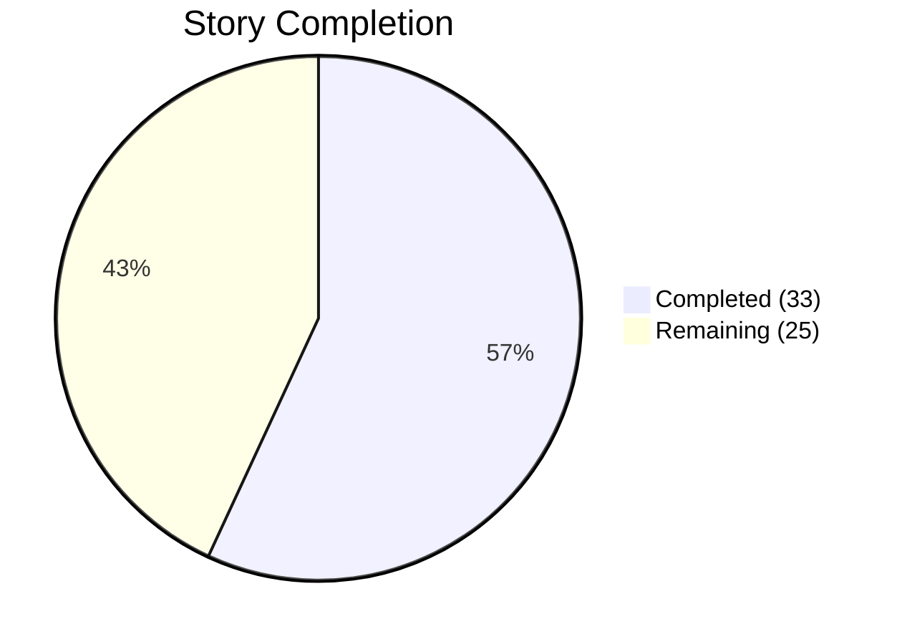

# Delivery Dashboard

**Status:** Living document — updated after each completed story  
**Last updated:** 2026-04-03 (Wave 5 complete)  
**Scope:** SeaRise Europe MVP — 58 stories across 8 epics, delivered in 8 waves

---

## Progress Snapshot

```text
  ███████████████░░░░░  57% COMPLETE  ·  33 of 58 stories delivered
```

| Metric | Value |
|--------|------:|
| Stories completed | **33** / 58 |
| Epics completed | **5** / 8 |
| Waves fully completed | **5** / 8 |
| Current wave | Wave 6 — Assessment UX (0 / 7) PLANNED |
| Unit tests passing | 27 unit + 12 integration + 52 frontend (91 total) |
| Next up | `S06-01` Implement ScenarioControl and HorizonControl |



---

## Wave Progress

```text
Wave 1 · Decision Closure      ████████████████████  7/7   100%  DONE
Wave 2 · Local Dev Environment ████████████████████  3/3   100%  DONE
Wave 3 · Geospatial Pipeline   ████████████████████  8/8   100%  DONE
Wave 4 · Backend API Core      ████████████████████  7/7   100%  DONE
Wave 5 · Frontend Search       ████████████████████  8/8   100%  DONE
Wave 6 · Assessment UX         ░░░░░░░░░░░░░░░░░░░░  0/7     0%  PLANNED
Wave 7 · Transparency & A11y   ░░░░░░░░░░░░░░░░░░░░  0/7     0%  PLANNED
Wave 8 · Azure Release         ░░░░░░░░░░░░░░░░░░░░  0/11    0%  PLANNED
```

---

## Epic Completion

| # | Epic | Progress | Status |
|--:|------|:--------:|:------:|
| 1 | Decision Closure and Delivery Baseline | 7 / 7 (100%) | **Done** |
| 2 | Local Development Environment | 3 / 3 (100%) | **Done** |
| 3 | Geospatial Data Pipeline | 8 / 8 (100%) | **Done** |
| 4 | Backend API Core | 7 / 7 (100%) | **Done** |
| 5 | Frontend Shell and Search Flow | 8 / 8 (100%) | **Done** |
| 6 | Scenario Controls and Assessment UX | 0 / 7 (0%) | Planned |
| 7 | Transparency, Accessibility, and Content Compliance | 0 / 7 (0%) | Planned |
| 8 | Azure Deployment, Release Hardening, and Go-Live | 0 / 11 (0%) | Planned |

---

## Remaining Work

### Assessment UX — 7 stories · Wave 6

| ID | Story | Scope |
|----|-------|-------|
| S06-01 | Implement ScenarioControl and HorizonControl | Scenario and horizon selectors |
| S06-02 | Implement Assessment API Integration | Assessment request flow and state updates |
| S06-03 | Implement ResultPanel with All 5 Result States | Exposure, no exposure, unavailable, inland, unsupported |
| S06-04 | Implement ExposureLayer and Legend | Raster overlay, legend, visual result context |
| S06-05 | Implement Loading, Error, and Result-Updating States | Assessment feedback and retry behavior |
| S06-06 | Implement URL State Synchronization | Shareable state in query params |
| S06-07 | Assessment Flow Component Integration Tests | End-to-end frontend assessment coverage |

### Transparency & A11y — 7 stories · Wave 7

| ID | Story | Scope |
|----|-------|-------|
| S07-01 | Implement MethodologyPanel | Methodology drawer, model cards, limitation copy |
| S07-02 | Content Copy Audit and CONTENT_GUIDELINES Compliance | Simplified, policy-aligned product copy |
| S07-03 | Complete i18n Externalization | Remove hardcoded strings and complete locale setup |
| S07-04 | Keyboard Navigation and Focus Management | Full keyboard path and focus handling |
| S07-05 | ARIA Attributes and Screen Reader Support | Semantic roles, labels, live regions |
| S07-06 | Responsive Layout Validation | Breakpoint fidelity across key screens |
| S07-07 | Accessibility Audit | Axe, manual keyboard, screen reader, contrast checks |

### Azure Release — 11 stories · Wave 8

| ID | Story | Scope |
|----|-------|-------|
| S08-01 | Provision Azure Resources and Key Vault | Resource group, hosting, storage, secrets |
| S08-02 | CI/CD Deployment Pipeline and Staging Deployment | Build, push, deploy, smoke-test automation |
| S08-03 | Upload COGs and Migrate Data to Azure | Production-like data and storage handoff |
| S08-04 | Complete Backend Test Suite | Backend verification in CI and staging context |
| S08-05 | Complete Frontend Test Suite | Frontend verification in CI and staging context |
| S08-06 | Security Hardening | Headers, rate limits, secret handling, scan fixes |
| S08-07 | Log Audit and Privacy Verification | Logging review and privacy-safe telemetry |
| S08-08 | E2E Test Suite and Demo Script Validation | Full demo path on local and staging |
| S08-09 | NFR Verification | Performance, reliability, and operational checks |
| S08-10 | Accessibility Audit | Final cloud-stage accessibility verification |
| S08-11 | Release Readiness Checklist | Go-live checklist and evidence package |

---

## Recently Completed

### Frontend Shell and Search Flow — 8 stories · Wave 5 · DONE 2026-04-03

| ID | Story | What was delivered |
|----|-------|-------------------|
| S05-01 | Initialize Next.js Project and App Shell | Next.js 14+ App Router with TailwindCSS v4, responsive split-pane layout, AppShell client boundary, Dockerfile |
| S05-02 | Implement Zustand State Stores | `appStore` (9-phase discriminated union), `mapStore` (viewport + selectedLocation), `uiStore` (panel visibility), shared TypeScript types |
| S05-03 | Implement MapSurface with MapLibre | MapLibre GL JS dynamic import (SSR: false), Europe-centered view, pan/zoom, attribution, click-to-assess, LocationMarker with flyTo |
| S05-04 | Implement SearchBar and Geocoding Integration | TanStack Query v5, geocoding mutation hook, SearchBar with validation (empty blocked, 200-char max), auto-select on single result |
| S05-05 | Implement CandidateList and Location Selection | Keyboard-navigable listbox (up to 5 candidates), label + displayContext, ARIA roles, selection triggers assessment |
| S05-06 | Implement Config Fetch and Localization Setup | `lib/i18n/en.ts` with all UI copy externalized, config query hook with staleTime: Infinity |
| S05-07 | Implement EmptyState, LoadingState, ErrorBanner | Phase-conditional components with ARIA (aria-live, aria-busy, role=alert), retry on error, NoResults variant |
| S05-08 | Frontend Smoke Tests and Performance Baseline | Vitest + RTL (47 tests across 9 files), CI updated with frontend unit tests, bundle baseline: 104 kB first load JS |

### Backend API Core — 7 stories · Wave 4 · DONE 2026-04-03

| ID | Story | What was delivered |
|----|-------|-------------------|
| S04-01 | Initialize ASP.NET Core Minimal API Project | Multi-project solution with 4-layer architecture (Domain, Application, Infrastructure, Api), NuGet packages, Dockerfile |
| S04-02 | Implement Domain Layer | `ResultStateDeterminator`, `ResultState`, `GeographyClassification`, `AssessmentQuery`, `AssessmentResult`, `GeocodingCandidate`, `ExposureLayer`, 6 domain interfaces |
| S04-03 | Implement Infrastructure Adapters | `PostGisGeographyRepository`, `LayerRepository`, `ScenarioRepository`, `MethodologyRepository`, `NominatimGeocodingClient`, `TiTilerExposureEvaluator` |
| S04-04 | Implement Assessment Service | `AssessmentService` with parallel geography checks, short-circuit logic, full pipeline orchestration |
| S04-05 | Implement API Endpoints and Validation | 5 endpoints (`POST /v1/geocode`, `POST /v1/assess`, `GET /v1/config/scenarios`, `GET /v1/config/methodology`, `GET /health`), FluentValidation, CORS, error envelope |
| S04-06 | Implement Structured Logging and Correlation ID Middleware | Serilog structured JSON logging, correlation ID middleware, privacy-safe log events |
| S04-07 | Backend Unit and Integration Tests | 27 unit tests (ResultStateDeterminator 100% branch coverage, validators, AssessmentService), 12 integration tests (Testcontainers PostgreSQL+PostGIS) |

### Geospatial Pipeline — 8 stories · Wave 3 · DONE 2026-04-03

| ID | Story | What was delivered |
|----|-------|-------------------|
| S03-01 | Set Up Pipeline Project and Dependencies | `src/pipeline/` project structure, `requirements-pipeline.txt`, `.env.pipeline.example` |
| S03-02 | Download and Cache Source Data | `download.py`: IPCC AR6 NetCDF + Copernicus DEM download with local caching |
| S03-03 | Reproject and Align SLR to DEM Grid | `preprocess.py`: bilinear resampling of SLR to DEM grid at 30m resolution |
| S03-04 | Compute Binary Exposure Rasters | `compute_exposure.py`: binary SLR >= DEM comparison with coastal zone masking |
| S03-05 | COGify and QA Validate | `cogify.py` + `validate.py`: COG conversion and 5-check QA validation |
| S03-06 | Upload COGs to Azure Blob Storage | `upload.py`: Azurite/Azure upload with correct paths, content-type, cache-control |
| S03-07 | Register Layers and Seed Metadata in PostgreSQL | `register.py`: seed all reference tables, register 9 layers, methodology activation |
| S03-08 | Pipeline Orchestration CLI and End-to-End Validation | `run_pipeline.py`: Click CLI orchestrating all 7 steps with summary report |

### Local Dev Environment — 3 stories · Wave 2 · DONE 2026-04-03

| ID | Story | What was delivered |
|----|-------|-------------------|
| S02-01 | Set Up Docker Compose Local Development Environment | `docker-compose.yml` with frontend, api, tiler, postgres, azurite; `.env.local.example` |
| S02-02 | Deploy Local PostgreSQL Schema and Enable PostGIS | `infra/db/init.sql` with PostGIS, 5 tables, indexes, seed data |
| S02-03 | Establish Basic CI Pipeline | `.github/workflows/ci.yml` — lint, type check, unit tests, Docker build on PR |

### Decision Closure — 7 stories · Wave 1 · DONE 2026-04-03

| ID | Story | What was delivered |
|----|-------|-------------------|
| S01-04 | Confirm Exposure Methodology | ADR-015: binary v1.0, methodology-spec.md, panel text |
| S01-01 | Confirm MVP Scenario Set | ADR-016: ssp1-26, ssp2-45, ssp5-85 with display names and descriptions |
| S01-02 | Confirm Default Scenario and Time Horizon | ADR-017: ssp2-45 + 2050 defaults |
| S01-03 | Define Coastal Analysis Zone Geometry | ADR-018: Copernicus Coastal Zones 2018, validation spec |
| S01-05 | Select Production Geocoding Provider | ADR-019: Azure Maps Search, field mapping |
| S01-06 | Select Basemap Tile Provider | ADR-020: Azure Maps Light, attribution, key model (amended from MapTiler 2026-04-03) |
| S01-07 | Produce Seed Data Specification | seed-data-spec.sql with cross-references |

### Cross-Epic Audit Fixes — 2026-04-03

A post-Wave-5 audit of Epics 02–04 identified gaps between the architecture specification and the implementation. All issues were fixed in a single pass. The fixes are not new stories — they are corrections to work that should have been complete within the original epic scope.

**Root cause:** During initial implementation of Epics 02–04, the focus was on delivering functional code that satisfied the story's primary acceptance criteria. Secondary concerns — CI strictness, logging fidelity, documentation parity, test coverage for edge cases — were implemented partially or with placeholders (e.g., `continue-on-error: true`, `DurationMs: 0`). The audit caught these gaps before they could affect downstream epics.

| Epic | Fix | What changed | Why it was missed |
|------|-----|-------------|-------------------|
| E-02 | CI: remove `continue-on-error` on integration tests | Integration test failures now break the build | Placeholder to unblock CI while Testcontainers stabilized |
| E-02 | docker-compose: frontend `depends_on` changed to `service_healthy` | Frontend waits for API health check, not just container start | Overlooked when API healthcheck was added later in Epic 04 |
| E-02 | CI: add pipeline job (ruff, mypy, pytest) | Pipeline code now linted and tested in CI | Pipeline CI job was not specified in Epic 02 stories; added retroactively |
| E-03 | cogify.py: pass `COG_OVERVIEW_LEVELS` to `cog_translate` | Overview levels now actually applied to COG output | Config constant was imported but not wired into the function call |
| E-03 | validate.py: add test for check 5 (extent outside Europe) | All 5 QA checks now have dedicated test coverage | Edge-case test was missing from the initial test suite |
| E-03 | Add tests for download, preprocess, upload, register modules | 4 new test files covering caching, alignment, blob paths, seed data constants | Initial test suite focused on compute_exposure, cogify, validate, config only |
| E-03 | pyproject.toml created | Pipeline has proper Python project metadata with dev dependencies | Pipeline used requirements.txt only; no project-level config for ruff/mypy/pytest |
| E-04 | Serilog middleware reordering | `UseSerilogRequestLogging()` now runs after correlation ID middleware | Middleware was placed before correlation ID, so `requestId` was missing from request logs |
| E-04 | AssessmentService: add ILogger + 3 log events | `GeographyCheckCompleted`, `LayerResolved`, `LayerNotFound` now emitted | Service had no logger injected; architecture doc specified these events but they weren't implemented |
| E-04 | TiTilerExposureEvaluator: fix `DurationMs` | Uses `Stopwatch` instead of hardcoded `0` | Placeholder value was left in during initial implementation |
| E-04 | Add WebApplicationFactory endpoint integration tests | 7 HTTP-level tests validating endpoints without external dependencies | Test story (S04-07) focused on unit tests and Testcontainers; WAF tests were not written |
| E-04 | appsettings.json: add `Cors` config key | CORS configuration documented in appsettings for discoverability | Config was read from env vars only; appsettings had no matching key |
| Docs | ER diagram: add missing columns | `exposure_threshold_desc`, `blob_container`, `cog_format`, `description`, `created_at` added to diagram | Diagram was authored before schema was finalized; drift accumulated |

### Planning Baseline — non-counted groundwork · DONE 2026-04-02

| ID | Work Item | What was delivered |
|----|-----------|-------------------|
| P-01 | Product baseline | Vision, PRD, personas, content guidelines, and metrics plan |
| P-02 | Architecture baseline | System, frontend, data, deployment, and testing architecture docs |
| P-03 | Delivery baseline | Epic files plus the initial execution roadmap |

---

## Milestone Tracker

| Version | Milestone | Status |
|:-------:|-----------|:------:|
| v0.1 | Documentation Baseline — product, architecture, and delivery planning docs | **Done** |
| v0.2 | Decision Closure — OQ-02 through OQ-07 approved and recorded (ADR-015 through ADR-020) | **Done** |
| v0.3 | Local Foundation — Docker Compose, schema, and CI operational | **Done** |
| v0.4 | Data Pipeline — validated COG generation and seeded metadata | **Done** |
| v0.5 | Backend Core — local API returns valid config, geocode, and assessment responses | **Done** |
| v0.6 | Frontend MVP — search flow and assessment UX working locally | In Progress |
| v0.7 | Transparency & A11y — methodology, copy, responsive behavior, and accessibility verified | Planned |
| v1.0 | Cloud Release — Azure staging, hardening, NFR checks, and release readiness complete | Planned |

---

## Critical Path

```mermaid
flowchart LR
    subgraph Completed
        B[Docs Baseline]
        W1[S01-01..07 Decision Closure]
        W2[S02-01..03 Local Dev]
        W3[S03-01..08 Pipeline]
        W4[S04-01..07 Backend API]
        W5[S05-01..08 Frontend Search]
    end

    subgraph Planned
        W6[S06-01..07 Assessment UX]
        W7[S07-01..07 Transparency and A11y]
        W8[S08-01..11 Azure Release]
    end

    B --> W1 --> W2 --> W3 --> W4 --> W5 --> W6 --> W7 --> W8

    classDef done fill:#d9f99d,stroke:#3f6212,color:#111827;
    classDef later fill:#e5e7eb,stroke:#6b7280,color:#111827;

    class B,W1,W2,W3,W4,W5 done;
    class W6,W7,W8 later;
```



---

## Navigation

| Need | Document |
|------|----------|
| Visual top-level status | [Delivery Dashboard](ROADMAP.md) _(this file)_ |
| Epic 01 scope | [Decision Closure and Delivery Baseline](01-decision-closure.md) |
| Epic 02 scope | [Local Development Environment](02-cloud-infrastructure.md) |
| Epic 03 scope | [Geospatial Data Pipeline](03-geospatial-pipeline.md) |
| Epic 04 scope | [Backend API Core](04-backend-api.md) |
| Epic 05 scope | [Frontend Shell and Search Flow](05-frontend-search.md) |
| Epic 06 scope | [Scenario Controls and Assessment UX](06-assessment-ux.md) |
| Epic 07 scope | [Transparency, Accessibility, and Content Compliance](07-transparency-a11y.md) |
| Epic 08 scope | [Azure Deployment, Release Hardening, and Go-Live](08-release-hardening.md) |
| Product scope and acceptance criteria | [PRD](../product/PRD.md) |
| Open-question closure baseline | [Open Question Closure Proposal](../architecture/17-open-question-closure-proposal.md) |

---

## Counting Rules

- Story counts come from delivery stories `S01-01` through `S08-11` across the 8 epic files in `docs/delivery/`.
- Dashboard progress counts execution stories only; planning artifacts in `docs/product/` and `docs/architecture/` are not counted as delivered stories.
- The planning baseline in `Recently Completed` is intentionally non-counted groundwork and does not affect the 58-story total.
- In this dashboard, one wave equals one epic, and a wave is complete only when all stories in that epic are complete.
