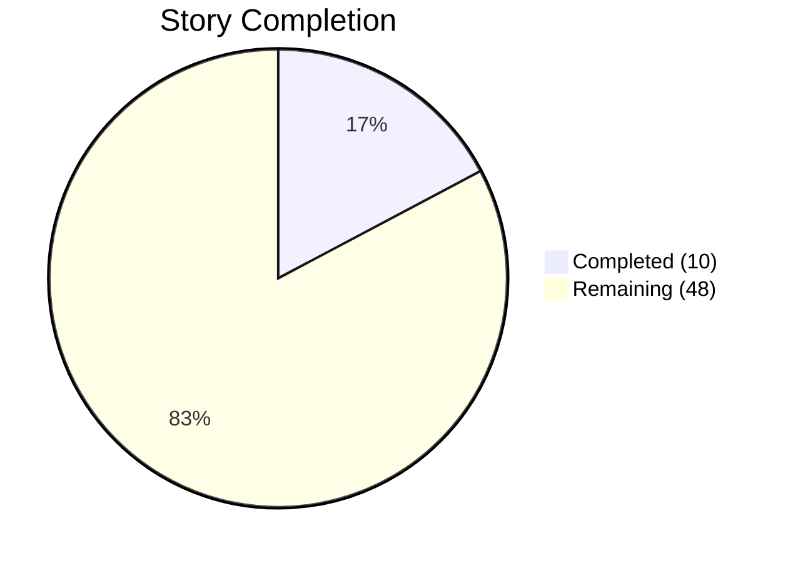

# Delivery Dashboard

**Status:** Living document — updated after each completed story  
**Last updated:** 2026-04-03 (Wave 2 complete)  
**Scope:** SeaRise Europe MVP — 58 stories across 8 epics, delivered in 8 waves

---

## Progress Snapshot

```text
  ████░░░░░░░░░░░░░░░░  17% COMPLETE  ·  10 of 58 stories delivered
```

| Metric | Value |
|--------|------:|
| Stories completed | **10** / 58 |
| Epics completed | **2** / 8 |
| Waves fully completed | **2** / 8 |
| Current wave | Wave 3 — Geospatial Pipeline (0 / 8) READY |
| Unit tests passing | N/A — stub services only |
| Next up | `S03-01` Set Up Pipeline Project and Dependencies |



---

## Wave Progress

```text
Wave 1 · Decision Closure      ████████████████████  7/7   100%  DONE
Wave 2 · Local Dev Environment ████████████████████  3/3   100%  DONE
Wave 3 · Geospatial Pipeline   ░░░░░░░░░░░░░░░░░░░░  0/8     0%  READY
Wave 4 · Backend API Core      ░░░░░░░░░░░░░░░░░░░░  0/7     0%  PLANNED
Wave 5 · Frontend Search       ░░░░░░░░░░░░░░░░░░░░  0/8     0%  PLANNED
Wave 6 · Assessment UX         ░░░░░░░░░░░░░░░░░░░░  0/7     0%  PLANNED
Wave 7 · Transparency & A11y   ░░░░░░░░░░░░░░░░░░░░  0/7     0%  PLANNED
Wave 8 · Azure Release         ░░░░░░░░░░░░░░░░░░░░  0/11    0%  PLANNED
```

---

## Epic Completion

| # | Epic | Progress | Status |
|--:|------|:--------:|:------:|
| 1 | Decision Closure and Delivery Baseline | 7 / 7 (100%) | **Done** |
| 2 | Local Development Environment | 3 / 3 (100%) | **Done** |
| 3 | Geospatial Data Pipeline | 0 / 8 (0%) | Planned |
| 4 | Backend API Core | 0 / 7 (0%) | Planned |
| 5 | Frontend Shell and Search Flow | 0 / 8 (0%) | Planned |
| 6 | Scenario Controls and Assessment UX | 0 / 7 (0%) | Planned |
| 7 | Transparency, Accessibility, and Content Compliance | 0 / 7 (0%) | Planned |
| 8 | Azure Deployment, Release Hardening, and Go-Live | 0 / 11 (0%) | Planned |

---

## Remaining Work

### Geospatial Pipeline — 8 stories · Wave 3

| ID | Story | Scope |
|----|-------|-------|
| S03-01 | Set Up Pipeline Project and Dependencies | Python project, env, and geospatial tooling |
| S03-02 | Download and Cache Source Data | AR6 inputs, DEM assets, local caching |
| S03-03 | Reproject and Align SLR to DEM Grid | Common CRS, alignment, raster prep |
| S03-04 | Compute Binary Exposure Rasters | Exposure mask generation inside coastal zone |
| S03-05 | COGify and QA Validate | Cloud-Optimized GeoTIFF output and validation |
| S03-06 | Upload COGs to Azure Blob Storage | Local blob contract matching Azure layout |
| S03-07 | Register Layers and Seed Metadata in PostgreSQL | Layer rows, scenarios, horizons, methodology metadata |
| S03-08 | Pipeline Orchestration CLI and End-to-End Validation | One-command pipeline run and checklist validation |

### Backend API Core — 7 stories · Wave 4

| ID | Story | Scope |
|----|-------|-------|
| S04-01 | Initialize ASP.NET Core Minimal API Project | Service skeleton, configuration, startup baseline |
| S04-02 | Implement Domain Layer | Core models, result states, domain rules |
| S04-03 | Implement Infrastructure Adapters | Postgres, TiTiler, geocoder, provider integrations |
| S04-04 | Implement Assessment Service | Assessment orchestration and business logic |
| S04-05 | Implement API Endpoints and Validation | Geocode, config, assess endpoints and input validation |
| S04-06 | Implement Structured Logging and Correlation ID Middleware | JSON logging, request correlation, audit-safe output |
| S04-07 | Backend Unit and Integration Tests | xUnit, Testcontainers, API integration coverage |

### Frontend Search — 8 stories · Wave 5

| ID | Story | Scope |
|----|-------|-------|
| S05-01 | Initialize Next.js Project and App Shell | App shell, layout, responsive skeleton |
| S05-02 | Implement Zustand State Stores | Client state model and transitions |
| S05-03 | Implement MapSurface with MapLibre | Base map, markers, and map interactions |
| S05-04 | Implement SearchBar and Geocoding Integration | Search input, requests, loading handling |
| S05-05 | Implement CandidateList and Location Selection | Candidate selection and keyboard interaction |
| S05-06 | Implement Config Fetch and Localization Setup | Config bootstrapping and string externalization |
| S05-07 | Implement EmptyState, LoadingState, ErrorBanner | Search-state UI and failure handling |
| S05-08 | Frontend Smoke Tests and Performance Baseline | Smoke coverage, Playwright, bundle baseline |

### Assessment UX — 7 stories · Wave 6

| ID | Story | Scope |
|----|-------|-------|
| S06-01 | Implement ScenarioControl and HorizonControl | Scenario and horizon selectors |
| S06-02 | Implement Assessment API Integration | Assessment request flow and state updates |
| S06-03 | Implement ResultPanel with All 5 Result States | Exposure, no exposure, unavailable, inland, unsupported |
| S06-04 | Implement ExposureLayer and Legend | Raster overlay, legend, visual result context |
| S06-05 | Implement Loading, Error, and Result-Updating States | Assessment feedback and retry behavior |
| S06-06 | Implement URL State Synchronization | Shareable state in query params |
| S06-07 | Assessment Flow Component Integration Tests | End-to-end frontend assessment coverage |

### Transparency & A11y — 7 stories · Wave 7

| ID | Story | Scope |
|----|-------|-------|
| S07-01 | Implement MethodologyPanel | Methodology drawer, model cards, limitation copy |
| S07-02 | Content Copy Audit and CONTENT_GUIDELINES Compliance | Simplified, policy-aligned product copy |
| S07-03 | Complete i18n Externalization | Remove hardcoded strings and complete locale setup |
| S07-04 | Keyboard Navigation and Focus Management | Full keyboard path and focus handling |
| S07-05 | ARIA Attributes and Screen Reader Support | Semantic roles, labels, live regions |
| S07-06 | Responsive Layout Validation | Breakpoint fidelity across key screens |
| S07-07 | Accessibility Audit | Axe, manual keyboard, screen reader, contrast checks |

### Azure Release — 11 stories · Wave 8

| ID | Story | Scope |
|----|-------|-------|
| S08-01 | Provision Azure Resources and Key Vault | Resource group, hosting, storage, secrets |
| S08-02 | CI/CD Deployment Pipeline and Staging Deployment | Build, push, deploy, smoke-test automation |
| S08-03 | Upload COGs and Migrate Data to Azure | Production-like data and storage handoff |
| S08-04 | Complete Backend Test Suite | Backend verification in CI and staging context |
| S08-05 | Complete Frontend Test Suite | Frontend verification in CI and staging context |
| S08-06 | Security Hardening | Headers, rate limits, secret handling, scan fixes |
| S08-07 | Log Audit and Privacy Verification | Logging review and privacy-safe telemetry |
| S08-08 | E2E Test Suite and Demo Script Validation | Full demo path on local and staging |
| S08-09 | NFR Verification | Performance, reliability, and operational checks |
| S08-10 | Accessibility Audit | Final cloud-stage accessibility verification |
| S08-11 | Release Readiness Checklist | Go-live checklist and evidence package |

---

## Recently Completed

### Local Dev Environment — 3 stories · Wave 2 · DONE 2026-04-03

| ID | Story | What was delivered |
|----|-------|-------------------|
| S02-01 | Set Up Docker Compose Local Development Environment | `docker-compose.yml` with frontend, api, tiler, postgres, azurite; `.env.local.example` |
| S02-02 | Deploy Local PostgreSQL Schema and Enable PostGIS | `infra/db/init.sql` with PostGIS, 5 tables, indexes, seed data |
| S02-03 | Establish Basic CI Pipeline | `.github/workflows/ci.yml` — lint, type check, unit tests, Docker build on PR |

### Decision Closure — 7 stories · Wave 1 · DONE 2026-04-03

| ID | Story | What was delivered |
|----|-------|-------------------|
| S01-04 | Confirm Exposure Methodology | ADR-015: binary v1.0, methodology-spec.md, panel text |
| S01-01 | Confirm MVP Scenario Set | ADR-016: ssp1-26, ssp2-45, ssp5-85 with display names and descriptions |
| S01-02 | Confirm Default Scenario and Time Horizon | ADR-017: ssp2-45 + 2050 defaults |
| S01-03 | Define Coastal Analysis Zone Geometry | ADR-018: Copernicus Coastal Zones 2018, validation spec |
| S01-05 | Select Production Geocoding Provider | ADR-019: Azure Maps Search, field mapping |
| S01-06 | Select Basemap Tile Provider | ADR-020: MapTiler Dataviz Light, attribution, key model |
| S01-07 | Produce Seed Data Specification | seed-data-spec.sql with cross-references |

### Planning Baseline — non-counted groundwork · DONE 2026-04-02

| ID | Work Item | What was delivered |
|----|-----------|-------------------|
| P-01 | Product baseline | Vision, PRD, personas, content guidelines, and metrics plan |
| P-02 | Architecture baseline | System, frontend, data, deployment, and testing architecture docs |
| P-03 | Delivery baseline | Epic files plus the initial execution roadmap |

---

## Milestone Tracker

| Version | Milestone | Status |
|:-------:|-----------|:------:|
| v0.1 | Documentation Baseline — product, architecture, and delivery planning docs | **Done** |
| v0.2 | Decision Closure — OQ-02 through OQ-07 approved and recorded (ADR-015 through ADR-020) | **Done** |
| v0.3 | Local Foundation — Docker Compose, schema, and CI operational | **Done** |
| v0.4 | Data Pipeline — validated COG generation and seeded metadata | Planned |
| v0.5 | Backend Core — local API returns valid config, geocode, and assessment responses | Planned |
| v0.6 | Frontend MVP — search flow and assessment UX working locally | Planned |
| v0.7 | Transparency & A11y — methodology, copy, responsive behavior, and accessibility verified | Planned |
| v1.0 | Cloud Release — Azure staging, hardening, NFR checks, and release readiness complete | Planned |

---

## Critical Path

```mermaid
flowchart LR
    subgraph Completed
        B[Docs Baseline]
        W1[S01-01..07 Decision Closure]
        W2[S02-01..03 Local Dev]
    end

    subgraph Planned
        W3[S03-01..08 Pipeline]
        W4[S04-01..07 Backend API]
        W5[S05-01..08 Frontend Search]
        W6[S06-01..07 Assessment UX]
        W7[S07-01..07 Transparency and A11y]
        W8[S08-01..11 Azure Release]
    end

    B --> W1 --> W2 --> W3 --> W4 --> W5 --> W6 --> W7 --> W8

    classDef done fill:#d9f99d,stroke:#3f6212,color:#111827;
    classDef later fill:#e5e7eb,stroke:#6b7280,color:#111827;

    class B,W1,W2 done;
    class W3,W4,W5,W6,W7,W8 later;
```



---

## Navigation

| Need | Document |
|------|----------|
| Visual top-level status | [Delivery Dashboard](ROADMAP.md) _(this file)_ |
| Epic 01 scope | [Decision Closure and Delivery Baseline](01-decision-closure.md) |
| Epic 02 scope | [Local Development Environment](02-cloud-infrastructure.md) |
| Epic 03 scope | [Geospatial Data Pipeline](03-geospatial-pipeline.md) |
| Epic 04 scope | [Backend API Core](04-backend-api.md) |
| Epic 05 scope | [Frontend Shell and Search Flow](05-frontend-search.md) |
| Epic 06 scope | [Scenario Controls and Assessment UX](06-assessment-ux.md) |
| Epic 07 scope | [Transparency, Accessibility, and Content Compliance](07-transparency-a11y.md) |
| Epic 08 scope | [Azure Deployment, Release Hardening, and Go-Live](08-release-hardening.md) |
| Product scope and acceptance criteria | [PRD](../product/PRD.md) |
| Open-question closure baseline | [Open Question Closure Proposal](../architecture/17-open-question-closure-proposal.md) |

---

## Counting Rules

- Story counts come from delivery stories `S01-01` through `S08-11` across the 8 epic files in `docs/delivery/`.
- Dashboard progress counts execution stories only; planning artifacts in `docs/product/` and `docs/architecture/` are not counted as delivered stories.
- The planning baseline in `Recently Completed` is intentionally non-counted groundwork and does not affect the 58-story total.
- In this dashboard, one wave equals one epic, and a wave is complete only when all stories in that epic are complete.
