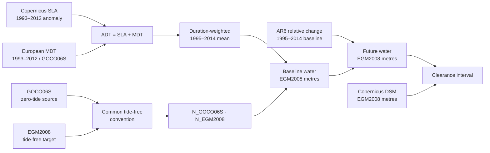

# Phase 0.5 — Vertical-reference methodology evidence

> **Issue:** [#81](https://github.com/artemsemdev/SeaRise-Europe/issues/81)
>
> **Decision:** `accepted` for acquisition and validation
>
> **Publication gate:** `blocked`
>
> **Machine contract:**
> [`vertical-methodology.json`](../../src/pipeline/science/vertical-methodology.json)

## Outcome

SeaRise Europe selects strategy family 1: construct the 1995–2014 mean water
surface on the Copernicus DEM EGM2008 reference, then add IPCC AR6 relative
sea-level change. The method identifier is
`absolute-mean-water-surface-egm2008-interval-v1`.

The selected baseline candidate is the duration-weighted 1995–2014 mean of
Copernicus Marine European Seas Level-4 absolute dynamic topography (`adt`).
It must be transformed from its source geoid realization to tide-free EGM2008
before comparison with the DEM. This is a selected transformation design, not
evidence that the exact assets already pass it.

Independent project review has **not** occurred. Exact source locking,
coverage inspection, transformation validation, uncertainty bounds, terrain
and connectivity decisions, and reviewer approval remain stop conditions.
The decision therefore unblocks evidence acquisition, not publication or
Phase 1.

## Primary-source findings

| Evidence | Verified fact | Consequence |
|---|---|---|
| [IPCC AR6 regional record](https://zenodo.org/records/6382554) and [NASA PO.DAAC description](https://podaac.jpl.nasa.gov/announcements/2021-08-09-Sea-level-projections-from-the-IPCC-6th-Assessment-Report) | Regional values are change relative to the 1995–2014 mean; the repository mapping uses `sea_level_change` in millimetres. | AR6 cannot itself provide the absolute baseline water elevation. |
| [European L4 MY sea-level product](https://data.marine.copernicus.eu/product/SEALEVEL_EUR_PHY_L4_MY_008_068/description) | Product `008_068` supplies daily/monthly sea-surface fields from 1993, at 0.0625°, across European seas, including `adt`. | Its exact 1995–2014 interval can construct the AR6-matched baseline without estimating a trend between unlike periods. |
| [Sea-level L4 Product User Manual](https://documentation.marine.copernicus.eu/PUM/CMEMS-SL-PUM-008-046-047-060-068.pdf) | `adt` is in metres, is sea-surface height above geoid, and is defined as `sla + mdt`; `err_sla` is a formal mapping error. | ADT is the water-height quantity; error variables must be inspected and cannot be treated as guaranteed coverage bounds by name. |
| [European MDT product](https://data.marine.copernicus.eu/product/SEALEVEL_EUR_PHY_MDT_L4_STATIC_008_070/description) and [MDT manual](https://documentation.marine.copernicus.eu/PUM/CMEMS-SL-PUM-008-063-066-067-70.pdf) | MDT is a 1993–2012 mean sea-surface height above geoid; `mdt` and `err_mdt` are in metres. | MDT alone has the wrong epoch and does not prove EGM2008 compatibility. |
| [MDT Quality Information Document](https://documentation.marine.copernicus.eu/QUID/CMEMS-SL-QUID-008-063-066-067-70.pdf) | European MDT uses CNES-CLS22 MSS and the GOCO06S geoid in its first guess and adds European coastal observations. | Treating “above geoid” as “above EGM2008” is prohibited; a GOCO06S-to-EGM2008 relation is required. |
| [Official GOCO06S ICGEM record](https://icgem.gfz.de/tom_longtime) | The coefficient header declares `zero_tide`, degree/order 300, reference epoch 2010-01-01, and formal errors; data are CC BY 4.0. | The permanent-tide convention must be reconciled before geoid differencing. |
| [NGA EGM2008 resources](https://earth-info.nga.mil/index.php?action=wgs84&dir=wgs84) and [IERS Conventions](https://iers-conventions.obspm.fr/conventions/content/tn36.pdf) | NGA distributes EGM2008 coefficients and a 2.5-minute grid; IERS identifies EGM2008 as conventional tide-free and distinguishes it from zero-tide geopotential. | Both geoid evaluations must use the same ellipsoid, normalization, tide convention, and spatial point. |
| [Copernicus DEM specification](https://dataspace.copernicus.eu/explore-data/data-collections/copernicus-contributing-missions/collections-description/COP-DEM) | The DEM is an EGM2008-referenced digital surface model, not bare-earth terrain. | Terrain stays in the method; DEM error and DSM representation bias remain separate uncertainty terms. |
| [EUREF European vertical systems](https://www.euref.eu/european-geodetic-reference-systems) | EVRF2019 is a common adjustment of national levelling networks for 30 countries; national systems and transformations remain distinct concerns. | EVRF/local tidal normalization is not automatically a continuous Europe-wide ocean-to-land transform. |
| [JRC European Coastal Flood Risk](https://data.jrc.ec.europa.eu/dataset/jrc-liscoast-10009) | Published outputs are aggregate expected damage/population for selected RCP/SSP combinations and 2050/2100. | They do not implement this product's three SSPs, three horizons, five point states, or exact lookup contract. |

### Fact, inference, and open evidence

- **Verified:** Copernicus Marine documents `adt = sla + mdt`; the European
  MDT reference is 1993–2012 and its documented gravity model is GOCO06S;
  GOCO06S is zero-tide; EGM2008 delivery is conventional tide-free.
- **Methodological inference selected for testing:** European `adt` can be
  expressed on EGM2008 by a pointwise, convention-matched geoid-model
  difference. The equation follows the documented reference surfaces, but its
  numerical accuracy is not yet validated.
- **Open evidence:** the exact `008_068` dataset/version and files used, the
  exact MDT linked by those files, AR6 0.17/0.50/0.83 coordinates, all
  checksums, licences, coverage masks, error-variable semantics, and geoid
  computation configuration must be pinned and inspected in Phase 0.6.

## Strategy decision matrix

| Strategy | Datum/geoid and epoch | Coverage, resolution, near shore | Uncertainty | Licence and reproducibility | Decision |
|---|---|---|---|---|---|
| **1A. European ADT mean, transformed to EGM2008, plus AR6** | `adt` uses MDT/SLA geoid semantics; build an exact 1995–2014 mean; evaluate GOCO06S and EGM2008 in tide-free convention and add their undulation difference. | `008_068` reports European seas, 0.0625°, daily/monthly. Regional processing is fitted to European seas, but cell-level coastal gaps remain a required inspection. | `err_sla`, `err_mdt`, geoid/tide conversion, epoch aggregation, interpolation, AR6 quantiles, DEM error, and DSM bias remain separate. | Official products and gravity models are obtainable and attributable; exact assets, checksums, access continuity, and derivative wording remain Phase 0.6 evidence. | **Selected.** Only family that retains the required scenarios/horizons while supplying an explicit absolute baseline and uncertainty path. |
| 1B. Use European MDT directly as EGM2008 baseline | MDT is 1993–2012 above the documented GOCO06S geoid, not EGM2008. | 0.0625° European coastal field with `err_mdt`. | Omits epoch and geoid differences. | Reproducible product, scientifically incomplete transform. | **Rejected.** “Height above geoid” is not datum equivalence. |
| 1C. Ellipsoidal MSS minus EGM2008 | Could be an algebraically direct baseline, but still needs an exact 1995–2014 epoch adjustment and tide/ellipsoid conventions. | Global MSS is available, but the reviewed candidate lacks the European regional coastal refinement and matched error chain of `008_068`/`008_070`. | MSS, epoch, coastal, and EGM2008 errors still required. | Potentially reproducible after a separate source review. | Not selected; retain as fallback if 1A fails controls. |
| **2. Normalize projection and terrain to local MSL/tidal datums** | Would require country/port-specific national and tidal transformations, reference epochs, tide systems, and land-motion handling. EVRF2019 does not by itself create a continuous coastal water datum. | Potentially strong locally; no demonstrated homogeneous support for the whole product extent, islands, and all European basins. | Station datum transfer, spatial representativeness, epoch, and network discontinuities dominate between gauges. | Many authorities, licences, versions, and transformation services; difficult to reproduce as one immutable release. | **Rejected for Europe-wide v1.** Suitable for independent local controls, not the canonical surface. |
| **3. Replace classification with a published hazard product** | Datum reconciliation is owned by the publisher, but becomes opaque unless its exact release exposes the required lineage. | JRC products cover Europe and coastal hazards, but the inspected public dataset exposes aggregate risk outputs rather than this point-class grid. | May include tides, waves, surge and defences under a different hazard definition. | Public JRC reuse terms are favourable; exact artifacts still require locking. | **Rejected for the current contract.** Scenarios, horizons, endpoint semantics, and five-state lookup do not match. Use only as independent validation evidence. |

## Binding equations and reference surfaces

At location `x`, let:

- `ADT_G(x,t)` be Copernicus Marine absolute dynamic topography in metres
  above the source GOCO06S geoid;
- `N_G^TF(x)` and `N_E^TF(x)` be GOCO06S and EGM2008 geoid undulations,
  evaluated on the same ellipsoid in conventional tide-free form;
- `B_E(x)` be the 1995–2014 mean water surface in EGM2008 metres;
- `R_q(x,s,y)` be AR6 relative sea-level change in millimetres for quantile
  `q`, scenario `s`, and year `y`;
- `Z_E(x)` be the selected Copernicus DSM elevation in EGM2008 metres.

The baseline and future water surface are:

```text
B_E(x) = mean_duration[1995-01-01,2015-01-01)(ADT_G(x,t))
         + N_G^TF(x) - N_E^TF(x)

W_q(x,s,y) = B_E(x) + 0.001 * R_q(x,s,y)
```

All intervals must be present. Weight monthly values by their represented
duration; do not average unequal intervals as equal samples. A missing
required interval makes the baseline cell nodata. Do not extrapolate source
coverage.



Continuous ADT, geoid, AR6, and continuous error fields use bilinear
interpolation only inside valid source support. A missing required neighbour
propagates nodata. The analysis remains on the approved native DEM grid;
categorical masks and final classes use nearest-neighbour semantics.

## Uncertainty and five-state decision rule

Keep projection uncertainty separate from non-projection vertical error:

```text
U_B = sum of bounded ADT/MDT mapping, geoid-model, tide-conversion,
      reference-period, and horizontal-interpolation terms

U_Z = sum of bounded DEM vertical, DSM-representation, and terrain-resampling terms

C_low  = (B_E - U_B) + 0.001 * R_0.17 - (Z_E + U_Z)
C_high = (B_E + U_B) + 0.001 * R_0.83 - (Z_E - U_Z)
```

The interval rule is binding:

| Condition | Domain state | Reason |
|---|---|---|
| `C_low >= 0` and approved connectivity passes | `ModeledExposureDetected` | The complete likely/error interval meets the vertical threshold and is connected. |
| `C_high < 0`, or `C_low >= 0` and approved connectivity rejects | `NoModeledExposureDetected` | The interval is wholly below the threshold, or a vertically eligible cell is disconnected under the approved model. |
| `C_low < 0 <= C_high` | `DataUnavailable` | `uncertain-threshold` |
| Missing input, bound, transform support, required neighbour, or connectivity decision | `DataUnavailable` | Specific missing/unsupported reason |

Non-projection bounds are added conservatively; independence must not be
assumed merely to reduce the interval. A publisher “standard error” may become
a bound only through a documented distribution and coverage conversion.
Otherwise the bound is missing and the cell fails closed. The median remains
reportable as context but never overrides the interval class.

## Physical scope and controls

- Included: long-term mean water surface, AR6 total relative change, and the
  EGM2008-referenced DSM.
- Excluded: astronomical tide, surge, waves/setup, river/pluvial flooding,
  drainage, and flood defences/adaptation. These exclusions must remain
  visible; they are not hidden inside uncertainty.
- AR6 total includes its selected relative-sea-level contributions. Do not add
  a second land-motion correction unless exact member inspection proves it is
  absent and a new ADR approves the change. Local anthropogenic subsidence not
  represented by AR6 remains a limitation.
- DSM structures and vegetation are not terrain truth. Phase 0.8 must select
  the resolution/masks and bound DSM representation bias.
- Vertical eligibility is not exposure by itself. The approved ocean-seeded
  connectivity rule is applied after the interval test. Disconnected terrain
  cannot be promoted to exposure by the vertical comparison.

## Downstream evidence required

Phase 0.6 must lock and inspect:

1. exact `008_068` ADT/SLA/error dataset files for 1995–2014;
2. exact `008_070` MDT/error product used by those ADT files;
3. GOCO06S coefficients/metadata and the selected tide conversion;
4. NGA EGM2008 coefficients or grid and computation software;
5. AR6 archive and 0.17/0.50/0.83 coordinates;
6. Copernicus DEM and quality/mask inputs;
7. licences, attribution, redistribution, checksums, coverage, and access
   continuity for every input and derivative.

Phase 0.7 must prove the equations, interval terms, deterministic numerics,
and independent controls across Atlantic/North Sea, Baltic,
Mediterranean/Adriatic, and Black Sea contexts. Phase 0.8 must approve terrain,
scope, and connectivity. Phase 0.9 alone may change the scientific gate after
all evidence and reviews pass.

## Reviewer record

| Role | Status | Record |
|---|---|---|
| Independent scientific/data reviewer | `pending` | No independent project reviewer has approved or rejected this decision. |

Primary-source document authors and publisher quality teams are evidence
authorities for their products; they are not reviewers of this project's
cross-product method. The missing review is therefore explicit and keeps the
publication and Phase 1 gates blocked.
